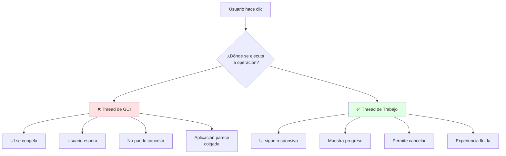
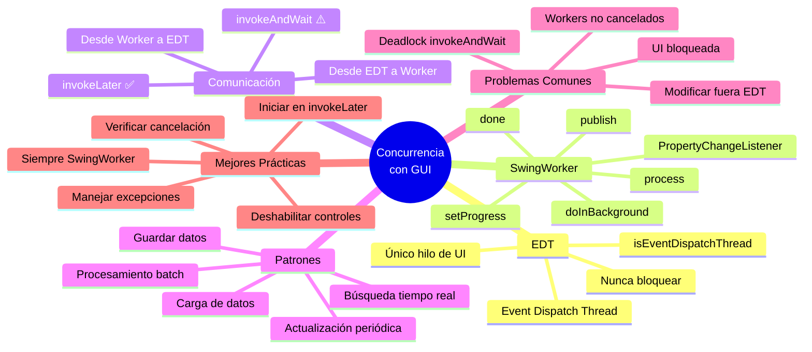

# 🖥️ Concurrencia con GUI 

## 🎯 Introducción

> [!info]- 💡 ¿Por Qué Concurrencia en Interfaces Gráficas?
> 
> Las **interfaces gráficas de usuario (GUI)** requieren un manejo especial de la concurrencia para mantener la **responsividad** y evitar que la aplicación se "congele" durante operaciones largas.
> 
> **Analogía del mundo real:** Piensa en un cajero de banco:
> 
> - **Sin concurrencia** → El cajero atiende un cliente y todos los demás esperan congelados
> - **Con concurrencia** → El cajero puede saludar a nuevos clientes mientras procesa una transacción
> - **Thread de GUI** → El cajero que siempre debe estar disponible para atender
> - **Threads de trabajo** → Asistentes que hacen tareas pesadas en segundo plano
> 
> **¿Por qué es crítico en GUI?**
> 
> |Razón|Problema sin Concurrencia|Solución con Concurrencia|
> |---|---|---|
> |**Responsividad**|Interfaz congelada durante operaciones|UI siempre responde a interacciones|
> |**Experiencia de usuario**|Frustración, aplicación parece bloqueada|Feedback visual, barras de progreso|
> |**Operaciones I/O**|Bloqueos en descargas/lecturas|Operaciones en background|
> |**Cálculos pesados**|UI no responde durante procesamiento|Procesamiento paralelo sin afectar UI|
> |**Profesionalismo**|Aplicación amateur|Aplicación profesional y pulida|



---

## 🧵 El Thread de Despacho de Eventos (EDT)

### 🎭 Event Dispatch Thread en Swing

> [!note]- 🎨 El Corazón de Swing
> 
> **¿Qué es el EDT?**
> 
> El **Event Dispatch Thread (EDT)** es el hilo único y especial en Swing responsable de:
> 
> - Pintar todos los componentes visuales
> - Procesar todos los eventos de usuario (clics, teclas, etc.)
> - Actualizar el estado visual de la interfaz
> 
> ```mermaid
> graph LR
>     U[Usuario] --> E[Eventos]
>     E --> EDT[Event Dispatch<br/>Thread]
>     EDT --> R[Renderizado]
>     EDT --> L[Listeners]
>     EDT --> A[Actualizaciones UI]
>     
>     W1[Worker 1] -.No puede<br/>tocar UI.-> EDT
>     W2[Worker 2] -.No puede<br/>tocar UI.-> EDT
>     W3[Worker 3] -.No puede<br/>tocar UI.-> EDT
>     
>     style EDT fill:#e1f5ff
>     style W1 fill:#fff4e1
>     style W2 fill:#fff4e1
>     style W3 fill:#fff4e1
> ```
> 
> **Regla de Oro de Swing:**
> 
> ```java
> // ✅ REGLA 1: Todo el código que toca componentes Swing 
> //            debe ejecutarse en el EDT
> 
> // ✅ REGLA 2: Operaciones largas NUNCA deben ejecutarse 
> //            en el EDT
> ```
> 
> **Comparación visual:**
> 
> |Aspecto|En el EDT|Fuera del EDT|
> |---|---|---|
> |**Acceso a componentes**|✅ Seguro|❌ Peligroso (race conditions)|
> |**Operaciones largas**|❌ Congela UI|✅ No afecta UI|
> |**Actualizar UI**|✅ Correcto|❌ Usar invokeLater/invokeAndWait|
> |**Respuesta a eventos**|✅ Automático|N/A|
> |**Renderizado**|✅ Automático|❌ Imposible|

### 🔍 Verificar si Estás en el EDT

> [!example]- 🧪 Detección del Thread Actual
> 
> **Método para verificar:**
> 
> ```java
> import javax.swing.*;
> 
> public class DetectorEDT {
>     
>     public static void verificarThread(String contexto) {
>         boolean esEDT = SwingUtilities.isEventDispatchThread();
>         String threadName = Thread.currentThread().getName();
>         
>         System.out.printf("[%s] EDT: %s | Thread: %s%n", 
>             contexto, 
>             esEDT ? "✅ SÍ" : "❌ NO", 
>             threadName);
>     }
>     
>     public static void main(String[] args) {
>         // Ejecutar desde main (NO es EDT)
>         verificarThread("main()");
>         
>         // Crear ventana
>         JFrame frame = new JFrame("Test EDT");
>         JButton boton = new JButton("Hacer clic");
>         
>         boton.addActionListener(e -> {
>             // Evento de botón (SÍ es EDT)
>             verificarThread("ActionListener");
>         });
>         
>         frame.add(boton);
>         frame.setSize(300, 200);
>         frame.setDefaultCloseOperation(JFrame.EXIT_ON_CLOSE);
>         
>         // Mostrar ventana en el EDT (forma correcta)
>         SwingUtilities.invokeLater(() -> {
>             verificarThread("invokeLater");
>             frame.setVisible(true);
>         });
>     }
> }
>     ```
> 
> **Salida esperada:**
> ```
> 
> [main()] EDT: ❌ NO | Thread: main [invokeLater] EDT: ✅ SÍ | Thread: AWT-EventQueue-0 [ActionListener] EDT: ✅ SÍ | Thread: AWT-EventQueue-0
> ```

### ⚠️ Problema: Bloquear el EDT

> [!danger]- 🚫 El Error Más Común
> 
> **Ejemplo problemático:**
> 
> ```java
> public class UIBloqueada extends JFrame {
>     private JButton botonProcesar;
>     private JProgressBar barraProgreso;
>     private JLabel labelEstado;
>     
>     public UIBloqueada() {
>         setTitle("UI Bloqueada - Ejemplo Malo");
>         setLayout(new BorderLayout());
>         
>         botonProcesar = new JButton("Procesar Datos");
>         barraProgreso = new JProgressBar(0, 100);
>         labelEstado = new JLabel("Listo");
>         
>         // ❌ CÓDIGO PROBLEMÁTICO
>         botonProcesar.addActionListener(e -> {
>             labelEstado.setText("Procesando...");
>             botonProcesar.setEnabled(false);
>             
>             // ⚠️ ESTO BLOQUEA EL EDT
>             for (int i = 0; i <= 100; i++) {
>                 barraProgreso.setValue(i);
>                 
>                 try {
>                     Thread.sleep(50); // Simular trabajo pesado
>                 } catch (InterruptedException ex) {
>                     ex.printStackTrace();
>                 }
>             }
>             
>             labelEstado.setText("Completado");
>             botonProcesar.setEnabled(true);
>         });
>         
>         add(botonProcesar, BorderLayout.NORTH);
>         add(barraProgreso, BorderLayout.CENTER);
>         add(labelEstado, BorderLayout.SOUTH);
>         
>         setSize(400, 150);
>         setDefaultCloseOperation(JFrame.EXIT_ON_CLOSE);
>     }
>     
>     public static void main(String[] args) {
>         SwingUtilities.invokeLater(() -> {
>             new UIBloqueada().setVisible(true);
>         });
>     }
> }
> ```
> 
> **Problemas observados:**
> 
> ```mermaid
> sequenceDiagram
>     participant U as Usuario
>     participant EDT as Event Dispatch Thread
>     participant UI as Interfaz
>     
>     U->>EDT: Click en botón
>     EDT->>EDT: Ejecutar listener
>     Note over EDT: ⚠️ EDT bloqueado durante 5 segundos
>     EDT->>EDT: sleep(50) × 100 veces
>     U->>UI: Intenta mover ventana
>     UI-->>U: ❌ No responde
>     U->>UI: Intenta hacer clic
>     UI-->>U: ❌ No responde
>     EDT->>EDT: Termina bucle
>     EDT->>UI: Actualizar
>     UI-->>U: ✅ Ventana responde nuevamente
> ```
> 
> **Síntomas de EDT bloqueado:**
> 
> |Síntoma|Descripción|
> |---|---|
> |🖱️ **Cursor de espera**|Sistema muestra reloj/spinner|
> |🪟 **Ventana no se mueve**|No responde a drag & drop|
> |🖼️ **No repinta**|Contenido corrupto si otra ventana pasa por encima|
> |🔘 **Botones no responden**|Clics son ignorados|
> |⌨️ **Teclado bloqueado**|No se puede escribir|
> |❌ **"No responde"**|Sistema operativo detecta bloqueo|

---

## 🛠️ SwingWorker: La Solución Profesional

### 🎯 ¿Qué es SwingWorker?

> [!success]- 🏆 La Herramienta Estándar para Concurrencia en Swing
> 
> **SwingWorker** es una clase diseñada específicamente para ejecutar tareas largas en segundo plano mientras mantiene la UI responsiva.
> 
> **Arquitectura de SwingWorker:**
> 
> ```mermaid
> graph TB
>     EDT[Event Dispatch Thread<br/>EDT]
>     WT[Worker Thread<br/>Background]
>     
>     EDT --> |1. execute| SW[SwingWorker]
>     SW --> |2. doInBackground| WT
>     WT --> |3. publish| EDT
>     EDT --> |4. process| UI[Actualizar UI]
>     WT --> |5. done| EDT
>     EDT --> |6. get| Result[Obtener resultado]
>     
>     style EDT fill:#e1f5ff
>     style WT fill:#fff4e1
>     style SW fill:#e1ffe1
> ```
> 
> **Métodos principales:**
> 
> |Método|Thread|Propósito|Cuándo se llama|
> |---|---|---|---|
> |`doInBackground()`|**Worker**|Tarea pesada|Al iniciar worker|
> |`process(List<V>)`|**EDT**|Actualizar UI con progreso|Después de publish()|
> |`done()`|**EDT**|Finalizar, mostrar resultado|Al terminar doInBackground()|
> |`publish(V...)`|**Worker**|Enviar actualizaciones|Cuando quieras actualizar UI|
> |`get()`|**Cualquiera**|Obtener resultado|Cuando necesites el resultado|
> 
> **Genéricos de SwingWorker:**
> 
> ```java
> SwingWorker<T, V>
> //         │   │
> //         │   └─> Tipo de datos intermedios (publish/process)
> //         └─────> Tipo del resultado final (doInBackground/get)
> ```

### 📝 Anatomía de un SwingWorker

> [!example]- 🔬 Estructura Básica
> 
> **Template completo:**
> 
> ```java
> import javax.swing.*;
> import java.util.List;
> 
> public class MiWorker extends SwingWorker<TipoResultado, TipoProgreso> {
>     
>     // 1. Constructor (opcional) - para pasar datos
>     public MiWorker(/* parámetros */) {
>         // Inicializar campos
>     }
>     
>     // 2. doInBackground - SE EJECUTA EN WORKER THREAD
>     @Override
>     protected TipoResultado doInBackground() throws Exception {
>         // ✅ Código pesado aquí
>         // ✅ Usar publish() para reportar progreso
>         // ❌ NO tocar componentes Swing directamente
>         
>         for (int i = 0; i < total; i++) {
>             // Trabajo pesado
>             procesarItem(i);
>             
>             // Reportar progreso
>             int progreso = (i * 100) / total;
>             setProgress(progreso); // 0-100
>             
>             // O enviar datos personalizados
>             publish(datosIntermedio);
>             
>             // Verificar cancelación
>             if (isCancelled()) {
>                 return null;
>             }
>         }
>         
>         return resultado;
>     }
>     
>     // 3. process - SE EJECUTA EN EDT
>     @Override
>     protected void process(List<TipoProgreso> chunks) {
>         // ✅ Actualizar componentes Swing
>         for (TipoProgreso dato : chunks) {
>             actualizarUI(dato);
>         }
>     }
>     
>     // 4. done - SE EJECUTA EN EDT
>     @Override
>     protected void done() {
>         try {
>             if (!isCancelled()) {
>                 TipoResultado resultado = get(); // Obtener resultado
>                 // ✅ Actualizar UI con resultado final
>                 mostrarResultado(resultado);
>             }
>         } catch (InterruptedException e) {
>             // Worker fue interrumpido
>         } catch (ExecutionException e) {
>             // Excepción durante doInBackground
>             mostrarError(e.getCause());
>         }
>     }
> }
> ```
> 
> **Flujo de ejecución:**
> 
> ```mermaid
> sequenceDiagram
>     participant UI as UI (EDT)
>     participant SW as SwingWorker
>     participant BG as Background Thread
>     
>     UI->>SW: execute()
>     SW->>BG: Iniciar doInBackground()
>     
>     loop Procesamiento
>         BG->>BG: Trabajo pesado
>         BG->>SW: publish(datos)
>         SW->>UI: process(datos)
>         UI->>UI: Actualizar componentes
>     end
>     
>     BG->>SW: return resultado
>     SW->>UI: done()
>     UI->>SW: get()
>     SW-->>UI: resultado
>     UI->>UI: Mostrar resultado
> ```

### 🎨 Ejemplo Completo: Procesador de Archivos

> [!example]- 💼 Caso de Uso Real
> 
> ```java
> import javax.swing.*;
> import java.awt.*;
> import java.io.*;
> import java.util.List;
> 
> public class ProcesadorArchivos extends JFrame {
>     private JTextArea areaResultado;
>     private JProgressBar barraProgreso;
>     private JButton botonProcesar;
>     private JButton botonCancelar;
>     private JLabel labelEstado;
>     
>     private ProcesadorWorker worker;
>     
>     public ProcesadorArchivos() {
>         setTitle("Procesador de Archivos - SwingWorker");
>         setLayout(new BorderLayout(10, 10));
>         
>         // Panel superior con controles
>         JPanel panelControl = new JPanel(new FlowLayout());
>         botonProcesar = new JButton("Procesar 100 Archivos");
>         botonCancelar = new JButton("Cancelar");
>         botonCancelar.setEnabled(false);
>         
>         botonProcesar.addActionListener(e -> iniciarProcesamiento());
>         botonCancelar.addActionListener(e -> cancelarProcesamiento());
>         
>         panelControl.add(botonProcesar);
>         panelControl.add(botonCancelar);
>         
>         // Área de resultado
>         areaResultado = new JTextArea(15, 40);
>         areaResultado.setEditable(false);
>         JScrollPane scroll = new JScrollPane(areaResultado);
>         
>         // Barra de progreso
>         barraProgreso = new JProgressBar(0, 100);
>         barraProgreso.setStringPainted(true);
>         
>         // Label de estado
>         labelEstado = new JLabel("Listo para procesar");
>         
>         // Panel inferior
>         JPanel panelInferior = new JPanel(new BorderLayout());
>         panelInferior.add(barraProgreso, BorderLayout.NORTH);
>         panelInferior.add(labelEstado, BorderLayout.SOUTH);
>         
>         add(panelControl, BorderLayout.NORTH);
>         add(scroll, BorderLayout.CENTER);
>         add(panelInferior, BorderLayout.SOUTH);
>         
>         setSize(500, 400);
>         setDefaultCloseOperation(JFrame.EXIT_ON_CLOSE);
>         setLocationRelativeTo(null);
>     }
>     
>     private void iniciarProcesamiento() {
>         areaResultado.setText("");
>         botonProcesar.setEnabled(false);
>         botonCancelar.setEnabled(true);
>         labelEstado.setText("Procesando...");
>         
>         // Crear y ejecutar worker
>         worker = new ProcesadorWorker();
>         
>         // Listener para cambios de progreso
>         worker.addPropertyChangeListener(evt -> {
>             if ("progress".equals(evt.getPropertyName())) {
>                 barraProgreso.setValue((Integer) evt.getNewValue());
>             }
>         });
>         
>         worker.execute();
>     }
>     
>     private void cancelarProcesamiento() {
>         if (worker != null && !worker.isDone()) {
>             worker.cancel(true);
>             labelEstado.setText("Cancelando...");
>         }
>     }
>     
>     // SwingWorker interno
>     private class ProcesadorWorker extends SwingWorker<Integer, String> {
>         private static final int TOTAL_ARCHIVOS = 100;
>         
>         @Override
>         protected Integer doInBackground() throws Exception {
>             int procesados = 0;
>             
>             for (int i = 1; i <= TOTAL_ARCHIVOS; i++) {
>                 // Verificar cancelación
>                 if (isCancelled()) {
>                     publish("⚠️ Procesamiento cancelado en archivo " + i);
>                     break;
>                 }
>                 
>                 // Simular procesamiento pesado
>                 Thread.sleep(50);
>                 
>                 procesados++;
>                 
>                 // Reportar progreso
>                 int progreso = (i * 100) / TOTAL_ARCHIVOS;
>                 setProgress(progreso);
>                 
>                 // Enviar actualización cada 10 archivos
>                 if (i % 10 == 0) {
>                     publish("✅ Procesados " + i + " archivos");
>                 }
>             }
>             
>             return procesados;
>         }
>         
>         @Override
>         protected void process(List<String> chunks) {
>             // Actualizar área de texto con mensajes
>             for (String mensaje : chunks) {
>                 areaResultado.append(mensaje + "\n");
>             }
>             
>             // Auto-scroll al final
>             areaResultado.setCaretPosition(areaResultado.getDocument().getLength());
>         }
>         
>         @Override
>         protected void done() {
>             botonProcesar.setEnabled(true);
>             botonCancelar.setEnabled(false);
>             
>             try {
>                 if (!isCancelled()) {
>                     Integer resultado = get();
>                     labelEstado.setText("✅ Completado: " + resultado + " archivos procesados");
>                     areaResultado.append("\n🎉 PROCESAMIENTO COMPLETADO\n");
>                 } else {
>                     labelEstado.setText("⚠️ Procesamiento cancelado");
>                 }
>             } catch (Exception e) {
>                 labelEstado.setText("❌ Error: " + e.getMessage());
>                 areaResultado.append("\n❌ ERROR: " + e.getMessage() + "\n");
>             }
>         }
>     }
>     
>     public static void main(String[] args) {
>         SwingUtilities.invokeLater(() -> {
>             new ProcesadorArchivos().setVisible(true);
>         });
>     }
> }
> ```

---

## 🔄 invokeLater y invokeAndWait

### 📨 Comunicación con el EDT

> [!tip]- 🎯 Actualizar UI desde Threads Externos
> 
> **Problema:** Tienes un thread de trabajo que necesita actualizar la UI.
> 
> **Solución:** Usar `SwingUtilities.invokeLater()` o `invokeAndWait()`
> 
> ```mermaid
> graph LR
>     WT[Worker Thread] -->|invokeLater| Q[Cola EDT]
>     Q --> EDT[Event Dispatch Thread]
>     EDT --> UI[Actualizar UI]
>     
>     style WT fill:#fff4e1
>     style EDT fill:#e1f5ff
> ```
> 
> **Comparación:**
> 
> |Método|Comportamiento|Bloquea Worker|Cuándo Usar|
> |---|---|---|---|
> |`invokeLater`|Encola y retorna inmediatamente|❌ No|✅ Mayoría de casos|
> |`invokeAndWait`|Espera hasta que se ejecute|✅ Sí|⚠️ Necesitas resultado inmediato|

### 🚀 invokeLater

> [!example]- ⚡ Ejecución Asíncrona
> 
> **Sintaxis:**
> 
> ```java
> SwingUtilities.invokeLater(() -> {
>     // Código que actualiza UI
>     // Se ejecutará en el EDT cuando sea posible
> });
> ```
> 
> **Ejemplo completo:**
> 
> ```java
> public class EjemploInvokeLater {
>     private JLabel labelContador;
>     private int contador = 0;
>     
>     public EjemploInvokeLater() {
>         JFrame frame = new JFrame("invokeLater Demo");
>         labelContador = new JLabel("Contador: 0");
>         JButton boton = new JButton("Iniciar Contador");
>         
>         boton.addActionListener(e -> {
>             // Deshabilitar botón
>             boton.setEnabled(false);
>             
>             // Crear thread de trabajo
>             new Thread(() -> {
>                 for (int i = 1; i <= 10; i++) {
>                     final int valor = i;
>                     
>                     try {
>                         Thread.sleep(500);
>                     } catch (InterruptedException ex) {
>                         break;
>                     }
>                     
>                     // ✅ Actualizar UI desde worker thread
>                     SwingUtilities.invokeLater(() -> {
>                         labelContador.setText("Contador: " + valor);
>                     });
>                 }
>                 
>                 // Habilitar botón al terminar
>                 SwingUtilities.invokeLater(() -> {
>                     boton.setEnabled(true);
>                 });
>                 
>             }).start();
>         });
>         
>         frame.setLayout(new FlowLayout());
>         frame.add(labelContador);
>         frame.add(boton);
>         frame.setSize(300, 100);
>         frame.setDefaultCloseOperation(JFrame.EXIT_ON_CLOSE);
>         frame.setVisible(true);
>     }
>     
>     public static void main(String[] args) {
>         SwingUtilities.invokeLater(EjemploInvokeLater::new);
>     }
> }
> ```
> 
> **Flujo de ejecución:**
> 
> ```mermaid
> sequenceDiagram
>     participant WT as Worker Thread
>     participant Q as Cola EDT
>     participant EDT as Event Dispatch Thread
>     participant UI as Componente UI
>     
>     WT->>WT: Hacer trabajo
>     WT->>Q: invokeLater(actualizar)
>     Note over WT: ✅ Continúa inmediatamente
>     WT->>WT: Más trabajo
>     
>     EDT->>Q: Procesar cola
>     Q->>EDT: Ejecutar actualizar
>     EDT->>UI: Modificar componente
> ```

### ⏰ invokeAndWait

> [!warning]- ⚠️ Ejecución Síncrona (Usar con Precaución)
> 
> **Sintaxis:**
> 
> ```java
> try {
>     SwingUtilities.invokeAndWait(() -> {
>         // Código que actualiza UI
>         // Worker thread esperará a que termine
>     });
> } catch (InterruptedException | InvocationTargetException e) {
>     e.printStackTrace();
> }
> ```
> 
> **Ejemplo:**
> 
> ```java
> public class EjemploInvokeAndWait {
>     private JLabel labelResultado;
>     
>     public void procesarConResultado() {
>         new Thread(() -> {
>             // Trabajo pesado
>             String resultado = calcularAlgo();
>             
>             try {
>                 // Esperar a que UI se actualice
>                 SwingUtilities.invokeAndWait(() -> {
>                     labelResultado.setText(resultado);
>                     labelResultado.setForeground(Color.GREEN);
>                 });
>                 
>                 // Este código NO se ejecuta hasta que EDT termine
>                 System.out.println("UI actualizada, continuando...");
>                 
>             } catch (InterruptedException | InvocationTargetException e) {
>                 e.printStackTrace();
>             }
>         }).start();
>     }
>     
>     private String calcularAlgo() {
>         try {
>             Thread.sleep(2000);
>         } catch (InterruptedException e) {}
>         return "Cálculo completado";
>     }
> }
> ```
> 
> **⚠️ PELIGROS de invokeAndWait:**
> 
> ```mermaid
> graph TD
>     A[invokeAndWait] --> B{¿Llamado desde<br/>el EDT?}
>     B -->|Sí| C[💀 DEADLOCK]
>     B -->|No| D{¿EDT ocupado?}
>     D -->|Sí| E[⏳ Worker espera]
>     D -->|No| F[✅ Ejecuta inmediatamente]
>     
>     style C fill:#ffe1e1
>     style E fill:#fff4e1
>     style F fill:#e1ffe1
> ```
> 
> **Reglas de uso:**
> 
> |Situación|invokeLater|invokeAndWait|
> |---|---|---|
> |**Actualización simple UI**|✅ Usar|❌ Innecesario|
> |**No necesitas respuesta**|✅ Usar|❌ Bloqueante|
> |**Necesitas valor de UI**|❌ No sirve|⚠️ Considerar|
> |**Desde el EDT**|✅ OK|💀 DEADLOCK|
> |**Simpleza**|✅ Simple|❌ Complejo|

---

## 🎨 Patrones Comunes de Concurrencia en GUI

### 📥 Patrón: Carga de Datos

> [!example]- 💾 Cargar Datos desde Base de Datos/Archivo
> 
> ```java
> public class CargaDatosWorker extends SwingWorker<List<Dato>, Void> {
>     private JTable tabla;
>     private DefaultTableModel modelo;
>     private JLabel labelEstado;
>     
>     public CargaDatosWorker(JTable tabla, DefaultTableModel modelo, JLabel labelEstado) {
>         this.tabla = tabla;
>         this.modelo = modelo;
>         this.labelEstado = labelEstado;
>     }
>     
>     @Override
>     protected List<Dato> doInBackground() throws Exception {
>         // ✅ Operación pesada en worker thread
>         setProgress(0);
>         
>         List<Dato> datos = new ArrayList<>();
>         
>         // Simular carga de base de datos
>         for (int i = 0; i < 1000; i++) {
>             if (isCancelled()) break;
>             
>             Dato dato = cargarDatoDesdeDB(i);
>             datos.add(dato);
>             
>             setProgress((i * 100) / 1000);
>         }
>         
>         return datos;
>     }
>     
>     @Override
>     protected void done() {
>         try {
>             if (!isCancelled()) {
>                 List<Dato> datos = get();
>                 
>                 // ✅ Actualizar tabla en EDT
>                 modelo.setRowCount(0); // Limpiar
>                 for (Dato dato : datos) {
>                     modelo.addRow(new Object[]{
>                         dato.getId(),
>                         dato.getNombre(),
>                     dato.getValor()
>                 });
>             }
>             
>             labelEstado.setText("✅ " + datos.size() + " registros cargados");
>         }
>     } catch (Exception e) {
>         labelEstado.setText("❌ Error: " + e.getMessage());
>         JOptionPane.showMessageDialog(tabla,
>             "Error al cargar datos: " + e.getMessage(),
>             "Error",
>             JOptionPane.ERROR_MESSAGE);
>     }
> }
> 
> private Dato cargarDatoDesdeDB(int id) throws InterruptedException {
>     Thread.sleep(5); // Simular latencia de BD
>     return new Dato(id, "Dato-" + id, Math.random() * 100);
> }
> 
> 
> }
> 
> // Uso public void cargarDatos() { CargaDatosWorker worker = new CargaDatosWorker(tabla, modelo, labelEstado); worker.addPropertyChangeListener(evt -> { if ("progress".equals(evt.getPropertyName())) { barraProgreso.setValue((Integer) evt.getNewValue()); } }); worker.execute(); }
> ```

### 📤 Patrón: Guardar Datos

> [!example]- 💿 Persistir Datos con Feedback
> 
> ```java
> public class GuardadoDatosWorker extends SwingWorker<Boolean, Integer> {
>     private List<Dato> datos;
>     private JProgressBar barraProgreso;
>     private JButton botonGuardar;
>     
>     public GuardadoDatosWorker(List<Dato> datos, JProgressBar barraProgreso, JButton botonGuardar) {
>         this.datos = datos;
>         this.barraProgreso = barraProgreso;
>         this.botonGuardar = botonGuardar;
>     }
>     
>     @Override
>     protected Boolean doInBackground() throws Exception {
>         int total = datos.size();
>         
>         for (int i = 0; i < total; i++) {
>             if (isCancelled()) return false;
>             
>             Dato dato = datos.get(i);
>             guardarEnDB(dato);
>             
>             // Reportar progreso
>             int progreso = ((i + 1) * 100) / total;
>             publish(progreso);
>             setProgress(progreso);
>         }
>         
>         return true;
>     }
>     
>     @Override
>     protected void process(List<Integer> chunks) {
>         // Actualizar barra con último valor
>         Integer ultimo = chunks.get(chunks.size() - 1);
>         barraProgreso.setValue(ultimo);
>     }
>     
>     @Override
>     protected void done() {
>         botonGuardar.setEnabled(true);
>         
>         try {
>             Boolean exito = get();
>             if (exito) {
>                 JOptionPane.showMessageDialog(null,
>                     "✅ Datos guardados correctamente",
>                     "Éxito",
>                     JOptionPane.INFORMATION_MESSAGE);
>             } else {
>                 JOptionPane.showMessageDialog(null,
>                     "⚠️ Operación cancelada",
>                     "Cancelado",
>                     JOptionPane.WARNING_MESSAGE);
>             }
>         } catch (Exception e) {
>             JOptionPane.showMessageDialog(null,
>                 "❌ Error al guardar: " + e.getMessage(),
>                 "Error",
>                 JOptionPane.ERROR_MESSAGE);
>         }
>     }
>     
>     private void guardarEnDB(Dato dato) throws InterruptedException {
>         Thread.sleep(20); // Simular escritura en BD
>         // Aquí iría la lógica real de persistencia
>     }
> }
> ```

### 🔍 Patrón: Búsqueda en Tiempo Real

> [!example]- 🔎 Búsqueda Incremental con Debouncing
> 
> ```java
> public class BuscadorTiempoReal {
>     private JTextField campoBusqueda;
>     private JList<String> listaResultados;
>     private DefaultListModel<String> modeloLista;
>     private SwingWorker<Void, List<String>> workerActual;
>     private Timer timerDebounce;
>     
>     public BuscadorTiempoReal() {
>         modeloLista = new DefaultListModel<>();
>         listaResultados = new JList<>(modeloLista);
>         campoBusqueda = new JTextField(20);
>         
>         // Timer para debouncing (esperar que usuario termine de escribir)
>         timerDebounce = new Timer(300, e -> realizarBusqueda());
>         timerDebounce.setRepeats(false);
>         
>         campoBusqueda.getDocument().addDocumentListener(new DocumentListener() {
>             @Override
>             public void insertUpdate(DocumentEvent e) {
>                 reiniciarTimer();
>             }
>             
>             @Override
>             public void removeUpdate(DocumentEvent e) {
>                 reiniciarTimer();
>             }
>             
>             @Override
>             public void changedUpdate(DocumentEvent e) {
>                 reiniciarTimer();
>             }
>         });
>     }
>     
>     private void reiniciarTimer() {
>         timerDebounce.restart();
>     }
>     
>     private void realizarBusqueda() {
>         String termino = campoBusqueda.getText().trim();
>         
>         // Cancelar búsqueda anterior si existe
>         if (workerActual != null && !workerActual.isDone()) {
>             workerActual.cancel(true);
>         }
>         
>         if (termino.isEmpty()) {
>             modeloLista.clear();
>             return;
>         }
>         
>         workerActual = new SwingWorker<Void, List<String>>() {
>             @Override
>             protected Void doInBackground() throws Exception {
>                 List<String> resultados = buscarEnBaseDatos(termino);
>                 
>                 if (!isCancelled()) {
>                     publish(resultados);
>                 }
>                 
>                 return null;
>             }
>             
>             @Override
>             protected void process(List<List<String>> chunks) {
>                 modeloLista.clear();
>                 List<String> ultimosResultados = chunks.get(chunks.size() - 1);
>                 for (String resultado : ultimosResultados) {
>                     modeloLista.addElement(resultado);
>                 }
>             }
>         };
>         
>         workerActual.execute();
>     }
>     
>     private List<String> buscarEnBaseDatos(String termino) throws InterruptedException {
>         // Simular búsqueda
>         Thread.sleep(200);
>         
>         List<String> resultados = new ArrayList<>();
>         for (int i = 0; i < 50; i++) {
>             if (Thread.currentThread().isInterrupted()) break;
>             
>             String candidato = "Resultado " + i + ": " + termino;
>             if (candidato.toLowerCase().contains(termino.toLowerCase())) {
>                 resultados.add(candidato);
>             }
>         }
>         
>         return resultados;
>     }
> }
> ```

### 📊 Patrón: Actualización Periódica

> [!example]- 🔄 Monitoreo y Actualización Automática
> 
> ```java
> public class MonitorSistema extends JFrame {
>     private JLabel labelCPU;
>     private JLabel labelMemoria;
>     private JProgressBar barraCPU;
>     private JProgressBar barraMemoria;
>     private Timer timerActualizacion;
>     
>     public MonitorSistema() {
>         setTitle("Monitor de Sistema");
>         setLayout(new GridLayout(4, 2, 10, 10));
>         
>         add(new JLabel("CPU:"));
>         labelCPU = new JLabel("0%");
>         add(labelCPU);
>         
>         barraCPU = new JProgressBar(0, 100);
>         barraCPU.setStringPainted(true);
>         add(new JLabel(""));
>         add(barraCPU);
>         
>         add(new JLabel("Memoria:"));
>         labelMemoria = new JLabel("0 MB");
>         add(labelMemoria);
>         
>         barraMemoria = new JProgressBar(0, 100);
>         barraMemoria.setStringPainted(true);
>         add(new JLabel(""));
>         add(barraMemoria);
>         
>         // Timer que ejecuta en EDT
>         timerActualizacion = new Timer(1000, e -> actualizarEstadisticas());
>         timerActualizacion.start();
>         
>         setSize(400, 200);
>         setDefaultCloseOperation(JFrame.EXIT_ON_CLOSE);
>         setLocationRelativeTo(null);
>     }
>     
>     private void actualizarEstadisticas() {
>         // Crear worker para obtener datos
>         SwingWorker<EstadisticasSistema, Void> worker = 
>             new SwingWorker<EstadisticasSistema, Void>() {
>             
>             @Override
>             protected EstadisticasSistema doInBackground() throws Exception {
>                 // Obtener estadísticas del sistema (operación potencialmente lenta)
>                 Runtime runtime = Runtime.getRuntime();
>                 long memoriaUsada = runtime.totalMemory() - runtime.freeMemory();
>                 long memoriaTotal = runtime.totalMemory();
>                 int porcentajeMemoria = (int) ((memoriaUsada * 100) / memoriaTotal);
>                 
>                 // Simular lectura de CPU
>                 int porcentajeCPU = (int) (Math.random() * 100);
>                 
>                 return new EstadisticasSistema(
>                     porcentajeCPU,
>                     porcentajeMemoria,
>                     memoriaUsada / (1024 * 1024) // Convertir a MB
>                 );
>             }
>             
>             @Override
>             protected void done() {
>                 try {
>                     EstadisticasSistema stats = get();
>                     
>                     labelCPU.setText(stats.porcentajeCPU + "%");
>                     barraCPU.setValue(stats.porcentajeCPU);
>                     
>                     labelMemoria.setText(stats.memoriaMB + " MB");
>                     barraMemoria.setValue(stats.porcentajeMemoria);
>                     
>                 } catch (Exception e) {
>                     e.printStackTrace();
>                 }
>             }
>         };
>         
>         worker.execute();
>     }
>     
>     @Override
>     public void dispose() {
>         timerActualizacion.stop();
>         super.dispose();
>     }
>     
>     private static class EstadisticasSistema {
>         int porcentajeCPU;
>         int porcentajeMemoria;
>         long memoriaMB;
>         
>         EstadisticasSistema(int cpu, int memoria, long mb) {
>             this.porcentajeCPU = cpu;
>             this.porcentajeMemoria = memoria;
>             this.memoriaMB = mb;
>         }
>     }
>     
>     public static void main(String[] args) {
>         SwingUtilities.invokeLater(() -> {
>             new MonitorSistema().setVisible(true);
>         });
>     }
> }
> ```

---

## ⚠️ Problemas Comunes y Soluciones

### 🐛 Error: Modificar UI fuera del EDT

> [!danger]- ❌ El Error Más Frecuente
> 
> **Código problemático:**
> 
> ```java
> // ❌ MAL: Actualizar UI desde thread de trabajo
> public void actualizarDatos() {
>     new Thread(() -> {
>         String datos = cargarDatos(); // OK
>         label.setText(datos); // ⚠️ PELIGRO: No estamos en EDT
>     }).start();
> }
> ```
> 
> **Síntomas:**
> 
> - Comportamiento impredecible
> - UI no se actualiza
> - Excepciones aleatorias
> - Corrupción visual
> 
> **Solución 1: Usar invokeLater**
> 
> ```java
> // ✅ BIEN: Enviar actualización al EDT
> public void actualizarDatos() {
>     new Thread(() -> {
>         String datos = cargarDatos(); // OK en worker thread
>         
>         SwingUtilities.invokeLater(() -> {
>             label.setText(datos); // ✅ Ahora en EDT
>         });
>     }).start();
> }
> ```
> 
> **Solución 2: Usar SwingWorker**
> 
> ```java
> // ✅ MEJOR: Usar SwingWorker
> public void actualizarDatos() {
>     SwingWorker<String, Void> worker = new SwingWorker<String, Void>() {
>         @Override
>         protected String doInBackground() throws Exception {
>             return cargarDatos(); // En worker thread
>         }
>         
>         @Override
>         protected void done() {
>             try {
>                 label.setText(get()); // ✅ done() se ejecuta en EDT
>             } catch (Exception e) {
>                 e.printStackTrace();
>             }
>         }
>     };
>     worker.execute();
> }
> ```

### 🔒 Error: Deadlock con invokeAndWait

> [!danger]- 💀 Bloqueo Mortal
> 
> **Código problemático:**
> 
> ```java
> // ❌ DEADLOCK: Llamar invokeAndWait desde el EDT
> button.addActionListener(e -> {
>     try {
>         SwingUtilities.invokeAndWait(() -> {
>             // ⚠️ EDT espera a que EDT termine = DEADLOCK
>             label.setText("Actualizado");
>         });
>     } catch (Exception ex) {
>         ex.printStackTrace();
>     }
> });
> ```
> 
> **Por qué ocurre:**
> 
> ```mermaid
> sequenceDiagram
>     participant EDT
>     participant Q as Cola EDT
>     
>     Note over EDT: EDT procesando evento
>     EDT->>Q: invokeAndWait(tarea)
>     Q->>Q: Encolar tarea
>     Note over EDT: EDT esperando que tarea termine
>     Note over Q: Tarea espera que EDT la procese
>     Note over EDT,Q: 💀 DEADLOCK: Espera circular
> ```
> 
> **Solución:**
> 
> ```java
> // ✅ BIEN: No usar invokeAndWait desde EDT
> button.addActionListener(e -> {
>     // Ya estamos en EDT, actualizar directamente
>     label.setText("Actualizado");
> });
> 
> // O si realmente necesitas invokeAndWait, hazlo desde worker thread
> new Thread(() -> {
>     try {
>         SwingUtilities.invokeAndWait(() -> {
>             label.setText("Actualizado");
>         });
>     } catch (Exception ex) {
>         ex.printStackTrace();
>     }
> }).start();
> ```

### 🔄 Error: No cancelar workers anteriores

> [!warning]- ⚡ Múltiples Workers Activos
> 
> **Problema:**
> 
> ```java
> // ❌ MAL: Crear nuevo worker sin cancelar el anterior
> button.addActionListener(e -> {
>     SwingWorker<Void, Void> worker = new SwingWorker<Void, Void>() {
>         @Override
>         protected Void doInBackground() throws Exception {
>             // Trabajo pesado
>             Thread.sleep(5000);
>             return null;
>         }
>     };
>     worker.execute(); // Si usuario hace clic rápido, habrá múltiples workers
> });
> ```
> 
> **Solución:**
> 
> ```java
> // ✅ BIEN: Cancelar worker anterior
> private SwingWorker<Void, Void> workerActual;
> 
> button.addActionListener(e -> {
>     // Cancelar worker anterior si existe
>     if (workerActual != null && !workerActual.isDone()) {
>         workerActual.cancel(true);
>     }
>     
>     workerActual = new SwingWorker<Void, Void>() {
>         @Override
>         protected Void doInBackground() throws Exception {
>             // Verificar cancelación periódicamente
>             for (int i = 0; i < 100; i++) {
>                 if (isCancelled()) {
>                     return null;
>                 }
>                 Thread.sleep(50);
>             }
>             return null;
>         }
>     };
>     workerActual.execute();
> });
> ```

---

## 🎯 Mejores Prácticas

### ✅ Checklist de Buenas Prácticas

> [!tip]- 🏆 Recomendaciones Profesionales
> 
> **1. SIEMPRE usar SwingWorker para operaciones largas**
> 
> ```java
> // ❌ EVITAR
> button.addActionListener(e -> {
>     procesarDatos(); // Bloquea EDT
> });
> 
> // ✅ PREFERIR
> button.addActionListener(e -> {
>     new MiWorker().execute(); // No bloquea EDT
> });
> ```
> 
> **2. Verificar cancelación en bucles largos**
> 
> ```java
> @Override
> protected Void doInBackground() throws Exception {
>     for (int i = 0; i < 10000; i++) {
>         if (isCancelled()) {
>             return null; // Salir temprano
>         }
>         procesarItem(i);
>     }
>     return null;
> }
> ```
> 
> **3. Manejar excepciones en done()**
> 
> ```java
> @Override
> protected void done() {
>     try {
>         if (!isCancelled()) {
>             Resultado resultado = get();
>             // Usar resultado
>         }
>     } catch (InterruptedException e) {
>         // Worker interrumpido
>     } catch (ExecutionException e) {
>         // Excepción en doInBackground
>         mostrarError(e.getCause());
>     }
> }
> ```
> 
> **4. Deshabilitar controles durante procesamiento**
> 
> ```java
> button.addActionListener(e -> {
>     button.setEnabled(false); // Prevenir clics múltiples
>     
>     SwingWorker<Void, Void> worker = new SwingWorker<Void, Void>() {
>         @Override
>         protected Void doInBackground() throws Exception {
>             // Trabajo
>             return null;
>         }
>         
>         @Override
>         protected void done() {
>             button.setEnabled(true); // Re-habilitar
>         }
>     };
>     worker.execute();
> });
> ```
> 
> **5. Usar PropertyChangeListener para progreso**
> 
> ```java
> SwingWorker<Void, Void> worker = new MiWorker();
> worker.addPropertyChangeListener(evt -> {
>     if ("progress".equals(evt.getPropertyName())) {
>         int progreso = (Integer) evt.getNewValue();
>         barraProgreso.setValue(progreso);
>     }
> });
> worker.execute();
> ```
> 
> **6. Iniciar GUI siempre en EDT**
> 
> ```java
> // ✅ SIEMPRE hacer esto en main
> public static void main(String[] args) {
>     SwingUtilities.invokeLater(() -> {
>         new MiAplicacion().setVisible(true);
>     });
> }
> ```
> 
> **7. No llamar get() desde el EDT sin timeout**
> 
> ```java
> // ❌ MAL: Bloqueará EDT
> button.addActionListener(e -> {
>     SwingWorker<String, Void> worker = new MiWorker();
>     worker.execute();
>     String resultado = worker.get(); // ⚠️ Bloquea EDT
> });
> 
> // ✅ BIEN: Usar done() o get() con timeout
> button.addActionListener(e -> {
>     SwingWorker<String, Void> worker = new SwingWorker<String, Void>() {
>         @Override
>         protected String doInBackground() throws Exception {
>             return "Resultado";
>         }
>         
>         @Override
>         protected void done() {
>             try {
>                 String resultado = get(); // OK en done()
>                 label.setText(resultado);
>             } catch (Exception ex) {
>                 ex.printStackTrace();
>             }
>         }
>     };
>     worker.execute();
> });
> ```

### 🔍 Debugging de Concurrencia en GUI

> [!example]- 🐛 Herramientas de Depuración
> 
> **1. Activar detección de violaciones EDT:**
> 
> ```java
> // Agregar al inicio de main()
> public static void main(String[] args) {
>     // Activar verificación de EDT
>     RepaintManager.setCurrentManager(new CheckThreadViolationRepaintManager());
>     
>     SwingUtilities.invokeLater(() -> {
>         new MiAplicacion().setVisible(true);
>     });
> }
> 
> // Clase helper
> class CheckThreadViolationRepaintManager extends RepaintManager {
>     @Override
>     public synchronized void addInvalidComponent(JComponent component) {
>         checkThreadViolations(component);
>         super.addInvalidComponent(component);
>     }
>     
>     @Override
>     public void addDirtyRegion(JComponent component, int x, int y, int w, int h) {
>         checkThreadViolations(component);
>         super.addDirtyRegion(component, x, y, w, h);
>     }
>     
>     private void checkThreadViolations(JComponent c) {
>         if (!SwingUtilities.isEventDispatchThread()) {
>             System.err.println("⚠️ VIOLACIÓN EDT detectada:");
>             System.err.println("Componente: " + c);
>             System.err.println("Thread: " + Thread.currentThread().getName());
>             Thread.dumpStack();
>         }
>     }
> }
> ```
> 
> **2. Logger personalizado para workers:**
> 
> ```java
> public abstract class LoggedSwingWorker<T, V> extends SwingWorker<T, V> {
>     private String nombre;
>     
>     public LoggedSwingWorker(String nombre) {
>         this.nombre = nombre;
>     }
>     
>     @Override
>     protected T doInBackground() throws Exception {
>         log("Iniciando");
>         try {
>             T resultado = doWork();
>             log("Completado exitosamente");
>             return resultado;
>         } catch (Exception e) {
>             log("Error: " + e.getMessage());
>             throw e;
>         }
>     }
>     
>     @Override
>     protected void done() {
>         try {
>             if (isCancelled()) {
>                 log("Cancelado");
>             } else {
>                 onDone();
>             }
>         } catch (Exception e) {
>             log("Error en done(): " + e.getMessage());
>         }
>     }
>     
>     private void log(String mensaje) {
>         System.out.printf("[%s] %s (Thread: %s)%n",
>             nombre,
>             mensaje,
>             Thread.currentThread().getName());
>     }
>     
>     protected abstract T doWork() throws Exception;
>     protected abstract void onDone();
> }
> 
> // Uso
> new LoggedSwingWorker<String, Void>("Carga-Datos") {
>     @Override
>     protected String doWork() throws Exception {
>         Thread.sleep(2000);
>         return "Datos cargados";
>     }
>     
>     @Override
>     protected void onDone() {
>         // Actualizar UI
>     }
> }.execute();
> ```

---

## 📊 Resumen Visual

### 🗺️ Mapa Mental Completo



### 📋 Tabla Comparativa Final

> [!success]- 🔍 Comparación de Enfoques
> 
> |Aspecto|EDT Bloqueado|Thread Manual|SwingWorker|
> |---|---|---|---|
> |**Responsividad**|❌ UI congelada|✅ UI responsiva|✅ UI responsiva|
> |**Complejidad**|✅ Simple|⚠️ Media|⚠️ Media|
> |**Seguridad**|✅ Sin race conditions|❌ Riesgo alto|✅ Diseño seguro|
> |**Progreso**|❌ No disponible|⚠️ Manual|✅ Integrado|
> |**Cancelación**|❌ Imposible|⚠️ Manual|✅ Integrada|
> |**Uso Recomendado**|Solo operaciones instantáneas|❌ Evitar|✅ **Estándar profesional**|
> 
> **Decisión rápida:**
> 
> ```mermaid
> graph TD
>     A{¿Cuánto tarda<br/>la operación?} --> B[< 100ms]
>     A --> C[> 100ms]
>     
>     B --> D[✅ Ejecutar en EDT<br/>directamente]
>     C --> E{¿Necesitas<br/>actualizar UI?}
>     
>     E -->|Sí| F[✅ SwingWorker]
>     E -->|No| G[⚠️ Thread simple<br/>+ invokeLater]
>     
>     style D fill:#e1ffe1
>     style F fill:#e1ffe1
>     style G fill:#fff4e1
> ```

---

## 🎓 Ejercicios Prácticos

> [!example]- 💪 Práctica Guiada
> 
> **Ejercicio 1: Descargador de archivos con progreso**
> 
> ```java
> import javax.swing.*;
> import java.awt.*;
> import java.util.List;
> 
> public class DescargadorArchivos extends JFrame {
>     private JButton botonIniciar;
>     private JButton botonCancelar;
>     private JProgressBar barraProgreso;
>     private JTextArea areaLog;
>     private JLabel labelEstado;
>     
>     private DescargaWorker workerActual;
>     
>     public DescargadorArchivos() {
>         setTitle("Descargador de Archivos");
>         setLayout(new BorderLayout(10, 10));
>         
>         // Panel de controles
>         JPanel panelControl = new JPanel();
>         botonIniciar = new JButton("Iniciar Descarga");
>         botonCancelar = new JButton("Cancelar");
>         botonCancelar.setEnabled(false);
>         
>         botonIniciar.addActionListener(e -> iniciarDescarga());
>         botonCancelar.addActionListener(e -> cancelarDescarga());
>         
>         panelControl.add(botonIniciar);
>         panelControl.add(botonCancelar);
>         
>         // Barra de progreso
>         barraProgreso = new JProgressBar(0, 100);
>         barraProgreso.setStringPainted(true);
>         barraProgreso.setString("Listo");
>         
>         // Área de log
>         areaLog = new JTextArea(10, 40);
>         areaLog.setEditable(false);
>         JScrollPane scroll = new JScrollPane(areaLog);
>         
>         // Label de estado
>         labelEstado = new JLabel("Esperando...");
>         
>         add(panelControl, BorderLayout.NORTH);
>         add(barraProgreso, BorderLayout.CENTER);
>         add(scroll, BorderLayout.SOUTH);
>         add(labelEstado, BorderLayout.PAGE_END);
>         
>         setSize(500, 300);
>         setDefaultCloseOperation(JFrame.EXIT_ON_CLOSE);
>         setLocationRelativeTo(null);
>     }
>     
>     private void iniciarDescarga() {
>         botonIniciar.setEnabled(false);
>         botonCancelar.setEnabled(true);
>         areaLog.setText("");
>         
>         workerActual = new DescargaWorker();
>         workerActual.addPropertyChangeListener(evt -> {
>             if ("progress".equals(evt.getPropertyName())) {
>                 int progreso = (Integer) evt.getNewValue();
>                 barraProgreso.setValue(progreso);
>                 barraProgreso.setString(progreso + "%");
>             }
>         });
>         workerActual.execute();
>     }
>    
> private void cancelarDescarga() {
>     if (workerActual != null && !workerActual.isDone()) {
>         workerActual.cancel(true);
>     }
> }
> 
> private class DescargaWorker extends SwingWorker<Long, String> {
>     private static final int TOTAL_ARCHIVOS = 10;
>     private static final int TAM AÑO_MB = 50;
>     
>     @Override
>     protected Long doInBackground() throws Exception {
>         long bytesDescargados = 0;
>         
>         for (int i = 1; i <= TOTAL_ARCHIVOS; i++) {
>             if (isCancelled()) {
>                 publish("⚠️ Descarga cancelada");
>                 break;
>             }
>             
>             String nombreArchivo = "archivo" + i + ".dat";
>             publish("📥 Descargando: " + nombreArchivo);
>             
>             // Simular descarga
>             for (int mb = 0; mb < TAMAÑO_MB; mb++) {
>                 if (isCancelled()) break;
>                 
>                 Thread.sleep(20);
>                 bytesDescargados += 1024 * 1024;
>                 
>                 int progresoTotal = ((i - 1) * 100 + (mb * 100 / TAMAÑO_MB)) / TOTAL_ARCHIVOS;
>                 setProgress(progresoTotal);
>             }
>             
>             if (!isCancelled()) {
>                 publish("✅ Completado: " + nombreArchivo);
>             }
>         }
>         
>         return bytesDescargados;
>     }
>     
>     @Override
>     protected void process(List<String> chunks) {
>         for (String mensaje : chunks) {
>             areaLog.append(mensaje + "\n");
>             labelEstado.setText(mensaje);
>         }
>         areaLog.setCaretPosition(areaLog.getDocument().getLength());
>     }
>     
>     @Override
>     protected void done() {
>         botonIniciar.setEnabled(true);
>         botonCancelar.setEnabled(false);
>         
>         try {
>             if (!isCancelled()) {
>                 Long total = get();
>                 long mb = total / (1024 * 1024);
>                 String mensaje = "🎉 Descarga completada: " + mb + " MB";
>                 areaLog.append("\n" + mensaje + "\n");
>                 labelEstado.setText(mensaje);
>                 barraProgreso.setString("Completado");
>             } else {
>                 labelEstado.setText("Descarga cancelada");
>                 barraProgreso.setString("Cancelado");
>             }
>         } catch (Exception e) {
>             String error = "❌ Error: " + e.getMessage();
>             areaLog.append("\n" + error + "\n");
>             labelEstado.setText(error);
>         }
>     }
> }
> 
> public static void main(String[] args) {
>     SwingUtilities.invokeLater(() -> {
>         new DescargadorArchivos().setVisible(true);
>     });
> }
> 
> 
> }
> 
> ````
> 
> **Ejercicio 2: Validador de formulario asíncrono**
> 
> ```java
> import javax.swing.*;
> import java.awt.*;
> import java.util.HashMap;
> import java.util.Map;
> 
> public class ValidadorFormulario extends JFrame {
>     private JTextField campoEmail;
>     private JTextField campoUsuario;
>     private JLabel labelEstadoEmail;
>     private JLabel labelEstadoUsuario;
>     private JButton botonEnviar;
>     
>     private Map<String, SwingWorker<Boolean, Void>> validadores;
>     
>     public ValidadorFormulario() {
>         setTitle("Validador Asíncrono");
>         setLayout(new GridLayout(4, 2, 10, 10));
>         
>         validadores = new HashMap<>();
>         
>         add(new JLabel("Email:"));
>         campoEmail = new JTextField();
>         add(campoEmail);
>         
>         add(new JLabel(""));
>         labelEstadoEmail = new JLabel("⏳ Sin validar");
>         add(labelEstadoEmail);
>         
>         add(new JLabel("Usuario:"));
>         campoUsuario = new JTextField();
>         add(campoUsuario);
>         
>         add(new JLabel(""));
>         labelEstadoUsuario = new JLabel("⏳ Sin validar");
>         add(labelEstadoUsuario);
>         
>         add(new JLabel(""));
>         botonEnviar = new JButton("Enviar");
>         botonEnviar.setEnabled(false);
>         add(botonEnviar);
>         
>         // Validar en tiempo real
>         campoEmail.getDocument().addDocumentListener(new SimpleDocumentListener(() -> {
>             validarCampo("email", campoEmail.getText(), labelEstadoEmail);
>         }));
>         
>         campoUsuario.getDocument().addDocumentListener(new SimpleDocumentListener(() -> {
>             validarCampo("usuario", campoUsuario.getText(), labelEstadoUsuario);
>         }));
>         
>         setSize(400, 200);
>         setDefaultCloseOperation(JFrame.EXIT_ON_CLOSE);
>         setLocationRelativeTo(null);
>     }
>     
>     private void validarCampo(String tipo, String valor, JLabel labelEstado) {
>         // Cancelar validación anterior
>         SwingWorker<Boolean, Void> validadorAnterior = validadores.get(tipo);
>         if (validadorAnterior != null && !validadorAnterior.isDone()) {
>             validadorAnterior.cancel(true);
>         }
>         
>         labelEstado.setText("⏳ Validando...");
>         labelEstado.setForeground(Color.ORANGE);
>         
>         SwingWorker<Boolean, Void> worker = new SwingWorker<Boolean, Void>() {
>             @Override
>             protected Boolean doInBackground() throws Exception {
>                 // Simular validación en servidor
>                 Thread.sleep(1000);
>                 
>                 if (tipo.equals("email")) {
>                     return valor.contains("@") && valor.contains(".");
>                 } else {
>                     return valor.length() >= 3;
>                 }
>             }
>             
>             @Override
>             protected void done() {
>                 try {
>                     if (!isCancelled()) {
>                         Boolean valido = get();
>                         if (valido) {
>                             labelEstado.setText("✅ Válido");
>                             labelEstado.setForeground(Color.GREEN);
>                         } else {
>                             labelEstado.setText("❌ Inválido");
>                             labelEstado.setForeground(Color.RED);
>                         }
>                         verificarFormularioCompleto();
>                     }
>                 } catch (Exception e) {
>                     labelEstado.setText("❌ Error");
>                     labelEstado.setForeground(Color.RED);
>                 }
>             }
>         };
>         
>         validadores.put(tipo, worker);
>         worker.execute();
>     }
>     
>     private void verificarFormularioCompleto() {
>         boolean emailValido = labelEstadoEmail.getText().startsWith("✅");
>         boolean usuarioValido = labelEstadoUsuario.getText().startsWith("✅");
>         botonEnviar.setEnabled(emailValido && usuarioValido);
>     }
>     
>     private static class SimpleDocumentListener implements javax.swing.event.DocumentListener {
>         private Runnable callback;
>         
>         SimpleDocumentListener(Runnable callback) {
>             this.callback = callback;
>         }
>         
>         @Override
>         public void insertUpdate(javax.swing.event.DocumentEvent e) {
>             callback.run();
>         }
>         
>         @Override
>         public void removeUpdate(javax.swing.event.DocumentEvent e) {
>             callback.run();
>         }
>         
>         @Override
>         public void changedUpdate(javax.swing.event.DocumentEvent e) {
>             callback.run();
>         }
>     }
>     
>     public static void main(String[] args) {
>         SwingUtilities.invokeLater(() -> {
>             new ValidadorFormulario().setVisible(true);
>         });
>     }
> }
> ````

---

## 🚀 Próximos Pasos

> [!quote]- 🌟 Continuando el Aprendizaje
> 
> **Has aprendido:**
> 
> ✅ El concepto del Event Dispatch Thread (EDT)  
> ✅ Por qué nunca bloquear el EDT  
> ✅ Uso profesional de SwingWorker  
> ✅ invokeLater vs invokeAndWait  
> ✅ Patrones comunes de concurrencia en GUI  
> ✅ Problemas típicos y sus soluciones  
> ✅ Mejores prácticas para aplicaciones responsivas
> 
> **Próximos temas:**
> 
> |Tema|Qué aprenderás|Por qué es importante|
> |---|---|---|
> |**JavaFX Concurrency**|Task, Service, Platform.runLater|GUI moderna con mejor API|
> |**Reactive Programming**|RxJava, flujos reactivos|Manejo avanzado de eventos asíncronos|
> |**CompletableFuture**|Programación asíncrona moderna|Alternativa moderna a SwingWorker|
> |**Virtual Threads (Java 21+)**|Threads livianos|Concurrencia masiva eficiente|
> |**Testing concurrencia**|Pruebas de código concurrente|Garantizar corrección|

---

**Tags:** #java #concurrencia #gui #swing #swingworker #edt #event-dispatch-thread #invokeLater #responsividad #ui #mejores-practicas #patrones-gui
