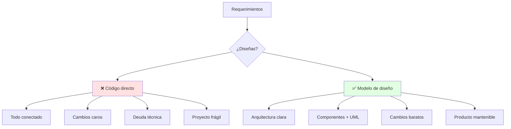
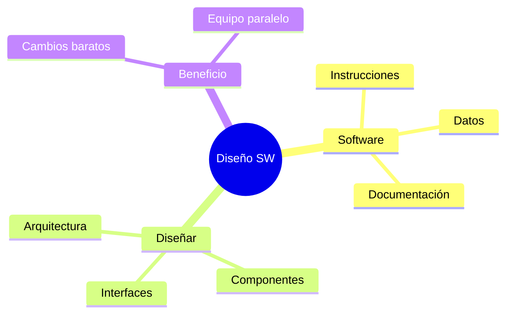

# 🏗️ Naturaleza del Software y el Diseño

## 🎯 Introducción

> [!info] 💡 ¿Por Qué Diseñar Antes de Codificar?
>
> El **diseño de software** es el puente entre los requerimientos y el código: decide la arquitectura, los componentes y sus interfaces *antes* de que programar sea caro de corregir. Un error de diseño cuesta 10x más si se descubre en pruebas que en el pizarrón.
>
> **Analogía del mundo real:** Piensa en construir una casa:
>
> - **Sin diseño** → Pegas ladrillos y descubres que la puerta no abre (refactor gigante)
> - **Con diseño** → Planos, cimientos y tuberías definidos antes del primer ladrillo
> - **Software** → Instrucciones + estructuras de datos + documentación que lo describe
> - **Diseño** → El plano: qué piezas existen y cómo se conectan
>
> | Razón | Codificar Directo | Diseñar Primero |
> |---|---|---|
> | **Cambios** | Rompen todo (alto acoplamiento) | Localizados en un componente |
> | **Mantenimiento** | Solo el autor entiende | Cualquiera lee el modelo UML |
> | **Calidad** | Se prueba al final | Se valida desde el modelo |
> | **Equipo** | Pisan su código | Interfaces claras, trabajo paralelo |



---

## 🧵 Qué es el Software (Pressman cap. 1)

### 🎭 Tres Caras del Mismo Producto

> [!note] 🎨 Definición Operativa
>
> **Software = instrucciones + estructuras de datos + documentación.** No es solo código: incluye lo que permite operar y mantener el programa.
>
> ```mermaid
> graph LR
>     U[Necesidad] --> E[Instrucciones]
>     E --> D[Datos]
>     D --> DOC[Documentación]
>     DOC --> S[Software útil]
>
>     style S fill:#e1ffe1
> ```
>
> | Cara | Qué es | Ejemplo en tu proyecto |
> |---|---|---|
> | **Instrucciones** | Programas que se ejecutan | Clases Java del sistema |
> | **Datos** | Estructuras que manipulan | Modelos, archivos, BD |
> | **Documentación** | Describe operación y uso | Diagramas UML + README |
>
> **Diferencia clave con manufactura:** el software no se desgasta, se *deteriora por cambios*. Cada parche sin diseño aumenta la entropía: por eso existe la refactorización (Unidad 4).

### 🔍 Dónde Vive el Diseño en el Proceso

> [!example] 🧪 Del Requerimiento al Código
>
> 1. Requerimientos (qué debe hacer) → Pressman cap. 7-8
> 2. DISEÑO (cómo lo hará): arquitectura → componentes → interfaces → esta materia
> 3. Construcción (código + versiones + pruebas) → Unidades 4-5
> 4. Validación (¿cumple?) → pruebas unitarias + proyecto final
>
> **Regla de oro:**
>
> Si no puedes dibujarlo en UML, aún no lo entiendes lo suficiente para codificarlo.

---

## ⚠️ Problemas Comunes y Soluciones

> [!danger] ❌ Error: "Diseñar es Perder Tiempo"
>
> **Síntomas:** saltan al IDE, a mitad del proyecto nadie sabe qué clase hace qué.
>
> **Solución:**
>
> - 30 min de modelo (diagrama de clases borrador) antes de cada módulo nuevo
> - Si el diagrama tiene >7 clases sin agrupar, falta arquitectura (ver nota 02 y Unidad 2)

---

## 🎯 Mejores Prácticas

> [!tip] 🏆 Checklist de Apertura
>
> **1. Todo módulo nuevo nace en el pizarrón, no en el IDE**
>
> Requerimiento → boceto UML → critícalo con tu equipo → recién codea
>
> **2. Documenta mientras diseñas**
>
> El diagrama ES documentación: guárdalo en el repo junto al código.
>
> **3. Conecta con POO (tu prerrequisito)**
>
> Pilares + UML básico de POO son el piso; aquí construyes la casa.

---

## 📊 Resumen Visual



> [!success] 🔍 Comparación Final
>
> | Aspecto | Sin Diseño | Con Diseño |
> |---|---|---|
> | **Cambios** | ❌ En cascada | ✅ Localizados |
> | **Equipo** | Se pisa | Interfaces claras |
> | **Uso Recomendado** | Scripts de 50 líneas | ✅ **Todo proyecto de curso** |

---

## 🚀 Próximos Pasos

> [!quote] 🌟 Continuando
>
> **Has aprendido:**
>
> ✅ Qué es software y por qué se deteriora con cambios
> ✅ Dónde vive el diseño en el proceso
> ✅ Regla del boceto UML previo
>
> **Próximo tema:**
>
> | Tema | Qué verás | Por qué importa |
> |---|---|---|
> | **Principios: abstracción, cohesión y acoplamiento** | Independencia funcional y ocultamiento | Base de todo diseño OO (Unidad 2) |

---

## 🔗 Seguir estudiando

> [!info] 📚 Seguir estudiando
>
> - Mapa de contenido: [[Diseño de Software]]
> - Índice Unidad 1: [[00 - Índice Unidad 1]]
> - Siguiente: [[02 - Principios de diseño, cohesión y acoplamiento]]
> - Syllabus: [[Bienvenida y Syllabus Diseño de Software]]

## 📚 Referencias

> [!quote] 📖 Fuentes
>
> - R. Pressman, B. Maxim, *Software Engineering: A Practitioner's Approach*, 9th ed., caps. 1 y 8.
> - Sílabo CCPG1042, Unidad 1: introducción al diseño (5h).

---

**Tags:** #CCPG1042 #unidad1 #software #diseno #diseno-software
