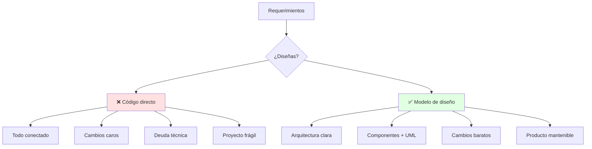
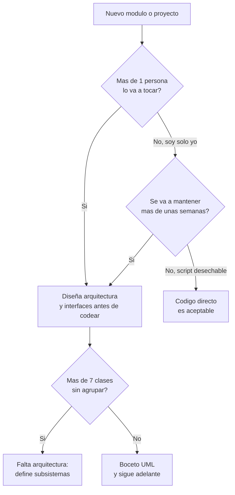
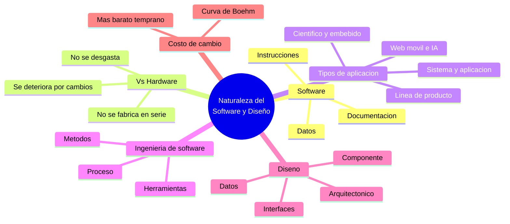

# 🏗️ Naturaleza del Software y el Diseño

## 🎯 Introducción

> [!info] 💡 ¿Por Qué Diseñar Antes de Codificar?
>
> El **diseño de software** es el puente entre los requerimientos y el código: decide la arquitectura, los componentes y sus interfaces *antes* de que programar sea caro de corregir.
>
> **Importancia histórica:** en 1968, la OTAN organizó la primera **Conferencia de Ingeniería de Software** en Garmisch, Alemania, para enfrentar lo que se llamó la **"crisis del software"**: proyectos que se entregaban tarde, sobre presupuesto y con errores, porque se programaba sin método ni diseño previo. De ahí nace la idea de tratar el desarrollo de software como una disciplina de ingeniería —con procesos, modelos y diseño formal— y no como un oficio artesanal improvisado.
>
> **Relevancia actual:** esa misma crisis se repite a pequeña escala en cualquier proyecto sin diseño: metodologías ágiles, DevOps y arquitecturas de microservicios modernas siguen dependiendo de decisiones de diseño explícitas (aunque se tomen de forma iterativa) para no colapsar bajo su propio peso al crecer.
>
> **Analogía del mundo real:** piensa en construir una casa:
>
> - **Sin diseño** → Pegas ladrillos y descubres que la puerta no abre (refactor gigante).
> - **Con diseño** → Planos, cimientos y tuberías definidos antes del primer ladrillo.
> - **Software** → Instrucciones + estructuras de datos + documentación que lo describe.
> - **Diseño** → El plano: qué piezas existen y cómo se conectan.
>
> | Razón | Codificar Directo | Diseñar Primero |
> |---|---|---|
> | **Cambios** | Rompen todo (alto acoplamiento) | Localizados en un componente |
> | **Mantenimiento** | Solo el autor entiende | Cualquiera lee el modelo UML |
> | **Calidad** | Se prueba al final | Se valida desde el modelo |
> | **Equipo** | Pisan su código | Interfaces claras, trabajo paralelo |



---

## 🧵 Qué es el Software (Pressman cap. 1)

> [!note] 🎨 Definición Operativa — Tres Caras del Mismo Producto
>
> **Software = instrucciones + estructuras de datos + documentación.** No es solo código: incluye lo que permite operar y mantener el programa.
>
> ```mermaid
> graph LR
>     U[Necesidad] --> E[Instrucciones]
>     E --> D[Datos]
>     D --> DOC[Documentación]
>     DOC --> S[Software útil]
>     style S fill:#e1ffe1
> ```
>
> | Cara | Qué es | Ejemplo en tu proyecto |
> |---|---|---|
> | **Instrucciones** | Programas que se ejecutan | Clases Java del sistema |
> | **Datos** | Estructuras que manipulan | Modelos, archivos, BD |
> | **Documentación** | Describe operación y uso | Diagramas UML + README |

> [!success] 📋 Por Qué el Software NO es Como el Hardware
>
> Pressman señala tres diferencias fundamentales entre software y hardware que justifican por qué el software necesita un tipo distinto de ingeniería:
>
> | Característica | Hardware | Software |
> |---|---|---|
> | **Se fabrica o se construye** | Se **manufactura** en serie (misma pieza, miles de copias idénticas) | Se **diseña/construye**; cada copia es una reproducción perfecta y gratuita del original — el costo está en construir el *primero*, no en copiarlo |
> | **Desgaste con el uso** | Se **desgasta físicamente** (fricción, fatiga de materiales) | **No se desgasta** — una función que funcionaba hace 5 años funciona igual hoy si nadie la tocó |
> | **Deterioro** | Sigue una curva de fallas conocida ("curva de bañera": fallas tempranas por defectos de fábrica, vida útil estable, fallas por desgaste al final) | **Se deteriora por los cambios**: cada modificación mal planeada introduce nuevos defectos y aumenta la complejidad — a esto se le llama *entropía del software* |
> | **Reparación** | Reemplazar la pieza dañada restaura el sistema | "Reparar" un defecto a veces introduce otro — el software no tiene piezas físicas intercambiables, solo lógica interconectada |

> [!tip] 🎯 Caso límite: la "curva de bañera" del software
>
> En hardware, la tasa de fallas grafica una curva en forma de "U" o bañera: alta al inicio (defectos de fabricación), baja y estable en medio (vida útil), alta al final (desgaste). El software **no sigue esta curva** — idealmente, su tasa de fallas debería mantenerse baja y constante si nadie lo toca. En la práctica, cada vez que se modifica (un parche, una nueva función) la tasa de fallas **sube temporalmente** antes de volver a estabilizarse, y con cada cambio mal diseñado, el nivel base de fallas tiende a subir un poco más que la vez anterior. Esa acumulación progresiva de deterioro por cambios sin control es exactamente lo que el diseño cuidadoso busca frenar.

---

## 🗂️ Tipos de Aplicaciones de Software

> [!note] 📋 Categorías según Pressman
>
> No todo software se diseña igual — el tipo de aplicación condiciona qué tan crítico es el diseño previo:
>
> | Tipo | Qué hace | Ejemplo |
> |---|---|---|
> | **Software de sistema** | Da servicio a otros programas (SO, drivers, compiladores) | Linux kernel, un driver de impresora |
> | **Software de aplicación** | Resuelve una necesidad específica del usuario/negocio | Un ERP, un editor de texto |
> | **Software científico/de ingeniería** | Cálculo numérico intensivo, simulaciones | Software de análisis estructural, clima |
> | **Software embebido** | Vive dentro de un dispositivo, controla hardware específico | Firmware de un microondas, un ECU automotriz |
> | **Software de línea de producto** | Una base de código, muchas variantes configurables | Un mismo CRM adaptado por industria |
> | **Aplicaciones web y móviles** | Distribuidas, interfaces ricas, consumo de APIs | Tu proyecto de NexusFS, apps de banca |
> | **Software con IA** | Usa técnicas no algorítmicas tradicionales (aprendizaje, inferencia) | Sistemas de recomendación, visión por computadora |
>
> **Por qué importa para diseño:** entre más crítico y de mayor escala sea el tipo de aplicación (ej. software embebido en un marcapasos vs. un script personal), más riguroso debe ser el proceso de diseño previo — el costo de un defecto no es el mismo.

---

## 🔍 Dónde Vive el Diseño en el Proceso

> [!example] 🧪 Del Requerimiento al Código
>
> 1. **Requerimientos** (qué debe hacer) → Pressman cap. 7-8.
> 2. **DISEÑO** (cómo lo hará): arquitectura → componentes → interfaces → **esta materia**.
> 3. **Construcción** (código + versiones + pruebas) → Unidades 4-5.
> 4. **Validación** (¿cumple?) → pruebas unitarias + proyecto final.
>
> **Regla de oro:** si no puedes dibujarlo en UML, aún no lo entiendes lo suficiente para codificarlo.

> [!warning] ⚠️ Por Qué Diseñar Temprano Sale Más Barato
>
> Existe un principio ampliamente documentado en ingeniería de software (curva de costo de Boehm): **el costo de corregir un defecto crece exponencialmente** mientras más tarde se detecta en el ciclo de vida del proyecto.
>
> | Etapa donde se detecta el error | Costo relativo de corregirlo |
> |---|---|
> | Durante el diseño (pizarrón, UML) | 1x (el más barato: borras y rehaces) |
> | Durante la construcción (código) | 5x-10x |
> | Durante las pruebas | 10x-20x |
> | Después de entregado al cliente | 100x o más |
>
> Un error de arquitectura detectado en un diagrama cuesta una conversación de 10 minutos; el mismo error detectado en producción puede costar semanas de reescritura.

> [!note] 📋 Las Cuatro Vistas del Diseño de Software
>
> El diseño de software no es una sola actividad — Pressman lo descompone en cuatro niveles, que se profundizarán en unidades posteriores de este curso:
>
> | Nivel | Qué decide | Se verá en |
> |---|---|---|
> | **Diseño de datos** | Estructuras de datos que soportan el software | Unidad 2 |
> | **Diseño arquitectónico** | Organización general en componentes/subsistemas | Unidad 2-3 |
> | **Diseño de interfaces** | Cómo se comunican los componentes entre sí y con el usuario | Unidad 3 |
> | **Diseño a nivel de componente** | Estructura interna detallada de cada módulo | Unidad 4 |

---

## 📐 Ingeniería de Software: Definición Formal

> [!note] 📋 Definición (IEEE)
>
> El **IEEE** define la ingeniería de software como: *"la aplicación de un enfoque sistemático, disciplinado y cuantificable al desarrollo, operación y mantenimiento del software."*
>
> En la práctica, esto se traduce en tres capas que trabajan juntas:
>
> ```mermaid
> graph TD
>     A["Un compromiso<br/>con la calidad"] --> B["Proceso<br/>(como organizas el trabajo)"]
>     B --> C["Metodos<br/>(tecnicas tecnicas: diseno, pruebas)"]
>     C --> D["Herramientas<br/>(UML, IDEs, control de versiones)"]
>     style A fill:#fff4e1
>     style B fill:#e1ffe1
>     style C fill:#e1f5ff
>     style D fill:#f5e1ff
> ```
>
> - **Proceso:** el marco de trabajo (ej. ágil, cascada) que organiza cuándo ocurre cada actividad.
> - **Métodos:** las técnicas concretas — cómo modelar requerimientos, cómo diseñar, cómo probar.
> - **Herramientas:** el soporte automatizado o semiautomatizado de los métodos (UML, Git, IDEs).
>
> El **diseño** (esta materia) vive dentro de "métodos" — es una de las técnicas centrales de todo el proceso.

---

## 🗺️ ¿Cuánto Diseño Necesito? — Diagrama de Decisión



> [!tip] 💡 Lectura del diagrama
>
> El diseño formal no es un trámite obligatorio para absolutamente todo — un script de uso personal y desechable no lo necesita. Pero en cuanto hay **más de una persona involucrada** o el código **va a vivir más de unas semanas**, el costo de no diseñar (ver la curva de Boehm) supera por mucho el tiempo invertido en el boceto previo.

---

## ⚠️ Problemas Comunes y Soluciones

> [!danger] ❌ Error 1: "Diseñar es Perder Tiempo" (viola **diseño previo/costo de Boehm**)
>
> **Síntomas:** saltan al IDE directamente; a mitad del proyecto nadie sabe qué clase hace qué.
>
> **Solución:**
>
> - 30 min de modelo (diagrama de clases borrador) antes de cada módulo nuevo.
> - Si el diagrama tiene más de 7 clases sin agrupar, falta arquitectura (ver nota 02 y Unidad 2).

> [!danger] ❌ Error 2: Confundir "Documentar" con "Diseñar" (viola **diseño como herramienta previa**)
>
> **Síntomas:** se hace el diagrama UML *después* de terminar el código, solo para "cumplir con la entrega" — el diagrama no refleja decisiones reales, solo describe lo que ya se hizo por accidente.
>
> **Solución:** el diagrama debe preceder al código y ser una herramienta de pensamiento, no un formalismo posterior. Si cambia el código, el diagrama también debe actualizarse — ambos documentan la misma verdad.

> [!danger] ❌ Error 3: Sobre-diseñar un Proyecto Pequeño (viola **proporcionalidad del diseño**)
>
> **Síntomas:** se invierten días en diagramas UML exhaustivos y patrones de diseño complejos para un script de una sola clase que se usará una vez.
>
> **Solución:** el nivel de diseño debe ser proporcional a la vida útil y complejidad esperada del software (ver el diagrama de decisión de esta nota) — diseñar de más es tan costoso como no diseñar.

---

## 🎯 Mejores Prácticas

> [!tip] 🏆 Checklist de Apertura
>
> **1. Todo módulo nuevo nace en el pizarrón, no en el IDE**
>
> Requerimiento → boceto UML → critícalo con tu equipo → recién codea.
>
> **2. Documenta mientras diseñas**
>
> El diagrama ES documentación: guárdalo en el repo junto al código, y actualízalo si el diseño cambia.
>
> **3. Conecta con POO (tu prerrequisito)**
>
> Pilares + UML básico de POO son el piso; aquí construyes la casa.
>
> **4. Calibra el esfuerzo de diseño al proyecto**
>
> No todo necesita arquitectura de microservicios — usa el diagrama de decisión de esta nota para no sobre-diseñar ni sub-diseñar.

---

## 📝 Ejercicios Propuestos

> [!example] 📋 Nivel 1 — Básico
>
> **1.** Define software con tus propias palabras usando las "tres caras" (instrucciones, datos, documentación).
>
> **2.** Menciona dos diferencias entre software y hardware según Pressman.
>
> **3.** ¿En qué etapa del proceso (requerimientos, diseño, construcción, validación) se decide la arquitectura de un sistema?
>
> **4.** Clasifica según el tipo de aplicación: (a) un firmware de termostato inteligente, (b) un sistema de nómina de una empresa.
>
> **5.** ¿Qué significa que el software "se deteriora" en vez de "desgastarse"?
>
> > [!success]- ✅ Respuestas — Nivel 1
> >
> > - **1.** Software es el conjunto de instrucciones ejecutables, las estructuras de datos que manipulan, y la documentación que describe su operación y uso — no es solo el código.
> > - **2.** Ej.: el hardware se manufactura en serie y se desgasta físicamente; el software se construye una vez (las copias son gratuitas) y no se desgasta, solo se deteriora por cambios mal gestionados.
> > - **3.** En la etapa de **diseño**, después de los requerimientos y antes de la construcción.
> > - **4.** (a) Software embebido. (b) Software de aplicación.
> > - **5.** El software no sufre fricción ni fatiga de materiales; su calidad empeora cuando se le hacen modificaciones sin control, acumulando complejidad y defectos (entropía del software).

> [!example] 📋 Nivel 2 — Intermedio
>
> **6.** Explica con tus palabras la "curva de costo de Boehm" y por qué justifica diseñar antes de codificar.
>
> **7.** Un compañero de equipo dice: "Hagamos el diagrama UML al final, para que coincida exactamente con el código que ya escribimos." ¿Qué error está cometiendo? Relaciónalo con los errores comunes de esta nota.
>
> **8.** Describe las tres capas de la definición de ingeniería de software del IEEE (proceso, métodos, herramientas) con un ejemplo de cada una en un proyecto propio.
>
> **9.** ¿Por qué un software de línea de producto (ej. un mismo CRM configurado para distintas industrias) depende más del diseño previo que una aplicación de un solo propósito?
>
> **10.** Usando el diagrama de decisión de la nota, justifica si un script personal de limpieza de archivos (uso único, solo tú lo usas) necesita diseño formal previo.
>
> > [!success]- ✅ Respuestas — Nivel 2
> >
> > - **6.** La curva muestra que el costo de corregir un error crece exponencialmente cuanto más tarde se detecta: barato en el diseño (solo rehacer un diagrama), carísimo después de entregado al cliente (requiere parches, pruebas de regresión, posible daño reputacional).
> > - **7.** Está confundiendo "documentar" con "diseñar" (Error 2) — el diagrama dejó de ser una herramienta de pensamiento previo y se volvió un trámite posterior que no influyó en ninguna decisión real.
> > - **8.** Respuesta libre guiada por el ejemplo del tema — proceso: metodología usada (ágil/cascada); métodos: técnica de diseño o prueba aplicada; herramientas: UML, Git, IDE usados.
> > - **9.** Porque los cambios en una base de código compartida por múltiples variantes se propagan a todas ellas — sin una arquitectura clara que aísle lo específico de cada industria, un cambio para un cliente puede romper el producto para otro.
> > - **10.** Según el diagrama: una sola persona lo usa y es desechable (no se mantiene por semanas) → código directo es aceptable, no requiere diseño formal.

> [!example] 📋 Nivel 3 — Avanzado
>
> **11.** Argumenta por qué la "crisis del software" de los años 60 llevó a tratar el desarrollo como ingeniería y no como oficio artesanal. ¿Qué problema concreto resolvía ese cambio de enfoque?
>
> **12.** Un proyecto universitario de 3 personas crece de 5 a 15 clases sin agrupar en 3 semanas. Usando el contenido de esta nota, diagnostica qué está fallando y qué acción tomar.
>
> **13.** Compara el concepto de "deterioro por cambios" del software con el concepto de deuda técnica (investiga brevemente si no te resulta familiar). ¿Son lo mismo o se relacionan?
>
> **14.** Diseña (en prosa, sin UML) un caso hipotético donde sobre-diseñar un proyecto pequeño resultó más costoso que no diseñar en absoluto. Usa el diagrama de decisión de la nota para justificar dónde se desvió la decisión correcta.
>
> **15.** Relaciona las "cuatro vistas del diseño" (datos, arquitectónico, interfaces, componente) con las tres capas de la definición IEEE de ingeniería de software (proceso, métodos, herramientas). ¿En cuál capa encajan las cuatro vistas?
>
> > [!success]- ✅ Respuestas — Nivel 3
> >
> > - **11.** Antes de tratarlo como ingeniería, el desarrollo dependía completamente de la habilidad individual del programador, sin proceso repetible ni forma de estimar costos o detectar errores temprano — de ahí los sobrecostos y retrasos masivos que motivaron la conferencia de la OTAN de 1968.
> > - **12.** Según el Error 1 de esta nota, 15 clases sin agrupar en un proyecto de varias personas es una señal clara de que falta arquitectura — la acción es pausar la construcción y definir subsistemas/agrupaciones antes de seguir agregando clases.
> > - **13.** Se relacionan estrechamente: la deuda técnica es, en esencia, una forma de medir el deterioro acumulado por decisiones de diseño pospuestas o atajos tomados bajo presión — "pagar" la deuda es básicamente rediseñar lo que se dejó sin estructurar.
> > - **14.** Respuesta libre — debe identificar el punto del diagrama de decisión donde se sobreestimó la necesidad de diseño (ej. tratar un script desechable como si fuera un sistema de larga vida).
> > - **15.** Las cuatro vistas del diseño son parte de la capa de **métodos** — son las técnicas concretas que se aplican dentro del proceso de ingeniería de software.

---

## 📋 Resumen Ejecutivo

> [!summary] 📋 Lo Esencial
>
> - El **software** son instrucciones + datos + documentación — no solo código.
> - A diferencia del hardware, el software **no se desgasta físicamente**, pero **se deteriora con cambios mal gestionados** (entropía del software).
> - El **diseño** ocurre entre los requerimientos y la construcción, y define arquitectura, datos, interfaces y componentes.
> - La **curva de costo de Boehm** justifica diseñar temprano: un error cuesta exponencialmente más mientras más tarde se detecta.
> - El esfuerzo de diseño debe ser **proporcional** al proyecto — ni sub-diseñar (caos) ni sobre-diseñar (desperdicio) un proyecto pequeño y desechable.

---

## ✅ Metas de Aprendizaje

> [!note] 🎯 Nivel Básico
> - [ ] Defino software usando sus tres caras (instrucciones, datos, documentación).
> - [ ] Explico al menos dos diferencias entre software y hardware.
> - [ ] Ubico la etapa de diseño dentro del proceso general de desarrollo.

> [!note] 🎯 Nivel Intermedio
> - [ ] Explico la curva de costo de Boehm y su implicación práctica para diseñar temprano.
> - [ ] Distingo las tres capas de la definición IEEE de ingeniería de software (proceso, métodos, herramientas).
> - [ ] Clasifico un software dado según su tipo de aplicación y explico por qué eso afecta cuánto diseño necesita.

> [!note] 🎯 Nivel Avanzado
> - [ ] Diagnostico cuándo un proyecto real necesita más o menos diseño formal, usando el diagrama de decisión.
> - [ ] Relaciono el deterioro del software con el concepto de deuda técnica.
> - [ ] Argumento históricamente por qué el desarrollo de software se convirtió en una disciplina de ingeniería.

---

## 📊 Resumen Visual



> [!success] 🔍 Comparación Final
>
> | Aspecto | Sin Diseño | Con Diseño |
> |---|---|---|
> | **Cambios** | ❌ En cascada | ✅ Localizados |
> | **Equipo** | Se pisa | Interfaces claras |
> | **Costo de un error** | Crece exponencialmente con el tiempo | Se corrige barato, en el pizarrón |
> | **Uso Recomendado** | Scripts desechables de una persona | ✅ **Todo proyecto de curso o producción** |

---

## 🚀 Próximos Pasos

> [!quote] 🌟 Continuando
>
> **Has aprendido:**
>
> ✅ Qué es software y por qué se deteriora con cambios, no se desgasta
> ✅ Las cuatro vistas del diseño y dónde vive en el proceso
> ✅ La curva de costo de Boehm como justificación para diseñar temprano
> ✅ Cuándo el diseño formal es proporcional (y cuándo es excesivo)
>
> **Próximo tema:**
>
> | Tema | Qué verás | Por qué importa |
> |---|---|---|
> | **Principios: abstracción, cohesión y acoplamiento** | Independencia funcional y ocultamiento de información | Base de todo diseño OO (Unidad 2) |

---

## 🔗 Seguir estudiando

> [!info] 📚 Seguir estudiando
>
> - Mapa de contenido: [[Diseño de Software]]
> - Índice Unidad 1: [[00 - Índice Unidad 1]]
> - Siguiente: [[02 - Principios de diseño, cohesión y acoplamiento]]
> - Syllabus: [[Bienvenida y Syllabus Diseño de Software]]

## 📚 Referencias

> [!quote] 📖 Fuentes
>
> - R. Pressman, B. Maxim, *Software Engineering: A Practitioner's Approach*, 9th ed., McGraw-Hill — caps. 1 (La naturaleza del software) y 8 (Conceptos de diseño).
> - IEEE, *IEEE Standard Glossary of Software Engineering Terminology* — definición de ingeniería de software.
> - P. Naur, B. Randell (eds.), *Software Engineering: Report on a conference sponsored by the NATO Science Committee*, Garmisch, Alemania, 1968 — origen histórico del término "ingeniería de software".
> - Sílabo CCPG1042, Unidad 1: introducción al diseño (5h).

---

**Tags:** #CCPG1042 #unidad1 #software #diseno #diseno-software #crisis-del-software #ingenieria-de-software
