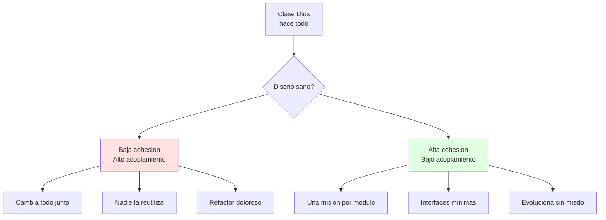
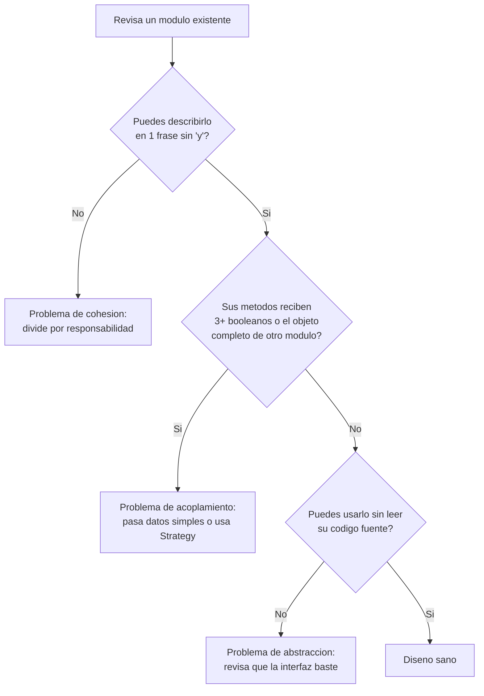
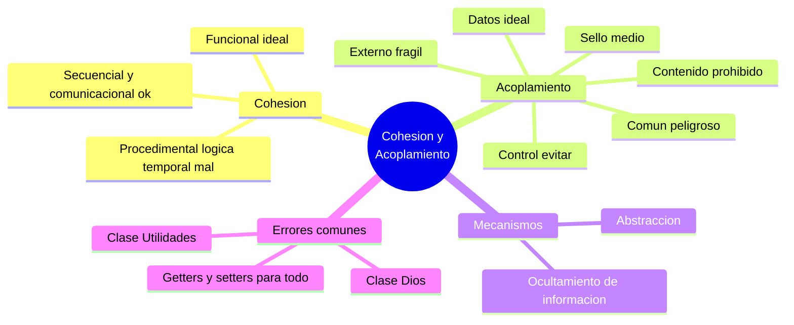

# ⚖️ Principios de Diseño: Cohesión y Acoplamiento

## 🎯 Introducción

> [!info] 💡 ¿Por Qué Dos Clases "Que Funcionan" Pueden Ser Mal Diseño?
>
> La **independencia funcional** se mide con dos reglas: **alta cohesión** (cada módulo hace UNA cosa bien) y **bajo acoplamiento** (los módulos dependen poco entre sí). Código que "funciona" pero mezcla todo es deuda que la Unidad 4 cobrará.
>
> Estos dos términos los formalizaron Constantine y Yourdon (*Structured Design*, 1979), y siguen vigentes hoy bajo otros nombres: el Principio de Responsabilidad Única de SOLID es, en esencia, "alta cohesión"; los límites entre microservicios se trazan para minimizar el acoplamiento.
>
> **Analogía del mundo real:** piensa en un restaurante:
>
> - **Alta cohesión** → El cocinero solo cocina; el mesero solo atiende (cada rol, una misión).
> - **Bajo acoplamiento** → El mesero pasa *el pedido* (dato), no le dice al cocinero *cómo* cocinar (control).
> - **Mal diseño** → El mesero entra a la cocina a sazonar y el cocinero cobra mesas.
>
> | Razón | Todo Mezclado | Cohesivo y Desacoplado |
> |---|---|---|
> | **Cambiar algo** | Tocas 5 clases | Tocas 1 |
> | **Reutilizar** | Imposible sin arrastrar todo | Tomas el módulo y sirve |
> | **Probar** | Necesitas todo el sistema | Prueba unitaria aislada (Unidad 5) |
> | **Equipo** | Conflictos en Git | Cada quien su módulo |



---

## 🧵 Cohesión: Una Misión por Módulo

> [!note] 📊 Escala de Cohesión (de peor a mejor)
>
> ```mermaid
> graph LR
>     P["Coincidente"] --> L["Logica"]
>     L --> T["Temporal"]
>     T --> PR["Procedimental"]
>     PR --> C["Comunicacional"]
>     C --> S["Secuencial"]
>     S --> F["Funcional"]
>     style F fill:#e1ffe1
>     style P fill:#ffe1e1
> ```
>
> | Nivel | Qué significa | Ejemplo |
> |---|---|---|
> | **Funcional** ✅ | Todo contribuye a UNA tarea | `CalculadoraIVA`: solo calcula IVA |
> | **Secuencial** | Salida de una parte = entrada de otra | Leer → validar → guardar |
> | **Comunicacional** | Operan sobre los mismos datos | CRUD de `Estudiante` |
> | **Procedimental** | Siguen un orden impuesto, sin compartir datos | `init(); procesar(); cerrar();` mezclados |
> | **Temporal** | Suceden al mismo tiempo, sin relación funcional | `iniciarTodo()` que prende 5 cosas distintas |
> | **Lógica** | Agrupadas por "se parecen" superficialmente | `Utilidades` con 40 métodos varios |
> | **Coincidente** ❌ | Juntas por accidente | `Miscelaneo.java` |
>
> **Test de 10 segundos:** describe tu clase en 1 frase sin usar "y". Si necesitas "y", divídela.
>

> [!example]- 💻 Código — Cohesión Funcional vs. Lógica
>
> ```java
> // ❌ COHESIÓN LÓGICA — agrupa "cosas parecidas", no una misión
> class Utilidades {
>     double calcularIVA(double precio) { ... }
>     String formatearFecha(Date d) { ... }
>     boolean validarEmail(String s) { ... }
>     void enviarCorreo(String destino) { ... }
> }
>
> // ✅ COHESIÓN FUNCIONAL — cada clase, una sola misión
> class CalculadoraIVA {
>     double calcular(double precio) { ... }
> }
> class FormateadorFecha {
>     String formatear(Date d) { ... }
> }
> class ValidadorEmail {
>     boolean validar(String s) { ... }
> }
> ```
>
> Si cambia la lógica de validación de emails, en la versión cohesiva solo tocas `ValidadorEmail`. En `Utilidades`, ese cambio obliga a revisar una clase con responsabilidades que no tienen nada que ver entre sí.
>

> [!tip] 🎯 Caso límite: no todo necesita ser puramente funcional
>
> En la práctica, la cohesión **secuencial** y **comunicacional** suelen ser aceptables. El problema real empieza en **procedimental** hacia abajo, donde las partes agrupadas ya no comparten ni datos ni un flujo natural, solo "convivencia forzada".

---

## 🔗 Acoplamiento: Depende Poco

> [!note] 📊 Escala de Acoplamiento (de mejor a peor)
>
> | Nivel | Qué pasa | Ejemplo Java |
> |---|---|---|
> | **Datos** ✅ | Solo parámetros simples | `calcular(precio, tasa)` |
> | **Sello (stamp)** | Pasa estructura completa, usa una parte | `procesar(estudiante)` usando solo su id |
> | **Control** | Una llama decide con banderas | `imprimir(reporte, aDobleCara)` |
> | **Externo** | Dependen de algo fuera (formato, protocolo) | Leer variable de entorno fija |
> | **Común** | Comparten estado global mutable | `public static Config x` tocada por 6 clases |
> | **Contenido** ❌ | Una modifica el interior de otra | Acceso directo a campos privados ajenos |
>

> [!example]- 💻 Código — Acoplamiento de Control vs. Datos
>
> ```java
> // ❌ ACOPLAMIENTO DE CONTROL + BAJA COHESIÓN
> class Reportes {
>     void generar(boolean aDobleCara, boolean urgente, boolean resumen) {
>         // 3 banderas = 3 personalidades distintas
>     }
> }
>
> // ✅ DATOS + COHESIÓN FUNCIONAL
> class GeneradorReporte {
>     Reporte generar(Datos datos) { /* una misión */ }
> }
> class Impresora {
>     void imprimir(Reporte r, OpcionesImpresion o) { /* otra misión */ }
> }
> ```
>

> [!note] ✅ Datos — Acoplamiento ideal
>
> Solo parámetros simples (primitivos, strings, records inmutables). La función no conoce estructura ni ciclo de vida del dato.
>
> - **Ejemplo:** `calcular(precio, tasa)`.
> - **Regla:** si pasas un objeto, usa solo lo que necesitas (Ley de Demeter).
> - **Anti-patrón:** pasar un `DTO` entero cuando solo necesitas un campo.
>

> [!note] 🟡 Sello (Stamp) — Acoplamiento medio
>
> Pasa una estructura completa pero usa solo una parte de ella.
>
> - **Ejemplo:** `procesar(estudiante)` usando solo `estudiante.id`.
> - **Mejora:** extrae el dato necesario antes de llamar, o usa un parámetro específico.
> - **Señal de alerta:** si tu test debe construir un objeto complejo solo por un campo, es acoplamiento de sello.
>

> [!warning] 🎚️ Control — Acoplamiento a evitar
>
> Una función decide qué hace otra mediante banderas/booleanos.
>
> - **Ejemplo:** `imprimir(reporte, aDobleCara, conMarcaDeAgua)`.
> - **Solución:** polimorfismo (`ReportePDF` vs `ReporteHTML`) o patrón Strategy.
> - **Test:** 3+ booleanos en una firma son 3 clases esperando nacer.
>

> [!warning] 🔌 Externo — Acoplamiento frágil
>
> Depende de algo fuera del sistema: formato de archivo, protocolo, variable de entorno hardcodeada.
>
> - **Ejemplo:** leer `APP_CONFIG` directamente desde `System.getenv()` en la lógica de negocio.
> - **Solución:** aislar detrás de una interfaz (`ConfigProvider`) e inyectar la dependencia.
>

> [!danger] 🌐 Común — Acoplamiento peligroso
>
> Comparten estado global mutable.
>
> - **Ejemplo:** `public static Config x` tocada por 6 clases.
> - **Solución:** inyección de dependencias (constructor/setter) + inmutabilidad.
> - **Regla de oro:** nada de `static` mutable en el dominio.
>

> [!danger] 🚫 Contenido — Acoplamiento prohibido
>
> Una clase accede directamente a campos privados de otra (reflexión, `friend` en C++, paquetes abiertos en Java).
>
> - **Único uso permitido:** tests con reflexión controlada, nunca en producción.
> - **Señal máxima:** si necesitas `@SuppressWarnings("java:S3011")` para compilar, el diseño está roto.

---

## 🛡️ Ocultamiento de Información y Abstracción

> [!success] 🏆 Las Dos Guardias del Diseño
>
> - **Abstracción:** muestra el *qué*, esconde el *cómo*.
>   - *Procedimental:* la firma de un método (`ordenar(lista)`) no revela si usa quicksort o mergesort.
>   - *De datos:* una clase expone operaciones (`push`, `pop`), no sus campos internos.
> - **Ocultamiento de información** (principio de Parnas, 1972): ningún módulo necesita saber el interior de otro — solo su interfaz pública. La idea: escondes detrás de la interfaz justo la decisión de diseño que es más probable que cambie.
>
> Si para usar tu clase debo leer su código fuente, tu abstracción falló.
>

> [!example]- 💻 Código — Ocultamiento en una Pila (Stack)
>
> ```java
> public class Pila<T> {
>     private List<T> datos = new ArrayList<>(); // detalle oculto
>
>     public void push(T valor) { datos.add(valor); }
>     public T pop() { return datos.remove(datos.size() - 1); }
>     public boolean estaVacia() { return datos.isEmpty(); }
> }
> ```
>
> Quien usa `Pila<T>` solo conoce `push`, `pop` y `estaVacia` — no sabe si por dentro usa un `ArrayList`, un arreglo nativo o una lista enlazada. Si cambias la implementación interna, ningún código externo se entera ni se rompe.
>

> [!note] 📋 Cómo se relacionan los tres conceptos
>
> | Concepto | Qué resuelve | Mecanismo |
> |---|---|---|
> | **Alta cohesión** | Que un módulo tenga una sola razón para cambiar | Agrupar por responsabilidad, no por conveniencia |
> | **Bajo acoplamiento** | Que un cambio no obligue a cambiar otros módulos | Pasar datos simples, no estructuras ni control |
> | **Ocultamiento de información** | Que los detalles internos no se filtren hacia afuera | Exponer solo interfaz, esconder implementación |
>
> La abstracción y el ocultamiento son los **mecanismos**; cohesión y acoplamiento son las **métricas** de qué tan bien los aplicaste.

---

## 🗺️ Diagrama de Decisión: ¿Qué Ajustar en mi Diseño?



---

## ⚠️ Problemas Comunes y Soluciones

> [!danger] ❌ Error 1: La Clase `Utilidades` Infinita (viola **cohesión funcional**)
>
> **Síntomas:** una sola clase acumula misiones sin relación:
>
> ```java
> // ❌ EL ERROR ESTÁ AQUÍ: 3 misiones, 0 cohesión
> class Utilidades {
>     boolean validarEmail(String s) { /* ... */ return true; }
>     String formatearFecha(Date d) { /* ... */ return ""; }
>     double calcularIVA(double p) { /* ... */ return 0; }
> }
> ```
>
> **Solución:** agrupa por misión real (`ValidadorEmail`, `FormateadorFecha`...); prohíbe crear métodos "generales" — toda función nueva nace en una clase con misión clara.

> [!danger] ❌ Error 2: Getters y Setters para Todo (viola **ocultamiento**)
>
> **Síntomas:** la clase expone su estado interno completo y la lógica vive fuera:
>
> ```java
> // ❌ EL ERROR ESTÁ AQUÍ: todo público vía getters, la clase no decide nada
> class Cuenta {
>     private double saldo;
>     public double getSaldo() { return saldo; }
>     public void setSaldo(double s) { saldo = s; }
> }
> // ...y en otro archivo: if (cuenta.getSaldo() > 0) { cuenta.setSaldo(cuenta.getSaldo() - monto); }
> ```
>
> **Solución:** expón comportamiento (`retirar(monto)` con validación adentro), no acceso crudo. Si el código que llama a tus getters hace lógica que debería vivir dentro de la clase, muévela adentro.
>

> [!danger] ❌ Error 3: La "Clase Dios" (viola **cohesión + acoplamiento a la vez**)
>
> **Síntomas:** una sola clase conoce y controla casi todo:
>
> ```java
> // ❌ EL ERROR ESTÁ AQUÍ: baja cohesión (hace de todo) + alto acoplamiento (todos dependen de ella)
> class Sistema {
>     void login() { /* ... */ }
>     void generarReporte() { /* ... */ }
>     void enviarCorreo() { /* ... */ }
>     void calcularNomina() { /* ... */ }
> }
> ```
>
> **Solución:** aplica el test de 10 segundos y divide por responsabilidad; ninguna clase debería "saber" de más de un puñado de otras.

---

## 🎯 Mejores Prácticas

> [!tip] 🏆 Checklist de Diseño Sano
>
> **1. Una clase, una frase** — "Esta clase gestiona ___." Si hay coma o "y", divide.
>
> **2. Pasa datos, no banderas** — 3+ booleanos en parámetros son 3 clases esperando nacer.
>
> **3. Dibuja dependencias antes de codear** (conecta con [[01 - Naturaleza del software y el diseño]]) — flechas entre clases = acoplamiento visible. Menos flechas, mejor.
>
> **4. Pregunta "¿qué cambiaría?" antes de diseñar la interfaz** — esconde exactamente eso detrás de ella.

---

## 📝 Ejercicios Propuestos

> [!example] 📋 Nivel 1 — Básico
>
> **1.** Clasifica la cohesión de una clase `ReporteVentas` que: lee datos de ventas, calcula el total, y también envía el correo con el reporte.
>
> **2.** ¿Qué tipo de acoplamiento es `metodo(boolean esUrgente)` que cambia el comportamiento interno según la bandera?
>
> **3.** Describe en una frase sin "y" qué hace una clase `ValidadorContraseña`. Si no puedes, ¿qué indica eso?
>
> **4.** ¿Acceder directamente a un campo `private` de otra clase mediante reflexión es acoplamiento de qué tipo?
>
> **5.** Da un ejemplo propio de acoplamiento de datos (el mejor tipo).
>
> > [!success]- ✅ Respuestas — Nivel 1
> >
> > - **1.** Cohesión procedimental o temporal (mezcla lectura, cálculo y envío sin relación funcional directa).
> > - **2.** Acoplamiento de control.
> > - **3.** "Valida que una contraseña cumpla los requisitos de seguridad" — si se puede, su cohesión es funcional.
> > - **4.** Acoplamiento de contenido (el prohibido).
> > - **5.** Respuesta libre — una función que solo recibe parámetros simples, sin estructuras completas ni banderas.
>

> [!example] 📋 Nivel 2 — Intermedio
>
> **6.** Refactoriza (en prosa) una clase `GestorPedidos` que valida, calcula descuento, genera factura y notifica — divídela por cohesión funcional.
>
> **7.** Un método `procesar(Usuario usuario)` solo usa `usuario.getId()`. ¿Qué acoplamiento es, y cómo lo mejorarías?
>
> **8.** Explica por qué una clase con muchos getters/setters públicos puede tener baja calidad de ocultamiento aunque sus campos sean privados.
>
> **9.** Da un ejemplo propio de abstracción de datos: una clase donde no necesitas saber su estructura interna para usarla.
>
> **10.** ¿Por qué dividir módulos según "qué cambiará" protege mejor al sistema que dividir según "qué pasos sigue el programa"?
>
> > [!success]- ✅ Respuestas — Nivel 2
> >
> > - **6.** Dividir en `ValidadorPedido`, `CalculadoraDescuento`, `GeneradorFactura`, `NotificadorPedido` — cada una con cohesión funcional.
> > - **7.** Acoplamiento de sello. Mejora: cambiar la firma a `procesar(idUsuario)` si no se necesita nada más.
> > - **8.** Porque el código externo termina haciendo la lógica que debería vivir dentro de la clase, y cualquier cambio interno rompe a todos los que leían esos getters.
> > - **9.** Respuesta libre — ej. una clase `Fecha` que expone `siguienteDia()` sin revelar si guarda día/mes/año o un timestamp.
> > - **10.** Porque agrupar por pasos mezcla código que cambia por razones distintas; agrupar por "qué cambiará" aísla cada futuro cambio en un solo módulo.
>

> [!example] 📋 Nivel 3 — Avanzado
>
> **11.** Argumenta por qué el Principio de Responsabilidad Única (SRP) es una reformulación de "alta cohesión funcional".
>
> **12.** Diseña (en prosa) una interfaz `ConfigProvider` que resuelva el caso de acoplamiento externo descrito en la nota.
>
> **13.** Un compañero dice: "Mi clase tiene una sola responsabilidad: gestionar todo lo del usuario (crear, autenticar, enviar emails, generar reportes)." ¿Por qué eso no es una sola responsabilidad?
>
> **14.** Explica, con un ejemplo propio, cómo el acoplamiento común hace que los tests unitarios dejen de ser confiables.
>
> **15.** ¿Es posible tener alta cohesión y alto acoplamiento a la vez? Da un ejemplo y explica por qué seguiría siendo problemático.
>
> > [!success]- ✅ Respuestas — Nivel 3
> >
> > - **11.** SRP dice "una clase, una razón para cambiar" — es exactamente la definición de cohesión funcional.
> > - **12.** `ConfigProvider` con `obtener(clave): String`; la implementación real lee `System.getenv()`, pero el dominio solo conoce la interfaz.
> > - **13.** "Gestionar todo lo del usuario" esconde varias responsabilidades sin relación entre sí — falla el test de 10 segundos en cuanto se listan las tareas reales.
> > - **14.** Respuesta libre — ej. dos tests que modifican la misma variable `static` pueden pasar o fallar según el orden de ejecución.
> > - **15.** Sí — ej. una clase con cohesión funcional perfecta pero que recibe un objeto completo y usa varios de sus campos (acoplamiento de sello alto). Sigue siendo problemático porque un cambio en esa estructura externa la obliga a cambiar también.

---

## 📋 Resumen Ejecutivo

> [!summary] 📋 Lo Esencial
>
> - **Cohesión** mide qué tan enfocado está un módulo — de peor (coincidente) a mejor (funcional). Meta: describirlo en una frase sin "y".
> - **Acoplamiento** mide cuánto depende un módulo de otros — de mejor (datos) a peor (contenido). Meta: pasar solo datos simples.
> - **Abstracción** y **ocultamiento de información** son los mecanismos para lograr ambos: esconder detrás de una interfaz justo lo que es probable que cambie.
> - SRP de SOLID ≈ alta cohesión; límites de microservicios ≈ bajo acoplamiento.
> - Errores típicos (`Utilidades`, getters/setters para todo, "Clase Dios") son síntomas de ignorar ambos principios a la vez.

---

## ✅ Metas de Aprendizaje

> [!note] 🎯 Nivel Básico
> - [ ] Explico qué es cohesión y qué es acoplamiento con mis propias palabras.
> - [ ] Ubico un módulo dado en la escala de cohesión.
> - [ ] Identifico acoplamiento de datos vs. de control en un ejemplo de código.
>

> [!note] 🎯 Nivel Intermedio
> - [ ] Aplico el "test de 10 segundos" para diagnosticar baja cohesión.
> - [ ] Explico por qué getters/setters para todo rompe el ocultamiento de información.
> - [ ] Refactorizo (en prosa) una clase con múltiples responsabilidades.
>

> [!note] 🎯 Nivel Avanzado
> - [ ] Relaciono cohesión/acoplamiento con SRP y otros principios SOLID.
> - [ ] Diseño una interfaz que aísle correctamente una dependencia externa.
> - [ ] Diagnostico una "Clase Dios" y propongo cómo dividirla.

---

## 📊 Resumen Visual



> [!success] 🔍 Comparación Final
>
> | Aspecto | Pegado | Independiente |
> |---|---|---|
> | **Cambio** | ❌ En cascada | ✅ Local |
> | **Test** | Requiere sistema completo | Unitario aislado |
> | **Ocultamiento** | Expone todo por dentro | Solo interfaz pública |
> | **Uso Recomendado** | Nunca en proyecto | ✅ **Regla de todo diseño** |

---

## 🔁 Repaso SR (flashcards)

#flashcards/diseno-u1

> [!note] 🧠 Repasa con el plugin Spaced Repetition
>
> - ¿Cohesión en 1 línea?::Qué tan enfocada está una clase: una misión, alta cohesión.
> - ¿Acoplamiento en 1 línea?::Qué tanto depende una clase de otras: mientras menos, mejor.
> - ¿Ocultamiento de información?::Esconder lo interno tras una interfaz; la clase decide, el cliente pide.
> - ¿Abstracción vs encapsulamiento?::Abstracción: qué hace (interfaz). Encapsulamiento: cómo lo esconde (privado).
> - ¿Señal de baja cohesión + alto acoplamiento?::Clase Dios de la que todos dependen y que hace de todo.

## 🚀 Próximos Pasos

> [!quote] 🌟 Continuando
>
> **Has aprendido:**
>
> ✅ Escala de cohesión y test de la frase
> ✅ Escala de acoplamiento con ejemplos Java
> ✅ Abstracción y ocultamiento de información
> ✅ Cómo se conectan con SOLID y microservicios
>
> **Próximo tema Unidad 2:**
>
> | Tema | Qué verás | Por qué importa |
> |---|---|---|
> | **Diseño arquitectónico y por componentes** | Estilos, despliegue, interfaces | Donde estos principios se vuelven sistema |

---

## 🔗 Seguir estudiando

> [!info] 📚 Seguir estudiando
>
> - Mapa de contenido: [[Diseño de Software]]
> - Índice Unidad 1: [[00 - Índice Unidad 1]]
> - Anterior: [[01 - Naturaleza del software y el diseño]]
> - Syllabus: [[Bienvenida y Syllabus Diseño de Software]]

## 📚 Referencias

> [!quote] 📖 Fuentes
>
> - R. Pressman, B. Maxim, *Software Engineering: A Practitioner's Approach*, 9th ed., cap. 9.
> - L. Constantine, E. Yourdon, *Structured Design*, Prentice-Hall, 1979.
> - D. Parnas, *"On the Criteria To Be Used in Decomposing Systems into Modules"*, CACM, 1972.
> - Sílabo CCPG1042, Unidad 1: introducción al diseño (5h).

---

**Tags:** #CCPG1042 #unidad1 #cohesion #acoplamiento #principios #ocultamiento-de-informacion
