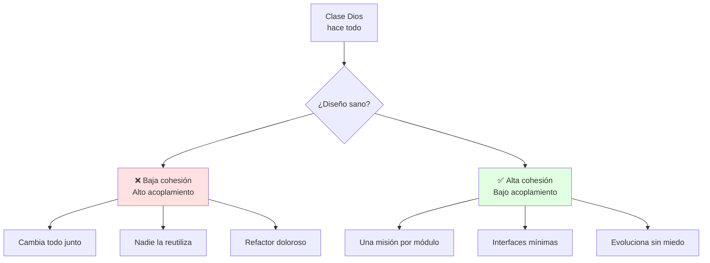
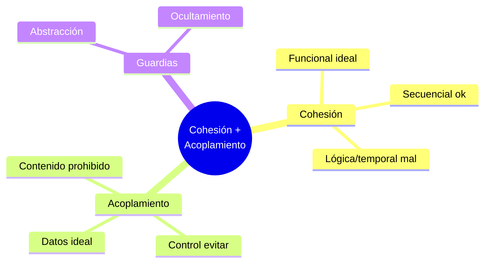

# ⚖️ Principios de Diseño: Cohesión y Acoplamiento

## 🎯 Introducción

> [!info] 💡 ¿Por Qué Dos Clases "Que Funcionan" Pueden Ser Mal Diseño?
>
> La **independencia funcional** se mide con dos reglas: **alta cohesión** (cada módulo hace UNA cosa bien) y **bajo acoplamiento** (los módulos dependen poco entre sí). Código que "funciona" pero mezcla todo es deuda que la Unidad 4 cobrará.
>
> **Analogía del mundo real:** Piensa en un restaurante:
>
> - **Alta cohesión** → El cocinero solo cocina; el mesero solo atiende (cada rol, una misión)
> - **Bajo acoplamiento** → El mesero pasa *el pedido* (dato), no le dice al cocinero *cómo* cocinar (control)
> - **Mal diseño** → El mesero entra a la cocina a sazonar y el cocinero cobra mesas
>
> | Razón | Todo Mezclado | Cohesivo y Desacoplado |
> |---|---|---|
> | **Cambiar algo** | Tocas 5 clases | Tocas 1 |
> | **Reutilizar** | Imposible sin arrastrar todo | Tomas el módulo y sirve |
> | **Probar** | Necesitas todo el sistema | Prueba unitaria aislada (Unidad 5) |
> | **Equipo** | Conflictos en Git | Cada quien su módulo |



---

## 🧵 Cohesión: Una Misión por Módulo (Pressman cap. 9)

### 🎭 Escala de Cohesión (de peor a mejor)

> [!note] 🎨 Mide Qué Tan Enfocado Está tu Módulo
>
> ```mermaid
> graph LR
>     P[❌ Coincidente] --> L[Lógica]
>     L --> T[Temporal]
>     T --> PR[Procedimental]
>     PR --> C[Comunicacional]
>     C --> S[Secuencial]
>     S --> F[✅ Funcional]
>
>     style F fill:#e1ffe1
>     style P fill:#ffe1e1
> ```
>
> | Nivel | Qué significa | Ejemplo |
> |---|---|---|
> | **Funcional** ✅ | Todo contribuye a UNA tarea | `CalculadoraIVA`: solo calcula IVA |
> | **Secuencial** | Salida de una parte = entrada de otra | Leer → validar → guardar |
> | **Comunicacional** | Operan sobre los mismos datos | CRUD de `Estudiante` |
> | **Procedimental** | Siguen un orden impuesto | `init(); procesar(); cerrar();` mezclados |
> | **Temporal** | Suceden al mismo tiempo | `iniciarTodo()` que prende 5 cosas |
> | **Lógica** | Agrupadas por "se parecen" | `Utilidades` con 40 métodos varios |
> | **Coincidente** ❌ | Juntas por accidente | `Miscelaneo.java` |
>
> **Test de 10 segundos:** describe tu clase en 1 frase sin usar "y". Si necesitas "y", divídela.

### 🔍 Acoplamiento: Depende Poco (Pressman cap. 9)

> [!example] 🧪 Escala de Acoplamiento (de mejor a peor)
>
> | Nivel | Qué pasa | Ejemplo Java |
> |---|---|---|
> | **Datos** ✅ | Solo parámetros simples | `calcular(precio, tasa)` |
> | **Sello (stamp)** | Pasa estructura, usa una parte | `procesar(estudiante)` usando solo su id |
> | **Control** | Una llama decide con banderas | `imprimir(reporte, aDobleCara)` |
> | **Externo** | Dependen de algo fuera (formato, protocolo) | Leer variable de entorno fija |
> | **Común** | Comparten global mutable | `public static Config x` tocada por 6 clases |
> | **Contenido** ❌ | Una modifica interior de otra | Acceso directo a campos privados ajenos |
>
> ```java
> // ❌ ACOPLAMIENTO DE CONTROL + BAJA COHESIÓN
> class Reportes {
>     void generar(boolean aDobleCara, boolean urgente, boolean resumen) {
>         // 3 banderas = 3 personalidades distintas
>     }
> }
>
> // ✅ DATOS + COHESIÓN FUNCIONAL
> class GeneradorReporte {
>     Reporte generar(Datos datos) { /* una misión */ }
> }
> class Impresora {
>     void imprimir(Reporte r, OpcionesImpresion o) { /* otra misión */ }
> }
> ```

---

## 🛡️ Ocultamiento y Abstracción

> [!success] 🏆 Las Dos Guardias del Diseño
>
> - **Abstracción:** muestra el *qué*, esconde el *cómo* (procedimental: firma del método; de datos: la clase expone operaciones, no campos).
> - **Ocultamiento de información:** ningún módulo necesita saber el interior de otro; solo su interfaz.
>
> Si para usar tu clase debo leer su código fuente, tu abstracción falló.

---

## ⚠️ Problemas Comunes y Soluciones

> [!danger] ❌ Error: La Clase `Utilidades` Infinita
>
> **Síntomas:** `StringUtils`, ` helpers` y `Manager` crecen sin control; todo el equipo les teme.
>
> **Solución (adelanto de Unidad 4):**
>
> - Agrupa por misión real: ValidadorEmail, FormateadorFecha...
> - Mueve cada método a la clase dueña de los datos (Fowler: Move Function)
> - Prohíbe crear métodos "generales": toda función nueva nace en una clase con misión

---

## 🎯 Mejores Prácticas

> [!tip] 🏆 Checklist de Diseño Sano
>
> **1. Una clase, una frase**
>
> "Esta clase gestiona ___." Si hay coma o "y", divide.
>
> **2. Pasa datos, no banderas**
>
> 3+ booleanos en parámetros = 3 clases esperando nacer.
>
> **3. Dibuja dependencias antes de codear (conecta con nota 01)**
>
> Flechas entre clases = acoplamiento visible. Menos flechas, mejor.

---

## 📊 Resumen Visual



> [!success] 🔍 Comparación Final
>
> | Aspecto | Pegado | Independiente |
> |---|---|---|
> | **Cambio** | ❌ En cascada | ✅ Local |
> | **Test** | Requiere sistema | Unitario aislado |
> | **Uso Recomendado** | Nunca en proyecto | ✅ **Regla de todo diseño** |

---

## 🚀 Próximos Pasos

> [!quote] 🌟 Continuando
>
> **Has aprendido:**
>
> ✅ Escala de cohesión y test de la frase
> ✅ Escala de acoplamiento con ejemplos Java
> ✅ Abstracción y ocultamiento
>
> **Próximo tema Unidad 2:**
>
> | Tema | Qué verás | Por qué importa |
> |---|---|---|
> | **Diseño arquitectónico y por componentes** | Estilos, despliegue, interfaces | Donde estos principios se vuelven sistema |

---

## 🔗 Seguir estudiando

> [!info] 📚 Seguir estudiando
>
> - Mapa de contenido: [[Diseño de Software]]
> - Índice Unidad 1: [[00 - Índice Unidad 1]]
> - Anterior: [[01 - Naturaleza del software y el diseño]]
> - Syllabus: [[Bienvenida y Syllabus Diseño de Software]]

## 📚 Referencias

> [!quote] 📖 Fuentes
>
> - R. Pressman, B. Maxim, *Software Engineering: A Practitioner's Approach*, 9th ed., cap. 9 (Conceptos de diseño).
> - Sílabo CCPG1042, Unidad 1: introducción al diseño (5h).

---

**Tags:** #CCPG1042 #unidad1 #cohesion #acoplamiento #principios
