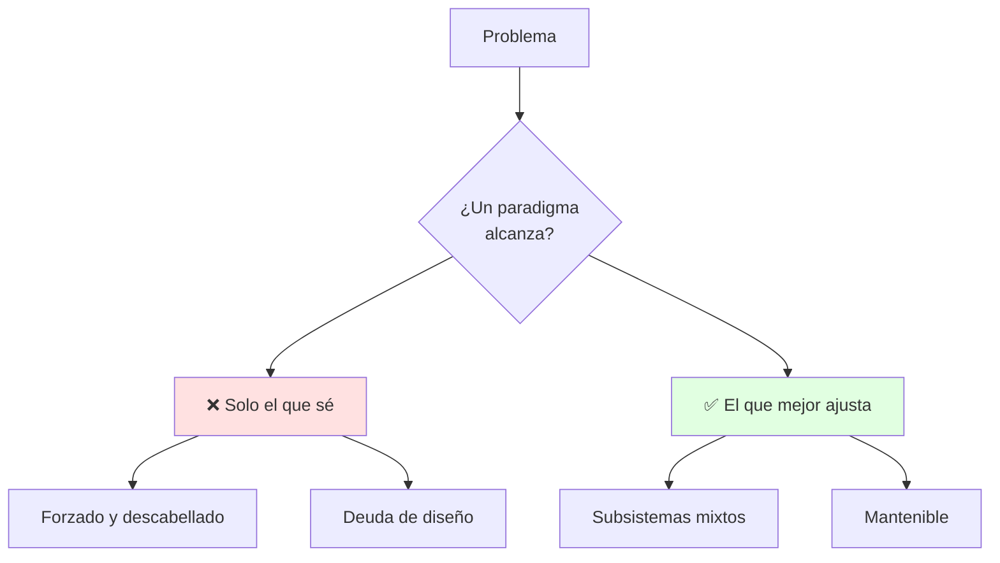
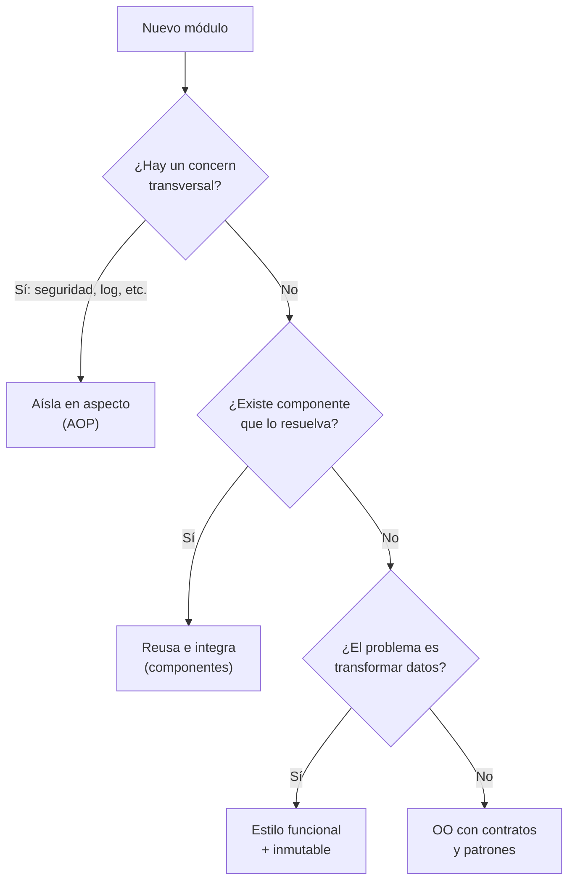
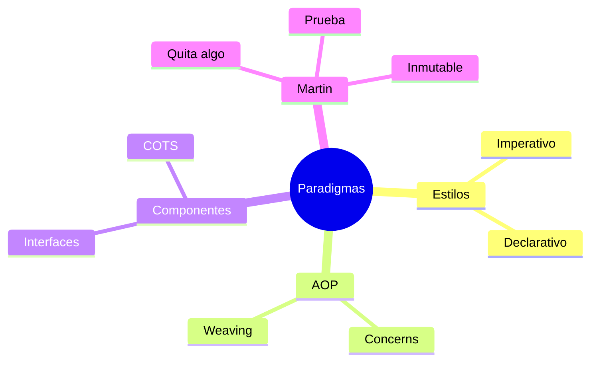

# 🔀 Paradigmas de Programación y Diseño

## 🎯 Introducción

> [!info] 💡 ¿Por Qué Importa el Paradigma Antes que el Lenguaje?
>
> Un **paradigma de programación** es un estilo de programar: no es un lenguaje, es *la forma en que se programa* con él. Dice qué estructuras usar y cuándo. Conocer varios paradigmas permite explorar diseños distintos del mismo problema y elegir el que mejor se ajuste — quien solo conoce uno intenta resolverlo todo con él, aunque sea descabellado.
>
> **Importancia histórica:** entre 1958 y 1968 se descubrieron los tres grandes paradigmas que Martin documenta (estructurado, OO, funcional) — y en décadas posteriores no apareció ningún paradigma nuevo de ese calibre. En cambio, la industria sumó paradigmas pragmáticos (aspectos, componentes) para mantener sistemas grandes y complejos escritos en varios estilos a la vez.
>
> **Relevancia actual:** ningún sistema real es "puro" — se usan formas mixtas (declarativo complementado con imperativo), y mantener sistemas multi-paradigma es una habilidad profesional esperada.
>
> **Analogía del mundo real:** piensa en idiomas para negociar:
>
> - **Un solo idioma** → Te defiendes, pero hay tratos que no puedes cerrar.
> - **Varios paradigmas** → Eliges el idioma del cliente (problema): directo con unos, ceremonioso con otros.
> - **Mezclarlos** → Spanglish técnico bien usado acelera; mal usado confunde a todos.
>
> | Razón | Un Solo Paradigma | Varios Paradigmas |
> |---|---|---|
> | **Ajuste** | Forzado, descabellado a veces | El mejor para cada subsistema |
> | **Mantenimiento** | Todo con el mismo martillo | Cada parte en su estilo natural |
> | **Equipo** | Todos piensan igual (punto ciego) | Vocabulario más rico de diseños |



---

## 🧵 Qué es un Paradigma (Deck 02b + Martin cap. 3)

> [!note] 📋 Definición Operativa
>
> Paradigma = **estilo de programación relativamente independiente del lenguaje**. No te dice qué lenguaje usar; te dice qué estructuras utilizar y cuándo.
>
> Martin agrega el marco profundo: cada gran paradigma **quita** una capacidad e impone disciplina (descubiertos 1958-1968, probablemente los únicos):
>
> | Paradigma | Quita | Disciplina | Origen |
> |---|---|---|---|
> | **Estructurado** | `goto` (salto libre) | Transferencia directa controlada | Dijkstra 1968 |
> | **Orientado a objetos** | Punteros a función | Transferencia indirecta controlada | Dahl y Nygaard 1966 |
> | **Funcional** | Asignación | Variables inmutables | Church 1936 → LISP 1958 |
>
> **Y la arquitectura:** polimorfismo cruza fronteras, lo funcional disciplina datos, lo estructurado funda algoritmos (función, separación, datos).

---

## 🧵 Imperativo vs Declarativo (Deck 02b)

> [!note] 📋 Las Dos Familias Grandes
>
> | Familia | Idea | Lenguajes | Ejemplos |
> |---|---|---|---|
> | **Imperativo** | Escribes instrucciones que **cambian el estado** + algoritmos paso a paso | Fortran, C | Estructurado, OO |
> | **Declarativo** | Especificas el **resultado esperado**, no el cómo; sin orden de ejecución fijo | LISP, Prolog, Haskell | Funcional, lógico |
>
> **Ejemplo completo en C (imperativo):** cada línea cambia el estado:
>
> ```c
> // El CÓMO está explícito: tú controlas el recorrido y el acumulador
> int suma(int *a, int n) {
>     int total = 0;
>     for (int i = 0; i < n; i++) total += a[i];
>     return total;
> }
> ```
>
> **Ejemplo completo en Prolog (declarativo):** declaras hechos, el motor resuelve:
>
> ```prolog
> % Base de conocimiento: solo hechos, ningún recorrido programado
> father(john, bill).
> mother(mary, bill).
>
> % Consulta: ¿qué X hace verdadera la sentencia?
> ?- mother(X, bill).
> % Respuesta del motor: X = mary  <-- el recorrido lo hizo Prolog, no tú
> ```
>
> > [!warning] ⚠️ En la práctica se mezclan
> >
> > Los lenguajes declarativos se complementan con métodos imperativos. Esa mezcla es **más propensa a errores** y dificulta la legibilidad — úsala con criterio, no por moda.

---

## 🧵 Paradigma Orientado a Aspectos — AOP (Deck 02b)

### 🎭 Separar lo que Cruza Todo

> [!note] 🎨 Concerns Transversales
>
> La POO modulariza en métodos, clases y paquetes — pero algunos *concerns* cruzan esos límites (ej. **seguridad**: el paquete Foro existe para mostrar posts, pero igual debe validar que solo moderadores aprueben o borren). **AOP** mueve cada concern transversal a su propio paquete y deja a los objetos con una sola responsabilidad clara.
>
> ```mermaid
> graph LR
>     F["Paquete Foro<br/>(posts)"] -.->|"sin AOP:<br/>seguridad regada"| S["if(esModerador)...<br/>en cada método"]
>     F2["Paquete Foro<br/>(limpio)"] --> A["Aspecto Seguridad<br/>(un solo lugar)"]
>     style A fill:#e1ffe1
> ```
>
> | Concepto AOP | Qué Es | Ejemplo (clase Account) |
> |---|---|---|
> | **Join point** | Punto identificable de ejecución (método, asignación) | Ejecución de `credit()`, acceso a `_balance` |
> | **Pointcut** | Selector de join points + su contexto | "La ejecución de `credit()` en Account" |
> | **Advice** | Código que corre ahí: *antes, después o alrededor* (el *around* puede modificar o saltarse la ejecución) | Log antes de `credit()` |
> | **Weaving** | Tejer el comportamiento (dinámico en ejecución; estático en clases/interfaces) | *Introduction*: agregar datos/métodos; *declaración* en compilación |
> | **Aspecto** | Unidad central (como la clase en OO): pointcuts + advices + reglas de weaving | Paquete de seguridad completo |
>
> **Síntomas de mala modularidad que AOP cura:**
>
> - **Code tangling:** un módulo manipula múltiples concerns a la vez.
> - **Code scattering:** un concern regado en varios módulos (duplicado, o complementario como el control de accesos: un autenticador central + autorización repetida en cada módulo).
>
> **Beneficios:** responsabilidades limpias, menos acoplamiento y duplicación, evolución coherente al agregar módulos, decisiones de diseño postergables, reutilización por bajo acoplamiento y roles especializados por experticia. Herramienta de referencia: **AspectJ (Eclipse)**.

---

## 🧵 Paradigma Orientado a Componentes (Deck 02b)

### 🎭 Reusar en Vez de Construir

> [!success] 🏆 Integración sobre Construcción
>
> En la mayoría de proyectos **ya existe software reutilizable** — este paradigma se fundamenta en reusar componentes dentro de un *framework* de integración, a veces sistemas completos e independientes (**COTS**) que proveen funcionalidades específicas.
>
> > [!note] 📋 Definición — Componente
> >
> > Unidad de software **independiente y desplegable**, completamente definida y accedida **solo por sus interfaces**.
>
> **Las 4 etapas del proceso:**
>
> 1. **Análisis de componentes:** dada la especificación, buscar el componente que mejor ajuste.
> 2. **Modificación de requerimientos:** ajustar ciertos requerimientos según componentes disponibles.
> 3. **Diseño con reuso:** organizar componentes + framework (puede haber desarrollo nuevo si falta algo).
> 4. **Desarrollo e integración:** componentes y COTS integrados crean el sistema.
>
> | Tipo de Componente | Ejemplo |
> |---|---|
> | **Servicios web** | Estándares, invocación remota |
> | **Colecciones de objetos** | Paquetes para frameworks (.NET, JEE) |
> | **Sistemas stand-alone** | Configurables para un ambiente particular |
>
> **Conexión con tu curso:** esto es la Unidad 2 (diseño por componentes e interfaces) llevada a proceso completo — el framework de integración es tu arquitectura.

---

## 🧵 Dijkstra, Prueba e Inmutabilidad (Martin caps. 4 y 6)

> [!example] 🧪 Lo Evaluable de Martin
>
> - **1968, *"Go To Statement Considered Harmful"* (CACM, marzo):** solo `if/then/else` + `do/while` bastan. Secuencia por enumeración, selección re-enumerando, iteración por **inducción**. De ahí la **descomposición funcional** (Yourdon, Constantine, DeMarco).
> - **"Testing shows the presence, not the absence, of bugs":** testear prueba incorrección; el valor de lo estructurado son unidades **falsables**. La arquitectura hereda esto: módulos fáciles de refutar.
> - **Sin mutación no hay carreras ni deadlocks.** **Segregación:** empuja lo máximo a componentes inmutables; lo mutable, aislado y protegido.
> - **Event sourcing:** guarda transacciones, no estado (como Git). Banco: suma movimientos desde el inicio → **CR, no CRUD**, cero conflictos concurrentes.

---

## 🗺️ Diagrama de Decisión: ¿Qué Paradigma Uso?



> [!tip] 💡 Lectura del diagrama
>
> El docente no pide pureza de paradigma — pide justificar la elección. En el Control 01, cada decisión sin justificar es un punto menos.

---

## ⚠️ Problemas Comunes y Soluciones

> [!danger] ❌ Error 1: Un Solo Paradigma para Todo (viola **paradigma adecuado al problema**)
>
> **Síntomas:** todo con clases aunque el problema pida transformar datos; o todo funcional aunque haya estado compartido real.
>
> - ❌ **EL ERROR ESTÁ AQUÍ:** elegir el paradigma por costumbre, no por el problema — "lo hago en OO porque es lo que sé".
>
> **Solución:**
>
> - Pregunta "¿qué varía aquí?" antes de elegir (ver diagrama de decisión).
> - Mezcla declarada: funcional adentro (lógica pura), OO afuera (estructura).
>

> [!danger] ❌ Error 2: Seguridad (y Logs) Regados por Todo el Código (viola **separación de concerns/AOP**)
>
> **Síntomas:** la misma guarda copiada en cada método:
>
> ```java
> // ❌ EL ERROR ESTÁ AQUÍ: scattering — la regla vive en 20 lugares
> void aprobarPost(Post p, Usuario u) {
>     if (!u.esAdmin()) throw new SeguridadException(); // copiado aquí...
> }
> void borrarPost(Post p, Usuario u) {
>     if (!u.esAdmin()) throw new SeguridadException(); // ...y aquí, y en 18 más
> }
> ```
>
> **Solución:** muévelo a un aspecto con pointcut + advice; los módulos quedan con una sola responsabilidad.
>

> [!danger] ❌ Error 3: Reescribir lo que ya Existe como Componente (viola **reuso antes que construcción**)
>
> **Síntomas:** reinventar autenticación, paginación o reportes pudiendo integrar un COTS o servicio.
>
> - ❌ **EL ERROR ESTÁ AQUÍ:** codear desde cero lo que ya existe probado — cada línea propia es deuda futura.
>
> **Solución:** aplica las 4 etapas (análisis → ajuste de requerimientos → diseño con reuso → integración) antes de codear desde cero.

---

## 🎯 Mejores Prácticas

> [!tip] 🏆 Checklist de Paradigmas
>
> **1. Nombra el paradigma de cada módulo**
>
> - Si no puedes decir en qué estilo está escrito un módulo, probablemente mezcla sin criterio.
>
> **2. Aísla lo transversal desde el día 1**
>
> - Seguridad, logging, métricas: aspectos, no copy-paste.
>
> **3. Reusa antes de construir**
>
> - Busca el componente/COTS primero; ajusta requerimientos después; codea al final.
>
> **4. Conecta con SOLID y UML**
>
> - Los paradigmas deciden el *estilo*; SOLID y UML deciden la *forma* (ver U1-04 y Unidad 2).

---

## 📝 Ejercicios Propuestos

> [!example] 📋 Nivel 1 — Básico
>
> **1.** Define paradigma de programación con tus palabras y explica por qué es independiente del lenguaje.
>
> **2.** Clasifica en imperativo o declarativo: (a) función C que suma un arreglo, (b) consulta Prolog `?- mother(X, Bill)`.
>
> **3.** ¿Qué es un *cross-cutting concern*? Da el ejemplo del foro y la seguridad del deck.
>
> **4.** Define componente según el deck y menciona sus 3 tipos con un ejemplo de cada uno.
>
> **5.** ¿Qué quita cada uno de los 3 paradigmas de Martin y quién los descubrió?
>
> > [!success]- ✅ Respuestas — Nivel 1
> >
> > - **1.** Estilo de programar (qué estructuras usar y cuándo), no lenguaje; el mismo lenguaje admite varios estilos.
> > - **2.** (a) Imperativo: instrucciones que cambian estado. (b) Declarativo: especifica el resultado, Prolog resuelve el cómo.
> > - **3.** Un asunto que cruza clases/paquetes (ej. seguridad en el paquete Foro, que existe para mostrar posts pero debe validar moderadores).
> > - **4.** Unidad independiente/desplegable accedida solo por interfaces. Tipos: servicios web (remotos), colecciones de objetos (.NET/JEE), stand-alone configurables.
> > - **5.** Estructurado quita `goto` (Dijkstra 1968); OO quita punteros a función (Dahl/Nygaard 1966); funcional quita asignación (Church 1936).
>

> [!example] 📋 Nivel 2 — Intermedio
>
> **6.** Explica tangling vs scattering con un ejemplo propio de un proyecto universitario.
>
> **7.** Define join point, pointcut y advice usando el ejemplo de `credit()` en la clase Account.
>
> **8.** Describe las 4 etapas del proceso orientado a componentes aplicadas a un sistema de reservas que reusa un servicio de pagos.
>
> **9.** ¿Por qué la mezcla declarativo+imperativo es más propensa a errores según el deck?
>
> **10.** Relaciona segregación de mutabilidad con tu nota de Git: ¿qué parte de un flujo de trabajo sería "inmutable" y cuál "mutable"?
>
> > [!success]- ✅ Respuestas — Nivel 2
> >
> > - **6.** Tangling: un módulo de reportes que además valida permisos y formatea fechas. Scattering: la validación de sesión copiada en 5 controladores (o complementaria como autenticación central + autorización por módulo).
> > - **7.** Join point: ejecución de `credit()` / acceso a `_balance`. Pointcut: selector que captura esos puntos. Advice: código (log) antes/después/alrededor del punto.
> > - **8.** Análisis: buscar pasarela que ajuste; modificación: ajustar requerimientos a lo que la pasarela soporta; diseño: organizar reserva + pagos + framework; integración: conectar y probar el flujo.
> > - **9.** Porque combina dos modelos mentales (qué vs cómo) sin frontera clara: se pierde legibilidad y cada parte asume garantías que la otra no da.
> > - **10.** Inmutable: historial de commits (event sourcing real — nada se reescribe). Mutable: working directory y staging, protegidos por convenciones de ramas/PRs.
>

> [!example] 📋 Nivel 3 — Avanzado
>
> **11.** Argumenta con Martin por qué probablemente no veremos un cuarto paradigma "negativo" como los tres grandes.
>
> **12.** Diseña (en prosa + mini-diagrama) cómo moverías autenticación y logging de un monolito acoplado a aspectos: define join points, pointcuts y advices.
>
> **13.** Un equipo discute si usar microservicios o monolito modular para un proyecto de curso de 4 personas. Usando paradigmas + componentes, argumenta tu recomendación.
>
> **14.** Explica event sourcing a un compañero usando el ejemplo del banco y conéctalo con "CR, no CRUD".
>
> **15.** ¿Cómo se relaciona "retrasar decisiones de diseño" (beneficio AOP) con tu nota de arquitectura (ADR)? Da un ejemplo concreto.
>
> > [!success]- ✅ Respuestas — Nivel 3
> >
> > - **11.** Los tres quitan goto, punteros a función y asignación — no queda nada equivalente por quitar; nacieron 1958-1968 y en décadas no apareció otro.
> > - **12.** Join points: entradas de controladores + accesos a datos sensibles. Pointcuts por paquete/acción. Advices: before (auth), around (log con tiempo). Respuesta libre con esa estructura.
> > - **13.** Monolito modular: 4 personas no pagan la operación de microservicios; componentes internos + interfaces claras dan orden sin red distribuida (ver nota U2-01).
> > - **14.** Guardar movimientos en vez de saldos; el saldo se calcula; nada se borra/actualiza → sin conflictos concurrentes.
> > - **15.** Un aspecto pospone fijar detalles (ej. proveedor de auth) igual que un ADR registra la decisión y sus alternativas: ambos evitan decisiones prematuras irreversibles.

---

## 📋 Resumen Ejecutivo

> [!summary] 📋 Lo Esencial
>
> - Un **paradigma** es estilo, no lenguaje — y quien solo sabe uno lo fuerza todo.
> - **Imperativo** (cómo, C) vs **declarativo** (qué, Prolog/Haskell); se mezclan con cuidado.
> - **AOP** aísla concerns transversales (join point → pointcut → advice + weaving); cura tangling y scattering.
> - **Componentes**: unidad desplegable por interfaces; proceso en 4 etapas; tipos web/COTS/stand-alone.
> - **Martin**: cada paradigma quita algo; Dijkstra/goto/prueba; inmutabilidad y event sourcing.

---

## ✅ Metas de Aprendizaje

> [!note] 🎯 Nivel Básico
> - [ ] Defino paradigma y distingo imperativo de declarativo con ejemplo.
> - [ ] Explico cross-cutting concern con el caso foro-seguridad.
> - [ ] Defino componente y nombro sus 3 tipos.
> - [ ] Digo qué quita cada paradigma de Martin con autor y año.
>

> [!note] 🎯 Nivel Intermedio
> - [ ] Diferencio tangling de scattering con ejemplo propio.
> - [ ] Defino join point, pointcut, advice y weaving con Account/credit().
> - [ ] Aplico las 4 etapas de componentes a un caso de reuso.
>

> [!note] 🎯 Nivel Avanzado
> - [ ] Diseño la migración de un monolito acoplado a aspectos.
> - [ ] Argumento monolito modular vs microservicios para un equipo chico.
> - [ ] Explico event sourcing y su conexión con control de versiones.

---

## 📊 Resumen Visual



> [!success] 🔍 Comparación Final
>
> | Aspecto | Un Paradigma | El Adecuado + Aislado |
> |---|---|---|
> | **Ajuste** | ❌ Forzado | ✅ Natural |
> | **Transversal** | Regado (scattering) | Aspecto único |
> | **Reuso** | Reescribir | Integrar COTS |
> | **Uso Recomendado** | Nunca por defecto | ✅ **Justificado por problema** |

---

## 🔁 Repaso SR (flashcards)

#flashcards/diseno-u1

> [!note] 🧠 Repasa con el plugin Spaced Repetition
>
> - ¿Paradigma en 1 línea?::Estilo de programación: qué estructuras usar y cuándo, independiente del lenguaje.
> - ¿Imperativo vs declarativo?::Imperativo dice cómo (pasos); declarativo dice qué (resultado).
> - ¿AOP resuelve qué?::Lo transversal (seguridad, logs) regado: pointcut + advice en un aspecto.
> - ¿Componente vs objeto?::Componente: unidad desplegable con interfaces; se reusa sin codear.
> - ¿Dijkstra y las pruebas?::Probar muestra presencia de bugs, no ausencia; el software es ciencia (falsable).

## 🚀 Próximos Pasos

> [!quote] 🌟 Continuando
>
> **Has aprendido:**
>
> ✅ Paradigmas como estilos + imperativo/declarativo con ejemplos
> ✅ AOP completo y componentes con proceso
> ✅ Marco de Martin listo para el Control 01
>
> **Próximo tema:**
>
> | Tema | Qué verás | Por qué importa |
> |---|---|---|
> | **Principios SOLID** | 5 reglas OO (S3 del docente) | El examen de diseño bien hecho |
> | **Repasa** | [[Control 01 - Repaso Paradigmas]] | Control lunes 23:59 en papel |

---

## 🔗 Seguir estudiando

> [!info] 📚 Seguir estudiando
>
> - Mapa de contenido: [[Diseño de Software]]
> - Índice Unidad 1: [[00 - Índice Unidad 1]]
> - Anterior: [[02 - Principios de diseño, cohesión y acoplamiento]]
> - Siguiente: [[04 - Principios SOLID]]
> - Syllabus: [[Bienvenida y Syllabus Diseño de Software]]

## 📚 Referencias

> [!quote] 📖 Fuentes
>
> - Deck docente `02bParadigmasDiseño.pdf` (S2b, 2025): imperativo/declarativo, AOP, componentes.
> - R. C. Martin, *Clean Architecture*, caps. 3, 4 y 6 — lectura Control 01.
> - R. Pressman, B. Maxim, *Software Engineering: A Practitioner's Approach*, 9th ed.
> - AspectJ (Eclipse) — herramienta de referencia AOP del deck.

---

**Tags:** #CCPG1042 #unidad1 #paradigmas #aop #componentes #diseno-software
