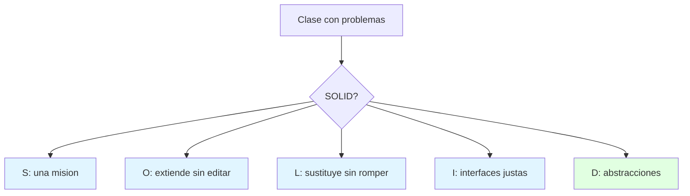
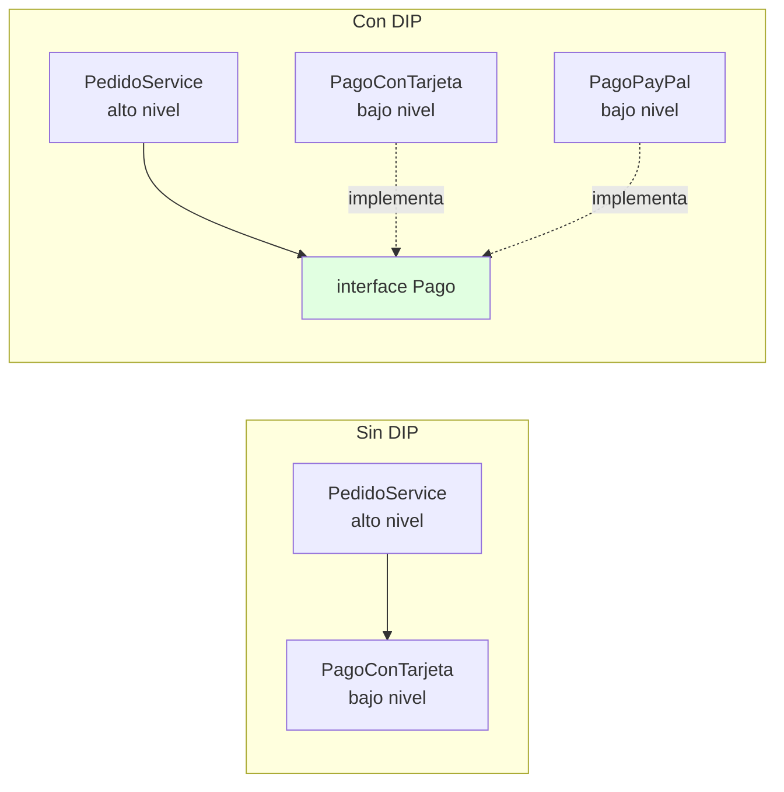
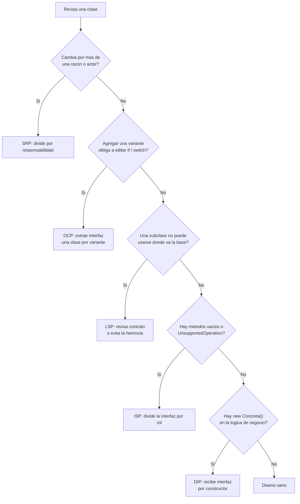
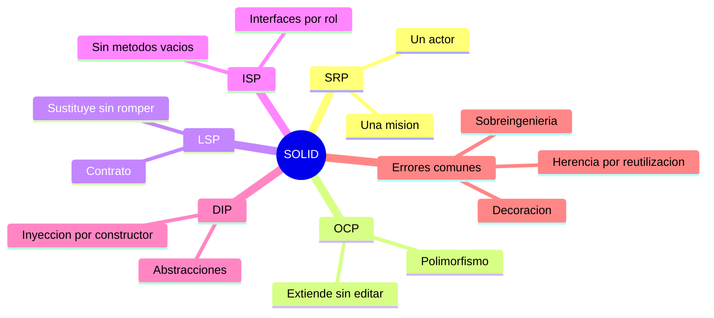

# 🖐️ Principios SOLID

## 🎯 Introducción

> [!info] 💡 ¿Por Qué 5 Reglas Valen un Parcial?
>
> **SOLID** son 5 principios de diseño orientado a objetos que convierten "código que funciona" en "diseño que aguanta cambios". El docente les dedica una semana completa: si tus clases los violan, los patrones llegan tarde.
>
> Robert C. Martin los reunió en los años 2000 (artículo *Design Principles and Design Patterns* y libro *Agile Software Development*), y Michael Feathers propuso el acrónimo **SOLID**. Los ingredientes son anteriores: Bertrand Meyer formuló el abierto/cerrado (1988) y Barbara Liskov la sustitución (1987). Hoy se explican con detalle en *Clean Architecture* (caps. 7 a 11).
>
> Son **principios, no leyes**: guían decisiones, y aplicarlos sin criterio también es un error (ver "Problemas Comunes").
>
> **Analogía del mundo real:** piensa en un taller mecánico:
>
> - **S** → Cada mecánico, una especialidad (no el mismo hace frenos y pinta).
> - **O** → Agregas un elevador nuevo sin demoler el taller (abierto a extensión).
> - **L** → Cualquier mecánico certificado hace el trabajo base (sustituible).
> - **I** → Manual por puesto, no un tomo para todos (interfaces justas).
> - **D** → Pides "un elevador", no "el Hidráulico-3000" (dependes de abstracciones).
>
> | Principio | 1 línea | Huele mal cuando... |
> |---|---|---|
> | **S**RP | Una razón para cambiar | La clase hace 3 cosas |
> | **O**CP | Abierto a extender, cerrado a modificar | Cada variante edita la misma clase |
> | **L**SP | La derivada sustituye a la base | Un `override` rompe el contrato |
> | **I**SP | Interfaces pequeñas por rol | Clientes obligados a implementar métodos inútiles |
> | **D**IP | Depende de abstracciones | `new Concreta()` regado por todos lados |



---

## 🔗 SOLID en el Contexto de la Unidad

> [!note] 📋 De Cohesión y Acoplamiento a SOLID
>
> SOLID no aparece de la nada: es la **versión concreta, para objetos**, de las dos reglas de [[02 - Principios de diseño, cohesión y acoplamiento]] y vive dentro del paradigma estudiado en [[03 - Paradigmas de programación y diseño]].
>
> | Principio | Se apoya en... | Idea de fondo |
> |---|---|---|
> | **SRP** | Alta cohesión funcional | Cada clase, una misión |
> | **OCP** | Ocultamiento de información | Esconde detrás de una interfaz lo que cambia |
> | **LSP** | Contratos y polimorfismo | Herencia solo si respeta el comportamiento prometido |
> | **ISP** | Bajo acoplamiento | No dependas de lo que no usas |
> | **DIP** | Bajo acoplamiento + abstracción | Apunta tus dependencias hacia interfaces |

---

## 🧵 Los 5 Principios, Uno por Uno

### 🎯 S — Single Responsibility Principle (SRP)

> [!note] 🎯 SRP — Una clase, una razón para cambiar
>
> - **Definición:** una clase tiene una, y solo una, razón para cambiar. Martin lo refina en *Clean Architecture*: un módulo debe ser responsable ante **un solo actor** (una sola persona o área que puede pedir cambios).
> - **Equivalente en la unidad:** cohesión funcional.
> - **Código malo:** `class Factura { calcularTotal(); guardarEnBD(); imprimir(); }`: tres actores distintos (contabilidad, TI, ventas) que pueden pedir cambios en la misma clase.
> - **Código bueno:** `Factura`, `RepositorioFactura`, `ImpresorFactura`, cada una con una misión.
> - **Test de 10 s:** describe la clase sin usar "y".
> - **Violación típica:** `Manager`, `Util`, `Helper` con 30 métodos estáticos; la "Clase Dios".
> - **Malentendido común:** SRP **no** significa "una clase con un solo método". Significa un solo motivo de cambio.

> [!example]- 💻 Código — SRP antes y después
>
> ```java
> // ❌ SRP ROTO — tres actores pueden pedir cambios sobre la misma clase
> class Factura {
>     double calcularTotal() { /* regla de contabilidad */ return 0; }
>     void guardar()         { /* SQL: cambia si cambia la BD */ }
>     String imprimir()      { /* formato: cambia si cambia el diseño */ return ""; }
> }
>
> // ✅ SRP — cada clase responde a un solo actor
> class Factura {
>     double calcularTotal() { /* solo regla de negocio */ return 0; }
> }
> class RepositorioFactura {
>     void guardar(Factura f) { /* solo persistencia */ }
> }
> class ImpresorFactura {
>     String imprimir(Factura f) { /* solo presentación */ return ""; }
> }
> ```
>
> Si cambia el formato de impresión, solo tocas `ImpresorFactura`: no hay riesgo de romper el cálculo del total.

### 🔓 O — Open/Closed Principle (OCP)

> [!note] 🔓 OCP — Abierto a extensión, cerrado a modificación
>
> - **Definición:** puedes **agregar** comportamiento nuevo sin **editar** el código que ya funciona (Meyer, 1988).
> - **Mecanismo:** abstracción + polimorfismo (interfaz con varias implementaciones).
> - **Código malo:** `if (tipo.equals("pdf")) ... else if (tipo.equals("html")) ...`: cada variante nueva edita la misma clase.
> - **Código bueno:** `interface Formato { generar(datos); }` + `ReportePdf`, `ReporteHtml`, `ReporteCsv` (variante nueva = archivo nuevo, cero ediciones).
> - **Test de 10 s:** ¿una nueva variante es un archivo nuevo sin tocar lo existente?
> - **Violación típica:** `switch`/`if` en cascada en la lógica de negocio.
> - **Matiz importante:** el sistema nunca queda 100 % cerrado. Eliges **frente a qué tipo de cambio** quieres protegerte (el que ya viste ocurrir o es muy probable) y dejas el resto simple.

> [!example]- 💻 Código — OCP con descuentos
>
> ```java
> // ❌ OCP ROTO — cada tipo de cliente nuevo obliga a editar este método
> double aplicar(String tipo, double precio) {
>     if (tipo.equals("ESTUDIANTE")) return precio * 0.80;
>     else if (tipo.equals("JUBILADO")) return precio * 0.70;
>     return precio;
> }
>
> // ✅ OCP — agregar "EMPLEADO" es una clase nueva, sin tocar nada existente
> interface Descuento { double aplicar(double precio); }
>
> class DescuentoEstudiante implements Descuento {
>     public double aplicar(double precio) { return precio * 0.80; }
> }
> class DescuentoJubilado implements Descuento {
>     public double aplicar(double precio) { return precio * 0.70; }
> }
>
> class Caja {
>     double cobrar(double precio, Descuento d) { return d.aplicar(precio); }
> }
> ```
>
> El `if` no desaparece mágicamente: se mueve a **un solo lugar** (por ejemplo una fábrica o la configuración) donde se decide qué `Descuento` usar. La lógica de negocio queda estable.

### 🔄 L — Liskov Substitution Principle (LSP)

> [!note] 🔄 LSP — La derivada sustituye a la base sin romper nada
>
> - **Definición:** donde se espera un objeto de la clase base, debe poder usarse uno de la clase derivada **sin que el programa se comporte mal** (Liskov, 1987).
> - **Reglas del contrato:**
>
> | Elemento | Qué puede hacer la subclase | Violación |
> |---|---|---|
> | **Precondiciones** | Pedir lo mismo o **menos** | Exigir **más** que la base |
> | **Postcondiciones** | Prometer lo mismo o **más** | Prometer **menos** que la base |
> | **Invariantes** | Mantenerlas | Romperlas |
> | **Excepciones** | Lanzar las ya previstas | Lanzar excepciones nuevas e inesperadas |
>
> - **Código malo:** `Cuadrado extends Rectangulo` y sobrescribe `setAncho()` cambiando también el alto: rompe lo que `Rectangulo` prometía.
> - **Código bueno:** `Rectangulo` y `Cuadrado` como tipos independientes bajo una interfaz `Figura` con `area()`.
> - **Test de 10 s:** ¿puedes usar la subclase donde va la base y todo sigue en verde?
> - **Violación típica:** `override` que lanza `UnsupportedOperationException`, métodos que hacen `instanceof` para saber con qué subclase tratan.
> - **Idea clave:** que la relación "es un" exista en el mundo real no basta; debe existir en el **comportamiento**.

> [!example]- 💻 Código — LSP con Rectángulo y Cuadrado
>
> ```java
> // ❌ LSP ROTO
> class Rectangulo {
>     protected int ancho, alto;
>     void setAncho(int a) { ancho = a; }
>     void setAlto(int h)  { alto = h; }
>     int area()           { return ancho * alto; }
> }
> class Cuadrado extends Rectangulo {
>     @Override void setAncho(int a) { ancho = a; alto = a; }  // cambia también el alto
>     @Override void setAlto(int h)  { ancho = h; alto = h; }
> }
>
> void probar(Rectangulo r) {
>     r.setAncho(5);
>     r.setAlto(4);
>     assert r.area() == 20;   // con Cuadrado da 16 → el cliente "se rompe"
> }
>
> // ✅ LSP — no hay herencia forzada; ambas cumplen un contrato común
> interface Figura { int area(); }
> record Rectangulo(int ancho, int alto) implements Figura {
>     public int area() { return ancho * alto; }
> }
> record Cuadrado(int lado) implements Figura {
>     public int area() { return lado * lado; }
> }
> ```

### ✂️ I — Interface Segregation Principle (ISP)

> [!note] ✂️ ISP — Interfaces pequeñas por rol
>
> - **Definición:** ningún cliente debería depender de métodos que no usa.
> - **Equivalente en la unidad:** bajo acoplamiento aplicado a interfaces.
> - **Código malo:** `ISistema` con 25 métodos; las clases implementan `throw new UnsupportedOperationException()` en 20 de ellos.
> - **Código bueno:** `IPagos`, `IEnvios`, `IReportes` (3-5 métodos cohesivos por rol).
> - **Test de 10 s:** ¿algún cliente implementa métodos vacíos? Divide la interfaz.
> - **Violación típica:** la "interfaz única para todo el sistema" o interfaces que crecen cada vez que alguien necesita "un método más".
> - **Beneficio:** cambiar un método que no te importa deja de obligarte a recompilar y retestear.

> [!example]- 💻 Código — ISP con trabajadores y robots
>
> ```java
> // ❌ ISP ROTO — Robot no come ni duerme
> interface Trabajador {
>     void trabajar();
>     void comer();
>     void dormir();
> }
> class Robot implements Trabajador {
>     public void trabajar() { /* ok */ }
>     public void comer()    { throw new UnsupportedOperationException(); }
>     public void dormir()   { throw new UnsupportedOperationException(); }
> }
>
> // ✅ ISP — cada rol, su interfaz; cada clase implementa solo lo que le aplica
> interface Trabajable { void trabajar(); }
> interface Alimentable { void comer(); }
> interface Descansable { void dormir(); }
>
> class Humano implements Trabajable, Alimentable, Descansable { /* los tres */ }
> class Robot  implements Trabajable { /* solo trabaja */ }
> ```

### 🔗 D — Dependency Inversion Principle (DIP)

> [!note] 🔗 DIP — Depende de abstracciones, no de concreciones
>
> - **Definición:** los módulos de alto nivel (reglas de negocio) **no dependen** de los de bajo nivel (BD, correo, pagos); **ambos dependen de abstracciones**. Además, la abstracción pertenece al módulo de alto nivel, no al de bajo.
> - **Equivalente en la unidad:** bajo acoplamiento + abstracción.
> - **Código malo:** `PedidoService` hace `new PagoConTarjeta()` directamente.
> - **Código bueno:** `PedidoService` depende de la interfaz `Pago`, que recibe por constructor (o fábrica).
> - **Test de 10 s:** ¿los constructores reciben interfaces?
> - **Violación típica:** `new Concreto()` regado por el código: impide probar con mocks y cambiar de proveedor implica reescribir.
> - **No confundir:** **DIP** es el principio (la dirección de las dependencias). **Inyección de dependencias (DI)** es una *técnica* para cumplirlo (Spring, constructores). Se puede cumplir DIP sin ningún framework.



> [!example]- 💻 Código — DIP con inyección por constructor y prueba con un falso
>
> ```java
> // ❌ DIP ROTO — PedidoService conoce y crea la clase concreta
> class PedidoService {
>     private final PagoConTarjeta pago = new PagoConTarjeta();
>     void confirmar(Pedido p) { pago.cobrar(p.total()); }
> }
>
> // ✅ DIP — depende de la abstracción, que recibe desde afuera
> interface Pago { void cobrar(double monto); }
>
> class PedidoService {
>     private final Pago pago;
>     PedidoService(Pago pago) { this.pago = pago; }
>     void confirmar(Pedido p) { pago.cobrar(p.total()); }
> }
>
> // 🧪 En una prueba unitaria, sustituyes el pago real por un falso
> class PagoFalso implements Pago {
>     double ultimoMonto;
>     public void cobrar(double monto) { ultimoMonto = monto; }
> }
> // new PedidoService(new PagoFalso()).confirmar(pedido); → sin tarjetas reales ni red
> ```

---

## 🎨 SRP + OCP: Los que Más Evalúan

> [!note] 🎨 Código Integrado y Chequeos de 10 Segundos
>
> ```java
> // ❌ SRP+OCP rotos: una clase, tres misiones, if por variante
> class Reporte {
>     String generar(String tipo) {
>         if (tipo.equals("pdf")) { /* ... */ }
>         else { /* ... */ }
>     }
>     void guardarEnDisco() { /* ... */ }
>     void enviarPorMail()  { /* ... */ }
> }
>
> // ✅ SRP+OCP: misiones separadas, variante = clase nueva
> interface Formato { String generar(Datos d); }
> class ReportePdf implements Formato {
>     public String generar(Datos d) { /* ... */ return ""; }
> }
> class ServicioReporte {
>     String emitir(Datos d, Formato f) { return f.generar(d); }
> }
> ```
>
> | Principio | Chequeo de 10 segundos |
> |---|---|
> | **SRP** | Describe la clase sin usar "y" |
> | **OCP** | Nueva variante = archivo nuevo, cero ediciones |
> | **LSP** | Prueba la derivada donde va la base: ¿todo sigue verde? |
> | **ISP** | ¿Algún cliente implementa métodos vacíos? Divide |
> | **DIP** | ¿Los constructores reciben interfaces? Bien |

---

## 🧭 Cómo se Refuerzan Entre Sí

> [!tip] 🔄 Los Cinco no Son Independientes
>
> ```mermaid
> graph TB
>     SRP["SRP<br/>clases enfocadas"] --> OCP["OCP<br/>extender sin editar"]
>     ISP["ISP<br/>interfaces justas"] --> OCP
>     DIP["DIP<br/>depender de abstracciones"] --> OCP
>     LSP["LSP<br/>implementaciones confiables"] --> OCP
>     LSP --> DIP
>     style OCP fill:#e1ffe1
> ```
>
> - **OCP es el objetivo**: un sistema que crece agregando código, no editándolo.
> - **SRP** da las piezas pequeñas; **DIP** y **ISP** definen cómo se conectan; **LSP** garantiza que cualquier pieza intercambiable de verdad lo sea.
> - Sin LSP, la abstracción de OCP/DIP miente: la interfaz dice una cosa y la implementación hace otra.

---

## 🗺️ Diagrama de Decisión: ¿Qué Principio Estoy Violando?



> [!note] 👃 Olores de Código → Principio
>
> | Olor | Principio probable | Arreglo típico |
> |---|---|---|
> | Clase de 800 líneas, nombre `Manager` | SRP | Dividir por responsabilidad |
> | `switch` o `if/else` sobre un tipo | OCP | Polimorfismo / Strategy |
> | `instanceof` o *casts* frecuentes | LSP | Revisar jerarquía o usar composición |
> | `UnsupportedOperationException` en `override` | LSP / ISP | Dividir interfaz o no heredar |
> | Interfaz de 20+ métodos | ISP | Segregar por rol |
> | `new` de clases concretas en servicios | DIP | Inyectar interfaces |
> | Pruebas que requieren BD o red reales | DIP | Abstraer y usar falsos |
> | Un cambio pequeño rompe 5 clases | SRP / OCP / DIP | Revisar fronteras y dependencias |

---

## ⚠️ Problemas Comunes y Soluciones

> [!danger] ❌ Error 1: SOLID como Decoración
>
> **Síntomas:** nombras los principios en el informe, pero el código tiene "Managers dioses" y `new` por doquier.
>
> **Solución:**
>
> - 1 principio por semana de práctica: SRP esta semana en tu proyecto.
> - El *code review* pregunta "¿qué principio protege este cambio?".

> [!danger] ❌ Error 2: Sobreingeniería, interfaz para todo (viola **simplicidad/YAGNI**)
>
> **Síntomas:** una interfaz con una única implementación "por si acaso":
>
> ```java
> // ❌ EL ERROR ESTÁ AQUÍ: abstracción sin segunda variante que la justifique
> interface Sumador { int sumar(int a, int b); }
> class SumadorUnico implements Sumador {
>     public int sumar(int a, int b) { return a + b; }
> }
> ```
>
> **Solución:** aplica el principio cuando hay **evidencia de variación** (ya cambió o cambiará seguro). Regla práctica: abstrae a la segunda variante, no a la primera.

> [!danger] ❌ Error 3: Interpretar SRP como "un método por clase" (viola **SRP real: razones de cambio**)
>
> **Síntomas:** cientos de clases diminutas donde seguir un flujo exige abrir 10 archivos:
>
> ```java
> // ❌ EL ERROR ESTÁ AQUÍ: partir por métodos, no por razones de cambio
> class ValidadorNombre { boolean ok(String n) { /* ... */ return true; } }
> class ValidadorEdad { boolean ok(int e) { /* ... */ return true; } }
> class ValidadorCorreo { boolean ok(String c) { /* ... */ return true; } }
> // ...todo cambia junto cuando cambia "qué es un usuario válido"
> ```
>
> **Solución:** SRP se mide por **razones de cambio**, no por número de métodos. Una clase con 10 métodos cohesivos que cambian juntos cumple SRP.

> [!danger] ❌ Error 4: Herencia solo para reutilizar código (viola **LSP**)
>
> **Síntomas:** la subclase hereda métodos que no tienen sentido para ella:
>
> ```java
> // ❌ EL ERROR ESTÁ AQUÍ: Pila NO ES un ArrayList (expone get(i), remove(i)...)
> class Pila extends ArrayList<String> {
>     void push(String s) { add(s); }
> }
> ```
>
> **Solución:** prefiere **composición** sobre herencia. Si no puedes decir "toda `B` se comporta como una `A` en todos los contextos", no heredes (LSP).

> [!danger] ❌ Error 5: DIP sin dueño de la abstracción (viola **DIP**)
>
> **Síntomas:** la interfaz vive en el paquete de la BD y el negocio sigue atado a infraestructura:
>
> ```java
> // ❌ EL ERROR ESTÁ AQUÍ: el negocio importa al paquete de la BD
> package bd;
> interface Repositorio { void guardar(Pedido p); } // vive en infraestructura
> package negocio;
> import bd.Repositorio; // el negocio depende de la BD
> class ServicioPedido {
>     ServicioPedido(Repositorio r) { /* ... */ }
> }
> ```
>
> **Solución:** la interfaz pertenece al **módulo de alto nivel** (lo que necesita el negocio); la implementación concreta vive en la capa de infraestructura.

---

## 🎯 Mejores Prácticas

> [!tip] 🏆 Checklist
>
> **1. SRP primero, el resto después** — Sin una misión por clase, OCP/LSP no tienen dónde apoyarse.
>
> **2. DIP en constructores desde el día 1** — Recibe interfaces: tus pruebas con mocks (Unidad 5) te lo agradecerán.
>
> **3. OCP donde ya viste variación** — No predigas el futuro entero; protégete de los cambios probables.
>
> **4. Revisa LSP con pruebas del contrato** — La misma batería de pruebas debe pasar para la base y para cada derivada.
>
> **5. Divide interfaces cuando duela** — Si dos clientes usan partes distintas de una interfaz, sepárala.
>
> **6. Usa los principios como preguntas de revisión** — "¿Qué actor cambia esto? ¿Qué pasa si agrego otra variante? ¿Esta subclase es sustituible?"

---

## 📝 Ejercicios Propuestos

> [!example] 📋 Nivel 1 — Básico
>
> **1.** Escribe el nombre completo y la idea central de cada letra de SOLID.
>
> **2.** Una clase `Usuario` valida contraseñas, guarda en BD y envía correos de bienvenida. ¿Qué principio viola y cómo la dividirías?
>
> **3.** Un método tiene `if (tipo == "A") ... else if (tipo == "B") ...` y cada mes se agrega un tipo. ¿Qué principio se viola?
>
> **4.** ¿Qué indica que una clase implemente `throw new UnsupportedOperationException()` en varios métodos?
>
> **5.** ¿Qué significa que `PedidoService` haga `new PagoConTarjeta()` en su constructor? ¿Qué principio rompe?
>
> > [!success]- ✅ Respuestas — Nivel 1
> >
> > - **1.** SRP (una razón para cambiar), OCP (abierto a extensión, cerrado a modificación), LSP (la derivada sustituye a la base), ISP (interfaces pequeñas por rol), DIP (depender de abstracciones).
> > - **2.** SRP (tres razones de cambio). Dividir en `ValidadorContraseña`, `RepositorioUsuario` y `NotificadorBienvenida`.
> > - **3.** OCP: cada tipo nuevo obliga a editar el método. Solución: interfaz + una clase por tipo.
> > - **4.** Violación de ISP (la interfaz es demasiado grande) o de LSP (la subclase no cumple lo que prometía la base).
> > - **5.** Viola DIP: depende de una clase concreta. Debe recibir una interfaz `Pago` por constructor.

> [!example] 📋 Nivel 2 — Intermedio
>
> **6.** Explica por qué `Cuadrado extends Rectangulo` viola LSP aunque "un cuadrado es un rectángulo" en geometría.
>
> **7.** Refactoriza en prosa una interfaz `IEmpleado` con `calcularSalario()`, `programarReunion()`, `generarReporteMedico()` y `manejarVehiculo()` para cumplir ISP.
>
> **8.** ¿Qué diferencia hay entre DIP e inyección de dependencias?
>
> **9.** Da un ejemplo propio donde un `override` fortalezca una precondición y explica por qué rompe LSP.
>
> **10.** Un compañero dice: "mi clase cumple SRP porque solo tiene un método de 300 líneas". ¿Qué le respondes?
>
> > [!success]- ✅ Respuestas — Nivel 2
> >
> > - **6.** En geometría los cuadrados son rectángulos inmutables; en código, `Rectangulo` promete que alto y ancho se modifican por separado. `Cuadrado` rompe esa promesa, así que un cliente que usa `Rectangulo` falla al recibir un `Cuadrado`.
> > - **7.** Separar por rol: `Pagable` (`calcularSalario`), `Convocable` (`programarReunion`), `ConHistorialMedico` (`generarReporteMedico`), `Conductor` (`manejarVehiculo`). Cada clase implementa solo los roles que le aplican.
> > - **8.** DIP es el principio de diseño (el negocio depende de abstracciones). DI es una técnica (pasar las dependencias desde afuera) que ayuda a cumplirlo.
> > - **9.** Ej.: la base `Descuento.aplicar(precio)` acepta cualquier precio ≥ 0; una derivada lanza excepción si el precio < 100. Un cliente que le pasaba 50 ahora falla: exige más que la base.
> > - **10.** Un solo método no garantiza una sola responsabilidad. El método de 300 líneas casi seguro mezcla varias tareas (viola cohesión y SRP); se debe dividir por responsabilidad.

> [!example] 📋 Nivel 3 — Avanzado
>
> **11.** Argumenta por qué OCP depende de que se cumplan SRP, LSP y DIP.
>
> **12.** Diseña (en prosa) un módulo de notificaciones (correo, SMS, push) que cumpla OCP y DIP.
>
> **13.** Da un caso en que aplicar OCP de forma excesiva empeora el diseño.
>
> **14.** Explica cómo DIP facilita las pruebas unitarias con un ejemplo propio.
>
> **15.** Un sistema tiene `Ave` con `volar()`, y `Pingüino extends Ave`. Analiza el problema con LSP y propón al menos dos soluciones.
>
> > [!success]- ✅ Respuestas — Nivel 3
> >
> > - **11.** Para extender sin editar necesitas piezas pequeñas (SRP), un punto de variación abstracto al que apunten los clientes (DIP) y que cada implementación sea sustituible de verdad (LSP). Sin ellos, extender obliga a modificar.
> > - **12.** `interface Notificador { void enviar(Mensaje m); }` con `NotificadorCorreo`, `NotificadorSms`, `NotificadorPush`. `ServicioPedidos` recibe un `Notificador` por constructor. Agregar WhatsApp = clase nueva; el servicio no cambia.
> > - **13.** Crear interfaces y jerarquías para una variación que nunca llegará (p. ej. `IFormatoFecha` con una sola implementación) añade indirección sin beneficio.
> > - **14.** En lugar de `new ServicioCorreo()`, el servicio recibe `Notificador`; en la prueba pasas un `NotificadorFalso` que solo guarda el mensaje. La prueba corre en milisegundos sin red.
> > - **15.** `Pingüino` no puede volar, así que `volar()` lanzaría error o no haría nada: rompe LSP. Soluciones: (a) separar interfaces `Ave` y `AveVoladora`; (b) usar composición con un `ComportamientoDeVuelo` (Strategy); (c) quitar `volar()` de la base.

---

## 📋 Resumen Ejecutivo

> [!summary] 📋 Lo Esencial
>
> - **SOLID** es la versión concreta, para objetos, de "alta cohesión + bajo acoplamiento".
> - **SRP:** una razón (un actor) para cambiar. **OCP:** agrega variantes sin editar lo existente. **LSP:** la derivada cumple el contrato de la base. **ISP:** interfaces pequeñas por rol. **DIP:** el negocio depende de abstracciones, no de detalles.
> - Los cinco **se refuerzan**: SRP da piezas pequeñas, DIP e ISP las conectan bien, LSP las hace intercambiables y OCP es el resultado.
> - Son **guías, no dogmas**: aplícalos donde hay variación real para evitar la sobreingeniería.
> - Cada principio tiene un **chequeo de 10 segundos** y un **olor de código** que lo delata.

---

## ✅ Metas de Aprendizaje

> [!note] 🎯 Nivel Básico
> - [ ] Enuncio los cinco principios con mis propias palabras.
> - [ ] Reconozco una violación típica de cada principio en un fragmento de código.
> - [ ] Aplico el chequeo de 10 segundos a una clase dada.

> [!note] 🎯 Nivel Intermedio
> - [ ] Refactorizo código con `if/switch` hacia polimorfismo (OCP).
> - [ ] Divido una interfaz grande por roles (ISP) y una clase con varios actores (SRP).
> - [ ] Explico por qué `Cuadrado extends Rectangulo` viola LSP.

> [!note] 🎯 Nivel Avanzado
> - [ ] Diseño un módulo con DIP e inyección por constructor, probable con falsos.
> - [ ] Explico cómo SRP, ISP, DIP y LSP habilitan OCP.
> - [ ] Decido cuándo **no** aplicar un principio para evitar sobreingeniería.

---

## 📊 Resumen Visual



> [!success] 🔍 Comparación Final
>
> | Aspecto | Sin SOLID | Con SOLID |
> |---|---|---|
> | **Cambio** | ❌ En cascada | ✅ Local |
> | **Tests** | Pegados a BD, red y concreciones | Mocks fáciles |
> | **Extensión** | Editar código existente | Agregar código nuevo |
> | **Equipo** | Conflictos en las mismas clases | Cada quien su módulo |
> | **Uso Recomendado** | Prototipo desechable | ✅ **Todo diseño OO que va a evolucionar** |

---

## 🚀 Próximos Pasos

> [!quote] 🌟 Continuando
>
> **Has aprendido:**
>
> ✅ Los 5 principios con definición, mecanismo, chequeo de 10 segundos y código antes/después
> ✅ Cómo se relacionan entre sí y con cohesión/acoplamiento
> ✅ Los errores típicos al aplicarlos (decoración y sobreingeniería)
>
> **Próximo tema Unidad 2:**
>
> | Tema | Qué verás | Por qué importa |
> |---|---|---|
> | **Diseño arquitectónico** | Estilos y vistas (S1 del deck) | Donde SOLID se vuelve sistema |

---

## 🔗 Seguir estudiando

> [!info] 📚 Seguir estudiando
>
> - Mapa de contenido: [[Diseño de Software]]
> - Índice Unidad 1: [[00 - Índice Unidad 1]]
> - Anterior: [[03 - Paradigmas de programación y diseño]]
> - Relacionado: [[02 - Principios de diseño, cohesión y acoplamiento]]
> - Syllabus: [[Bienvenida y Syllabus Diseño de Software]]

## 📚 Referencias

> [!quote] 📖 Fuentes
>
> - Deck docente 01bDisenoSoftware (S3): SOLID.
> - R. C. Martin, *Clean Architecture*, caps. 7 a 11 (SRP, OCP, LSP, ISP, DIP).
> - R. C. Martin, *Agile Software Development: Principles, Patterns, and Practices*, Prentice Hall, 2002 (origen de SOLID).
> - B. Meyer, *Object-Oriented Software Construction*, Prentice Hall, 1988 (principio abierto/cerrado).
> - B. Liskov, *Data Abstraction and Hierarchy*, OOPSLA, 1987; B. Liskov y J. Wing, *A Behavioral Notion of Subtyping*, 1994.

---

**Tags:** #CCPG1042 #unidad1 #solid #principios #diseno-software
