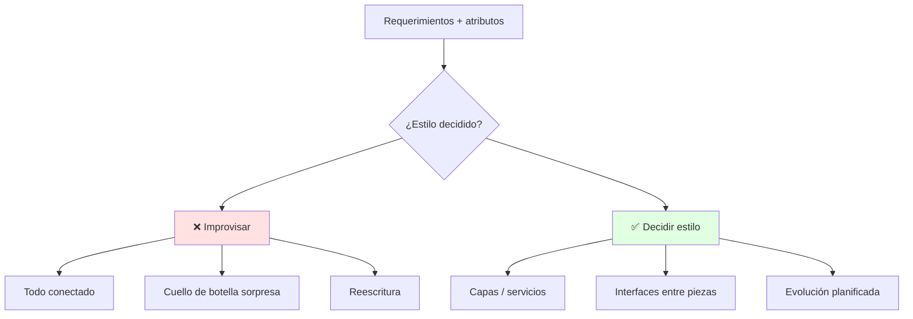
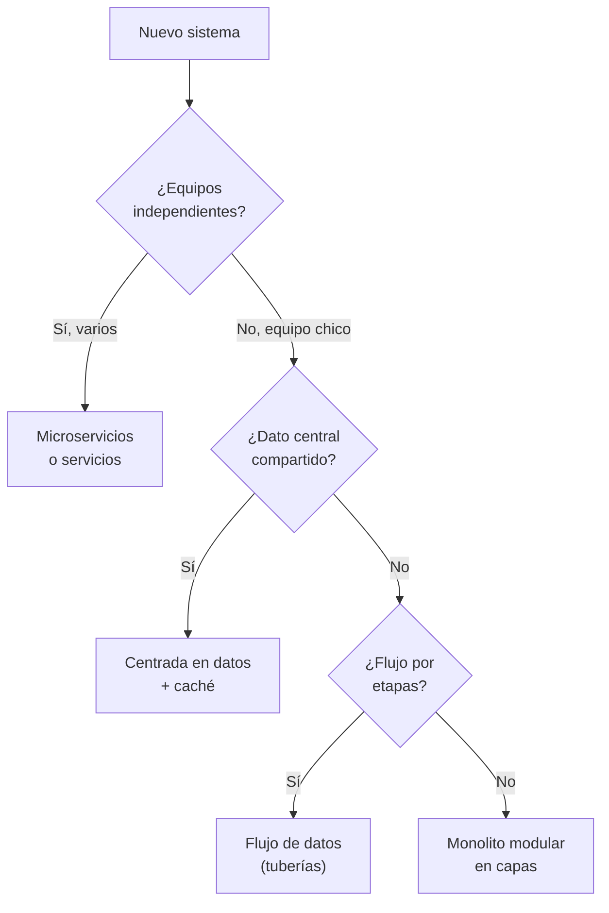
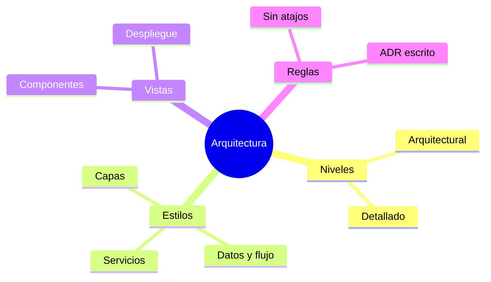

# 🏛️ Diseño Arquitectónico y Estilos

## 🎯 Introducción

> [!info] 💡 ¿Por Qué la Arquitectura se Decide Primero y se Lamenta al Final?
>
> La **arquitectura de software** es la estructura global: qué piezas existen, cómo se comunican y qué restricciones cumplen. Es la decisión más cara de revertir — cambiar de monolito a microservicios a mitad del proyecto cuesta más que todo lo construido hasta ahí.
>
> **Importancia histórica:** en los 90, el auge de internet obligó a separar cliente y servidor (nace la web en capas); en los 2010, la nube y los contenedores volvieron viables los microservicios. Cada era impuso su estilo porque el anterior colapsó bajo su propio peso al escalar.
>
> **Relevancia actual:** tu proyecto de curso, el monolito de una startup y la plataforma de un banco difieren solo en escala — los tres necesitan la misma pregunta respondida el día 1: ¿qué piezas hay y cómo se hablan?
>
> **Analogía del mundo real:** piensa en planificar una ciudad:
>
> - **Sin arquitectura** → Casas donde caigan, sin avenidas: el tráfico (datos) colapsa.
> - **Con arquitectura** → Zonas, avenidas y servicios definidos antes de construir.
> - **Estilo** → El "plano tipo": capas, cliente-servidor, microservicios, monolito.
>
> | Razón | Sin Arquitectura | Con Arquitectura |
> |---|---|---|
> | **Escalar** | Reescribir medio sistema | Agregar nodos/módulos |
> | **Equipo** | Todos tocan todo | Fronteras claras por equipo |
> | **Atributos** | Rendimiento por accidente | Decisiones que garantizan calidad |
> | **Costo del cambio** | Exponencial | Localizado por capa |

---

## 🧵 Dos Niveles: Arquitectural vs Detallado (Deck 01b)

> [!note] 📋 Definición — Los Dos Niveles del Diseño
>
> 1. **Arquitectural (alto nivel):** modelos macro de calidad y funciones, separados del bajo nivel. Decide despliegue físico, plataforma tecnológica, componentes estructurales, intercomunicación (protocolos), no funcionales (desempeño, seguridad, robustez, escalabilidad) y concurrencia.
> 2. **Detallado:** refina la arquitectura hasta que está lista para construir: componentes → clases, interfaces implementadas, relaciones especificadas, patrones identificados y aplicados.
>
> | Nivel | Pregunta | Entregable |
> |---|---|---|
> | **Arquitectural** | ¿Qué piezas y cómo se hablan? | Diagrama de componentes + despliegue |
> | **Detallado** | ¿Qué clases e interfaces exactas? | Diagrama de clases + contratos |
>
> **Regla del docente:** no se codifica lo que no pasó por ambos niveles.

---

## 🧵 Estilos Arquitectónicos (Pressman cap. 10 + Deck 01b)

### 🎭 Catálogo con Criterio

> [!note] 🎨 Anatomía de un Estilo
>
> Todo estilo tiene 4 partes: **componentes** que hacen el trabajo + **conectores** (comunicación/coordinación) + **restricciones** de integración + **modelos semánticos** para entender propiedades.
>
> | Estilo | Idea | Úsalo cuando | Cuidado |
> |---|---|---|---|
> | **Capas** | UI → lógica → datos, cada capa solo habla con la de abajo | Proyecto de curso clásico, CRUD | No saltarse capas ("atajos") |
> | **Centrada en datos** | Repositorio central que todos consultan/actualizan | Dato compartido intenso | Cuello de botella en el repositorio |
> | **Flujo de datos** | Entrada → etapas de transformación → salida | Compiladores, ETL | Acoplar etapas al dato |
> | **Cliente-servidor** | Front pide, back responde por API | App + API REST | El contrato API es sagrado |
> | **Microservicios** | Servicios pequeños e independientes | Escala y equipos grandes | Operación compleja (overkill en curso) |
> | **Monolito modular** | Un despliegue, módulos internos claros | Proyecto semestral, equipo chico ✅ | Disciplina para no mezclar |
>
> **Recomendación para tu proyecto:** monolito modular en capas.

### 🔍 Vistas Mínimas: Componentes y Despliegue

> [!example] 🧪 Lo que tu Arquitectura Debe Mostrar
>
> 1. **Vista de componentes:** cajas (módulos) + flechas (quién llama a quién).
> 2. **Vista de despliegue:** dónde corre cada caja (cliente, servidor, BD).
> 3. **1 restricción anotada:** "responde <2s", "solo HTTPS", "3 usuarios concurrentes".
>
> **Test:** si un compañero no puede decir dónde agregar "reportes PDF" sin preguntarte, tu arquitectura no comunica.

---

## 🗺️ Diagrama de Decisión: ¿Qué Estilo Elijo?

> [!tip] 💡 Lectura del diagrama
>
> Para tu proyecto de curso casi siempre terminas en monolito modular en capas — y está bien: la decisión justificada vale más que el estilo de moda.

---

## ⚠️ Problemas Comunes y Soluciones

> [!danger] ❌ Error 1: Capas que se Saltan (viola **arquitectura en capas**)
>
> **Síntomas:** la UI consulta la BD directo "solo esta vez" y el atajo se vuelve patrón.
>
> **Solución:**
>
> - Regla escrita: "UI → Servicio → Datos, sin excepciones".
> - En code review, el primer comentario es sobre capas, no estilo.

> [!danger] ❌ Error 2: Elegir Estilo por Moda (viola **decisión justificada por contexto**)
>
> **Síntomas:** microservicios para 3 endpoints usados por 10 personas; más YAML que código.
>
> **Solución:** usa el diagrama de decisión — justifica el estilo por equipos, datos y flujo, no por conferencias.

> [!danger] ❌ Error 3: Arquitectura Solo en la Cabeza del Líder (viola **ADR/decisiones escritas**)
>
> **Síntomas:** nadie más sabe dónde va cada cosa; cada pregunta interrumpe al mismo.
>
> **Solución:** 5 cajas + flechas + 1 restricción en el README desde el sprint 1; ADR de 5 líneas por decisión.

---

## 🎯 Mejores Prácticas

> [!tip] 🏆 Checklist Arquitectónico
>
> **1. Nombra tu estilo en 1 línea del README**
>
> Monolito modular en 3 capas: web / servicio / datos.
>
> **2. Dibuja antes del sprint 1**
>
> 5 cajas máximo. Si necesitas 15, agrupa.
>
> **3. Registra decisiones (ADR corto)**
>
> "Elegimos X porque Y; descartamos Z por W." 5 líneas por decisión.
>
> **4. Dibuja despliegue aunque sea local**
>
> Cliente, servidor y BD en cajas separadas aunque corran en tu laptop — el día que se separen ya está pensado.

---

## 📝 Ejercicios Propuestos

> [!example] 📋 Nivel 1 — Básico
>
> **1.** Define arquitectura de software y explica por qué es la decisión más cara de revertir.
>
> **2.** Diferencia diseño arquitectural de diseño detallado: ¿qué decide cada uno y qué entrega?
>
> **3.** Nombra las 4 partes de todo estilo arquitectónico.
>
> **4.** ¿Qué restricción anotarías para un sistema de inscripciones con 500 usuarios concurrentes?
>
> **5.** Clasifica: (a) app móvil + API REST, (b) compilador, (c) ERP con BD central.
>
> > [!success]- ✅ Respuestas — Nivel 1
> >
> > - **1.** Estructura global (piezas, comunicación, restricciones); revertirla implica reescribir lo construido encima.
> > - **2.** Arquitectural: piezas y comunicación (componentes + despliegue). Detallado: clases, interfaces y patrones listos para construir.
> > - **3.** Componentes, conectores, restricciones y modelos semánticos.
> > - **4.** Ej.: "responde <2s con 500 concurrentes" + "solo HTTPS".
> > - **5.** (a) Cliente-servidor. (b) Flujo de datos. (c) Centrada en datos.

> [!example] 📋 Nivel 2 — Intermedio
>
> **6.** Tu equipo de 4 hará un sistema de reservas con panel admin y notificaciones. Elige estilo y justifícalo con el diagrama de decisión.
>
> **7.** Dibuja las vistas de componentes y despliegue de ese sistema (5 cajas máximo + 1 restricción).
>
> **8.** Un compañero propone que la UI lea directo la BD "para ir más rápido". Responde con Error 1 y propón la alternativa.
>
> **9.** Escribe un ADR de 5 líneas para elegir monolito modular sobre microservicios en tu proyecto.
>
> **10.** ¿Dónde pondrías la autenticación en capas y por qué no en la UI?
>
> > [!success]- ✅ Respuestas — Nivel 2
> >
> > - **6.** Monolito modular en capas: equipo chico, sin dato central dominante ni flujo por etapas.
> > - **7.** Cajas: Web + API + Servicio reservas + Notificador + BD; despliegue: cliente, servidor, BD; restricción ej. "confirmación <3s".
> > - **8.** Es el atajo clásico: ahorra 1 hora hoy y crea acoplamiento permanente; la UI habla solo con Servicio.
> > - **9.** "Elegimos monolito modular porque somos 4 sin DevOps dedicado; descartamos microservicios por costo operativo mayor que el beneficio a esta escala."
> > - **10.** En Servicio (capa lógica): la UI solo presenta; si vive en la UI, cada cliente reimplementa seguridad.

> [!example] 📋 Nivel 3 — Avanzado
>
> **11.** Argumenta cuándo una arquitectura centrada en datos se convierte en cuello de botella y qué dos salidas existen (caché vs. partición) con sus costos.
>
> **12.** Tu monolito creció: 2 equipos, despliegues que se pisan. Diseña la ruta de extracción del primer servicio (qué sale primero y por qué, qué contrato congela).
>
> **13.** Compara concurrencia a nivel arquitectónico vs a nivel de código: ¿qué decide cada uno y qué pasa si solo atiendes uno?
>
> **14.** Redacta las decisiones de despliegue físico, plataforma y protocolos de un sistema de votaciones estudiantiles (usa la lista del deck).
>
> **15.** Relaciona "arquitectura como decisiones difíciles de revertir" con el Error 3: ¿cómo evita un ADR que la arquitectura viva en una sola cabeza?
>
> > [!success]- ✅ Respuestas — Nivel 3
> >
> > - **11.** Cuando todo el tráfico cruza el repositorio: caché (riesgo de datos viejos) o partición/sharding (complejidad operativa). Elegir según tolerancia a datos viejos vs presupuesto operativo.
> > - **12.** Sale primero el módulo con menos dependencias entrantes y contrato más estable (ej. notificaciones); se congela su API y el monolito la consume como servicio.
> > - **13.** Arquitectura decide dónde puede haber concurrencia (etapas, réplicas); el código la ejecuta bien (locks, inmutabilidad). Sin la primera, el código pelea contra la topología.
> > - **14.** Respuesta libre guiada: dónde corre cada pieza, plataforma elegida, protocolos entre piezas, no funcionales objetivo.
> > - **15.** El ADR escribe la decisión + alternativas + motivo: cualquiera la lee y la discute sin depender del autor original.

---

## 📋 Resumen Ejecutivo

> [!summary] 📋 Lo Esencial
>
> - La **arquitectura** (piezas + comunicación + restricciones) es lo más caro de revertir.
> - **Dos niveles:** arquitectural (qué piezas) y detallado (qué clases) — no se codifica sin ambos.
> - Todo **estilo** tiene componentes, conectores, restricciones y semántica.
> - Para tu proyecto: **monolito modular en capas** + ADR de 5 líneas por decisión.

---

## ✅ Metas de Aprendizaje

> [!note] 🎯 Nivel Básico
> - [ ] Defino arquitectura y diferencio los dos niveles con su entregable.
> - [ ] Nombro las 4 partes de un estilo y 4 estilos con su caso de uso.
> - [ ] Dibujo vistas de componentes y despliegue de un sistema simple.

> [!note] 🎯 Nivel Intermedio
> - [ ] Elijo estilo con el diagrama de decisión y lo justifico por escrito.
> - [ ] Detecto atajos entre capas y los corrijo con la regla UI→Servicio→Datos.
> - [ ] Redacto un ADR corto que otro pueda entender sin mí.

> [!note] 🎯 Nivel Avanzado
> - [ ] Diagnostico cuellos de botella de una arquitectura centrada en datos.
> - [ ] Diseño una ruta de extracción de microservicio desde un monolito.
> - [ ] Decido despliegue, plataforma y protocolos de un caso nuevo.

---

## 📊 Resumen Visual

> [!success] 🔍 Comparación Final
>
> | Aspecto | Improvisada | Decidida |
> |---|---|---|
> | **Escalar** | ❌ Reescribir | ✅ Agregar piezas |
> | **Equipo** | Colisiones | Fronteras claras |
> | **Decisiones** | En una cabeza | En ADRs |
> | **Uso Recomendado** | Prototipo desechable | ✅ **Todo proyecto** |

---

## 🚀 Próximos Pasos

> [!quote] 🌟 Continuando
>
> **Has aprendido:**
>
> ✅ Arquitectura como decisión cara + dos niveles del deck
> ✅ Estilos con anatomía de 4 partes y diagrama de decisión
> ✅ Vistas mínimas, ADRs y errores numerados
>
> **Próximo tema:**
>
> | Tema | Qué verás | Por qué importa |
> |---|---|---|
> | **Diseño por componentes** | Interfaces, contratos, reutilización | Baja la arquitectura a piezas construibles |

---

## 🔗 Seguir estudiando

> [!info] 📚 Seguir estudiando
>
> - Mapa de contenido: [[Diseño de Software]]
> - Índice Unidad 2: [[00 - Índice Unidad 2]]
> - Siguiente: [[02 - Diseño por componentes e interfaces]]
> - Syllabus: [[Bienvenida y Syllabus Diseño de Software]]

## 📚 Referencias

> [!quote] 📖 Fuentes
>
> - Deck docente `01bDisenoSoftware.pdf`: dos niveles, qué decide cada uno, estilos.
> - R. Pressman, B. Maxim, *Software Engineering: A Practitioner's Approach*, 9th ed., cap. 10.
> - Sílabo CCPG1042, Unidad 2: diseño orientado a objetos (7h).

---

**Tags:** #CCPG1042 #unidad2 #arquitectura #estilos #diseno-software
