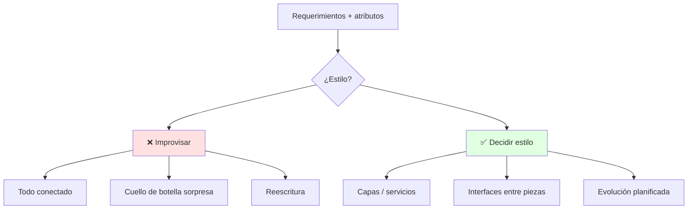
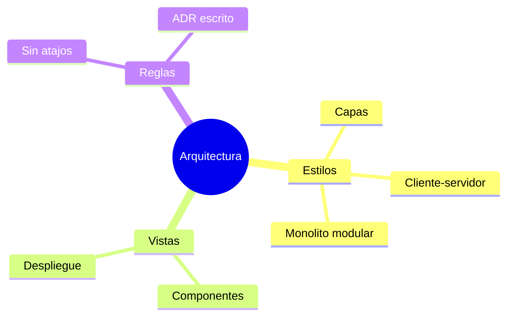

# 🏛️ Diseño Arquitectónico

## 🎯 Introducción

> [!info] 💡 ¿Por Qué la Arquitectura se Decide Primero y se Lamenta al Final?
>
> La **arquitectura de software** es la estructura global: qué grandes piezas existen, cómo se comunican y qué restricciones cumplen (rendimiento, seguridad, escalabilidad). Es la decisión más cara de revertir.
>
> **Analogía del mundo real:** Piensa en planificar una ciudad:
>
> - **Sin arquitectura** → Casas donde caigan, sin avenidas: el tráfico (datos) colapsa
> - **Con arquitectura** → Zonas, avenidas y servicios definidos antes de construir
> - **Estilo** → El "plano tipo": capas, cliente-servidor, microservicios, monolito
> - **Tu proyecto** → Elegir estilo sin criterio es la deuda más cara (Unidad 4 la cobra)
>
> | Razón | Sin Arquitectura | Con Arquitectura |
> |---|---|---|
> | **Escalar** | Reescribir medio sistema | Agregar nodos/módulos |
> | **Equipo** | Todos tocan todo | Fronteras claras por equipo |
> | **Atributos** | Rendimiento por accidente | Decisiones que garantizan calidad |
> | **Costo del cambio** | Exponencial | Localizado por capa |



---

## 🧵 Estilos Arquitectónicos (Pressman cap. 10)

### 🎭 Catálogo Mínimo que Debes Dominar

> [!note] 🎨 Elige con Criterio, no por Moda
>
> ```mermaid
> graph LR
>     U[Problema] --> E[Restricciones]
>     E --> S[Estilo]
>     S --> V[Vistas: despliegue + componentes]
>
>     style S fill:#e1f5ff
> ```
>
> | Estilo | Idea | Úsalo cuando | Cuidado |
> |---|---|---|---|
> | **Capas** | UI → lógica → datos, cada capa solo habla con la de abajo | Proyecto de curso clásico, CRUD | No saltarse capas ("atajos") |
> | **Cliente-servidor** | Front pide, back responde por API | App + API REST | El contrato API es sagrado |
> | **Microservicios** | Servicios pequeños e independientes | Escala y equipos grandes | Operación compleja (overkill en curso) |
> | **Monolito modular** | Un despliegue, módulos internos claros | Proyecto semestral, equipo chico ✅ | Disciplina para no mezclar |
> | **Tuberías y filtros** | Datos fluyen por etapas | Compiladores, ETL, procesamiento |
> | **Eventos** | Componentes reaccionan a mensajes | Notificaciones, tiempo real |
>
> **Recomendación para tu proyecto:** monolito modular en capas. Te da orden sin la operación de microservicios.

### 🔍 Vistas: Despliegue y Componentes

> [!example] 🧪 Lo Mínimo que tu Arquitectura Debe Mostrar
>
> 1. Vista de componentes: cajas (módulos) + flechas (quién llama a quién)
> 2. Vista de despliegue: dónde corre cada caja (cliente, servidor, BD)
> 3. 1 restricción anotada: "responde <2s", "solo HTTPS", "3 usuarios concurrentes"
>
> **Test:** si un compañero no puede decir dónde agregar "reportes PDF" sin preguntarte, tu arquitectura no comunica.

---

## ⚠️ Problemas Comunes y Soluciones

> [!danger] ❌ Error: Capas que se Saltan (Atajos)
>
> **Síntomas:** la UI consulta la BD directo "solo esta vez" y el atajo se vuelve patrón.
>
> **Solución:**
>
> - Regla escrita: "UI → Servicio → Datos, sin excepciones"
> - En code review, el primer comentario es sobre capas, no estilo

---

## 🎯 Mejores Prácticas

> [!tip] 🏆 Checklist Arquitectónico
>
> **1. Nombra tu estilo en 1 línea del README**
>
> "Monolito modular en 3 capas: web / servicio / datos."
>
> **2. Dibuja antes del sprint 1**
>
> 5 cajas máximo. Si necesitas 15, agrupa.
>
> **3. Registra decisiones (ADR corto)**
>
> "Elegimos X porque Y; descartamos Z por W." 5 líneas por decisión.

---

## 📊 Resumen Visual



> [!success] 🔍 Comparación Final
>
> | Aspecto | Improvisada | Decidida |
> |---|---|---|
> | **Escalar** | ❌ Reescribir | ✅ Agregar piezas |
> | **Equipo** | Colisiones | Fronteras claras |
> | **Uso Recomendado** | Prototipo desechable | ✅ **Todo proyecto** |

---

## 🚀 Próximos Pasos

> [!quote] 🌟 Continuando
>
> **Has aprendido:**
>
> ✅ Estilos y cuándo usar cada uno
> ✅ Vistas mínimas y regla anti-atajos
> ✅ ADR y recomendación para tu proyecto
>
> **Próximo tema:**
>
> | Tema | Qué verás | Por qué importa |
> |---|---|---|
> | **Diseño por componentes** | Interfaces, contratos, reutilización | Baja la arquitectura a piezas construibles |

---

## 🔗 Seguir estudiando

> [!info] 📚 Seguir estudiando
>
> - Mapa de contenido: [[Diseño de Software]]
> - Índice Unidad 2: [[00 - Índice Unidad 2]]
> - Siguiente: [[02 - Diseño por componentes e interfaces]]
> - Syllabus: [[Bienvenida y Syllabus Diseño de Software]]

## 📚 Referencias

> [!quote] 📖 Fuentes
>
> - R. Pressman, B. Maxim, *Software Engineering: A Practitioner's Approach*, 9th ed., cap. 10.
> - Sílabo CCPG1042, Unidad 2: diseño orientado a objetos (7h).

---

**Tags:** #CCPG1042 #unidad2 #arquitectura #diseno-software
