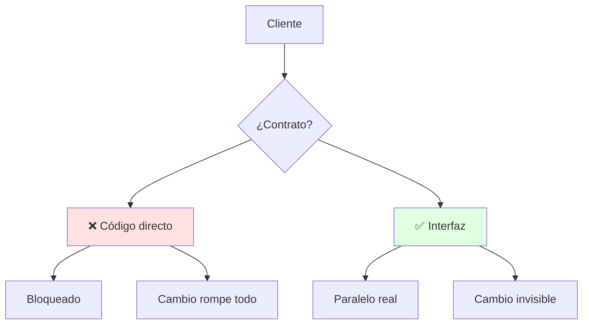
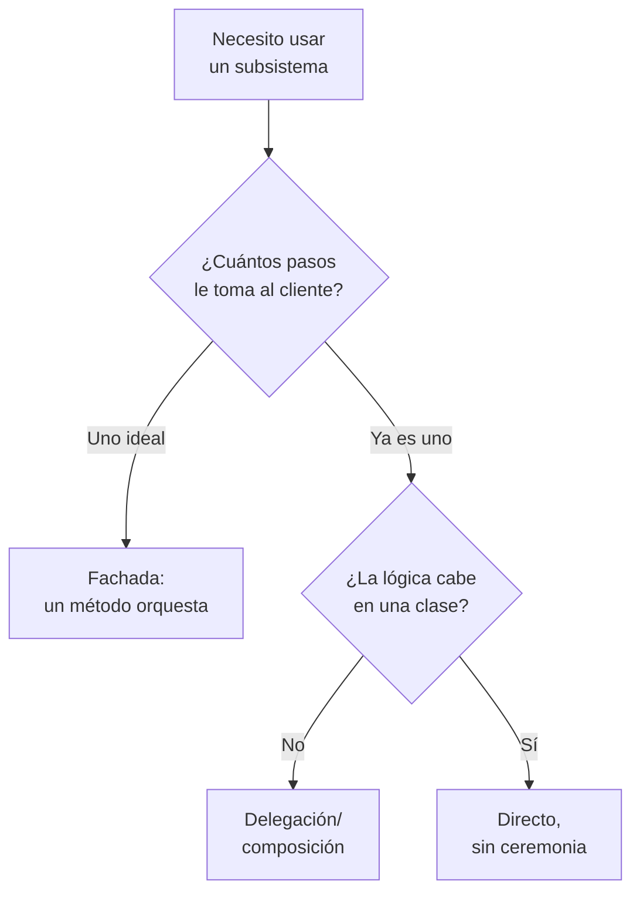
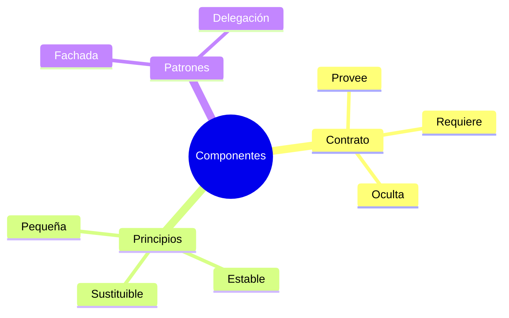

# 🧩 Diseño por Componentes e Interfaces

## 🎯 Introducción

> [!info] 💡 ¿Por Qué tu Clase Necesita un Contrato?
>
> El **diseño por componentes** baja la arquitectura a piezas construibles: cada componente expone una **interfaz** (contrato) y esconde su interior. Así dos personas programan en paralelo sin pisarse — y el día que cambias la implementación, nadie se entera.
>
> **Importancia histórica:** la crisis de los 2000 fue de integración — sistemas enormes donde cambiar una librería rompía diez módulos. De ahí nacieron los estándares de componentes (.NET, JEE, servicios web): programar contra contratos, no contra código ajeno.
>
> **Relevancia actual:** microservicios, paquetes npm, APIs REST — todo es "componente + interfaz". Tu proyecto se evalúa igual: ¿puedo cambiar una pieza sin romper las demás?
>
> **Analogía del mundo real:** piensa en enchufes eléctricos:
>
> - **Sin interfaz** → Cada aparato trae cable pelado distinto (todo acoplado).
> - **Con interfaz** → Enchufe estándar: conectas sin saber cómo genera la planta.
> - **Contrato** → Voltaje + forma prometidos; si cambian, avisan (versionan).
>
> | Razón | Sin Interfaces | Con Interfaces |
> |---|---|---|
> | **Paralelo** | Esperan a que el otro termine | Programan contra el contrato |
> | **Cambio interno** | Rompe a todos | Invisible si respeta contrato |
> | **Pruebas** | Necesitan todo real | Mocks del contrato (Unidad 5) |
> | **Reutilización** | Copiar-pegar | Importar componente |



---

## 🧵 Anatomía del Componente (Pressman cap. 11)

### 🎭 Contrato, Provisión y Requerimiento

> [!note] 📋 Definición — Las Tres Caras
>
> - **Provee:** qué servicios ofrece (`ReportePDF.generar(datos)`).
> - **Requiere:** qué necesita para funcionar (fuente de `datos` válida).
> - **Oculta:** qué nadie debe tocar (caché interna, queries crudas).
>
> ```mermaid
> graph LR
>     C[Componente] --> P[🔌 Provee:<br/>qué ofrece]
>     R[🔌 Requiere:<br/>qué necesita] --> C
>     style C fill:#e1f5ff
> ```
>
> **Principios de diseño de interfaces:**
>
> 1. **Pequeña:** 3-5 operaciones cohesivas, no 20.
> 2. **Estable:** cambia por versión, nunca en silencio.
> 3. **Explícita:** parámetros y errores documentados (qué falla y cómo).
> 4. **Sustituible:** dos implementaciones intercambiables sin tocar clientes.

### 🔍 Patrones de Estructura Interna

> [!example] 🧪 Tres Formas Sanas
>
> | Patrón | Idea | Cuándo |
> |---|---|---|
> | **Fachada** | Una cara simple ante un subsistema complejo | `TiendaFacade.comprar()` orquesta pagos+stock+envío |
> | **Delegación** | Repartir a ayudantes internos | Validador → Reglas individuales |
> | **Composición** | Armar de piezas pequeñas | `Pedido` contiene `Líneas` + `Descuento` |
>
> ```java
> // ✅ FACHADA: el cliente ve 1 método, el subsistema sigue complejo
> class TiendaFacade {
>     Resultado comprar(Carrito c, Pago p) {
>         stock.reservar(c);
>         pagos.cobrar(p);
>         return envios.programar(c);
>     }
> }
> ```

---

## 🗺️ Diagrama de Decisión: ¿Fachada, Delegación o Directo?



> [!tip] 💡 Lectura del diagrama
>
> La fachada no es obligatoria — es para subsistemas que duelen de usar. Si el subsistema ya es simple, usarlo directo evita capas inútiles.

---

## ⚠️ Problemas Comunes y Soluciones

> [!danger] ❌ Error 1: Interfaces Obesas ("God Interface")
>
> **Síntomas:** una interfaz de 25 métodos donde todo cambio la rompe y nadie se atreve a versionarla:
>
> ```java
> interface ISistema { // ❌ EL ERROR ESTÁ AQUÍ: 25 métodos, 4 roles mezclados
>     void generarReporte(); void pagarFactura(); void enviarCorreo();
>     // ... 22 métodos más de reportes, pagos y envíos
> }
> ```
>
> **Solución:**
>
> - Divide por rol: `IReportes`, `IPagos`, `IEnvios`.
> - Regla: si un cliente usa menos del 50% de la interfaz, está obesa.

> [!danger] ❌ Error 2: Filtrar Detalles Internos (viola **ocultamiento**)
>
> **Síntomas:** la interfaz expone códigos de error de la BD interna:
>
> ```java
> // ❌ EL ERROR ESTÁ AQUÍ: el cliente ve entrañas de Oracle
> interface Pagos {
>     void cobrar(double m) throws SQLExceptionORA00001; // filtra el motor
> }
> ```
>
> **Solución:** traduce errores internos a errores del dominio en la frontera del componente.

> [!danger] ❌ Error 3: Fachada que Hace Todo (viola **SRP + delegación**)
>
> **Síntomas:** la fachada acumula lógica de negocio en vez de orquestar:
>
> ```java
> // ❌ EL ERROR ESTÁ AQUÍ: la fachada calcula, valida y persiste
> class TiendaFacade {
>     Resultado comprar(Carrito c, Pago p) {
>         double total = 0; // ❌ lógica de negocio aquí
>         for (Linea l : c.lineas()) total += l.precio();
>         // ... + validación + persistencia, todo adentro
>         return null;
>     }
> }
> ```
>
> **Solución:** orquesta, no implementa — si la fachada crece, esconde un diseño pendiente.

---

## 🎯 Mejores Prácticas

> [!tip] 🏆 Checklist de Componentes
>
> **1. Diseña la interfaz en equipo antes del sprint**
>
> Firmas + errores + ejemplo de uso en 1 página. El código viene después.
>
> **2. Un componente, un dueño**
>
> Cada componente tiene responsable en Git: menos conflictos, más calidad.
>
> **3. Interfaz pequeña y versionada**
>
> 3-5 operaciones; cambios compatibles o versión nueva, nunca silencio.
>
> **4. Mapea a UML (puente a Stevens)**
>
> Componente = clase con estereotipo «component»; interfaz = círculo/paleta UML.

---

## 📝 Ejercicios Propuestos

> [!example] 📋 Nivel 1 — Básico
>
> **1.** Define componente con sus tres caras (provee, requiere, oculta) y da un ejemplo.
>
> **2.** ¿Qué significan los 4 principios de interfaces (pequeña, estable, explícita, sustituible)?
>
> **3.** Diferencia fachada, delegación y composición con un ejemplo de cada uno.
>
> **4.** ¿Por qué una interfaz con 25 métodos es un problema? ¿Cómo la dividirías?
>
> **5.** Dibuja el mini-diagrama cliente→interfaz→2 implementaciones de un servicio de notificaciones.
>
> > [!success]- ✅ Respuestas — Nivel 1
> >
> > - **1.** Unidad desplegable accedida solo por interfaces; provee servicios, requiere insumos, oculta interior.
> > - **2.** Pocas operaciones cohesivas; cambios versionados; errores documentados; implementaciones intercambiables.
> > - **3.** Fachada: cara simple (TiendaFacade). Delegación: reparte a ayudantes. Composición: arma de piezas (Pedido+Líneas).
> > - **4.** Nadie la implementa completa y todo cambio la rompe; dividir por rol (IReportes, IPagos...).
> > - **5.** `Notificador → INotificador ← {Email, SMS}`: el cliente conoce solo la interfaz.

> [!example] 📋 Nivel 2 — Intermedio
>
> **6.** Diseña la interfaz de un componente de reportes PDF con 4 operaciones máximas, incluyendo sus errores.
>
> **7.** Un `GestorUsuarios` hace login, reportes, envíos de correo y backup. Aplica SRP + interfaces: ¿en qué piezas queda?
>
> **8.** Explica con un caso cuándo una fachada deja de ayudar y se vuelve God Facade. ¿Cómo la detectas?
>
> **9.** ¿Cómo probarías `TiendaFacade.comprar()` sin tocar pagos ni envíos reales? (Conecta con Unidad 5.)
>
> **10.** Tu equipo discute si exponer el código de error SQL `ORA-00001` en la API. Argumenta con "leaky abstraction".
>
> > [!success]- ✅ Respuestas — Nivel 2
> >
> > - **6.** Ej.: `generar(datos)->pdf | ErrorDatos`, `vistaPrevia(datos)`, `plantillas()->lista`, `programarEnvio(pdf,destino)` — 4 cohesivas con errores del dominio.
> > - **7.** `IAuth`, `IReportes`, `INotificador`, `IRespaldo` + fachada opcional solo si orquestarlas duele.
> > - **8.** Cuando acumula reglas de negocio en vez de orquestar; se detecta porque cambiar 1 flujo toca siempre la fachada.
> > - **9.** Mocks de `IPagos` e `IEnvios` inyectados por constructor (DIP): verificas orquestación sin red.
> > - **10.** Filtra el detalle interno: la API devuelve `DUPLICADO` del dominio; el ORA queda en logs internos.

> [!example] 📋 Nivel 3 — Avanzado
>
> **11.** Diseña versionado de una API de pagos v1→v2 sin romper clientes v1: ¿qué cambia, qué se congela, cómo conviven?
>
> **12.** Argumenta cuándo NO crear una fachada aunque el subsistema tenga 10 clases.
>
> **13.** Un componente A requiere 8 servicios distintos para funcionar. Diagnostica con cohesión/acoplamiento y propón rediseño.
>
> **14.** Compara "programar contra interfaces" con el paradigma de componentes del deck (4 etapas): ¿dónde encaja cada principio?
>
> **15.** Diseña el contrato completo (firmas + errores + ejemplo) de un componente de autenticación para tu proyecto.
>
> > [!success]- ✅ Respuestas — Nivel 3
> >
> > - **11.** v1 congelada (solo fixes críticos), v2 con el cambio, ambas conviven por versión en ruta; deprecar v1 con fecha.
> > - **12.** Si los clientes usan subconjuntos disjuntos y simples: fachada agregaría acoplamiento sin valor; exponer módulos directos es mejor.
> > - **13.** Acoplamiento eferente altísimo + probable baja cohesión: partir A por misiones y agrupar dependencias por rol.
> > - **14.** Análisis→interfaces candidatas; modificación→ajustar contratos; diseño→fachadas donde duela; integración→versionado.
> > - **15.** Respuesta libre guiada: `autenticar(cred)->token | ErrorCredenciales`, `renovar(token)`, `revocar(token)` + ejemplo de uso.

---

## 📋 Resumen Ejecutivo

> [!summary] 📋 Lo Esencial
>
> - Un **componente** provee, requiere y oculta — accedido solo por **interfaces**.
> - Interfaces **pequeñas, estables, explícitas y sustituibles**.
> - **Fachada** para subsistemas que duelen; si no duele, directo.
> - Todo cambio de contrato se **versiona**, nunca en silencio.

---

## ✅ Metas de Aprendizaje

> [!note] 🎯 Nivel Básico
> - [ ] Defino componente con sus tres caras y doy un ejemplo.
> - [ ] Explico los 4 principios de interfaces con ejemplo.
> - [ ] Diferencio fachada, delegación y composición.

> [!note] 🎯 Nivel Intermedio
> - [ ] Diseño una interfaz pequeña con errores del dominio.
> - [ ] Detecto God Interface y God Facade y propongo división.
> - [ ] Explico cómo testear con mocks vía DIP.

> [!note] 🎯 Nivel Avanzado
> - [ ] Versiono una API sin romper clientes.
> - [ ] Diagnostico acoplamiento eferente y rediseño.
> - [ ] Diseño un contrato completo listo para implementar.

---

## 📊 Resumen Visual



> [!success] 🔍 Comparación Final
>
> | Aspecto | Sin Contrato | Con Contrato |
> |---|---|---|
> | **Paralelo** | ❌ Bloqueado | ✅ Por interfaces |
> | **Cambio** | Rompe clientes | Versionado |
> | **Tests** | Requieren sistema | Mocks aislados |
> | **Uso Recomendado** | Nunca en equipo | ✅ **Estándar de proyecto** |

---

## 🚀 Próximos Pasos

> [!quote] 🌟 Continuando
>
> **Has aprendido:**
>
> ✅ Contrato provee/requiere/oculta + 4 principios
> ✅ Fachada, delegación y cuándo no usarlos
> ✅ Versionado y testing con mocks
>
> **Próximo tema:**
>
> | Tema | Qué verás | Por qué importa |
> |---|---|---|
> | **UML: clases y objetos** | Atributos, operaciones, relaciones | El idioma para dibujar todo lo anterior |

---

## 🔗 Seguir estudiando

> [!info] 📚 Seguir estudiando
>
> - Mapa de contenido: [[Diseño de Software]]
> - Índice Unidad 2: [[00 - Índice Unidad 2]]
> - Anterior: [[01 - Diseño arquitectónico y estilos]]
> - Siguiente: [[03 - UML clases, objetos y relaciones]]
> - Syllabus: [[Bienvenida y Syllabus Diseño de Software]]

## 📚 Referencias

> [!quote] 📖 Fuentes
>
> - R. Pressman, B. Maxim, *Software Engineering: A Practitioner's Approach*, 9th ed., cap. 11.
> - Deck docente (paradigma de componentes, 4 etapas, COTS).
> - Sílabo CCPG1042, Unidad 2: diseño orientado a objetos (7h).

---

**Tags:** #CCPG1042 #unidad2 #componentes #interfaces #diseno-software
