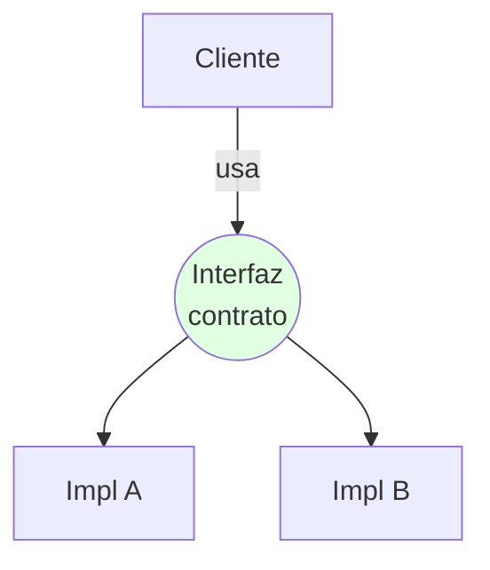
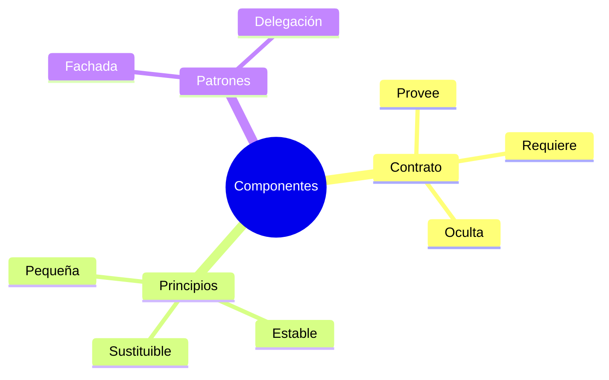

# 🧩 Diseño por Componentes e Interfaces

## 🎯 Introducción

> [!info] 💡 ¿Por Qué tu Clase Necesita un Contrato?
>
> El **diseño por componentes** baja la arquitectura a piezas construibles: cada componente expone una **interfaz** (contrato) y esconde su interior. Así dos personas programan en paralelo sin pisarse.
>
> **Analogía del mundo real:** Piensa en enchufes eléctricos:
>
> - **Sin interfaz** → Cada aparato trae cable pelado distinto (todo acoplado)
> - **Con interfaz** → Enchufe estándar: conectas sin saber cómo genera la planta
> - **Contrato** → Voltaje + forma prometidos; si cambian, avisan (versionan)
> - **Tu código** → `IPagos.cobrar()` promete; da igual si usa Stripe o PayPal detrás
>
> | Razón | Sin Interfaces | Con Interfaces |
> |---|---|---|
> | **Paralelo** | Esperan a que el otro termine | Programan contra el contrato |
> | **Cambio interno** | Rompe a todos | Invisible si respeta contrato |
> | **Pruebas** | Necesitan todo real | Mocks del contrato (Unidad 5) |
> | **Reutilización** | Copiar-pegar | Importar componente |



---

## 🧵 Anatomía del Componente (Pressman cap. 11)

### 🎭 Contrato, Provisión y Requerimiento

> [!note] 🎨 Diseñar la Frontera, no el Interior
>
> ```mermaid
> graph LR
>     C[Componente] --> P[🔌 Provee:<br/>qué ofrece]
>     R[🔌 Requiere:<br/>qué necesita] --> C
>
>     style C fill:#e1f5ff
> ```
>
> | Parte | Pregunta | Ejemplo |
> |---|---|---|
> | **Provee** | ¿Qué servicios ofrezco? | `ReportePDF.generar(datos)` |
> | **Requiere** | ¿Qué necesito para funcionar? | Fuente de `datos` válida |
> | **Oculta** | ¿Qué nadie debe tocar? | Caché interna, queries crudas |
>
> **Principios de diseño de interfaces:**
>
> 1. Pequeña: 3-5 operaciones cohesivas, no 20
> 2. Estable: cambia por versión, nunca en silencio
> 3. Explícita: parámetros y errores documentados (qué falla y cómo)
> 4. Sustituible: dos implementaciones intercambiables sin tocar clientes

### 🔍 Patrones de Estructura Interna

> [!example] 🧪 Tres Formas Sanas
>
> | Patrón | Idea | Cuándo |
> |---|---|---|
> | **Fachada** | Una cara simple ante un subsistema complejo | `TiendaFacade.comprar()` orquesta pagos+stock+envío |
> | **Delegación** | Repartir a ayudantes internos | Validador → Reglas individuales |
> | **Composición** | Armar de piezas pequeñas | `Pedido` contiene `Líneas` + `Descuento` |
>
> ```java
> // ✅ FACHADA: el cliente ve 1 método, el subsistema sigue complejo
> class TiendaFacade {
>     Resultado comprar(Carrito c, Pago p) {
>         stock.reservar(c);
>         pagos.cobrar(p);
>         return envios.programar(c);
>     }
> }
> ```

---

## ⚠️ Problemas Comunes y Soluciones

> [!danger] ❌ Error: Interfaces Obesas ("God Interface")
>
> **Síntomas:** `ISistema` con 25 métodos; todo cambio la rompe y nadie se atreve a versionarla.
>
> **Solución:**
>
> - Divide por rol: IReportes, IPagos, IEnvios
> - Regla: si un cliente usa <50% de la interfaz, está obesa

---

## 🎯 Mejores Prácticas

> [!tip] 🏆 Checklist de Componentes
>
> **1. Diseña la interfaz en equipo antes del sprint**
>
> Firmas + errores + ejemplo de uso en 1 página. El código viene después.
>
> **2. Un componente, un dueño**
>
> Cada componente tiene responsable en Git: menos conflictos, más calidad.
>
> **3. M <=> UML (puente a Stevens)**
>
> Componente = clase con estereotipo «component»; interfaz = círculo/paleta UML.

---

## 📊 Resumen Visual



> [!success] 🔍 Comparación Final
>
> | Aspecto | Sin Contrato | Con Contrato |
> |---|---|---|
> | **Paralelo** | ❌ Bloqueado | ✅ Por interfaces |
> | **Cambio** | Rompe clientes | Versionado |
> | **Uso Recomendado** | Nunca en equipo | ✅ **Estándar de proyecto** |

---

## 🚀 Próximos Pasos

> [!quote] 🌟 Continuando
>
> **Has aprendido:**
>
> ✅ Contrato provee/requiere/oculta
> ✅ Interfaces pequeñas y estables
> ✅ Fachada y patrones internos
>
> **Próximo tema:**
>
> | Tema | Qué verás | Por qué importa |
> |---|---|---|
> | **UML: clases y objetos** | Atributos, operaciones, relaciones | El idioma para dibujar todo lo anterior |

---

## 🔗 Seguir estudiando

> [!info] 📚 Seguir estudiando
>
> - Mapa de contenido: [[Diseño de Software]]
> - Índice Unidad 2: [[00 - Índice Unidad 2]]
> - Anterior: [[01 - Diseño arquitectónico y estilos]]
> - Siguiente: [[03 - UML clases, objetos y relaciones]]
> - Syllabus: [[Bienvenida y Syllabus Diseño de Software]]

## 📚 Referencias

> [!quote] 📖 Fuentes
>
> - R. Pressman, B. Maxim, *Software Engineering: A Practitioner's Approach*, 9th ed., cap. 11.
> - Sílabo CCPG1042, Unidad 2: diseño orientado a objetos (7h).

---

**Tags:** #CCPG1042 #unidad2 #componentes #interfaces #diseno-software
