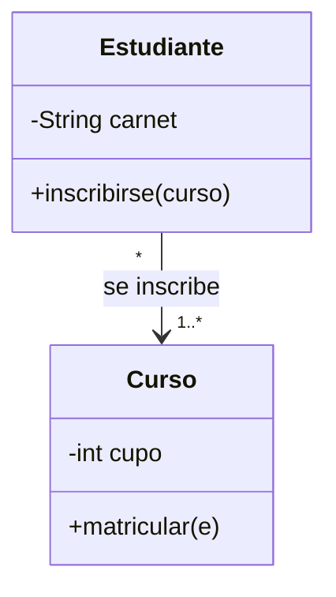
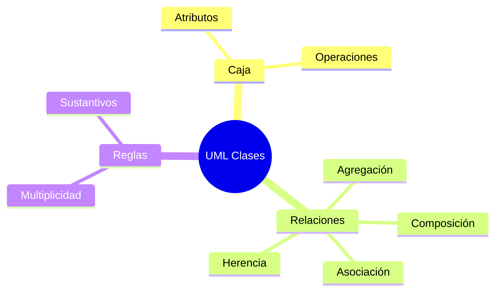

# 📐 UML: Clases, Objetos y Relaciones

## 🎯 Introducción

> [!info] 💡 ¿Por Qué UML Sigue Vivo en 2026?
>
> **UML 2.0** es el idioma común para dibujar diseño: una caja significa lo mismo en ESPOL que en cualquier empresa. Sin él, cada diagrama inventa su notación y nadie se entiende.
>
> **Analogía del mundo real:** Piensa en planos eléctricos:
>
> - **Sin estándar** → Cada electricista dibuja el enchufe a su manera (cortocircuito seguro)
> - **Con UML** → Clase, flecha y rombo significan siempre lo mismo
> - **Clase vs objeto** → Plano de casa vs casa construida
> - **Relación** → Cómo se conectan las casas (calle, tubería, herencia del terreno)
>
> | Razón | Dibujo Libre | UML 2.0 |
> |---|---|---|
> | **Lectura** | Adivinar símbolos | Notación estándar |
> | **Herramientas** | Papel que se pierde | Modelado + generación de código |
> | **Equipo** | Cada quien su estilo | Un solo idioma |
> | **Evaluación** | Diagrama ambiguo | Diagrama calificable |

---

## 🧵 La Caja y sus Relaciones (Stevens caps. 5-6)

### 🎭 Leer un Diagrama en 1 Minuto

> [!note] 🎨 Anatomía de la Caja
>
> ┌──────────────┐
> │   Estudiante │  ← nombre
> ├──────────────┤
> │ - carnet     │  ← atributos (- privado, + público, # protegido)
> ├──────────────┤
> │ + inscribirse│  ← operaciones
> └──────────────┘
>
> | Relación | Símbolo | Significado | Ejemplo |
> |---|---|---|---|
> | **Asociación** | línea + multiplicidad | Usa / conoce a | Estudiante `*` — `*` Curso |
> | **Agregación** | rombo blanco | Tiene, pero sobrevive sin él | Equipo ◇— Jugador |
> | **Composición** | rombo negro | Dueño: si muere, mueren partes | Casa ◆— Habitación |
> | **Generalización** | flecha hueca | Es-un (herencia) | Estudiante ─▷ Persona |
> | **Dependencia** | flecha punteada | Usa temporalmente | Reporte - -▷ Datos |
> | **Interfaz** | círculo/paleta | Contrato realizable | `<<interface>> Pagable` |
>
> **Multiplicidades que sí usarás:** `1`, `0..1`, `1..*`, `*`. Si dudas entre agregación y composición, pregunta: "¿la parte sobrevive sin el todo?".

### 🔍 Errores de Modelado que Delatan

> [!example] 🧪 Revisión Rápida de tu Diagrama
>
> 1. ¿Toda clase tiene al menos 1 relación? (suelta = sobra o falta)
> 2. ¿Los nombres son sustantivos del dominio? (nada de Manejador2)
> 3. ¿Herencia significa "es-un" real? (Estudiante es Persona ✅; Curso es Lista ❌)
> 4. ¿Multiplicidad en AMBOS extremos de cada asociación?

---

## ⚠️ Problemas Comunes y Soluciones

> [!danger] ❌ Error: Modelar la Base de Datos como Clases
>
> **Síntomas:** clases `TablaUsuario`, `ConexionBD` mezcladas con `Estudiante`; el diagrama es un ER disfrazado.
>
> **Solución:**
>
> - Clases = conceptos del problema (Persona, Matrícula), no tablas
> - La persistencia va en otra capa (ver nota de arquitectura)

---

## 🎯 Mejores Prácticas

> [!tip] 🏆 Checklist UML de Clases
>
> **1. 7±2 clases por diagrama**
>
> Más = divide en paquetes por tema.
>
> **2. Nombres del dominio, no técnicos**
>
> Matrícula, no MatriculaManagerBean.
>
> **3. Valida con escenarios**
>
> Narra "Ana se inscribe": ¿el diagrama permite cada paso? (puente a casos de uso)

---

## 📊 Resumen Visual

> [!success] 🔍 Comparación Final
>
> | Aspecto | Dibujo Libre | UML Clases |
> |---|---|---|
> | **Ambigüedad** | ❌ Alta | ✅ Notación única |
> | **Verificación** | Imposible | Escenarios |
> | **Uso Recomendado** | Borrador 5 min | ✅ **Entregable de diseño** |

---

## 🚀 Próximos Pasos

> [!quote] 🌟 Continuando
>
> **Has aprendido:**
>
> ✅ Caja UML y visibilidades
> ✅ 6 relaciones con ejemplos
> ✅ Revisión anti-errores
>
> **Próximo tema:**
>
> | Tema | Qué verás | Por qué importa |
> |---|---|---|
> | **UML comportamiento** | Casos de uso, secuencia, actividad | Muestran la película, no solo la foto |

---

## 🔗 Seguir estudiando

> [!info] 📚 Seguir estudiando
>
> - Mapa de contenido: [[Diseño de Software]]
> - Índice Unidad 2: [[00 - Índice Unidad 2]]
> - Anterior: [[02 - Diseño por componentes e interfaces]]
> - Siguiente: [[04 - UML casos de uso, secuencia y actividad]]
> - Syllabus: [[Bienvenida y Syllabus Diseño de Software]]

## 📚 Referencias

> [!quote] 📖 Fuentes
>
> - P. Stevens, R. Pooley, *Using UML*, 2nd ed., caps. 5-6 (clases y objetos).
> - Sílabo CCPG1042, Unidad 2: diseño orientado a objetos (7h).

---

**Tags:** #CCPG1042 #unidad2 #uml #clases #diseno-software
