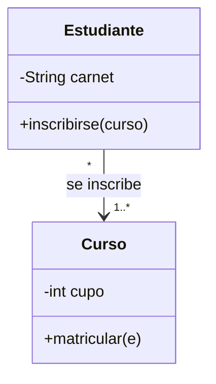
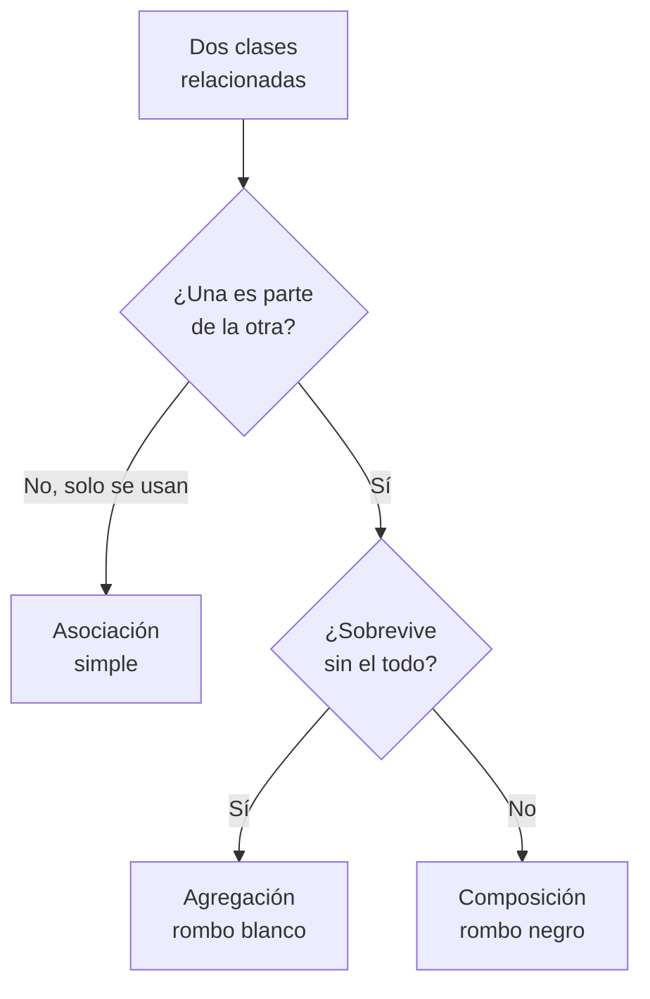
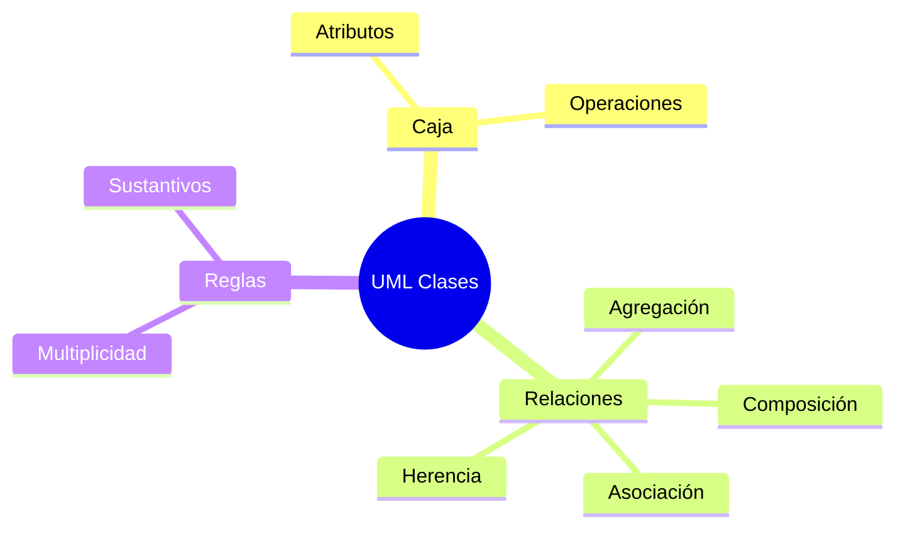

# 📐 UML: Clases, Objetos y Relaciones

## 🎯 Introducción

> [!info] 💡 ¿Por Qué UML Sigue Vivo?
>
> **UML 2.0** es el idioma común para dibujar diseño: una caja significa lo mismo en ESPOL que en cualquier empresa. Sin él, cada diagrama inventa su notación y nadie se entiende — y el docente lo evalúa en S4 tal cual.
>
> **Importancia histórica:** UML nació en los 90 unificando los métodos rivales de Booch, Rumbaugh y Jacobson ("los tres amigos"). La versión 2.0 (Stevens) modernizó secuencias, máquinas de estado y componentes — lo que estudias es el estándar que sobrevivió 30 años.
>
> **Relevancia actual:** aunque el código se genera solo a veces desde UML, el diagrama sigue siendo el medio más denso para discutir diseño en equipo y en entrevistas técnicas.
>
> **Analogía del mundo real:** piensa en planos eléctricos:
>
> - **Sin estándar** → Cada electricista dibuja el enchufe a su manera (cortocircuito seguro).
> - **Con UML** → Clase, flecha y rombo significan siempre lo mismo.
> - **Clase vs objeto** → Plano de casa vs casa construida.
>
> | Razón | Dibujo Libre | UML 2.0 |
> |---|---|---|
> | **Lectura** | Adivinar símbolos | Notación estándar |
> | **Equipo** | Cada quien su estilo | Un solo idioma |
> | **Evaluación** | Diagrama ambiguo | Diagrama calificable |



---

## 🧵 La Caja y sus Relaciones (Stevens caps. 5-6)

### 🎭 Leer un Diagrama en 1 Minuto

> [!note] 📋 Definición — Anatomía de la Caja
>
> | Compartimento | Contenido | Ejemplo |
> |---|---|---|
> | **Arriba** | Nombre (sustantivo del dominio) | Estudiante |
> | **Medio** | Atributos (`-` privado, `+` público, `#` protegido) | `- carnet` |
> | **Abajo** | Operaciones | `+ inscribirse` |
>
> | Relación | Símbolo | Significado | Ejemplo |
> |---|---|---|---|
> | **Asociación** | línea + multiplicidad | Usa / conoce a | Estudiante `*` — `*` Curso |
> | **Agregación** | rombo blanco | Tiene, pero sobrevive sin él | Equipo ◇— Jugador |
> | **Composición** | rombo negro | Dueño: si muere, mueren partes | Casa ◆— Habitación |
> | **Generalización** | flecha hueca | Es-un (herencia) | Estudiante ─▷ Persona |
> | **Dependencia** | flecha punteada | Usa temporalmente | Reporte - -▷ Datos |
> | **Interfaz** | círculo/paleta | Contrato realizable | `<<interface>> Pagable` |
>
> **Multiplicidades que sí usarás:** `1`, `0..1`, `1..*`, `*`. Ante la duda agregación vs composición: "¿la parte sobrevive sin el todo?".

### 🔍 Revisión Rápida de tu Diagrama

> [!example] 🧪 Checklist de 4 Preguntas
>
> 1. ¿Toda clase tiene al menos 1 relación? (suelta = sobra o falta)
> 2. ¿Los nombres son sustantivos del dominio? (nada de `Manejador2`)
> 3. ¿Herencia significa "es-un" real? (Estudiante es Persona ✅; Curso es Lista ❌)
> 4. ¿Multiplicidad en AMBOS extremos de cada asociación?

---

## 🗺️ Diagrama de Decisión: ¿Qué Relación Uso?



> [!tip] 💡 Lectura del diagrama
>
> La herencia queda fuera a propósito: solo si hay un "es-un" genuino. El 90% de las herencias apresuradas debieron ser asociaciones o composición.

---

## ⚠️ Problemas Comunes y Soluciones

> [!danger] ❌ Error 1: Modelar la Base de Datos como Clases
>
> **Síntomas:** el diagrama mezcla persistencia con dominio:
>
> ```java
> // ❌ EL ERROR ESTÁ AQUÍ: clases que son tablas, no conceptos
> class TablaUsuario { /* ... */ }
> class ConexionBD { /* ... */ }
> class Estudiante { /* ... */ } // la única que sí es del dominio
> ```
>
> **Solución:**
>
> - Clases = conceptos del problema (Persona, Matrícula), no tablas.
> - La persistencia va en otra capa (ver nota de arquitectura).

> [!danger] ❌ Error 2: Herencia por Pereza ("es-un" Falso)
>
> **Síntomas:** herencia usada solo para reusar 1 método:
>
> ```java
> // ❌ EL ERROR ESTÁ AQUÍ: un Curso NO ES una Lista
> class Curso extends Lista { /* ... */ }
> class Estudiante extends Usuario { /* ... */ } // solo si hay sustitución real
> ```
>
> **Solución:** usa el diagrama de decisión — asociación o composición casi siempre ganan; hereda solo con "es-un" real y sustitución válida (LSP, nota U1-04).

> [!danger] ❌ Error 3: Multiplicidades de Un Solo Lado (viola **multiplicidad bilateral**)
>
> **Síntomas:** un extremo mudo que deja la cardinalidad adivinada: `Estudiante — * Curso` sin nada del otro lado.
>
> **Completo y marcado:** `Estudiante — * Curso` ❌ (falta extremo) vs `Estudiante 1..* — * Curso` ✅ (ambos extremos).
>
> **Solución:** siempre ambos extremos (`1..*` y `*`); si no sabes el número, escribe `*` y anota el supuesto.

---

## 🎯 Mejores Prácticas

> [!tip] 🏆 Checklist UML de Clases
>
> **1. 7±2 clases por diagrama**
>
> Más = divide en paquetes por tema.
>
> **2. Nombres del dominio, no técnicos**
>
> Matrícula, no MatriculaManagerBean.
>
> **3. Valida con escenarios**
>
> Narra "Ana se inscribe": ¿el diagrama permite cada paso? (puente a casos de uso).
>
> **4. Visibilidades con intención**
>
> `-` por defecto; `+` solo lo contratado; `#` solo para herencia real.

---

## 📝 Ejercicios Propuestos

> [!example] 📋 Nivel 1 — Básico
>
> **1.** Dibuja la caja UML de `CuentaBancaria` con 2 atributos (uno privado) y 2 operaciones (una pública).
>
> **2.** Diferencia agregación de composición con un ejemplo propio de cada una.
>
> **3.** ¿Qué significan `-`, `+` y `#`? ¿Cuál debe ser el valor por defecto y por qué?
>
> **4.** Corrige: `Perro extends ListaMascotas` — ¿qué está mal y por qué diagrama?
>
> **5.** Pon multiplicidad a: Profesor–Materia, Estudiante–Carnet.
>
> > [!success]- ✅ Respuestas — Nivel 1
> >
> > - **1.** Nombre arriba, atributos en medio con `-`, operaciones abajo con `+`.
> > - **2.** Agregación: la parte sobrevive (Equipo–Jugador). Composición: muere con el todo (Casa–Habitación).
> > - **3.** Privado, público, protegido. `-` por defecto: oculta por defecto (encapsulamiento, nota U1-02).
> > - **4.** "Es-un" falso (un perro no ES una lista): debe ser asociación o tenencia, no herencia.
> > - **5.** Profesor `1` — `*` Materia (un docente, varias materias); Estudiante `1` — `1` Carnet.

> [!example] 📋 Nivel 2 — Intermedio
>
> **6.** Modela Biblioteca–Libro–Socio con clases, relaciones y multiplicidades en ambos extremos.
>
> **7.** Un `Informe` usa datos de `Estudiante` solo para leerlos. ¿Asociación, dependencia o agregación? Justifica.
>
> **8.** Diseña `Pedido–Línea–Producto` decidiendo agregación vs composición en cada par.
>
> **9.** Convierte tu diagrama de la nota U2-02 (TiendaFacade) en clases UML con estereotipos.
>
> **10.** Explica por qué una interfaz UML (`<<interface>>`) se dibuja como círculo/paleta y no como caja.
>
> > [!success]- ✅ Respuestas — Nivel 2
> >
> > - **6.** Biblioteca `1`—`*` Libro (catálogo), Socio `*`—`*` Préstamo (vía intermedia si detalla), Libro con `codigo` PK conceptual.
> > - **7.** Dependencia (punteada): uso temporal de lectura, sin posesión ni ciclo de vida compartido.
> > - **8.** Pedido◆—Línea (composición: sin pedido no hay línea); Línea—Producto (asociación: el producto sobrevive).
> > - **9.** Clases `TiendaFacade`, `Stock`, `Pagos`, `Envíos` + `<<interface>>` donde haya contrato; asociaciones según llamadas.
> > - **10.** Porque no tiene interior que mostrar: solo promete operaciones; la paleta/círculo comunica "contrato, sin estructura".

> [!example] 📋 Nivel 3 — Avanzado
>
> **11.** Modela un sistema de reservas (cliente, reserva, habitación, pago) completo: 5-7 clases, herencia solo si hay "es-un" real, todo con multiplicidad.
>
> **12.** Argumenta con LSP (U1-04) cuándo una jerarquía Persona→Estudiante→Becario deja de ser válida y cómo la refactorizarías.
>
> **13.** Un diagrama tiene 18 clases planas. Aplica paquetes + la regla 7±2: ¿cómo lo divides y qué criterios usas?
>
> **14.** Compara modelar `Matrícula` como clase vs como asociación con atributos: ¿cuándo gana cada opción?
>
> **15.** Diseña el diagrama de clases de tu proyecto de curso (mínimo: 5 clases, 1 herencia real, 1 composición, todo con multiplicidad).
>
> > [!success]- ✅ Respuestas — Nivel 3
> >
> > - **11.** Respuesta libre guiada: Cliente–Reserva–Habitación–Pago; herencia solo si aparece (ej. Pago→PagoTarjeta con sustitución válida).
> > - **12.** Cuando Becario rompe contratos de Estudiante (ej. no puede matricularse igual): pasar a composición o rol separado.
> > - **13.** Por tema (dominio, pagos, reportes); criterio: alta cohesión interna + pocas flechas entre paquetes.
> > - **14.** Clase si tiene identidad y ciclo propio (carnet, historial); asociación con atributos si solo existe entre los dos extremos.
> > - **15.** Autocorrección con el checklist de 4 preguntas de esta nota.

---

## 📋 Resumen Ejecutivo

> [!summary] 📋 Lo Esencial
>
> - UML es el **idioma estándar**: caja (clase), rombo (relación en ER) / flechas tipadas en clases.
> - **6 relaciones** con su símbolo; multiplicidad **siempre en ambos extremos**.
> - Herencia solo con **"es-un" real**; lo demás es asociación o composición.
> - Valida narrando **escenarios** ("Ana se inscribe").

---

## ✅ Metas de Aprendizaje

> [!note] 🎯 Nivel Básico
> - [ ] Dibujo la caja UML con visibilidades correctas.
> - [ ] Distingo las 6 relaciones con ejemplo propio.
> - [ ] Pongo multiplicidad en ambos extremos siempre.

> [!note] 🎯 Nivel Intermedio
> - [ ] Modelo un dominio chico (biblioteca, reservas) completo y consistente.
> - [ ] Decido agregación vs composición con la prueba de supervivencia.
> - [ ] Detecto herencias falsas y las corrijo.

> [!note] 🎯 Nivel Avanzado
> - [ ] Divido diagramas grandes en paquetes con criterio.
> - [ ] Diseño el diagrama de clases de mi proyecto con herencia real.
> - [ ] Conecto clases con casos de uso (siguiente nota).

---

## 📊 Resumen Visual



> [!success] 🔍 Comparación Final
>
> | Aspecto | Dibujo Libre | UML Clases |
> |---|---|---|
> | **Ambigüedad** | ❌ Alta | ✅ Notación única |
> | **Verificación** | Imposible | Escenarios |
> | **Herencia** | Por pereza | Solo "es-un" |
> | **Uso Recomendado** | Borrador 5 min | ✅ **Entregable de diseño** |

---

## 🚀 Próximos Pasos

> [!quote] 🌟 Continuando
>
> **Has aprendido:**
>
> ✅ Caja UML y las 6 relaciones con criterio de elección
> ✅ Revisión anti-errores y diagrama de decisión
> ✅ Validación por escenarios
>
> **Próximo tema:**
>
> | Tema | Qué verás | Por qué importa |
> |---|---|---|
> | **UML comportamiento** | Casos de uso, secuencia, actividad | Muestran la película, no solo la foto |

---

## 🔗 Seguir estudiando

> [!info] 📚 Seguir estudiando
>
> - Mapa de contenido: [[Diseño de Software]]
> - Índice Unidad 2: [[00 - Índice Unidad 2]]
> - Anterior: [[02 - Diseño por componentes e interfaces]]
> - Siguiente: [[04 - UML casos de uso, secuencia y actividad]]
> - Syllabus: [[Bienvenida y Syllabus Diseño de Software]]

## 📚 Referencias

> [!quote] 📖 Fuentes
>
> - P. Stevens, R. Pooley, *Using UML*, 2nd ed., caps. 5-6 (clases y objetos).
> - G. Booch, J. Rumbaugh, I. Jacobson — UML 2.0 (unificación de métodos, años 90).
> - Sílabo CCPG1042, Unidad 2: diseño orientado a objetos (7h).

---

**Tags:** #CCPG1042 #unidad2 #uml #clases #diseno-software
