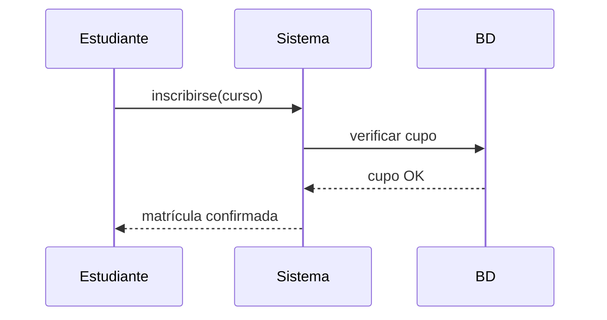
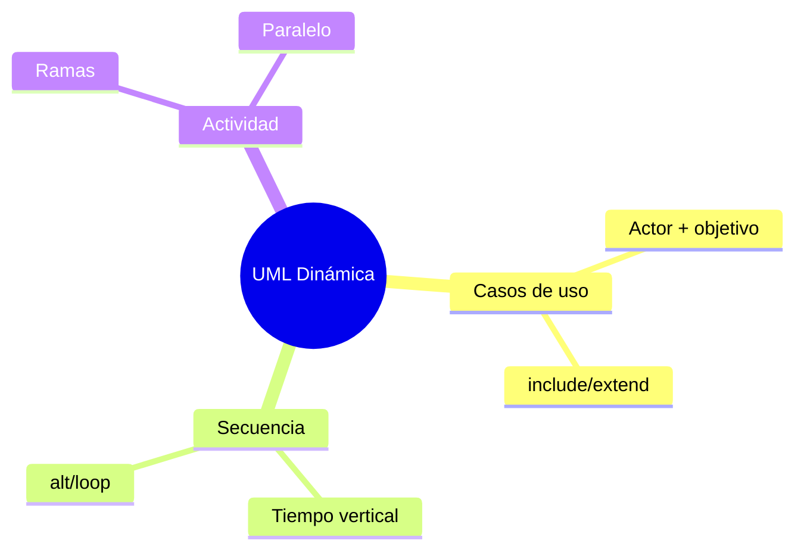

# 🎬 UML Comportamiento: Casos de Uso, Secuencia y Actividad

## 🎯 Introducción

> [!info] 💡 ¿Por Qué el Diagrama de Clases no Basta?
>
> Las clases muestran la **foto** (estructura); los diagramas de comportamiento muestran la **película** (qué pasa en el tiempo). Un sistema con clases perfectas pero sin flujos definidos falla en la primera historia de usuario.
>
> **Analogía del mundo real:** Piensa en una receta:
>
> - **Clases** → Ingredientes en la despensa (qué hay)
> - **Casos de uso** → Platos del menú (qué quiere el cliente)
> - **Secuencia** → Paso a paso con tiempos (quién hace qué y cuándo)
> - **Actividad** → Diagrama de flujo de la cocina (decisiones y paralelos)
>
> | Diagrama | Pregunta que responde | Cuándo dibujarlo |
> |---|---|---|
> | **Casos de uso** | ¿Qué quiere lograr cada actor? | Al inicio, con el cliente |
> | **Secuencia** | ¿Quién llama a quién y en qué orden? | Antes de codear un flujo clave |
> | **Actividad** | ¿Qué decisiones y caminos hay? | Procesos con ramas/paralelo |

---

## 🧵 Los Tres Diagramas (Stevens caps. 7-11)

### 🎭 1. Casos de Uso: el Menú del Sistema

> [!note] 🎨 Actor + Objetivo, Nada Más
>
> Reglas de 1 minuto:
> - Actor = rol externo (Estudiante, Docente, SistemaPagos), no persona concreta
> - Caso = objetivo con valor ("Inscribirse", no "Clic en botón")
> - <<include>> = siempre incluido (Validar identidad)
> - <<extend>> = opcional/extensión (Aplicar descuento)
>
> | Bien | Mal | Por qué |
> |---|---|---|
> | `Inscribirse a curso` | `Ingresar carnet` | El segundo es un paso, no un objetivo |
> | `Generar reporte` | `Conectarse a BD` | El segundo es interno, invisible al actor |
>
> **Test:** si el actor no lo pediría en voz alta, no es caso de uso.

### 🎭 2. Secuencia: Quién Llama a Quién

> [!example] 🧪 Leer de Arriba Abajo
>
> - Eje vertical = tiempo (arriba primero)
> - Flecha sólida = llamada; punteada = retorno
> - Cuadro "alt" = decisión; "loop" = repetición
> - La vida del objeto (línea) nace y muere: crea tarde, destruye pronto
>
> **Mapeo directo a código:** cada flecha entre objetos será una llamada a método. Si tu secuencia tiene 20 flechas cruzadas, tu diseño grita "acoplamiento alto" (ver Unidad 1).

### 🎭 3. Actividad: el Flujo con Decisiones

> [!example] 🧪 Cuándo Preferirla
>
> Úsala cuando hay ramas (si/no), paralelos (fork/join) o varios actores.
> Ejemplo: matrícula con validación de cupo + pago en paralelo.

---

## ⚠️ Problemas Comunes y Soluciones

> [!danger] ❌ Error: Casos de Uso a Nivel de Botón
>
> **Síntomas:** 30 óvalos (`Clic guardar`, `Abrir ventana`...); el diagrama es un manual, no un menú.
>
> **Solución:**
>
> - Fusiona pasos en objetivos: 5-9 casos por sistema de curso
> - El detalle va en la especificación textual o en secuencia, no en óvalos

---

## 🎯 Mejores Prácticas

> [!tip] 🏆 Checklist de Comportamiento
>
> **1. Un flujo clave con secuencia antes de codear**
>
> El flujo "inscribirse" dibujado evita 3 bugs de orden por sprint.
>
> **2. Nombres de mensajes = métodos futuros**
>
> verificarCupo(), no "chequear cosa". El diagrama se vuelve código.
>
> **3. Actividad solo donde hay ramas**
>
> Flujo lineal simple: no necesita diagrama, una lista basta.

---

## 📊 Resumen Visual

> [!success] 🔍 Comparación Final
>
> | Aspecto | Solo Clases | Clases + Comportamiento |
> |---|---|---|
> | **Flujos** | ❌ Imaginados | ✅ Dibujados y revisables |
> | **Bugs de orden** | Aparecen en QA | Se ven en el diagrama |
> | **Uso Recomendado** | Insuficiente solo | ✅ **Pack completo de diseño** |

---

## 🚀 Próximos Pasos

> [!quote] 🌟 Continuando
>
> **Has aprendido:**
>
> ✅ Casos de uso a nivel objetivo
> ✅ Secuencia como futuro código
> ✅ Actividad para ramas y paralelos
>
> **Próximo tema Unidad 3:**
>
> | Tema | Qué verás | Por qué importa |
> |---|---|---|
> | **Patrones de diseño** | Soluciones probadas con Shalloway | Dejas de reinventar la rueda |

---

## 🔗 Seguir estudiando

> [!info] 📚 Seguir estudiando
>
> - Mapa de contenido: [[Diseño de Software]]
> - Índice Unidad 2: [[00 - Índice Unidad 2]]
> - Anterior: [[03 - UML clases, objetos y relaciones]]
> - Syllabus: [[Bienvenida y Syllabus Diseño de Software]]

## 📚 Referencias

> [!quote] 📖 Fuentes
>
> - P. Stevens, R. Pooley, *Using UML*, 2nd ed., caps. 7-11 (casos de uso, secuencia, actividad).
> - Sílabo CCPG1042, Unidad 2: diseño orientado a objetos (7h).

---

**Tags:** #CCPG1042 #unidad2 #uml #secuencia #diseno-software
