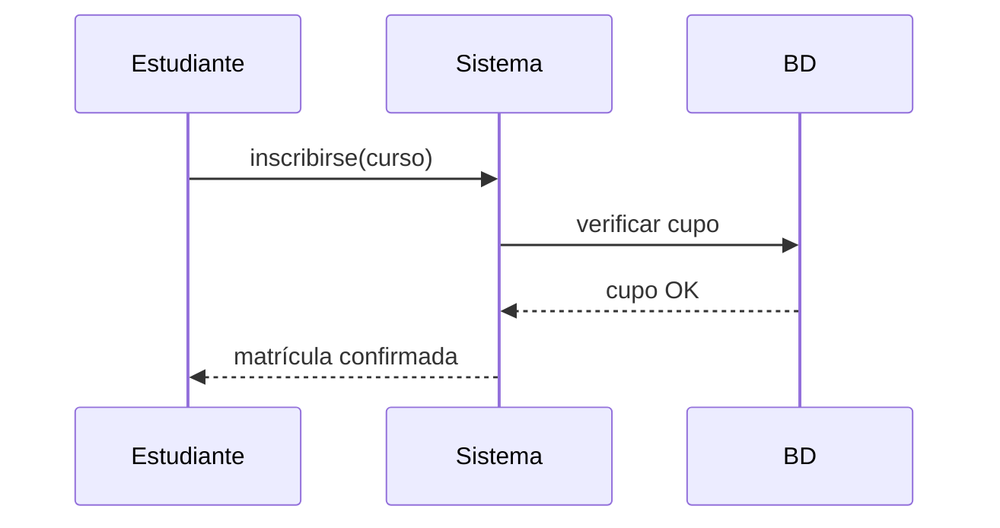
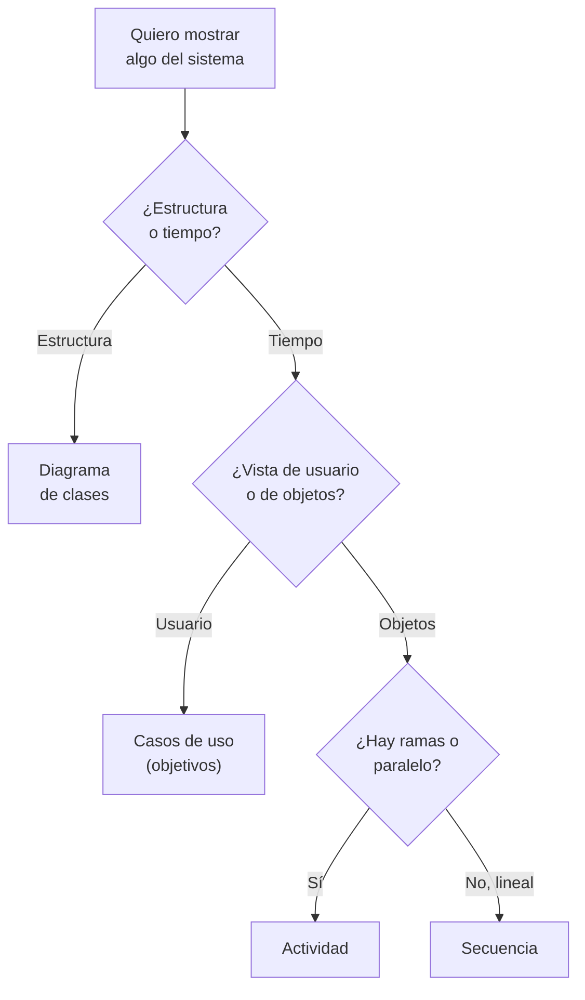
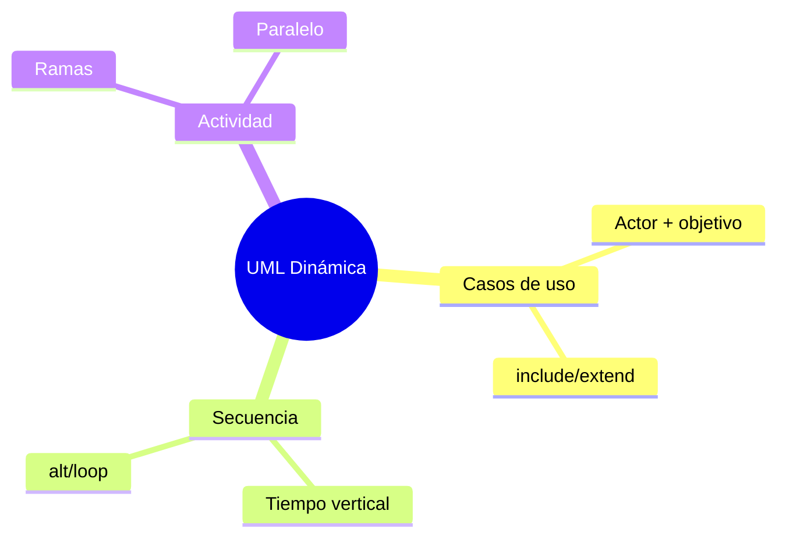

# 🎬 UML Comportamiento: Casos de Uso, Secuencia y Actividad

## 🎯 Introducción

> [!info] 💡 ¿Por Qué el Diagrama de Clases no Basta?
>
> Las clases muestran la **foto** (estructura); los diagramas de comportamiento muestran la **película** (qué pasa en el tiempo). Un sistema con clases perfectas pero sin flujos definidos falla en la primera historia de usuario — y el docente lo evalúa en S4-S5 tal cual.
>
> **Importancia histórica:** los casos de uso nacieron con Ivar Jacobson (uno de "los tres amigos" de UML) para capturar requisitos desde la perspectiva del usuario, no del programador. Los diagramas de secuencia vienen del mundo de telecomunicaciones (diagramas de traza de mensajes).
>
> **Relevancia actual:** historias de usuario ágiles, contratos de API y pruebas de aceptación viven de estos diagramas, aunque se dibujen en pizarras y no en herramientas formales.
>
> **Analogía del mundo real:** piensa en una receta:
>
> - **Clases** → Ingredientes en la despensa (qué hay).
> - **Casos de uso** → Platos del menú (qué quiere el cliente).
> - **Secuencia** → Paso a paso con tiempos (quién hace qué y cuándo).
> - **Actividad** → Diagrama de flujo de la cocina (decisiones y paralelos).
>
> | Diagrama | Pregunta que responde | Cuándo dibujarlo |
> |---|---|---|
> | **Casos de uso** | ¿Qué quiere lograr cada actor? | Al inicio, con el cliente |
> | **Secuencia** | ¿Quién llama a quién y en qué orden? | Antes de codear un flujo clave |
> | **Actividad** | ¿Qué decisiones y caminos hay? | Procesos con ramas/paralelo |

---

## 🧵 Los Tres Diagramas (Stevens caps. 7-11)

### 🎭 1. Casos de Uso: el Menú del Sistema

> [!note] 📋 Definición — Actor + Objetivo, Nada Más
>
> - **Actor** = rol externo (Estudiante, Docente, SistemaPagos), no persona concreta.
> - **Caso** = objetivo con valor ("Inscribirse", no "Clic en botón").
> - **<<include>>** = siempre incluido (Validar identidad).
> - **<<extend>>** = opcional/extensión (Aplicar descuento).
>
> | Bien | Mal | Por qué |
> |---|---|---|
> | `Inscribirse a curso` | `Ingresar carnet` | El segundo es un paso, no un objetivo |
> | `Generar reporte` | `Conectarse a BD` | El segundo es interno, invisible al actor |
>
> **Test:** si el actor no lo pediría en voz alta, no es caso de uso.

### 🎭 2. Secuencia: Quién Llama a Quién

> [!example] 🧪 Leer de Arriba Abajo
>
> - Eje vertical = tiempo (arriba primero).
> - Flecha sólida = llamada; punteada = retorno.
> - Cuadro `alt` = decisión; `loop` = repetición.
> - La vida del objeto (línea) nace y muere: crea tarde, destruye pronto.
>
> **Mapeo directo a código:** cada flecha entre objetos será una llamada a método. Si tu secuencia tiene 20 flechas cruzadas, tu diseño grita "acoplamiento alto" (ver U1-02).

### 🎭 3. Actividad: el Flujo con Decisiones

> [!example] 🧪 Cuándo Preferirla
>
> Úsala cuando hay ramas (si/no), paralelos (fork/join) o varios actores. Ejemplo: matrícula con validación de cupo + pago en paralelo.
>
> **Regla:** flujo lineal simple no necesita diagrama — una lista basta.

---

## 🗺️ Diagrama de Decisión: ¿Qué Diagrama Dibujo?

> [!tip] 💡 Lectura del diagrama
>
> La mayoría de los flujos de tu proyecto caen en secuencia; reserva actividad para los procesos con decisiones reales.

---

## ⚠️ Problemas Comunes y Soluciones

> [!danger] ❌ Error 1: Casos de Uso a Nivel de Botón (viola **objetivo con valor**)
>
> **Síntomas:** 30 óvalos (`Clic guardar`, `Abrir ventana`...) donde deberían ir 6 objetivos; el diagrama es un manual, no un menú.
>
> **Solución:**
>
> - Fusiona pasos en objetivos: 5-9 casos por sistema de curso.
> - El detalle va en la especificación textual o en secuencia, no en óvalos.

> [!danger] ❌ Error 2: Secuencia que Nadie Puede Seguir (viola **un escenario por diagrama**)
>
> **Síntomas:** 20 flechas cruzadas, vidas de objeto eternas, sin `alt`/`loop` donde hay ramas.
>
> **Solución:** parte el flujo por escenario (feliz vs error); cada diagrama, un escenario con sus ramas marcadas.

> [!danger] ❌ Error 3: Actividad para Todo, Incluso lo Lineal (viola **diagrama según decisión**)
>
> **Síntomas:** diagramas de actividad para flujos de 3 pasos sin decisiones.
>
> **Solución:** si no hay ramas ni paralelos, una lista numerada comunica mejor y más rápido.

---

## 🎯 Mejores Prácticas

> [!tip] 🏆 Checklist de Comportamiento
>
> **1. Un flujo clave con secuencia antes de codear**
>
> El flujo "inscribirse" dibujado evita 3 bugs de orden por sprint.
>
> **2. Nombres de mensajes = métodos futuros**
>
> `verificarCupo()`, no "chequear cosa". El diagrama se vuelve código.
>
> **3. Actores reales, no roles inventados**
>
> Si ningún humano o sistema externo lo pide, no es caso de uso.
>
> **4. 5-9 casos por sistema de curso**
>
> Más = estás dibujando pasos; agrupa en objetivos.

---

## 📝 Ejercicios Propuestos

> [!example] 📋 Nivel 1 — Básico
>
> **1.** Define actor y caso de uso, y explica por qué "Ingresar carnet" no es un caso de uso.
>
> **2.** ¿Qué significan `<<include>>` y `<<extend>>`? Da un ejemplo de cada uno en un sistema de matrícula.
>
> **3.** Lee el diagrama de secuencia de la intro: ¿en qué orden ocurren las 4 llamadas?
>
> **4.** ¿Cuándo prefieres actividad sobre secuencia?
>
> **5.** Dibuja un `alt` y un `loop` mínimos y explica qué representa cada uno.
>
> > [!success]- ✅ Respuestas — Nivel 1
> >
> > - **1.** Actor = rol externo; caso = objetivo con valor. "Ingresar carnet" es un paso interno, ningún actor lo pediría como objetivo.
> > - **2.** Include: siempre incluido (Validar identidad). Extend: opcional (Aplicar descuento).
> > - **3.** inscribirse → verificar cupo → cupo OK → matrícula confirmada (de arriba abajo).
> > - **4.** Cuando hay ramas (si/no) o paralelos; lo lineal simple va en lista o secuencia.
> > - **5.** `alt`: ramas excluyentes (cupo sí/no). `loop`: repetición (reintentar pago 3 veces).

> [!example] 📋 Nivel 2 — Intermedio
>
> **6.** Escribe 5 casos de uso a nivel objetivo para un sistema de biblioteca (nada a nivel botón).
>
> **7.** Dibuja la secuencia de "devolver libro con multa": actores, llamadas, retornos y un `alt` (con/sin multa).
>
> **8.** Un flujo tiene validación de cupo Y pago en paralelo. ¿Secuencia o actividad? Justifica y dibújalo.
>
> **9.** Convierte tu diagrama de clases de la nota anterior (Biblioteca) en 3 casos de uso que lo usen.
>
> **10.** Detecta el error: un diagrama con 25 óvalos que incluyen "Abrir ventana" y "Guardar en BD".
>
> > [!success]- ✅ Respuestas — Nivel 2
> >
> > - **6.** Ej.: Buscar catálogo, Prestar libro, Devolver libro, Reservar ejemplar, Pagar multa.
> > - **7.** Lector→Sistema: devolver; Sistema→BD: buscar préstamo; alt con multa (calcular+cobrar) / sin multa (cerrar); retorno confirmación.
> > - **8.** Actividad: hay paralelo real (fork cupo/pago, join al confirmar). Secuencia forzaría un orden falso.
> > - **9.** Respuesta libre guiada: cada caso usa 2-3 clases del diagrama anterior como participantes.
> > - **10.** Casos a nivel botón/paso interno: fusionar en 5-7 objetivos ("Gestionar préstamo" absorbe abrir/guardar).

> [!example] 📋 Nivel 3 — Avanzado
>
> **11.** Diseña casos + secuencia + actividad coherentes para "inscripción con lista de espera": los 3 diagramas deben contar la misma historia.
>
> **12.** Argumenta dónde pondrías la validación "cupo > 0": ¿en secuencia (flujo), en actividad (regla) o en clases (invariante)? ¿Por qué?
>
> **13.** Un flujo crítico tiene 30 flechas en secuencia. Aplica la regla de partición por escenario y explica qué ganas y qué pierdes.
>
> **14.** Compara `alt`/`loop` de secuencia con rombos de actividad: ¿cuándo la misma rama se modela mejor en cada uno?
>
> **15.** Diseña los 3 diagramas de tu proyecto de curso para su flujo principal (5-9 casos, 1 secuencia del flujo feliz + 1 de error, actividad solo si hay ramas).
>
> > [!success]- ✅ Respuestas — Nivel 3
> >
> > - **11.** Casos: Inscribirse, Entrar en lista de espera, Notificar cupo. Secuencia por escenario. Actividad con fork validación/pago si aplica.
> > - **12.** En clases como invariante si es regla permanente del dominio; en flujo si es política temporal. Lo permanente va a estructura.
> > - **13.** Ganas legibilidad por escenario y revisiones focalizadas; pierdes la vista completa (compénsalo con el diagrama de actividad general).
> > - **14.** En secuencia cuando importa QUIÉN decide y el orden de mensajes; en actividad cuando importan los caminos y paralelos sin importar tanto el quién.
> > - **15.** Autocorrección con el checklist de esta nota + diagrama de decisión.

---

## 📋 Resumen Ejecutivo

> [!summary] 📋 Lo Esencial
>
> - **Casos de uso** = menú de objetivos del actor (5-9 por sistema, nada a nivel botón).
> - **Secuencia** = quién llama a quién en orden (1 escenario por diagrama, `alt`/`loop` marcados).
> - **Actividad** = solo con ramas o paralelos reales; lo lineal va en lista.
> - Cada flecha de secuencia será **una llamada a método**: diseñas código al dibujar.

---

## ✅ Metas de Aprendizaje

> [!note] 🎯 Nivel Básico
> - [ ] Defino actor y caso de uso y distingo objetivos de pasos.
> - [ ] Leo una secuencia de arriba abajo con `alt` y `loop`.
> - [ ] Decido con el diagrama qué dibujar en cada situación.

> [!note] 🎯 Nivel Intermedio
> - [ ] Escribo 5-9 casos a nivel objetivo para un dominio nuevo.
> - [ ] Dibujo secuencias por escenario (feliz + error).
> - [ ] Uso actividad solo donde hay ramas o paralelo real.

> [!note] 🎯 Nivel Avanzado
> - [ ] Mantengo coherentes clases + casos + secuencias del mismo sistema.
> - [ ] Particiono secuencias gigantes por escenario con criterio.
> - [ ] Diseño los 3 diagramas del flujo principal de mi proyecto.

---

## 📊 Resumen Visual

> [!success] 🔍 Comparación Final
>
> | Aspecto | Solo Clases | Clases + Comportamiento |
> |---|---|---|
> | **Flujos** | ❌ Imaginados | ✅ Dibujados y revisables |
> | **Bugs de orden** | Aparecen en QA | Se ven en el diagrama |
> | **Decisión** | Adivinada | Con diagrama propio |
> | **Uso Recomendado** | Insuficiente solo | ✅ **Pack completo de diseño** |

---

## 🚀 Próximos Pasos

> [!quote] 🌟 Continuando
>
> **Has aprendido:**
>
> ✅ Casos a nivel objetivo + diagrama de decisión propio
> ✅ Secuencia como futuro código + partición por escenario
> ✅ Actividad solo con ramas + 3 errores numerados
>
> **Próximo tema Unidad 3:**
>
> | Tema | Qué verás | Por qué importa |
> |---|---|---|
> | **Patrones de diseño** | Soluciones probadas con Shalloway | Dejas de reinventar la rueda |

---

## 🔗 Seguir estudiando

> [!info] 📚 Seguir estudiando
>
> - Mapa de contenido: [[Diseño de Software]]
> - Índice Unidad 2: [[00 - Índice Unidad 2]]
> - Anterior: [[03 - UML clases, objetos y relaciones]]
> - Syllabus: [[Bienvenida y Syllabus Diseño de Software]]

## 📚 Referencias

> [!quote] 📖 Fuentes
>
> - P. Stevens, R. Pooley, *Using UML*, 2nd ed., caps. 7-11 (casos de uso, secuencia, actividad).
> - I. Jacobson — casos de uso (origen con "los tres amigos" de UML).
> - Sílabo CCPG1042, Unidad 2: diseño orientado a objetos (7h).

---

**Tags:** #CCPG1042 #unidad2 #uml #secuencia #diseno-software
