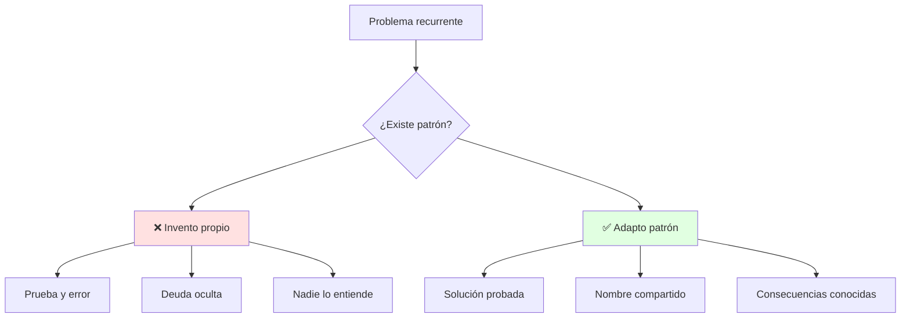
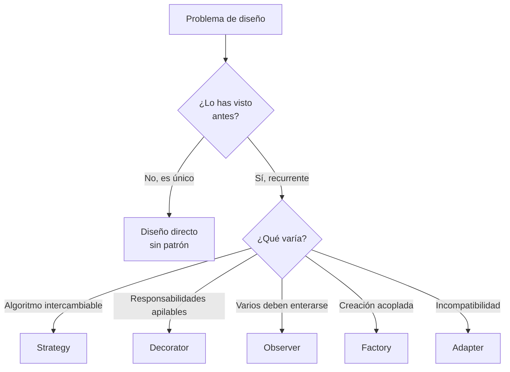
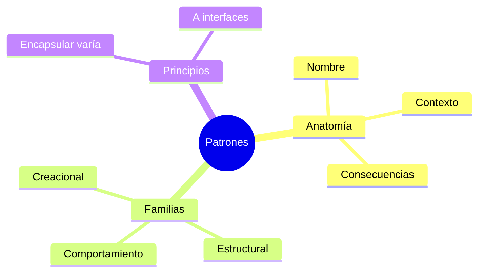

# 🧬 Qué es un Patrón y Encapsular lo que Varía

## 🎯 Introducción

> [!info] 💡 ¿Por Qué los Expertos Diseñan Parecido sin Copiarse?
>
> Un **patrón de diseño** es una solución probada a un problema recurrente, con nombre, contexto y consecuencias. No es código copiable: es una *idea* que adaptas. Shalloway lo resume: el verdadero poder de los objetos no es la herencia, es **encapsular comportamientos**.
>
> **Importancia histórica:** Christopher Alexander documentó patrones primero en arquitectura civil (*A Pattern Language*, 1977): soluciones a problemas de diseño de espacios que se repetían. La pandilla de los cuatro (Gamma, Helm, Johnson, Vlissides) importó la idea al software en 1994 con *Design Patterns* — 23 patrones que hoy son vocabulario estándar en cualquier entrevista técnica seria.
>
> **Relevancia actual:** decir "usé un Observer" comunica 3 clases en 1 palabra. No saber patrones te deja reinventando soluciones que otros ya probaron (y ya les dolieron).
>
> **Analogía del mundo real:** piensa en recetas de cocina:
>
> - **Sin patrón** → Cada cocinero inventa cómo freír un huevo (algunos lo queman).
> - **Con patrón** → "Salteado": técnica con nombre, pasos y casos donde funciona.
> - **Adaptar, no copiar** → Ajustas tiempos a tu cocina, como ajustas el patrón a tu dominio.
>
> | Razón | Reinventar | Usar Patrones |
> |---|---|---|
> | **Calidad** | Descubres los errores en producción | Errores ya descubiertos por otros |
> | **Comunicación** | Explicas 5 clases una por una | Nombra el patrón y listo |
> | **Flexibilidad** | Cambios rompen todo | Lo que varía está encapsulado |
> | **Aprendizaje** | Años de cicatrices | Cicatrices ajenas, gratis |



---

## 🧵 Anatomía de un Patrón y sus Familias

### 🎭 Nombre, Problema, Solución, Consecuencias

> [!note] 📋 Definición — Qué Trae Todo Patrón (GoF)
>
> 1. **Nombre:** vocabulario (Strategy, Observer...) — lo que dices en el daily.
> 2. **Problema + contexto:** ¿cuándo aplica y cuándo NO?
> 3. **Solución:** estructura (diagrama) + roles de cada clase.
> 4. **Consecuencias:** qué ganas y qué precio pagas (complejidad, clases extra).
>
> | Familia | Responde a | Ejemplos de este curso |
> |---|---|---|
> | **Creacionales** | ¿Quién crea los objetos? | Factory, Singleton |
> | **Estructurales** | ¿Cómo se componen? | Adapter, Decorator, Facade, Composite |
> | **Comportamiento** | ¿Cómo interactúan? | Strategy, Observer, Template Method |

### 🔍 Los Dos Principios que lo Explican Todo (Shalloway)

> [!example] 🧪 Encapsula lo que Varía + Diseña a Interfaces
>
> **Principio 1 — Encapsula lo que varía:** si algo cambia (algoritmo, formato, tarifa), mételo en su propia clase detrás de una interfaz.
>
> **Principio 2 — Diseña a interfaces, no a implementaciones:** el cliente conoce el contrato, nunca la clase concreta.
>
> ```java
> // ❌ SIN PATRÓN: el cambio rompe todo (if por cada tipo)
> class Calculadora {
>     double enviar(String tipo, double monto) {
>         if (tipo.equals("email")) { /* ... */ }
>         else if (tipo.equals("sms")) { /* ... */ }
>         else if (tipo.equals("push")) { /* ... */ } // cada canal nuevo = editar aquí
>         return 0;
>     }
> }
>
> // ✅ CON PRINCIPIO: lo que varía (canal) vive en su clase
> interface Canal { void enviar(String msg); }
> class Notificador {
>     private Canal canal; // programado a interfaz
>     Notificador(Canal c) { this.canal = c; }
>     void notificar(String msg) { canal.enviar(msg); }
> }
> // Nuevo canal = nueva clase, cero edición (abierto/cerrado)
> ```
>
> **Ese ejemplo ya es medio Strategy:** el resto de la unidad le pone nombre a cada variante.

---

## 🗺️ Diagrama de Decisión: ¿Necesito un Patrón?



> [!tip] 💡 Lectura del diagrama
>
> Si no sabes qué varía, aún no necesitas el patrón — necesitas entender mejor el problema (ver Unidad 4: refactoriza al doler).

---

## ⚠️ Problemas Comunes y Soluciones

> [!danger] ❌ Error 1: Patternitis, Patrón para Todo (viola **YAGNI/patrón con dolor real**)
>
> **Síntomas:** Singleton para cada clase, Factory de Factories; el proyecto simple parece framework:
>
> ```java
> // ❌ EL ERROR ESTÁ AQUÍ: patrón sin variación que lo pida
> interface SumadorUnico { int sumar(int a, int b); } // 1 sola implementación posible
> class SumadorConcreto implements SumadorUnico {
>     public int sumar(int a, int b) { return a + b; }
> }
> ```
>
> **Solución:**
>
> - Regla: sin variación real, sin patrón (YAGNI).
> - Primero código simple + tests; el patrón llega cuando duele (ver Unidad 4).

> [!danger] ❌ Error 2: Copiar el Patrón sin su Contexto (viola **problema + consecuencias**)
>
> **Síntomas:** aplican Observer donde bastaba una llamada directa; el "desacople" agrega 5 clases para un flujo lineal.
>
> **Solución:** lee siempre consecuencias antes de aplicar; si el costo supera al dolor actual, espera.

> [!danger] ❌ Error 3: Patrón sin Nombre Compartido (viola **vocabulario común**)
>
> **Síntomas:** implementan Strategy pero lo llaman `ManejadorCasos` — nadie reconoce el patrón en review.
>
> **Solución:** nombra con el patrón (`PagoTarjetaStrategy`); el nombre documenta la intención.

---

## 🎯 Mejores Prácticas

> [!tip] 🏆 Checklist de Patrones
>
> **1. Nombra el problema antes que el patrón**
>
> "Necesito intercambiar algoritmos" → Strategy. Nunca al revés.
>
> **2. Dibuja roles, no clases concretas**
>
> Contexto → Estrategia → Concretas. Si no encaja, no es ese patrón.
>
> **3. Anota consecuencias en el ADR**
>
> "+ flexible ante nuevos canales; − 3 clases más."
>
> **4. Un patrón por dolor real**
>
> Cada patrón de tu proyecto debe señalar el dolor que cura.

---

## 📝 Ejercicios Propuestos

> [!example] 📋 Nivel 1 — Básico
>
> **1.** Define patrón de diseño y nombra sus 4 partes (GoF).
>
> **2.** Clasifica en familia: Factory, Adapter, Strategy, Singleton, Observer.
>
> **3.** Explica con tus palabras "encapsula lo que varía" usando el ejemplo del Notificador.
>
> **4.** ¿Por qué un patrón no es código copiable?
>
> **5.** ¿Qué quiso decir Shalloway con que el poder de los objetos no es la herencia?
>
> > [!success]- ✅ Respuestas — Nivel 1
> >
> > - **1.** Solución probada a problema recurrente: nombre, problema+contexto, solución, consecuencias.
> > - **2.** Factory: creacional. Adapter: estructural. Strategy: comportamiento. Singleton: creacional. Observer: comportamiento.
> > - **3.** El canal cambia → vive en su clase tras `Canal`; agregar uno no edita `Notificador`.
> > - **4.** Porque es una idea adaptable a un contexto, no un fragmento portable.
> > - **5.** Que la flexibilidad real viene de componer comportamientos encapsulados (interfaces), no de heredar.

> [!example] 📋 Nivel 2 — Intermedio
>
> **6.** Tu módulo de envíos tiene `if` por cada transportadora (3 y creciendo). ¿Qué patrón aplica y cómo quedaría la estructura?
>
> **7.** Un reporte necesita título, tabla y gráfico opcionales en cualquier combinación. ¿Strategy o Decorator? Justifica.
>
> **8.** Explica Alexander→GoF en 3 líneas: ¿qué tomó prestado el software de la arquitectura civil?
>
> **9.** ¿Cuándo NO usar Observer aunque "haya varios interesados"? Da un caso concreto.
>
> **10.** Dibuja los roles de Strategy para "métodos de pago" sin escribir código.
>
> > [!success]- ✅ Respuestas — Nivel 2
> >
> > - **6.** Strategy: interfaz `Envío` + una clase por transportadora; el `if` desaparece del cliente.
> > - **7.** Decorator: combinaciones opcionales que se apilan (título+tabla, tabla+gráfico...); Strategy es para alternativas excluyentes.
> > - **8.** La idea de soluciones con nombre a problemas recurrentes, con contexto y consecuencias documentadas.
> > - **9.** Cuando los interesados son fijos y pocos (ej. 2 fijos): llamada directa es más simple que la infraestructura de suscripción.
> > - **10.** Contexto → Estrategia → Concretas (PagoTarjeta, PayPal...); el cliente solo conoce la interfaz.

> [!example] 📋 Nivel 3 — Avanzado
>
> **11.** Argumenta por qué "patrón sin variación real" es deuda y no diseño, usando YAGNI y costo de cambio.
>
> **12.** Diseña (prosa + roles) cómo combinarías Strategy + Factory en un sistema de descuentos por tipo de cliente.
>
> **13.** Un equipo discute si Decorator o herencia para 4 combinaciones de café. Resuélvelo con números (¿cuántas clases en cada opción?).
>
> **14.** ¿Cómo documentarías en un ADR la adopción de Observer (consecuencias incluidas)?
>
> **15.** Relaciona "encapsula lo que varía" con OCP (U1-04): ¿son el mismo principio con distinto nombre?
>
> > [!success]- ✅ Respuestas — Nivel 3
> >
> > - **11.** Agrega clases e indirección sin beneficio medible; cada cambio futuro paga ese costo. YAGNI: págalo cuando duela.
> > - **12.** Factory crea la Strategy según tipo de cliente; el cliente recibe interfaz lista. Roles: Creador, Estrategia, Concretas.
> > - **13.** Herencia: 2^4 = 16 clases potenciales; Decorator: 1 base + 4 decoradores combinables.
> > - **14.** Contexto, decisión, alternativas descartadas, consecuencias (+desacople, −N clases, orden de notificación no garantizado).
> > - **15.** Primo hermanos: OCP dice "extiende sin editar" y encapsular lo variable es cómo se logra en la práctica.

---

## 📋 Resumen Ejecutivo

> [!summary] 📋 Lo Esencial
>
> - Un **patrón** = nombre + problema + solución + consecuencias (Alexander 1977 → GoF 1994).
> - **Encapsula lo que varía** + diseña a **interfaces**: los 2 principios que explican casi todo.
> - Sin variación real no hay patrón (YAGNI); el nombre compartido es documentación.

---

## ✅ Metas de Aprendizaje

> [!note] 🎯 Nivel Básico
> - [ ] Defino patrón con sus 4 partes y clasifico por familia.
> - [ ] Explico los 2 principios de Shalloway con ejemplo.
> - [ ] Distingo adaptar un patrón de copiar código.

> [!note] 🎯 Nivel Intermedio
> - [ ] Elijo Strategy vs Decorator vs Observer según el dolor.
> - [ ] Dibujo roles antes de codear el patrón.
> - [ ] Documento consecuencias en un ADR.

> [!note] 🎯 Nivel Avanzado
> - [ ] Combino patrones (Factory+Strategy) con justificación.
> - [ ] Calculo el costo de herencia vs composición en casos reales.
> - [ ] Decido con YAGNI cuándo NO aplicar un patrón.

---

## 📊 Resumen Visual



> [!success] 🔍 Comparación Final
>
> | Aspecto | Improvisar | Patrón Adaptado |
> |---|---|---|
> | **Riesgo** | ❌ Desconocido | ✅ Documentado |
> | **Equipo** | Explicación larga | 1 nombre basta |
> | **Decisión** | Adivinada | Con diagrama propio |
> | **Uso Recomendado** | Problema único | ✅ **Problema recurrente** |

---

## 🚀 Próximos Pasos

> [!quote] 🌟 Continuando
>
> **Has aprendido:**
>
> ✅ Anatomía GoF + historia Alexander→1994
> ✅ Los 2 principios con código antes/después
> ✅ Diagrama de decisión propio + 3 errores numerados
>
> **Próximo tema:**
>
> | Tema | Qué verás | Por qué importa |
> |---|---|---|
> | **Patrones esenciales I** | Strategy, Decorator, Observer con Java | Los 3 que más verás en exámenes y proyecto |

---

## 🔗 Seguir estudiando

> [!info] 📚 Seguir estudiando
>
> - Mapa de contenido: [[Diseño de Software]]
> - Índice Unidad 3: [[00 - Índice Unidad 3]]
> - Siguiente: [[02 - Patrones esenciales I, Strategy Decorator Observer]]
> - Syllabus: [[Bienvenida y Syllabus Diseño de Software]]

## 📚 Referencias

> [!quote] 📖 Fuentes
>
> - A. Shalloway, J. Trott, *Design Patterns Explained*: principios y Strategy.
> - E. Gamma et al., *Design Patterns (GoF)*, 1994: catálogo y familias.
> - C. Alexander, *A Pattern Language*, 1977 — origen de la idea.
> - Sílabo CCPG1042, Unidad 3: patrones de diseño (7h).

---

**Tags:** #CCPG1042 #unidad3 #patrones #principios #diseno-software
