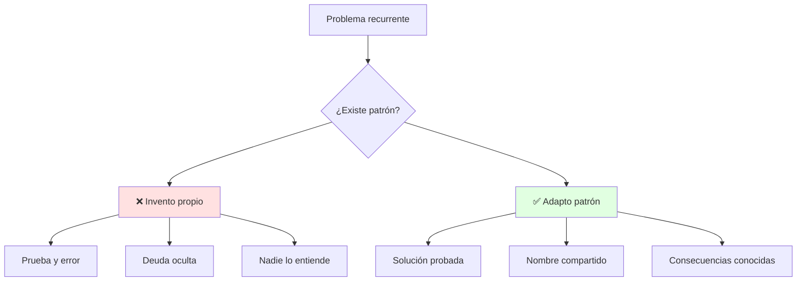
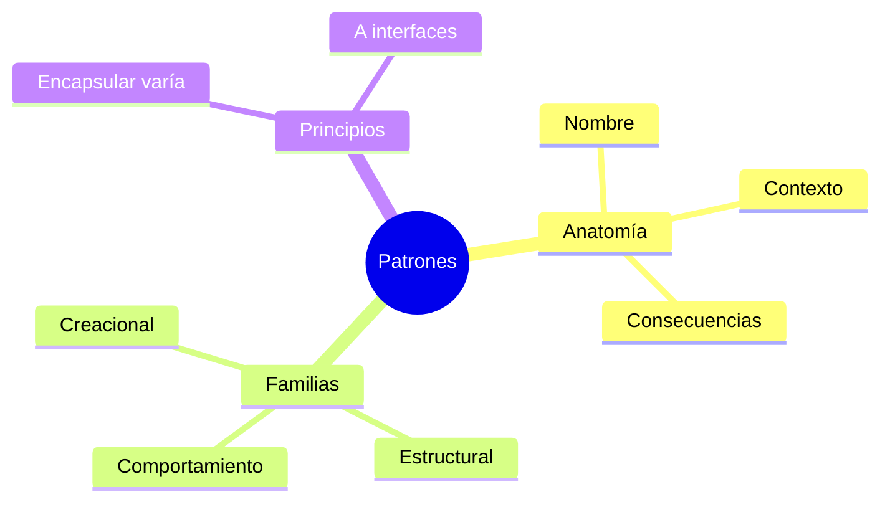

# 🧬 Qué es un Patrón y Encapsular lo que Varía

## 🎯 Introducción

> [!info] 💡 ¿Por Qué los Expertos Diseñan Parecido sin Copiarse?
>
> Un **patrón de diseño** es una solución probada a un problema recurrente, con nombre, contexto y consecuencias. No es código copiable: es una *idea* que adaptas. Shalloway lo resume: el verdadero poder de los objetos no es la herencia, es **encapsular comportamientos**.
>
> **Analogía del mundo real:** Piensa en recetas de cocina:
>
> - **Sin patrón** → Cada cocinero inventa cómo freír un huevo (algunos lo queman)
> - **Con patrón** → "Salteado": técnica con nombre, pasos y casos donde funciona
> - **Adaptar, no copiar** → Ajustas tiempos a tu cocina, como ajustas el patrón a tu dominio
> - **Vocabulario** → Dices "usé un Observer" y tu equipo entiende 3 clases de un golpe
>
> | Razón | Reinventar | Usar Patrones |
> |---|---|---|
> | **Calidad** | Descubres los errores en producción | Errores ya descubiertos por otros |
> | **Comunicación** | Explicas 5 clases una por una | Nombra el patrón y listo |
> | **Flexibilidad** | Cambios rompen todo | Lo que varía está encapsulado |
> | **Aprendizaje** | Años de cicatrices | Años de cicatrices ajenas, gratis |



---

## 🧵 Anatomía de un Patrón y sus Familias

### 🎭 Nombre, Problema, Solución, Consecuencias

> [!note] 🎨 Cómo Leer Cualquier Patrón (GoF)
>
> 1. Nombre: vocabulario (Strategy, Observer...)
> 2. Problema + contexto: ¿cuándo aplica y cuándo NO?
> 3. Solución: estructura (diagrama) + roles de cada clase
> 4. Consecuencias: qué ganas y qué precio pagas (complejidad, clases extra)
>
> **Las 3 familias GoF:**
>
> | Familia | Responde a | Ejemplos de este curso |
> |---|---|---|
> | **Creacionales** | ¿Quién crea los objetos? | Factory, Singleton |
> | **Estructurales** | ¿Cómo se componen? | Adapter, Decorator, Facade, Composite |
> | **Comportamiento** | ¿Cómo interactúan? | Strategy, Observer, Template Method |
>
> ```mermaid
> graph LR
>     P[Patrón] --> CR[Creacional]
>     P --> ES[Estructural]
>     P --> CO[Comportamiento]
>
>     style P fill:#e1f5ff
> ```

### 🔍 Los Dos Principios que lo Explican Todo (Shalloway)

> [!example] 🧪 Encapsula lo que Varía + Diseña a Interfaces
>
> **Principio 1 — Encapsula lo que varía:** si algo cambia (algoritmo, formato, tarifa), mételo en su propia clase detrás de una interfaz.
>
> **Principio 2 — Diseña a interfaces, no a implementaciones:** el cliente conoce el contrato, nunca la clase concreta.
>
> ```java
> // ❌ SIN PATRÓN: el cambio rompe todo (if por cada tipo)
> class Calculadora {
>     double enviar(String tipo, double monto) {
>         if (tipo.equals("email")) { /* ... */ }
>         else if (tipo.equals("sms")) { /* ... */ }
>         else if (tipo.equals("push")) { /* ... */ } // cada canal nuevo = editar aquí
>         return 0;
>     }
> }
>
> // ✅ CON PRINCIPIO: lo que varía (canal) vive en su clase
> interface Canal { void enviar(String msg); }
> class Notificador {
>     private Canal canal; // programado a interfaz
>     Notificador(Canal c) { this.canal = c; }
>     void notificar(String msg) { canal.enviar(msg); }
> }
> // Nuevo canal = nueva clase, cero edición (abierto/cerrado)
> ```
>
> **Ese ejemplo ya es medio Strategy:** el resto del curso le pone nombre a cada variante.

---

## ⚠️ Problemas Comunes y Soluciones

> [!danger] ❌ Error: Patternitis (Patrón para Todo)
>
> **Síntomas:** Singleton para cada clase, Factory de Factories; el proyecto simple parece framework.
>
> **Solución:**
>
> - Regla: sin variación real, sin patrón (YAGNI)
> - Primero código simple + tests; el patrón llega cuando duele (ver Unidad 4)

---

## 🎯 Mejores Prácticas

> [!tip] 🏆 Checklist de Patrones
>
> **1. Nombra el problema antes que el patrón**
>
> "Necesito intercambiar algoritmos" → Strategy. Nunca al revés.
>
> **2. Dibuja roles, no clases concretas**
>
> Contexto → Estrategia → Concretas. Si no encaja, no es ese patrón.
>
> **3. Anota consecuencias en el ADR**
>
> "+ flexible ante nuevos canales; − 3 clases más."

---

## 📊 Resumen Visual



> [!success] 🔍 Comparación Final
>
> | Aspecto | Improvisar | Patrón Adaptado |
> |---|---|---|
> | **Riesgo** | ❌ Desconocido | ✅ Documentado |
> | **Equipo** | Explicación larga | 1 nombre basta |
> | **Uso Recomendado** | Problema único real | ✅ **Problema recurrente** |

---

## 🚀 Próximos Pasos

> [!quote] 🌟 Continuando
>
> **Has aprendido:**
>
> ✅ Anatomía y familias GoF
> ✅ Los 2 principios de Shalloway con código
> ✅ Antídoto contra la patternitis
>
> **Próximo tema:**
>
> | Tema | Qué verás | Por qué importa |
> |---|---|---|
> | **Patrones esenciales I** | Strategy, Decorator, Observer con Java | Los 3 que más verás en exámenes y proyecto |

---

## 🔗 Seguir estudiando

> [!info] 📚 Seguir estudiando
>
> - Mapa de contenido: [[Diseño de Software]]
> - Índice Unidad 3: [[00 - Índice Unidad 3]]
> - Siguiente: [[02 - Patrones esenciales I, Strategy Decorator Observer]]
> - Syllabus: [[Bienvenida y Syllabus Diseño de Software]]

## 📚 Referencias

> [!quote] 📖 Fuentes
>
> - A. Shalloway, J. Trott, *Design Patterns Explained*, caps. de principios y Strategy.
> - E. Gamma et al., *Design Patterns (GoF)*: catálogo y familias.
> - Sílabo CCPG1042, Unidad 3: patrones de diseño (7h).

---

**Tags:** #CCPG1042 #unidad3 #patrones #principios #diseno-software
