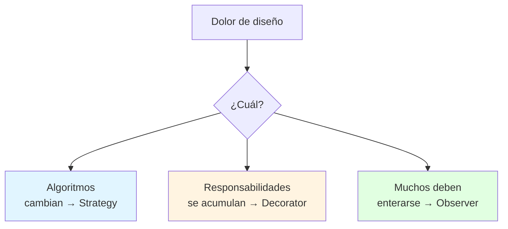
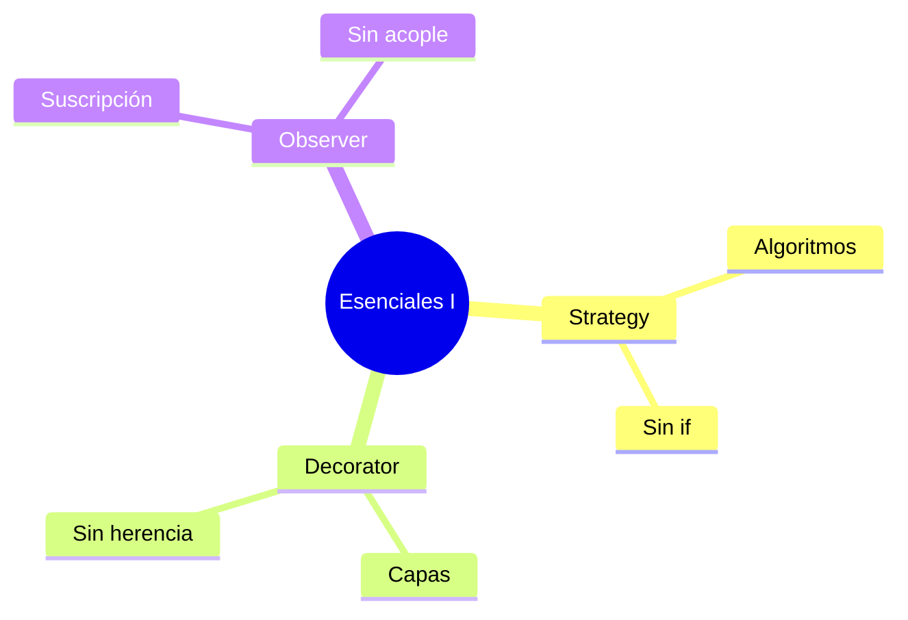

# 🎯 Patrones Esenciales I: Strategy, Decorator, Observer

## 🎯 Introducción

> [!info] 💡 ¿Por Qué Estos Tres Primero?
>
> **Strategy, Decorator y Observer** resuelven los 3 dolores más comunes: algoritmos que cambian, responsabilidades que se acumulan y objetos que deben enterarse de cambios sin acoplarse.
>
> **Analogía del mundo real:**
>
> - **Strategy** → Cambias la broca del taladro sin cambiar el taladro (algoritmo intercambiable)
> - **Decorator** → Vistes por capas según el clima sin cambiarte de cuerpo (responsabilidades apilables)
> - **Observer** → Grupo de WhatsApp: uno publica, todos los suscritos se enteran (sin que el autor los conozca uno a uno)
>
> | Patrón | Problema que mata | Idea en 1 línea |
> |---|---|---|
> | **Strategy** | `if/else` por cada variante | Encapsula cada algoritmo en su clase |
> | **Decorator** | Herencia explosiva (`CaféConLecheConAzúcar...`) | Envuelve y suma comportamiento |
> | **Observer** | Acoplamiento N-a-N manual | Sujeto notifica, observadores reaccionan |



---

## 🧵 Strategy: Intercambia el Cómo (Comportamiento)

### 🎭 Elimina el `if` de Variantes

> [!note] 🎨 Algoritmo como Objeto
>
> ```java
> // ✅ STRATEGY: cada algoritmo encapsulado + intercambiable
> interface EstrategiaPago { void pagar(double monto); }
>
> class PagoTarjeta implements EstrategiaPago {
>     public void pagar(double monto) { /* cargo a tarjeta */ }
> }
> class PagoPayPal implements EstrategiaPago {
>     public void pagar(double monto) { /* cargo a PayPal */ }
> }
>
> class Caja {
>     private EstrategiaPago estrategia; // programado a interfaz
>     Caja(EstrategiaPago e) { this.estrategia = e; }
>     void cobrar(double monto) { estrategia.pagar(monto); }
> }
> // Nuevo medio = nueva clase. Caja jamás se edita.
> ```
>
> **Cuándo:** 2+ formas de hacer lo mismo (pagos, envíos, ordenamientos, tarifas).
> **Precio:** más clases pequeñas (vale la pena desde la 2da variante).

---

## 🧵 Decorator: Suma sin Heredar (Estructural)

### 🎭 Envuelve en Capas

> [!example] 🧪 Adiós a la Explosión de Subclases
>
> ```java
> // ✅ DECORATOR: agrega responsabilidad envolviendo
> interface Bebida { double costo(); }
> class Café implements Bebida {
>     public double costo() { return 2.0; }
> }
> abstract class Extra implements Bebida {
>     protected Bebida base;
>     Extra(Bebida b) { this.base = b; }
> }
> class ConLeche extends Extra {
>     ConLeche(Bebida b) { super(b); }
>     public double costo() { return base.costo() + 0.5; }
> }
> // Café + leche + canela = new ConCanela(new ConLeche(new Café()))
> // Sin crear CaféConLecheConCanela como clase.
> ```
>
> **Cuándo:** combinaciones de opcionales (filtros, permisos, formatos).
> **Precio:** muchos objetos pequeños; depurar exige seguir la cadena.

---

## 🧵 Observer: Entera sin Acoplar (Comportamiento)

### 🎭 Publica y Suscribe

> [!example] 🧪 El Sujeto no Conoce a sus Seguidores
>
> ```java
> // ✅ OBSERVER: sujeto notifica a interfaz, no a clases concretas
> interface Observador { void actualizar(String evento); }
>
> class SistemasNotas {
>     private List<Observador> subs = new ArrayList<>();
>     void suscribir(Observador o) { subs.add(o); }
>     void publicarNota(String n) {
>         for (Observador o : subs) o.actualizar(n); // 1 llamada, N enterados
>     }
> }
> ```
>
> **Cuándo:** dashboards, notificaciones, MVC (la vista observa al modelo).
> **Precio:** orden de notificación impredecible; fugas si no te desuscribes.

---

## ⚠️ Problemas Comunes y Soluciones

> [!danger] ❌ Error: Strategy de Una Sola Variante
>
> **Síntomas:** interfaz + 1 implementación; complejidad sin beneficio.
>
> **Solución:**
>
> - Aplica el patrón cuando aparece la 2da variante, no antes (YAGNI).
> - Con 1 variante, código directo + test. Refactoriza al doler (Unidad 4).

---

## 🎯 Mejores Prácticas

> [!tip] 🏆 Checklist I
>
> **1. Un patrón por dolor real**
>
> if/else de tipos → Strategy. Subclases explosivas → Decorator. Avisos manuales → Observer.
>
> **2. Nombra con el patrón en el código**
>
> PagoTarjetaStrategy, NotificadorObserver. El nombre documenta.
>
> **3. Dibuja roles en UML antes de codear**
>
> Contexto→Estrategia, Componente→Decorador, Sujeto→Observador.

---

## 📊 Resumen Visual



> [!success] 🔍 Comparación Final
>
> | Aspecto | Sin Patrón | Con Patrón I |
> |---|---|---|
> | **Variantes** | ❌ if grows | ✅ clases nuevas |
> | **Avisos** | Llamadas manuales | Publica/suscribe |
> | **Uso Recomendado** | Problema único | ✅ **Dolor recurrente** |

---

## 🚀 Próximos Pasos

> [!quote] 🌟 Continuando
>
> **Has aprendido:**
>
> ✅ Strategy, Decorator y Observer con Java
> ✅ Cuándo aplicarlos y qué cuestan
> ✅ Regla de la 2da variante
>
> **Próximo tema:**
>
> | Tema | Qué verás | Por qué importa |
> |---|---|---|
> | **Patrones esenciales II** | Factory, Adapter, Facade, Singleton, Template Method | Creación, compatibilidad y esqueletos |

---

## 🔗 Seguir estudiando

> [!info] 📚 Seguir estudiando
>
> - Mapa de contenido: [[Diseño de Software]]
> - Índice Unidad 3: [[00 - Índice Unidad 3]]
> - Anterior: [[01 - Qué es un patrón y encapsular lo que varía]]
> - Siguiente: [[03 - Patrones esenciales II, creación y estructura]]
> - Syllabus: [[Bienvenida y Syllabus Diseño de Software]]

## 📚 Referencias

> [!quote] 📖 Fuentes
>
> - A. Shalloway, J. Trott, *Design Patterns Explained*: Strategy, Decorator, Observer.
> - E. Gamma et al., *Design Patterns (GoF)*: catálogo comportamiento/estructural.
> - Sílabo CCPG1042, Unidad 3: patrones de diseño (7h).

---

**Tags:** #CCPG1042 #unidad3 #strategy #decorator #observer
