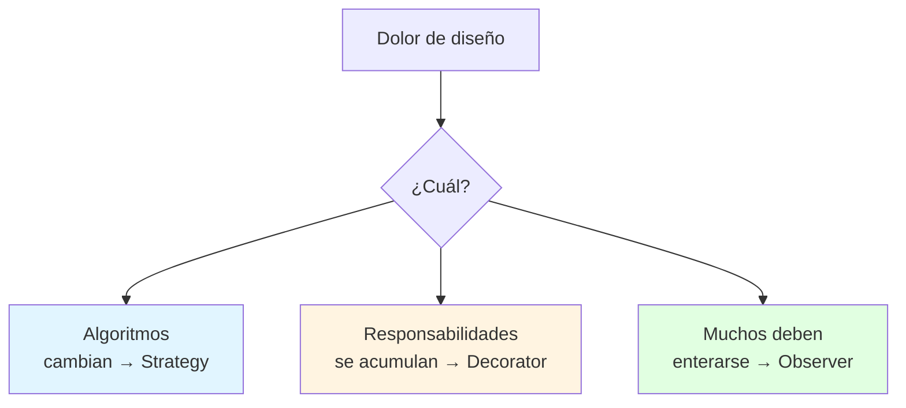
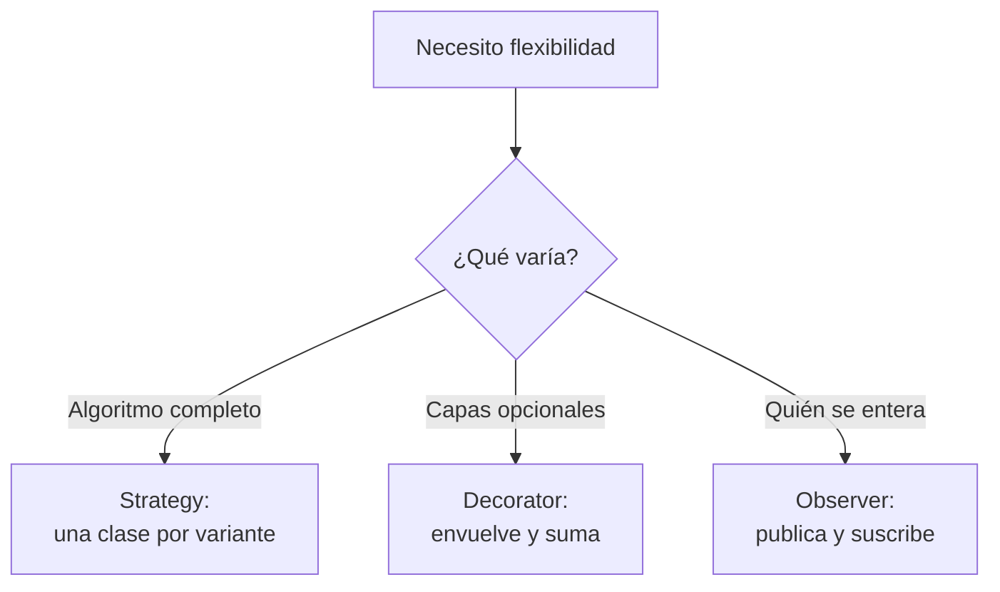
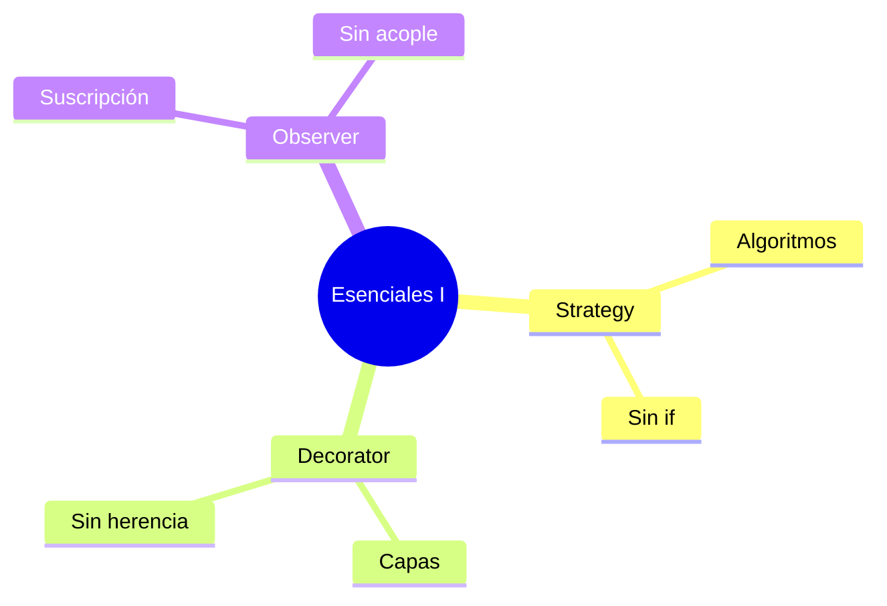

# 🎯 Patrones Esenciales I: Strategy, Decorator, Observer

## 🎯 Introducción

> [!info] 💡 ¿Por Qué Estos Tres Primero?
>
> **Strategy, Decorator y Observer** resuelven los 3 dolores más comunes del desarrollo OO: algoritmos que cambian, responsabilidades que se acumulan y objetos que deben enterarse de cambios sin acoplarse. El docente los evalúa en S6-S9 — y aparecen en casi todo proyecto real.
>
> **Importancia histórica:** Strategy y Observer están entre los 23 originales de GoF (1994); Decorator resolvió el problema clásico de la explosión de subclases en interfaces gráficas (ventanas con/sin scroll, con/sin borde...).
>
> **Relevancia actual:** pagos con múltiples medios, notificaciones push, dashboards en vivo — los tres patrones siguen vigentes tal cual.
>
> **Analogía del mundo real:**
>
> - **Strategy** → Cambias la broca del taladro sin cambiar el taladro.
> - **Decorator** → Vistes por capas según el clima sin cambiarte de cuerpo.
> - **Observer** → Grupo de WhatsApp: uno publica, todos los suscritos se enteran.
>
> | Patrón | Problema que mata | Idea en 1 línea |
> |---|---|---|
> | **Strategy** | `if/else` por cada variante | Encapsula cada algoritmo en su clase |
> | **Decorator** | Herencia explosiva | Envuelve y suma comportamiento |
> | **Observer** | Acoplamiento N-a-N manual | Sujeto notifica, observadores reaccionan |



---

## 🧵 Strategy: Intercambia el Cómo (Comportamiento)

### 🎭 Elimina el `if` de Variantes

> [!note] 📋 Definición — Algoritmo como Objeto
>
> Una familia de algoritmos encapsulada tras una interfaz común, intercambiable en tiempo de ejecución. El cliente programa contra la interfaz, nunca contra la variante.
>
> ```java
> // ✅ STRATEGY: cada algoritmo encapsulado + intercambiable
> interface EstrategiaPago { void pagar(double monto); }
>
> class PagoTarjeta implements EstrategiaPago {
>     public void pagar(double monto) { /* cargo a tarjeta */ }
> }
> class PagoPayPal implements EstrategiaPago {
>     public void pagar(double monto) { /* cargo a PayPal */ }
> }
>
> class Caja {
>     private EstrategiaPago estrategia; // programado a interfaz
>     Caja(EstrategiaPago e) { this.estrategia = e; }
>     void cobrar(double monto) { estrategia.pagar(monto); }
> }
> // Nuevo medio = nueva clase. Caja jamás se edita.
> ```
>
> **Cuándo:** 2+ formas de hacer lo mismo (pagos, envíos, ordenamientos, tarifas).
> **Precio:** más clases pequeñas (vale la pena desde la 2da variante).

---

## 🧵 Decorator: Suma sin Heredar (Estructural)

### 🎭 Envuelve en Capas

> [!note] 📋 Definición — Responsabilidades Apilables
>
> Envuelve un objeto con decoradores que agregan comportamiento, manteniendo la misma interfaz. Alternativa a la explosión de subclases.
>
> ```java
> // ✅ DECORATOR: agrega responsabilidad envolviendo
> interface Bebida { double costo(); }
> class Café implements Bebida {
>     public double costo() { return 2.0; }
> }
> abstract class Extra implements Bebida {
>     protected Bebida base;
>     Extra(Bebida b) { this.base = b; }
> }
> class ConLeche extends Extra {
>     ConLeche(Bebida b) { super(b); }
>     public double costo() { return base.costo() + 0.5; }
> }
> // Café + leche + canela = new ConCanela(new ConLeche(new Café()))
> // Sin crear CaféConLecheConCanela como clase.
> ```
>
> **Cuándo:** combinaciones de opcionales (filtros, permisos, formatos).
> **Precio:** muchos objetos pequeños; depurar exige seguir la cadena.

---

## 🧵 Observer: Entera sin Acoplar (Comportamiento)

### 🎭 Publica y Suscribe

> [!note] 📋 Definición — Sujeto y Observadores
>
> Un sujeto mantiene una lista de observadores y los notifica ante cambios, sin conocer sus clases concretas. Base del patrón Modelo-Vista y de los eventos en UI.
>
> ```java
> // ✅ OBSERVER: sujeto notifica a interfaz, no a clases concretas
> interface Observador { void actualizar(String evento); }
>
> class SistemasNotas {
>     private List<Observador> subs = new ArrayList<>();
>     void suscribir(Observador o) { subs.add(o); }
>     void publicarNota(String n) {
>         for (Observador o : subs) o.actualizar(n); // 1 llamada, N enterados
>     }
> }
> ```
>
> **Cuándo:** dashboards, notificaciones, MVC (la vista observa al modelo).
> **Precio:** orden de notificación impredecible; fugas si no te desuscribes.

---

## 🗺️ Diagrama de Decisión: ¿Cuál de los Tres?



> [!tip] 💡 Lectura del diagrama
>
> Si dudas entre Strategy y Decorator: ¿las opciones se excluyen (Strategy) o se combinan (Decorator)?

---

## ⚠️ Problemas Comunes y Soluciones

> [!danger] ❌ Error 1: Strategy de Una Sola Variante (viola **regla de la 2da variante**)
>
> **Síntomas:** interfaz + 1 implementación; complejidad sin beneficio:
>
> ```java
> // ❌ EL ERROR ESTÁ AQUÍ: Strategy con una sola estrategia posible
> interface FormatoUnico { String aplicar(String s); }
> class Mayusculas implements FormatoUnico {
>     public String aplicar(String s) { return s.toUpperCase(); } // única variante real
> }
> ```
>
> **Solución:**
>
> - Aplica el patrón cuando aparece la 2da variante, no antes (YAGNI).
> - Con 1 variante, código directo + test. Refactoriza al doler (Unidad 4).

> [!danger] ❌ Error 2: Observer sin Desuscripción (viola **ciclo de vida del observador**)
>
> **Síntomas:** vistas destruidas que siguen recibiendo eventos; fugas de memoria y callbacks fantasma.
>
> **Solución:** todo `suscribir` tiene su `desuscribir` parejo (en el teardown/destructor del observador).

> [!danger] ❌ Error 3: Decorator como Torre Inestable (viola **orden y transparencia**)
>
> **Síntomas:** 8 capas anidadas donde nadie sabe qué agrega cada una; el debug es seguir la cadena a mano.
>
> **Solución:** máximo 2-3 capas típicas; nombra cada decorador por lo que agrega (`ConDescuento`, no `Decorator2`).

---

## 🎯 Mejores Prácticas

> [!tip] 🏆 Checklist I
>
> **1. Un patrón por dolor real**
>
> `if/else` de tipos → Strategy. Subclases explosivas → Decorator. Avisos manuales → Observer.
>
> **2. Nombra con el patrón en el código**
>
> `PagoTarjetaStrategy`, `NotificadorObserver`. El nombre documenta.
>
> **3. Dibuja roles en UML antes de codear**
>
> Contexto→Estrategia, Componente→Decorador, Sujeto→Observador.
>
> **4. Revisa precio vs dolor**
>
> ¿Las clases extra cuestan menos que el `if` actual? Solo entonces.

---

## 📝 Ejercicios Propuestos

> [!example] 📋 Nivel 1 — Básico
>
> **1.** Define Strategy, Decorator y Observer en 1 línea cada uno.
>
> **2.** ¿Qué problema resuelve cada uno (variantes, combinaciones, avisos)?
>
> **3.** Explica el diagrama Contexto→Estrategia→Concretas con el ejemplo de pagos.
>
> **4.** ¿Por qué Decorator evita la explosión de subclases? Usa el café como ejemplo.
>
> **5.** ¿Qué significa que Observer desacopla al sujeto de sus observadores?
>
> > [!success]- ✅ Respuestas — Nivel 1
> >
> > - **1.** Strategy: algoritmos intercambiables tras interfaz. Decorator: suma comportamiento envolviendo. Observer: notifica suscriptores sin conocerlos.
> > - **2.** Strategy = alternativas excluyentes; Decorator = capas combinables; Observer = avisos 1-a-N.
> > - **3.** Caja conoce la interfaz; cada medio es una clase; agregar uno no toca Caja.
> > - **4.** 4 extras combinables serían 16 subclases; con Decorator son 1 base + 4 envoltorios.
> > - **5.** El sujeto solo conoce la interfaz `Observador`; agregar/quitar suscriptores no lo modifica.

> [!example] 📋 Nivel 2 — Intermedio
>
> **6.** Un sistema de tarifas tiene 3 tipos de cliente con descuentos distintos y llega un cuarto. Diseña con Strategy.
>
> **7.** Un editor aplica negrita, cursiva y subrayado en cualquier combinación. ¿Por qué Decorator y no herencia?
>
> **8.** Diseña un sistema de alertas (email + SMS + push) con Observer: sujeto, observadores y flujo.
>
> **9.** ¿Cuándo NO usar Observer aunque "haya varios interesados"? Da un caso concreto.
>
> **10.** Convierte un `switch` de 4 ramas de envío en Strategy paso a paso.
>
> > [!success]- ✅ Respuestas — Nivel 2
> >
> > - **6.** Interfaz `Tarifa` + 4 clases; el cliente recibe la tarifa inyectada.
> > - **7.** Herencia daría 2³ combinaciones; Decorator apila 3 envoltorios sobre texto base.
> > - **8.** Sujeto `Alarma` + observadores `Email/SMS/Push` suscritos; un evento los notifica a todos.
> > - **9.** Con 2 interesados fijos: llamada directa es más simple que la infraestructura de suscripción.
> > - **10.** Extrae cada rama a su clase `EnvíoX`, crea la interfaz común, el cliente recibe la estrategia.

> [!example] 📋 Nivel 3 — Avanzado
>
> **11.** Combina Observer + Strategy: un sistema donde cada suscriptor elige cómo formatear la notificación. Dibuja roles.
>
> **12.** Argumenta el costo de Decorator en debugging y propone 2 mitigaciones concretas.
>
> **13.** Un Observer notifica en orden impredecible y eso rompe una invariante. Propón 3 soluciones con sus costos.
>
> **14.** Refactoriza (prosa + firmas) un `GestorNotificaciones` con `if` por canal hacia Strategy + Factory.
>
> **15.** ¿Strategy viola OCP si hay que modificar el cliente para elegir estrategia? Responde con DIP.
>
> > [!success]- ✅ Respuestas — Nivel 3
> >
> > - **11.** Sujeto notifica `Evento`; cada Observer aplica su `FormatoStrategy` interno. Roles: Sujeto, Observador+Estrategia, Concretas.
> > - **12.** Costo: seguir la cadena a mano. Mitigaciones: nombres por aporte (`ConDescuento`), tope de 2-3 capas, tests por capa.
> > - **13.** Cola con prioridad, notificación secuencial documentada, o rediseñar para que el orden no importe (ideal).
> > - **14.** Extrae cada rama a clase `CanalX`, Factory crea según preferencia, cliente recibe `Canal` listo.
> > - **15.** No si la elección llega inyectada (DIP): el cliente no elige, recibe. Elegir dentro sí violaría OCP.

---

## 📋 Resumen Ejecutivo

> [!summary] 📋 Lo Esencial
>
> - **Strategy:** algoritmos intercambiables tras interfaz (desde la 2da variante).
> - **Decorator:** responsabilidades apilables sin herencia explosiva.
> - **Observer:** publica/suscribe con desuscripción pareja.
> - El diagrama de decisión evita aplicar el patrón equivocado.

---

## ✅ Metas de Aprendizaje

> [!note] 🎯 Nivel Básico
> - [ ] Defino los 3 patrones con su dolor correspondiente.
> - [ ] Explico el diagrama Contexto→Estrategia con ejemplo.
> - [ ] Distingo alternativas excluyentes (Strategy) de capas (Decorator).

> [!note] 🎯 Nivel Intermedio
> - [ ] Diseño Strategy/Decorator/Observer para casos nuevos.
> - [ ] Decido cuándo NO aplicar cada uno.
> - [ ] Dibujo roles UML antes de codear.

> [!note] 🎯 Nivel Avanzado
> - [ ] Combino patrones con justificación de costos.
> - [ ] Mitigo debugging de Decorator y orden de Observer.
> - [ ] Conecto Strategy con OCP/DIP correctamente.

---

## 📊 Resumen Visual



> [!success] 🔍 Comparación Final
>
> | Aspecto | Sin Patrón | Con Patrón I |
> |---|---|---|
> | **Variantes** | ❌ if grows | ✅ clases nuevas |
> | **Avisos** | Llamadas manuales | Publica/suscribe |
> | **Decisión** | Adivinada | Con diagrama propio |
> | **Uso Recomendado** | Problema único | ✅ **Dolor recurrente** |

---

## 🚀 Próximos Pasos

> [!quote] 🌟 Continuando
>
> **Has aprendido:**
>
> ✅ Strategy, Decorator y Observer con Java + historia GoF
> ✅ Cuándo aplicarlos (y cuándo NO) + 3 errores numerados
> ✅ Diagrama de decisión propio
>
> **Próximo tema:**
>
> | Tema | Qué verás | Por qué importa |
> |---|---|---|
> | **Patrones esenciales II** | Factory, Adapter, Facade, Singleton, Template Method | Creación, compatibilidad y esqueletos |

---

## 🔗 Seguir estudiando

> [!info] 📚 Seguir estudiando
>
> - Mapa de contenido: [[Diseño de Software]]
> - Índice Unidad 3: [[00 - Índice Unidad 3]]
> - Anterior: [[01 - Qué es un patrón y encapsular lo que varía]]
> - Siguiente: [[03 - Patrones esenciales II, creación y estructura]]
> - Syllabus: [[Bienvenida y Syllabus Diseño de Software]]

## 📚 Referencias

> [!quote] 📖 Fuentes
>
> - A. Shalloway, J. Trott, *Design Patterns Explained*: Strategy, Decorator, Observer.
> - E. Gamma et al., *Design Patterns (GoF)*, 1994: catálogo comportamiento/estructural.
> - Sílabo CCPG1042, Unidad 3: patrones de diseño (7h).

---

**Tags:** #CCPG1042 #unidad3 #strategy #decorator #observer #diseno-software
