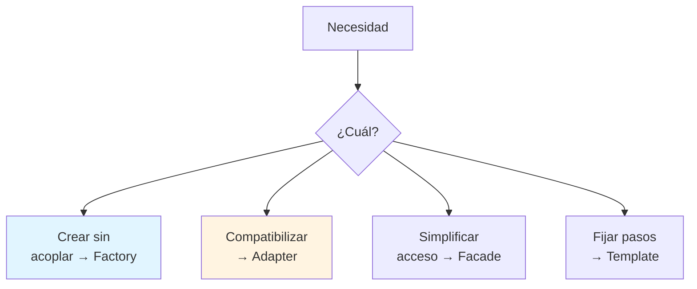
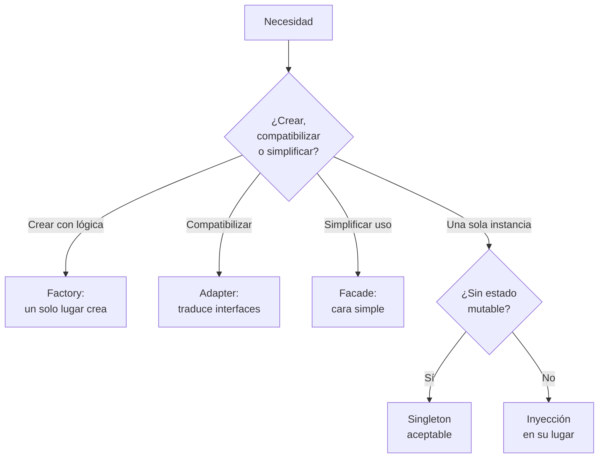
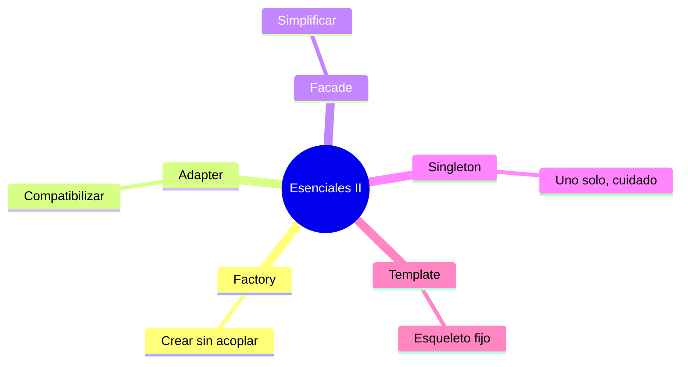

# 🏭 Patrones Esenciales II: Creación y Estructura

## 🎯 Introducción

> [!info] 💡 ¿Por Qué Crear Objetos También se Diseña?
>
> Los patrones **creacionales y estructurales** responden: ¿quién crea los objetos y cómo se ensamblan piezas incompatibles? `new` regado por todo el código es acoplamiento silencioso — y adaptar sin reescribir ahorra semanas.
>
> **Importancia histórica:** Factory y Singleton nacieron de la necesidad de controlar la creación en sistemas grandes (el `new` directo acopla al cliente con la clase concreta para siempre). Adapter viene del mundo del hardware (adaptadores físicos) aplicado a interfaces de software.
>
> **Relevancia actual:** inyección de dependencias, builders de configuración, adaptadores de APIs de terceros — todos los días usas estos patrones aunque no los nombres.
>
> **Analogía del mundo real:**
>
> - **Factory** → Concesionario: pides "un auto familiar" sin saber la fábrica exacta.
> - **Adapter** → Adaptador de enchufe: hace compatible lo incompatible sin cambiar nada.
> - **Facade** → Recepción del hotel: un punto simple ante 10 departamentos.
> - **Singleton** → Rector: solo puede haber uno (úsalo casi nunca).
> - **Template Method** → Receta base con pasos fijos y 1 paso "a tu gusto".
>
> | Patrón | Familia | 1 línea |
> |---|---|---|
> | **Factory Method** | Creacional | Delega la creación a subclases/método |
> | **Adapter** | Estructural | Traduce una interfaz a otra |
> | **Facade** | Estructural | Cara simple ante subsistema complejo |
> | **Singleton** | Creacional | Una sola instancia global ⚠️ |
> | **Template Method** | Comportamiento | Esqueleto fijo + pasos variables |



---

## 🧵 Factory, Adapter y Facade con Java

### 🎭 Crear, Traducir, Simplificar

> [!note] 📋 Definición — Los Tres con Código
>
> ```java
> // ✅ FACTORY: el cliente no hace 'new' de concretas
> interface Documento { void abrir(); }
> class Creador {
>     static Documento crear(String tipo) {
>         if (tipo.equals("pdf")) return new Pdf();
>         return new Word();
>     }
> }
>
> // ✅ ADAPTER: hace compatible sin tocar al adaptado
> class EnchufeUSA { void conectarPlano() {} }
> interface EnchufeEU { void conectarRedondo(); }
> class Adaptador implements EnchufeEU {
>     private EnchufeUSA usa = new EnchufeUSA();
>     public void conectarRedondo() { usa.conectarPlano(); }
> }
>
> // ✅ FACADE: ya la viste en Unidad 2 (TiendaFacade)
> // Un método simple orquesta pagos + stock + envío.
> ```
>
> | Patrón | Cuándo | Precio |
> |---|---|---|
> | **Factory** | Creación con lógica o variantes | El `if` vive en 1 solo lugar |
> | **Adapter** | Reutilizar clase incompatible | Capa extra de traducción |
> | **Facade** | Subsistema intimidante | Puede ocultar demasiado |

### 🔍 Singleton y Template Method (Úsalos con Pinzas y Gusto)

> [!example] 🧪 Uno Peligroso y Uno Elegante
>
> ```java
> // ⚠️ SINGLETON: útil para configuración; peligroso como global mutable
> class Config {
>     private static Config unica = new Config();
>     private Config() {}
>     static Config get() { return unica; }
> }
> // Regla: si lo usas para "acceder desde todos lados", es variable global
> // disfrazada. Prefiere inyección (pasarlo por constructor).
>
> // ✅ TEMPLATE METHOD: esqueleto en la base, detalles en hijas
> abstract class Informe {
>     final void generar() { // pasos fijos
>         encabezado();
>         cuerpo();      // <-- varía por hija
>         pie();
>     }
>     abstract void cuerpo();
>     void encabezado() { /* común */ }
>     void pie() { /* común */ }
> }
> ```
>
> **Herencia bien usada:** Template Method es de los pocos lugares donde heredar es la herramienta correcta (nota: contrasta con Decorator para responsabilidades).

---

## 🗺️ Diagrama de Decisión: ¿Qué Patrón de Creación/Estructura?



> [!tip] 💡 Lectura del diagrama
>
> Template Method queda fuera a propósito: no es de creación ni estructura, es de comportamiento (esqueleto fijo). Si tu necesidad es "pasos fijos + huecos variables", ese es.

---

## ⚠️ Problemas Comunes y Soluciones

> [!danger] ❌ Error 1: Singleton como Atajo Global (viola **estado compartido mínimo**)
>
> **Síntomas:** la misma cadena en 40 archivos, tests imposibles de aislar:
>
> ```java
> // ❌ EL ERROR ESTÁ AQUÍ: global mutable disfrazado de patrón
> double total = Config.get().getX().hacer();
> ```
>
> **Solución:**
>
> - Pasa dependencias por constructor (inyección manual, sin framework).
> - Reserva Singleton a objetos sin estado mutable (config de solo lectura).

> [!danger] ❌ Error 2: Factory que Solo Reubica el `new` (viola **lógica de creación real**)
>
> **Síntomas:** un `Creador` cuyo único trabajo es `return new X()` sin decisión alguna — indirección sin valor.
>
> **Solución:** si no hay lógica (elegir según tipo, cachear, configurar), el `new` directo está bien; Factory aparece con la primera decisión real.

> [!danger] ❌ Error 3: Adapter Eterno (viola **compatibilidad temporal**)
>
> **Síntomas:** capas de adaptadores sobre adaptadores porque "ya lo arreglaremos"; nadie recuerda qué traduce qué.
>
> **Solución:** todo Adapter lleva fecha de muerte — migra al formato nativo o documenta por qué es permanente.

---

## 🎯 Mejores Prácticas

> [!tip] 🏆 Checklist II
>
> **1. `new` de concretas solo en factories o composición raíz**
>
> Si ves `new Pdf()` en lógica de negocio, muévelo a un creador.
>
> **2. Adapter antes que reescribir**
>
> Librería incompatible ≠ reescribirla. Adáptala en 1 clase.
>
> **3. Facade delgada**
>
> Orquesta, no implementa: si la fachada crece, esconde un diseño pendiente.
>
> **4. Singleton casi nunca**
>
> Pregunta "¿y si necesito dos?" — si la respuesta incomoda, inyecta.

---

## 📝 Ejercicios Propuestos

> [!example] 📋 Nivel 1 — Básico
>
> **1.** Define Factory, Adapter, Facade, Singleton y Template Method en 1 línea cada uno.
>
> **2.** Clasifica por familia los 5 patrones con su justificación.
>
> **3.** ¿Qué diferencia a Facade de Adapter si ambos "están en medio"?
>
> **4.** ¿Por qué Singleton es peligroso como global mutable y aceptable como config de solo lectura?
>
> **5.** ¿Qué parte de Template Method es fija y cuál varía? ¿Quién decide cada una?
>
> > [!success]- ✅ Respuestas — Nivel 1
> >
> > - **1.** Factory: delega creación. Adapter: traduce interfaces. Facade: simplifica acceso. Singleton: una instancia. Template: esqueleto + huecos.
> > - **2.** Factory/Singleton: creacionales (quién crea). Adapter/Facade: estructurales (cómo se ensambla). Template: comportamiento (cómo interactúan pasos).
> > - **3.** Facade simplifica lo complejo propio; Adapter compatibiliza lo ajeno incompatible.
> > - **4.** Mutable global = estado compartido sin control (tests imposibles); solo-lectura no tiene ese riesgo.
> > - **5.** Fija: la base (`final generar()`). Variable: los métodos abstractos. La base decide el esqueleto; las hijas, los huecos.

> [!example] 📋 Nivel 2 — Intermedio
>
> **6.** Un sistema lee CSV, JSON y XML según extensión. Diseña con Factory (¿dónde vive el `if`?).
>
> **7.** Integras una librería de pagos vieja con interfaz incompatible. Diseña el Adapter con sus 3 partes.
>
> **8.** ¿Cuándo prefieres Template Method sobre Strategy para variar comportamiento? Justifica con un caso.
>
> **9.** Convierte un Singleton con estado mutable en inyección por constructor paso a paso.
>
> **10.** Dibuja Facade sobre un subsistema de 4 clases que ya conoces (el de Unidad 2 sirve).
>
> > [!success]- ✅ Respuestas — Nivel 2
> >
> > - **6.** `LectorFactory.crear(ext)` con el único `if`; clientes reciben `Lector` listo.
> > - **7.** Adaptado (librería) + Target (tu interfaz) + Adaptador (traduce llamada por llamada).
> > - **8.** Cuando el esqueleto es fijo y solo varían pasos: Template fija el orden; Strategy cuando todo el algoritmo cambia.
> > - **9.** Extrae el estado a parámetro, crea la instancia arriba una vez, pásala por constructor a quien la necesite.
> > - **10.** Respuesta libre guiada: 1 método orquesta las 4 clases; clientes solo ven la fachada.

> [!example] 📋 Nivel 3 — Avanzado
>
> **11.** Combina Factory + Singleton "bien usado": ¿en qué caso coexisten sin oler mal?
>
> **12.** Argumenta por qué Adapter es el patrón más honesto sobre deuda técnica (y cómo ponerle fecha de muerte).
>
> **13.** Template Method vs Strategy en un framework que otros extenderán: ¿cuál eliges para el punto de extensión y por qué?
>
> **14.** Diseña (roles + código mínimo) un sistema de notificaciones que use Factory (creación), Adapter (canal legacy) y Facade (envío simple).
>
> **15.** ¿Facade viola SRP si orquesta 10 subsistemas? Responde con el criterio "orquesta vs implementa".
>
> > [!success]- ✅ Respuestas — Nivel 3
> >
> > - **11.** Factory singleton de factories inmutables (sin estado): una instancia sin riesgo porque nada muta.
> > - **12.** Declara "esto es temporal e incompatible" en vez de esconderlo; fecha de muerte = compromiso de migrar.
> > - **13.** Template si el orden lo fijas tú (framework); Strategy si el usuario trae el algoritmo completo.
> > - **14.** Factory crea `Canal` según tipo; Adapter envuelve el legacy; Facade `enviar(mensaje)` orquesta. Roles + 1 snippet por pieza.
> > - **15.** No si solo orquesta (delega todo); sí en cuanto implementa lógica propia — ahí se partió en componentes.

---

## 📋 Resumen Ejecutivo

> [!summary] 📋 Lo Esencial
>
> - **Factory** centraliza creación; **Adapter** compatibiliza; **Facade** simplifica.
> - **Singleton** casi nunca (solo sin estado); **Template** fija esqueletos.
> - Todo Adapter temporal lleva **fecha de muerte**.

---

## ✅ Metas de Aprendizaje

> [!note] 🎯 Nivel Básico
> - [ ] Defino los 5 patrones con familia y ejemplo.
> - [ ] Diferencio Facade de Adapter con criterio.
> - [ ] Explico por qué Singleton mutable es peligroso.

> [!note] 🎯 Nivel Intermedio
> - [ ] Diseño Factory/Adapter/Facade para casos nuevos.
> - [ ] Decido Template vs Strategy según fijeza del esqueleto.
> - [ ] Migro un Singleton con estado a inyección.

> [!note] 🎯 Nivel Avanzado
> - [ ] Combino 3+ patrones en un diseño justificado.
> - [ ] Pongo fecha de muerte a adaptadores temporales.
> - [ ] Diseño puntos de extensión de frameworks (Template vs Strategy).

---

## 📊 Resumen Visual



> [!success] 🔍 Comparación Final
>
> | Aspecto | `new` Regado | Patrones II |
> |---|---|---|
> | **Creación** | ❌ Acoplada | Centralizada |
> | **Compatibilidad** | Reescriben | Adaptan |
> | **Temporalidad** | Para siempre | Con fecha de muerte |
> | **Uso Recomendado** | Prototipo | ✅ **Proyecto con variantes** |

---

## 🚀 Próximos Pasos

> [!quote] 🌟 Continuando
>
> **Has aprendido:**
>
> ✅ Factory, Adapter, Facade con código + Singleton advertido + Template elegante
> ✅ Diagrama de decisión propio + 3 errores numerados
> ✅ Fecha de muerte para adaptadores
>
> **Próximo tema Unidad 4:**
>
> | Tema | Qué verás | Por qué importa |
> |---|---|---|
> | **Refactorización** | Smells + catálogo Fowler | Limpias todo lo anterior sin romperlo |

---

## 🔗 Seguir estudiando

> [!info] 📚 Seguir estudiando
>
> - Mapa de contenido: [[Diseño de Software]]
> - Índice Unidad 3: [[00 - Índice Unidad 3]]
> - Anterior: [[02 - Patrones esenciales I, Strategy Decorator Observer]]
> - Syllabus: [[Bienvenida y Syllabus Diseño de Software]]

## 📚 Referencias

> [!quote] 📖 Fuentes
>
> - A. Shalloway, J. Trott, *Design Patterns Explained*: Factory, Adapter, Facade, Singleton, Template Method.
> - E. Gamma et al., *Design Patterns (GoF)*, 1994: catálogo creacional/estructural.
> - Sílabo CCPG1042, Unidad 3: patrones de diseño (7h).

---

**Tags:** #CCPG1042 #unidad3 #factory #adapter #facade #singleton #diseno-software
