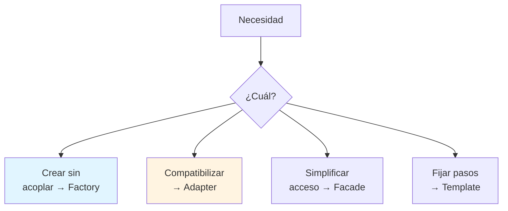
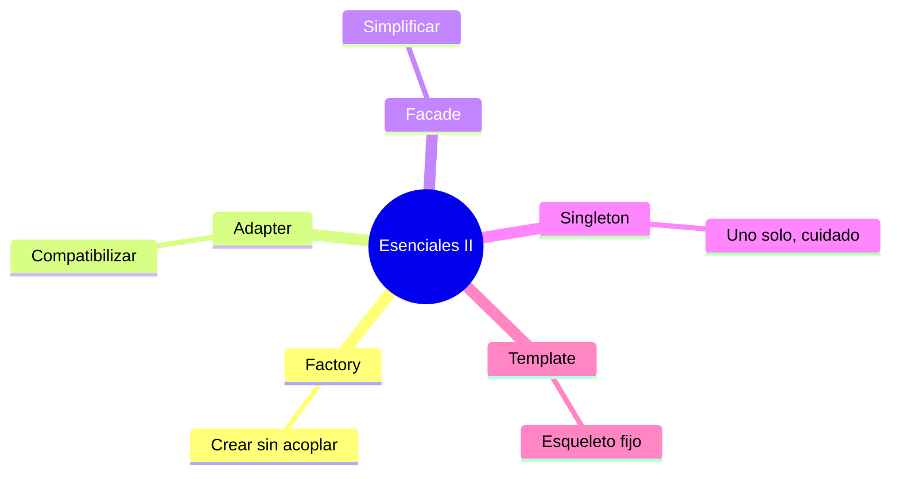

# 🏭 Patrones Esenciales II: Creación y Estructura

## 🎯 Introducción

> [!info] 💡 ¿Por Qué Crear Objetos También se Diseña?
>
> Los patrones **creacionales y estructurales** responden: ¿quién crea los objetos y cómo se ensamblan piezas incompatibles? `new` regado por todo el código es acoplamiento silencioso.
>
> **Analogía del mundo real:**
>
> - **Factory** → Concesionario: pides "un auto familiar" sin saber la fábrica exacta
> - **Adapter** → Adaptador de enchufe: hace compatible lo incompatible sin cambiar nada
> - **Facade** → Recepción del hotel: un punto simple ante 10 departamentos
> - **Singleton** → Rector: solo puede haber uno (úsalo casi nunca)
> - **Template Method** → Receta base con pasos fijos y 1 paso "a tu gusto"
>
> | Patrón | Familia | 1 línea |
> |---|---|---|
> | **Factory Method** | Creacional | Delega la creación a subclases/método |
> | **Adapter** | Estructural | Traduce una interfaz a otra |
> | **Facade** | Estructural | Cara simple ante subsistema complejo |
> | **Singleton** | Creacional | Una sola instancia global ⚠️ |
> | **Template Method** | Comportamiento | Esqueleto fijo + pasos variables |



---

## 🧵 Factory, Adapter y Facade con Java

### 🎭 Crear, Traducir, Simplificar

> [!note] 🎨 Tres Códigos que Debes Reconocer
>
> ```java
> // ✅ FACTORY: el cliente no hace 'new' de concretas
> interface Documento { void abrir(); }
> class Creador {
>     static Documento crear(String tipo) {
>         if (tipo.equals("pdf")) return new Pdf();
>         return new Word();
>     }
> }
>
> // ✅ ADAPTER: hace compatible sin tocar al adaptado
> class EnchufeUSA { void conectarPlano() {} }
> interface EnchufeEU { void conectarRedondo(); }
> class Adaptador implements EnchufeEU {
>     private EnchufeUSA usa = new EnchufeUSA();
>     public void conectarRedondo() { usa.conectarPlano(); }
> }
>
> // ✅ FACADE: ya la viste en Unidad 2 (TiendaFacade)
> // Un método simple orquesta pagos + stock + envío.
> ```
>
> | Patrón | Cuándo | Precio |
> |---|---|---|
> | **Factory** | Creación con lógica o variantes | El `if` vive en 1 solo lugar |
> | **Adapter** | Reutilizar clase incompatible | Capa extra de traducción |
> | **Facade** | Subsistema intimidante | Puede ocultar demasiado |

### 🔍 Singleton y Template Method (Úsalos con Pinzas y Gusto)

> [!example] 🧪 Uno Peligroso y Uno Elegante
>
> ```java
> // ⚠️ SINGLETON: útil para configuración; peligroso como global mutable
> class Config {
>     private static Config unica = new Config();
>     private Config() {}
>     static Config get() { return unica; }
> }
> // Regla: si lo usas para "acceder desde todos lados", es variable global
> // disfrazada. Prefiere inyección (pasarlo por constructor).
>
> // ✅ TEMPLATE METHOD: esqueleto en la base, detalles en hijas
> abstract class Informe {
>     final void generar() { // pasos fijos
>         encabezado();
>         cuerpo();      // <-- varía por hija
>         pie();
>     }
>     abstract void cuerpo();
>     void encabezado() { /* común */ }
>     void pie() { /* común */ }
> }
> ```
>
> **Herencia bien usada:** Template Method es de los pocos lugares donde heredar es la herramienta correcta (nota: contrasta con Decorator para responsabilidades).

---

## ⚠️ Problemas Comunes y Soluciones

> [!danger] ❌ Error: Singleton como Atajo Global
>
> **Síntomas:** `Config.get().getX().hacer()` en 40 archivos; tests imposibles de aislar.
>
> **Solución:**
>
> - Pasa dependencias por constructor (inyección manual, sin framework).
> - Reserva Singleton a objetos sin estado mutable (config de solo lectura).

---

## 🎯 Mejores Prácticas

> [!tip] 🏆 Checklist II
>
> **1. `new` de concretas solo en factories o composición raíz**
>
> Si ves 'new Pdf()' en lógica de negocio, muévelo a un creador.
>
> **2. Adapter antes que reescribir**
>
> Librería incompatible ≠ reescribirla. Adáptala en 1 clase.
>
> **3. Facade delgada**
>
> Orquesta, no implementa: si la fachada crece, esconde un diseño pendiente.

---

## 📊 Resumen Visual



> [!success] 🔍 Comparación Final
>
> | Aspecto | `new` Regado | Patrones II |
> |---|---|---|
> | **Creación** | ❌ Acoplada | Centralizada |
> | **Compatibilidad** | Reescriben | Adaptan |
> | **Uso Recomendado** | Prototipo | ✅ **Proyecto con variantes** |

---

## 🚀 Próximos Pasos

> [!quote] 🌟 Continuando
>
> **Has aprendido:**
>
> ✅ Factory, Adapter, Facade con código
> ✅ Singleton (peligros) y Template Method
> ✅ Reglas anti-atajos globales
>
> **Próximo tema Unidad 4:**
>
> | Tema | Qué verás | Por qué importa |
> |---|---|---|
> | **Refactorización** | Smells + catálogo Fowler | Limpias todo lo anterior sin romperlo |

---

## 🔗 Seguir estudiando

> [!info] 📚 Seguir estudiando
>
> - Mapa de contenido: [[Diseño de Software]]
> - Índice Unidad 3: [[00 - Índice Unidad 3]]
> - Anterior: [[02 - Patrones esenciales I, Strategy Decorator Observer]]
> - Syllabus: [[Bienvenida y Syllabus Diseño de Software]]

## 📚 Referencias

> [!quote] 📖 Fuentes
>
> - A. Shalloway, J. Trott, *Design Patterns Explained*: Factory, Adapter, Facade, Singleton, Template Method.
> - E. Gamma et al., *Design Patterns (GoF)*: catálogo creacional/estructural.
> - Sílabo CCPG1042, Unidad 3: patrones de diseño (7h).

---

**Tags:** #CCPG1042 #unidad3 #factory #adapter #facade #singleton
