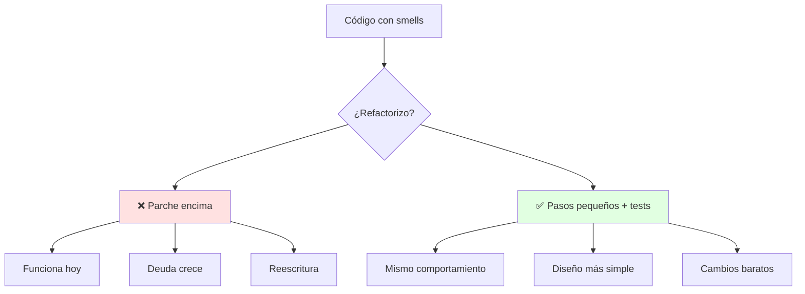
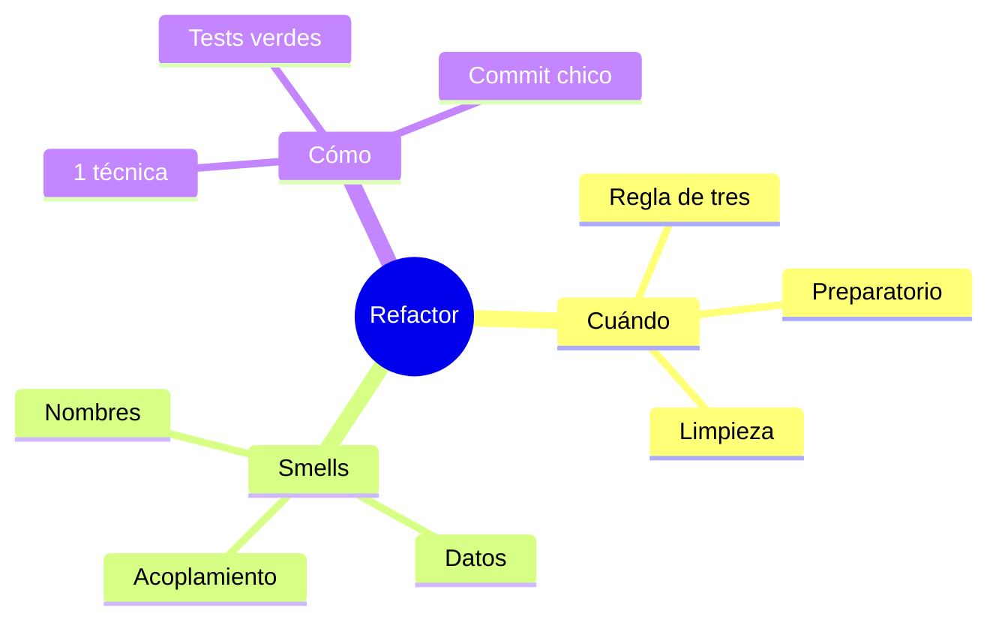

# 🔧 Qué y Cuándo Refactorizar + Code Smells

## 🎯 Introducción

> [!info] 💡 ¿Por Qué Cambiar Código que Funciona?
>
> La **refactorización** (Fowler) es reestructurar código existente sin cambiar su comportamiento observable, para hacerlo más simple de mantener. No agrega funciones: paga deuda para que el próximo cambio cueste menos.
>
> **Analogía del mundo real:** Piensa en ordenar un taller:
>
> - **Sin refactorizar** → Cada arreglo tarda más porque nada está en su lugar (el código "funciona" pero asusta tocarlo)
> - **Con refactorización** → Ordenas 10 min al día; arreglar sigue siendo rápido dentro de 6 meses
> - **Condición** → Ordenas sin tirar herramientas (los tests confirman que nada se rompió)
> - **Deuda** → Cada parche rápido sin limpieza sube intereses que la Unidad 4 cobra
>
> | Razón | Nunca Refactorizar | Refactorizar Continuo |
> |---|---|---|
> | **Velocidad futura** | Cada cambio más lento | Ritmo sostenible |
> | **Bugs** | Miedo a tocar (más bugs) | Tests + pasos pequeños |
> | **Lectura** | Solo el autor entiende | Cualquiera se ubica |
> | **Costo** | Reescritura total al final | Inversión diaria pequeña |

---

## 🧵 Definición y Cuándo Hacerlo (Fowler caps. 1-4)

### 🎭 Las Dos Reglas de Oro

> [!note] 🎨 Refactor ≠ Reescritura
>
> Refactorizar cambia la **estructura interna** verificando con tests que el comportamiento externo no cambió. Si agregas funcionalidad a la vez, no estás refactorizando: estás mezclando dos tareas y duplicando el riesgo.
>
> **Los 3 momentos que manda Fowler:**
>
> | Momento | Qué significa | Ejemplo en tu proyecto |
> |---|---|---|
> | **Regla de tres** | A la 3ra vez que haces algo similar, generaliza | Tercer `if` de tarifa → Strategy (Unidad 3) |
> | **Refactor preparatorio** | Limpia antes de agregar la función | Extrae método para entender dónde enganchar |
> | **Refactor de limpieza** | Ordena lo que acabas de ensuciar | Terminaste el sprint: renombra y simplifica |
>
> **Y la condición innegociable:** red de tests (aunque sea mínima) corriendo en verde *antes* de empezar. Sin tests, cada cambio es un salto al vacío — por eso la Unidad 5 existe.

### 🔍 El Ciclo de 5 Minutos

> [!example] 🧪 Ritmo Seguro
>
> El ciclo que repites decenas de veces por sesión:
>
> 1. Detecta un smell pequeño (nombre confuso, método largo, duplicado)
> 2. Aplica UNA técnica del catálogo (ver nota 02)
> 3. Corre los tests: todo verde o revierte
> 4. Commit pequeño con mensaje claro
>
> Pasos de minutos, nunca refactors de 3 horas sin red. Si el cambio asusta, es demasiado grande: pártelo.

---

## 🧵 Catálogo de Smells Esenciales (Fowler cap. 3)

### 🎭 Los 12 que Debes Oler a Distancia

> [!warning] 📊 Smells Agrupados por Familia
>
> **Nombres y duplicación (los más baratos de arreglar):**
>
> | Smell | Síntoma | Técnica que lo cura |
> |---|---|---|
> | **Nombre misterioso** | `x1`, `procesar2()`, `data` | Rename Variable/Function |
> | **Código duplicado** | Mismo bloque en 2+ lugares | Extract Function + Pull Up |
> | **Función larga** | +20 líneas, hace 3 cosas | Extract Function por misión |
> | **Lista larga de parámetros** | 4+ params, varios booleanos | Introduce Parameter Object |
>
> **Datos y estado (los que más duelen en equipo):**
>
> | Smell | Síntoma | Técnica que lo cura |
> |---|---|---|
> | **Dato globalmutable** | `static` tocado por todos | Encapsulate Variable |
> | **Obsesión primitiva** | `String telefono`, `int tipo` por doquier | Replace Primitive with Object |
> | **Grupo de datos** | `calle, ciudad, zip` siempre juntos | Extract Class / Parameter Object |
> | **Clase perezosa** | Existe pero casi no hace nada | Inline Class o Collapse Hierarchy |
>
> **Acoplamiento y dispersión (los arquitectónicos):**
>
> | Smell | Síntoma | Técnica que lo cura |
> |---|---|---|
> | **Envidia de funcionalidad** | Método que usa más datos ajenos que propios | Move Function a la clase dueña |
> | **Cambio divergente** | 1 clase cambia por 5 motivos distintos | Split Phase / Extract Class |
> | **Cirugía shotgun** | 1 cambio toca 8 archivos | Move Function + Inline |
> | **Cadena de mensajes** | `a.getB().getC().haz()` | Hide Delegate |
>
> **Regla práctica:** si huele en 2 de estas tablas a la vez (p. ej. función larga + envidia), ataca primero la envidia: mover revela la extracción correcta.

---

## ⚠️ Problemas Comunes y Soluciones

> [!danger] ❌ Error: Refactor Gigante sin Tests ("big bang")
>
> **Síntomas:** rama de 2 semanas, 40 archivos tocados, merge imposible y nadie sabe qué se rompió.
>
> **Solución:**
>
> - Límite: 1 smell, 1 técnica, 1 commit, tests verdes entre cada uno
> - Si no hay tests, escríbelos primero para el código que tocarás (aunque sean 3 asserts)
> - Commits pequeños se revierten; ramas gigantes se abandonan

---

## 🎯 Mejores Prácticas

> [!tip] 🏆 Checklist de Refactor Diario
>
> **1. Separa los dos sombreros**
>
> - Sombrero de función: agrego comportamiento, no reordeno nada
> - Sombrero de refactor: reordeno, no agrego nada
> - Nunca los dos puestos a la vez
>
> **2. Nombra antes de extraer**
>
> - Un buen nombre hace innecesario el comentario; un mal nombre esconde el smell
>
> **3. Mide el dolor, no la estética**
>
> - Refactoriza el código que cambias seguido, no el que "se ve feo" pero nadie toca

---

## 📊 Resumen Visual

> [!success] 🔍 Comparación Final
>
> | Aspecto | Parche Encima | Refactor Continuo |
> |---|---|---|
> | **Riesgo** | ❌ Crece en silencio | ✅ Tests por paso |
> | **Velocidad** | Rápido hoy, lento siempre | Sostenible |
> | **Uso Recomendado** | Emergencia con ticket de deuda | ✅ **Rutina diaria** |

---

## 🚀 Próximos Pasos

> [!quote] 🌟 Continuando
>
> **Has aprendido:**
>
> ✅ Definición, 3 momentos y ciclo de 5 minutos
> ✅ 12 smells agrupados con su cura
> ✅ Errores big-bang y checklist diario
>
> **Próximo tema:**
>
> | Tema | Qué verás | Por qué importa |
> |---|---|---|
> | **Catálogo esencial Fowler** | Extract, Move, Rename paso a paso con Java | Las manos del refactor |

---

## 🔗 Seguir estudiando

> [!info] 📚 Seguir estudiando
>
> - Mapa de contenido: [[Diseño de Software]]
> - Índice Unidad 4: [[00 - Índice Unidad 4]]
> - Siguiente: [[02 - Catálogo esencial de Fowler, Extract Move Rename]]
> - Syllabus: [[Bienvenida y Syllabus Diseño de Software]]

## 📚 Referencias

> [!quote] 📖 Fuentes
>
> - M. Fowler, K. Beck, *Refactoring*, 2nd ed., caps. 1-4 (definición, cuándo, smells).
> - Sílabo CCPG1042, Unidad 4: refactorización (5h).

---

**Tags:** #CCPG1042 #unidad4 #refactoring #smells #diseno-software
