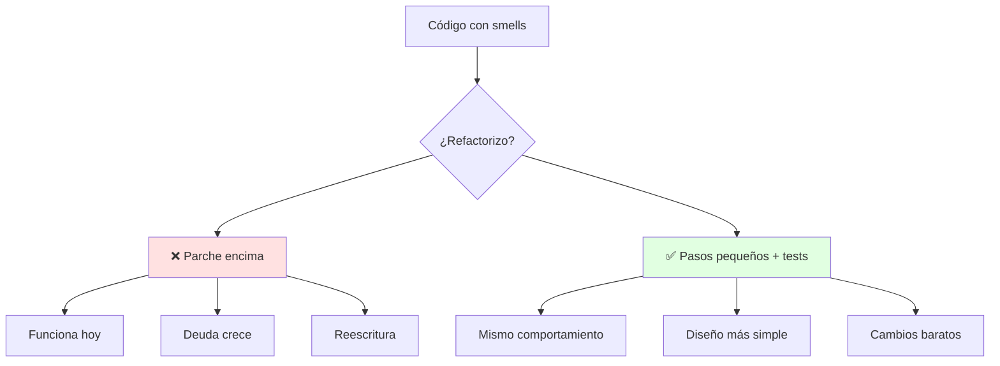
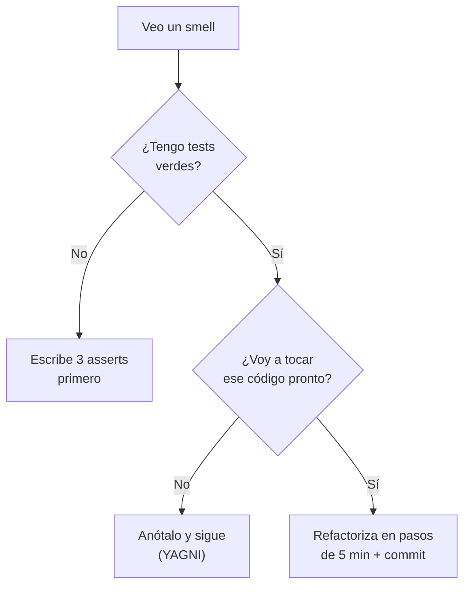
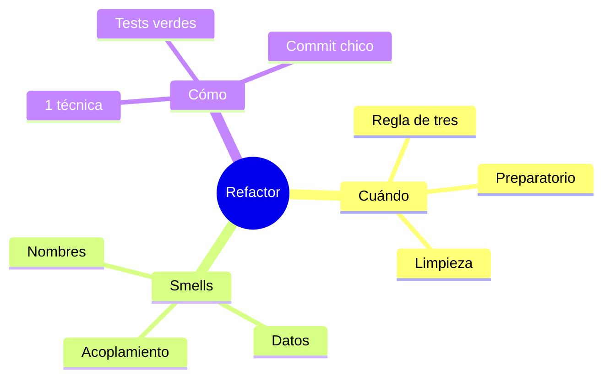

# 🔧 Qué y Cuándo Refactorizar + Code Smells

## 🎯 Introducción

> [!info] 💡 ¿Por Qué Cambiar Código que Funciona?
>
> La **refactorización** (Fowler) es reestructurar código existente sin cambiar su comportamiento observable, para hacerlo más simple de mantener. No agrega funciones: paga deuda para que el próximo cambio cueste menos.
>
> **Importancia histórica:** el término se popularizó con el libro de Fowler (1999, 2da ed. 2019 con Kent Beck) — antes se llamaba simplemente "limpiar código" y nadie lo enseñaba sistemáticamente. Hoy es disciplina con catálogo, y tu docente le dedica S12-S13 completas.
>
> **Relevancia actual:** cada PR que revisas en un trabajo real incluye refactor menor; saber hacerlo sin romper nada es literalmente empleabilidad.
>
> **Analogía del mundo real:** piensa en ordenar un taller:
>
> - **Sin refactorizar** → Cada arreglo tarda más porque nada está en su lugar.
> - **Con refactorización** → Ordenas 10 min al día; arreglar sigue siendo rápido en 6 meses.
> - **Condición** → Ordenas sin tirar herramientas (los tests confirman que nada se rompió).
>
> | Razón | Nunca Refactorizar | Refactorizar Continuo |
> |---|---|---|
> | **Velocidad futura** | Cada cambio más lento | Ritmo sostenible |
> | **Bugs** | Miedo a tocar (más bugs) | Tests + pasos pequeños |
> | **Lectura** | Solo el autor entiende | Cualquiera se ubica |
> | **Costo** | Reescritura total al final | Inversión diaria pequeña |

---

## 🧵 Definición y Cuándo Hacerlo (Fowler caps. 1-4)

### 🎭 Las Dos Reglas de Oro + Los 3 Momentos

> [!note] 📋 Definición — Refactor ≠ Reescritura
>
> Reestructurar la **estructura interna** verificando con tests que el comportamiento externo no cambió. Si agregas funcionalidad a la vez, no estás refactorizando: estás mezclando dos tareas y duplicando el riesgo.
>
> **Los 3 momentos que manda Fowler:**
>
> | Momento | Qué significa | Ejemplo en tu proyecto |
> |---|---|---|
> | **Regla de tres** | A la 3ra vez que haces algo similar, generaliza | Tercer `if` de tarifa → Strategy |
> | **Refactor preparatorio** | Limpia antes de agregar la función | Extrae método para entender dónde enganchar |
> | **Refactor de limpieza** | Ordena lo que acabas de ensuciar | Terminada la feature: renombra y simplifica |
>
> **Condición innegociable:** red de tests (aunque sea mínima) corriendo en verde *antes* de empezar. Sin tests, cada cambio es un salto al vacío — por eso existe la Unidad 5.

### 🔍 El Ciclo de 5 Minutos

> [!example] 🧪 Ritmo Seguro
>
> 1. Detecta un smell pequeño (nombre confuso, método largo, duplicado).
> 2. Aplica UNA técnica del catálogo (ver nota 02).
> 3. Corre los tests: todo verde o revierte.
> 4. Commit pequeño con mensaje claro.
>
> Pasos de minutos, nunca refactors de 3 horas sin red. Si el cambio asusta, es demasiado grande: pártelo.

---

## 🗺️ Diagrama de Decisión: ¿Refactorizo Ahora?

> [!tip] 💡 Lectura del diagrama
>
> No todo smell se ataca al verlo: solo el del código que vas a tocar. El resto es lista de deseos, no trabajo de hoy.

---

## 🧵 Catálogo de Smells Esenciales (Fowler cap. 3)

### 🎭 Los 12 que Debes Oler a Distancia

> [!warning] 📊 Smells Agrupados por Familia
>
> **Nombres y duplicación (los más baratos de arreglar):**
>
> | Smell | Síntoma | Técnica que lo cura |
> |---|---|---|
> | **Nombre misterioso** | `x1`, `procesar2()`, `data` | Rename Variable/Function |
> | **Código duplicado** | Mismo bloque en 2+ lugares | Extract Function + Pull Up |
> | **Función larga** | +20 líneas, hace 3 cosas | Extract Function por misión |
> | **Lista larga de parámetros** | 4+ params, varios booleanos | Introduce Parameter Object |
>
> **Datos y estado (los que más duelen en equipo):**
>
> | Smell | Síntoma | Técnica que lo cura |
> |---|---|---|
> | **Dato global mutable** | `static` tocado por todos | Encapsulate Variable |
> | **Obsesión primitiva** | `String telefono`, `int tipo` por doquier | Replace Primitive with Object |
> | **Grupo de datos** | `calle, ciudad, zip` siempre juntos | Extract Class / Parameter Object |
> | **Clase perezosa** | Existe pero casi no hace nada | Inline Class o Collapse Hierarchy |
>
> **Acoplamiento y dispersión (los arquitectónicos):**
>
> | Smell | Síntoma | Técnica que lo cura |
> |---|---|---|
> | **Envidia de funcionalidad** | Método que usa más datos ajenos que propios | Move Function a la clase dueña |
> | **Cambio divergente** | 1 clase cambia por 5 motivos distintos | Split Phase / Extract Class |
> | **Cirugía shotgun** | 1 cambio toca 8 archivos | Move Function + Inline |
> | **Cadena de mensajes** | `a.getB().getC().haz()` | Hide Delegate |
>
> **Regla práctica:** si huele en 2 tablas a la vez (p. ej. función larga + envidia), ataca primero la envidia: mover revela la extracción correcta.

---

## ⚠️ Problemas Comunes y Soluciones

> [!danger] ❌ Error 1: Refactor Gigante sin Tests, "big bang" (viola **pasos pequeños + red de tests**)
>
> **Síntomas:** rama de 2 semanas, 40 archivos tocados, merge imposible y nadie sabe qué se rompió.
>
> **Solución:**
>
> - Límite: 1 smell, 1 técnica, 1 commit, tests verdes entre cada uno.
> - Sin tests previos, escríbelos para el código a tocar (aunque sean 3 asserts).
> - Commits pequeños se revierten; ramas gigantes se abandonan.

> [!danger] ❌ Error 2: Mezclar Refactor con Features (viola **un sombrero a la vez**)
>
> **Síntomas:** el diff muestra reordenamientos Y lógica nueva; el review no sabe qué revisar ni qué revertir si falla.
>
> **Solución:** sombrero de función (agrego, no reordeno) o sombrero de refactor (reordeno, no agrego) — nunca ambos en el mismo commit.

> [!danger] ❌ Error 3: Refactorizar Código que Nadie Toca (viola **YAGNI**)
>
> **Síntomas:** semanas puliendo un módulo legacy estable que nadie modificará.
>
> **Solución:** refactoriza el código del camino (lo que vas a tocar); el resto, anótalo y sigue.

---

## 🎯 Mejores Prácticas

> [!tip] 🏆 Checklist de Refactor Diario
>
> **1. Separa los dos sombreros**
>
> Función: agrego comportamiento, no reordeno. Refactor: reordeno, no agrego.
>
> **2. Nombra antes de extraer**
>
> Un buen nombre hace innecesario el comentario; un mal nombre esconde el smell.
>
> **3. Mide el dolor, no la estética**
>
> Refactoriza el código que cambias seguido, no el que "se ve feo" pero nadie toca.
>
> **4. 1 técnica, 1 commit, tests verdes**
>
> Sin excepciones: es lo que separa refactor de "toqué cosas".

---

## 📝 Ejercicios Propuestos

> [!example] 📋 Nivel 1 — Básico
>
> **1.** Define refactorización y explica por qué no es lo mismo que reescritura.
>
> **2.** Nombra los 3 momentos de Fowler con un ejemplo de tu proyecto cada uno.
>
> **3.** Clasifica estos smells por familia: `x1`, `static` mutable global, `a.getB().getC()`, función de 40 líneas.
>
> **4.** ¿Por qué los tests deben estar en verde ANTES de empezar a refactorizar?
>
> **5.** Explica la regla "si asusta, pártelo" con un ejemplo concreto.
>
> > [!success]- ✅ Respuestas — Nivel 1
> >
> > - **1.** Reestructurar el interior sin cambiar comportamiento observable, verificado con tests. Reescritura desecha y rehace.
> > - **2.** Regla de tres (tercer `if` de tarifa → Strategy); preparatorio (extraer para entender dónde enganchar); limpieza (renombrar tras la feature).
> > - **3.** Nombres (misterioso), datos/estado (global mutable), acoplamiento (cadena), nombres/duplicación (función larga).
> > - **4.** Porque son la red que detecta si el cambio rompió algo; sin red no hay forma de saberlo.
> > - **5.** Un cambio que da miedo esconde varios cambios: extrae primero lo entendible y repite.

> [!example] 📋 Nivel 2 — Intermedio
>
> **6.** Tu clase `Pedido` valida, calcula, factura y notifica. ¿Qué smells huele y en qué orden los atacas?
>
> **7.** Un método usa 4 campos del cliente y 1 propio. ¿Qué smell es y qué técnica lo cura?
>
> **8.** Explica cambio divergente vs cirugía shotgun con un ejemplo de cada uno en el mismo sistema.
>
> **9.** ¿Cuándo conviene Introduce Parameter Object frente a seguir agregando parámetros? Da el umbral práctico.
>
> **10.** Diseña tu "ciclo de 5 minutos" personal para antes de cada commit.
>
> > [!success]- ✅ Respuestas — Nivel 2
> >
> > - **6.** Función larga + cambio divergente (+quizás envidia). Orden: envidia primero (mueve lo ajeno), luego extrae por misión.
> > - **7.** Envidia de funcionalidad → Move Function a Cliente.
> > - **8.** Divergente: 1 clase, 5 motivos de cambio. Shotgun: 1 cambio, 8 archivos. Misma enfermedad (mala distribución), síntomas opuestos.
> > - **9.** Desde 3-4 parámetros relacionados: el objeto agrupa lo que siempre viaja junto.
> > - **10.** Respuesta libre guiada: detectar → 1 técnica → tests → commit chico.

> [!example] 📋 Nivel 3 — Avanzado
>
> **11.** Argumenta por qué "refactorizar código que nadie toca" destruye valor aunque mejore el código.
>
> **12.** Un equipo quiere "semana de refactor total, sin features". Evalúa con los 3 momentos de Fowler y propón alternativa.
>
> **13.** ¿Cómo se relaciona YAGNI con la decisión de NO atacar un smell visible? Da criterios.
>
> **14.** Diseña una guía de 1 página para tu equipo: cuándo refactorizar, cuándo no, y cómo verificarlo.
>
> **15.** Conecta falsabilidad (Martin, cap. 4) con la red de tests: ¿por qué un código no testeable no es refactorizable?
>
> > [!success]- ✅ Respuestas — Nivel 3
> >
> > - **11.** Riesgo sin retorno: cada cambio puede romper lo estable y nadie usará la mejora. Valor = mejora × probabilidad de tocarlo.
> > - **12.** Viola los 3 momentos (ninguno pide pausar todo): mejor refactor continuo atado a features (preparatorio + limpieza por sprint).
> > - **13.** Si el código no está en el camino de trabajo próximo, el smell es inventario, no tarea (ver diagrama de decisión).
> > - **14.** Respuesta libre guiada: momentos, ciclo 5 min, regla 1-1-1, verificación con tests.
> > - **15.** Sin tests no hay forma de refutar que algo se rompió: el cambio no es falsable, luego no es seguro.

---

## 📋 Resumen Ejecutivo

> [!summary] 📋 Lo Esencial
>
> - **Refactorizar** = reestructurar sin cambiar comportamiento, con tests en verde.
> - **3 momentos:** regla de tres, preparatorio, limpieza. **Ciclo:** 5 minutos por paso.
> - **12 smells** en 3 familias, cada uno con su técnica de cura.
> - Solo se ataca el smell del código que vas a tocar.

---

## ✅ Metas de Aprendizaje

> [!note] 🎯 Nivel Básico
> - [ ] Defino refactor y distingo los 3 momentos con ejemplo.
> - [ ] Clasifico 12 smells por familia con su técnica.
> - [ ] Describo el ciclo de 5 minutos sin mirar.

> [!note] 🎯 Nivel Intermedio
> - [ ] Ordeno ataques multi-smell (envidia primero).
> - [ ] Decido con el diagrama si un smell se ataca hoy o se anota.
> - [ ] Distingo cambio divergente de cirugía shotgun en código real.

> [!note] 🎯 Nivel Avanzado
> - [ ] Evalúo "semanas de refactor" con criterio Fowler.
> - [ ] Escribo la guía de refactor de 1 página de mi equipo.
> - [ ] Conecto falsabilidad con red de tests correctamente.

---

## 📊 Resumen Visual

> [!success] 🔍 Comparación Final
>
> | Aspecto | Parche Encima | Refactor Continuo |
> |---|---|---|
> | **Riesgo** | ❌ Crece en silencio | ✅ Tests por paso |
> | **Decisión** | Adivinada | Con diagrama propio |
> | **Alcance** | Todo lo feo | Solo tu camino |
> | **Uso Recomendado** | Emergencia con ticket | ✅ **Rutina diaria** |

---

## 🚀 Próximos Pasos

> [!quote] 🌟 Continuando
>
> **Has aprendido:**
>
> ✅ Definición + 3 momentos + ciclo de 5 minutos
> ✅ 12 smells con cura + diagrama de decisión propio
> ✅ 3 errores numerados + falsabilidad
>
> **Próximo tema:**
>
> | Tema | Qué verás | Por qué importa |
> |---|---|---|
> | **Catálogo Fowler** | Extract, Move, Rename paso a paso | Las manos del refactor |

---

## 🔗 Seguir estudiando

> [!info] 📚 Seguir estudiando
>
> - Mapa de contenido: [[Diseño de Software]]
> - Índice Unidad 4: [[00 - Índice Unidad 4]]
> - Siguiente: [[02 - Catálogo esencial de Fowler, Extract Move Rename]]
> - Syllabus: [[Bienvenida y Syllabus Diseño de Software]]

## 📚 Referencias

> [!quote] 📖 Fuentes
>
> - M. Fowler, K. Beck, *Refactoring*, 2nd ed., caps. 1-4 (definición, cuándo, smells).
> - R. C. Martin, *Clean Architecture*, cap. 4 (falsabilidad y tests).
> - Sílabo CCPG1042, Unidad 4: refactorización (5h).

---

**Tags:** #CCPG1042 #unidad4 #refactoring #smells #diseno-software
