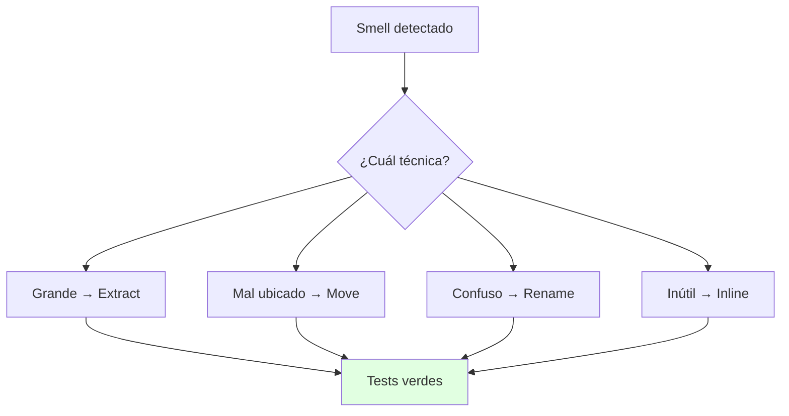
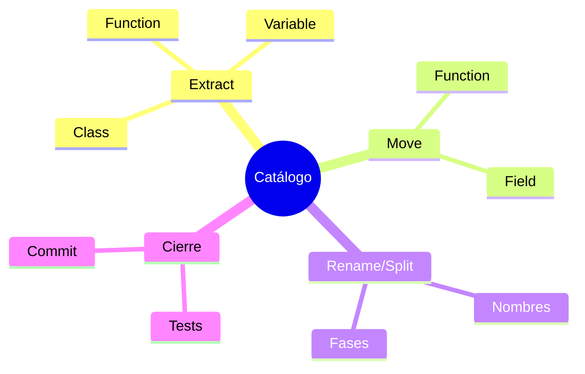

# 🛠️ Catálogo Esencial de Fowler: Extract, Move, Rename

## 🎯 Introducción

> [!info] 💡 ¿Por Qué un Catálogo y no Improvisar?
>
> Cada técnica del catálogo es una **receta con pasos mecánicos y seguros**: sabes exactamente qué mover, en qué orden y cómo verificar. Improvisar refactors es como operar sin protocolo: a veces sale, a veces mata al paciente.
>
> **Analogía del mundo real:** Piensa en mudanza profesional:
>
> - **Sin catálogo** → Cargas todo revuelto, se rompe lo frágil, no sabes qué caja abrir primero
> - **Con catálogo** → Etiquetas por cuarto (Extract), muebles al camión correcto (Move), cajas renombradas (Rename)
> - **Orden** → Primero divides, luego mueves, al final nombras: cada paso verificable
> - **Tests** → El inventario que confirma que nada se perdió en el traslado
>
> | Técnica | Qué hace | Smell que cura |
> |---|---|---|
> | **Extract Function/Variable/Class** | Divide lo grande en piezas con nombre | Función larga, duplicado |
> | **Move Function/Field** | Lleva el código a su dueño | Envidia de funcionalidad |
> | **Rename** | Nombres que explican | Nombre misterioso |
> | **Inline** | Elimina indirección inútil | Clase/método perezoso |
> | **Split Phase / Split Loop** | Separa etapas mezcladas | Cambio divergente |



---

## 🧵 Extract: Divide y Nombra (las Más Usadas)

### 🎭 Extract Function, el 80% del Trabajo

> [!note] 🎨 Mecánica en 4 Pasos
>
> La técnica que más aplicarás en tu vida, paso a paso según Fowler:
>
> 1. Encuentra el fragmento con UNA misión dentro del método largo y crea la función con un nombre que diga qué hace (no cómo)
> 2. Mueve el fragmento; las variables que solo usa adentro quedan locales
> 3. Lo que el fragmento necesita de afuera entra por parámetros; lo que produce sale por retorno (si hay 2+ salidas, algo anda mal: revisa Split Phase)
> 4. Compila, corre tests, commit
>
> ```java
> // ❌ ANTES: dos misiones mezcladas (imprimir + calcular)
> void mostrarFactura(Pedido p) {
>     System.out.println("Cliente: " + p.cliente());
>     double total = 0;
>     for (Linea l : p.lineas()) total += l.precio() * (1 - l.descuento());
>     System.out.println("Total: " + total);
> }
>
> // ✅ DESPUÉS: cada misión con nombre propio
> void mostrarFactura(Pedido p) {
>     imprimirEncabezado(p.cliente());
>     imprimirTotal(calcularTotal(p));
> }
> double calcularTotal(Pedido p) {
>     double total = 0;
>     for (Linea l : p.lineas()) total += l.precio() * (1 - l.descuento());
>     return total;
> }
> ```
>
> **Extract Variable y Extract Class** siguen la misma idea en otras escalas:
>
> | Técnica | Cuándo | Ejemplo |
> |---|---|---|
> | **Extract Variable** | Expresión que exige comentario para entenderse | `double factor = 1 - descuento;` en vez de la fórmula inline |
> | **Extract Class** | La clase tiene 2 misiones (falla el test de la frase) | `Pedido` + `DirecciónEnvio` separadas |

---

## 🧵 Move e Inline: Cada Cosa en su Lugar

### 🎭 Move Function contra la Envidia

> [!example] 🧪 Lleva el Método a los Datos que Más Usa
>
> Si un método de `Factura` usa 4 campos de `Cliente` y 1 propio, vive en la casa equivocada. La mecánica de Fowler: copia el método a `Cliente`, ajusta referencias, deja el original delegando una temporada y luego elimínalo.
>
> ```java
> // ❌ ANTES: envidia (usa casi todo de Cliente)
> class Factura {
>     double descuentoCliente(Cliente c) {
>         return c.compras() > 10 && c.antiguedad() > 2 ? 0.15 : 0.0;
>     }
> }
>
> // ✅ DESPUÉS: el descuento vive donde están los datos
> class Cliente {
>     double descuento() {
>         return compras() > 10 && antiguedad() > 2 ? 0.15 : 0.0;
>     }
> }
> class Factura {
>     double total(Cliente c, double base) { return base * (1 - c.descuento()); }
> }
> ```
>
> **Move Field** es gemelo: el dato se muda con (o antes que) los métodos que lo usan.
>
> **Inline** es el camino inverso: si una clase o método quedó tan pequeño que solo estorba, fusiona su contenido donde se usa y elimínalo. Úsalo contra clases perezosas y delegaciones de un solo salto.

---

## 🧵 Rename y Split: Claridad Estructural

### 🎭 Nombres y Fases Separadas

> [!success] 🏆 Lo Barato que Más Rinde
>
> **Rename Variable/Function** es la técnica de mejor retorno por minuto: un nombre preciso elimina comentarios y malentendidos. Renombra en cuanto entiendas mejor el código que cuando lo escribiste, y deja que el IDE actualice referencias.
>
> **Split Phase** ataca funciones que mezclan etapas (p. ej. calcular + formatear + imprimir): divide en funciones por etapa y conecta con una estructura intermedia. **Split Loop** es su primo para bucles que hacen 2 tareas: dos bucles claros valen más que uno "eficiente" ilegible.
>
> | Técnica | Señal para usarla | Resultado |
> |---|---|---|
> | **Rename** | Tardas en explicar qué hace | Nombre = documentación |
> | **Split Phase** | Mezcla cálculo con salida | Etapas testeables por separado |
> | **Replace Temp with Query** | Variable temporal solo para 1 cálculo | Método que calcula al pedir |
> | **Substitute Algorithm** | Existe forma canónica más clara | Reemplazo total verificado con tests |

---

## ⚠️ Problemas Comunes y Soluciones

> [!danger] ❌ Error: Extraer sin Tests y Romper Comportamiento
>
> **Síntomas:** "solo moví código" pero 3 tests fallan y no sabes en qué paso.
>
> **Solución:**
>
> - Antes: tests verdes que cubran el método a tocar (aunque los escribas tú mismo, 5 min)
> - Durante: 1 técnica por commit; si algo falla, revierte UN commit, no toda la tarde
> - Después: el diff debe mostrar movimiento, no lógica nueva (si hay lógica nueva, ibas con el otro sombrero)

---

## 🎯 Mejores Prácticas

> [!tip] 🏆 Checklist del Catálogo
>
> **1. Orden canónico: Split → Extract → Move → Rename**
>
> - Separa etapas, extrae piezas, ubícalas bien y nómbralas al final (cuando ya entiendes qué son)
>
> **2. El catálogo vive en tu IDE**
>
> - Aprende los atajos de Extract Method y Rename de tu entorno: convierten minutos en segundos
>
> **3. Cada técnica cierra con tests + commit**
>
> - Sin excepciones: es lo que separa refactor de "toqué cosas"

---

## 📊 Resumen Visual



> [!success] 🔍 Comparación Final
>
> | Aspecto | Improvisar | Catálogo Fowler |
> |---|---|---|
> | **Seguridad** | ❌ Suerte | ✅ Pasos + tests |
> | **Reversión** | Toda la tarde | 1 commit |
> | **Uso Recomendado** | Nunca en equipo | ✅ **Siempre mecánico** |

---

## 🚀 Próximos Pasos

> [!quote] 🌟 Continuando
>
> **Has aprendido:**
>
> ✅ Extract Function/Variable/Class con mecánica y Java
> ✅ Move Function/Field e Inline con ejemplo de envidia
> ✅ Rename, Split y orden canónico de trabajo
>
> **Próximo tema Unidad 5:**
>
> | Tema | Qué verás | Por qué importa |
> |---|---|---|
> | **Pruebas unitarias** | Tests que sostienen todo lo anterior | Sin tests no hay refactor seguro |

---

## 🔗 Seguir estudiando

> [!info] 📚 Seguir estudiando
>
> - Mapa de contenido: [[Diseño de Software]]
> - Índice Unidad 4: [[00 - Índice Unidad 4]]
> - Anterior: [[01 - Qué y cuándo refactorizar, smells]]
> - Syllabus: [[Bienvenida y Syllabus Diseño de Software]]

## 📚 Referencias

> [!quote] 📖 Fuentes
>
> - M. Fowler, K. Beck, *Refactoring*, 2nd ed., caps. 6-12 (catálogo: Extract, Move, Rename, Split).
> - Sílabo CCPG1042, Unidad 4: refactorización (5h).

---

**Tags:** #CCPG1042 #unidad4 #catalogo #extract #move #diseno-software
