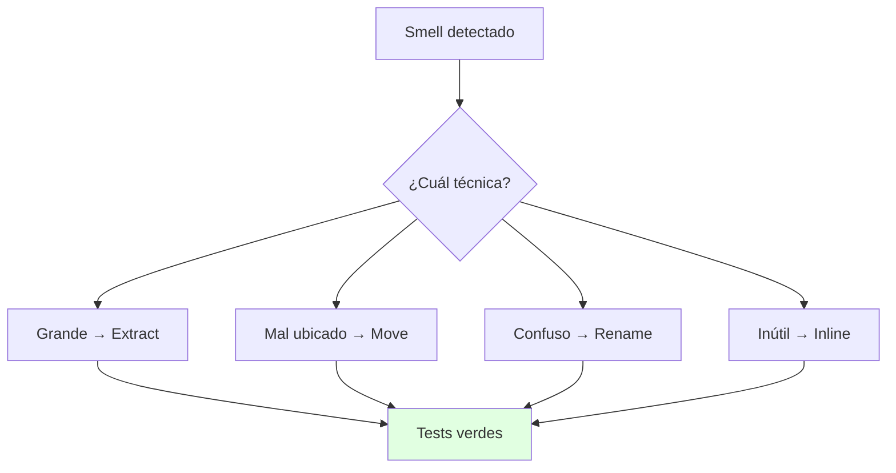
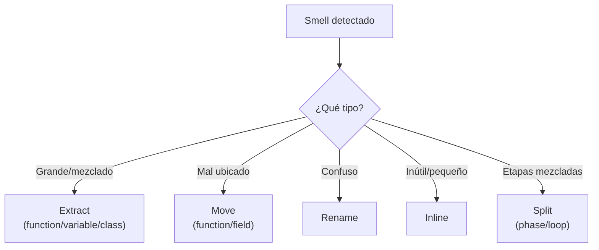
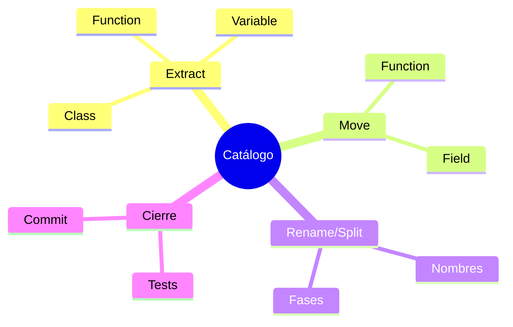

# 🛠️ Catálogo Esencial de Fowler: Extract, Move, Rename

## 🎯 Introducción

> [!info] 💡 ¿Por Qué un Catálogo y no Improvisar?
>
> Cada técnica del catálogo es una **receta con pasos mecánicos y seguros**: sabes exactamente qué mover, en qué orden y cómo verificar. Improvisar refactors es como operar sin protocolo: a veces sale, a veces mata al paciente.
>
> **Importancia histórica:** Fowler sistematizó en 1999 lo que los buenos programadores hacían por instinto — y la 2da edición (2019, con Beck) lo actualizó a JavaScript/Java moderno. El catálogo completo trae 60+ técnicas; aquí van las 8 que cubren el 90% de tu trabajo real.
>
> **Relevancia actual:** tu IDE ya automatiza varias (Extract Method, Rename, Move) — saber la mecánica te dice *cuándo* invocarlas y en qué orden.
>
> **Analogía del mundo real:** piensa en mudanza profesional:
>
> - **Sin catálogo** → Cargas todo revuelto, se rompe lo frágil, no sabes qué caja abrir primero.
> - **Con catálogo** → Etiquetas por cuarto (Extract), muebles al camión correcto (Move), cajas renombradas (Rename).
> - **Orden** → Primero divides, luego mueves, al final nombras: cada paso verificable.
> - **Tests** → El inventario que confirma que nada se perdió en el traslado.
>
> | Técnica | Qué hace | Smell que cura |
> |---|---|---|
> | **Extract Function/Variable/Class** | Divide lo grande en piezas con nombre | Función larga, duplicado |
> | **Move Function/Field** | Lleva el código a su dueño | Envidia de funcionalidad |
> | **Rename** | Nombres que explican | Nombre misterioso |
> | **Inline** | Elimina indirección inútil | Clase/método perezoso |
> | **Split Phase / Split Loop** | Separa etapas mezcladas | Cambio divergente |



---

## 🧵 Extract: Divide y Nombra (Fowler caps. 6-8)

### 🎭 La Técnica del 80%

> [!note] 📋 Definición — Mecánica en 4 Pasos
>
> La técnica que más aplicarás en tu vida, paso a paso según Fowler:
>
> 1. Encuentra el fragmento con UNA misión dentro del método largo y crea la función con un nombre que diga qué hace (no cómo).
> 2. Mueve el fragmento; las variables que solo usa adentro quedan locales.
> 3. Lo que el fragmento necesita de afuera entra por parámetros; lo que produce sale por retorno (si hay 2+ salidas, algo anda mal: revisa Split Phase).
> 4. Compila, corre tests, commit.
>
> ```java
> // ❌ ANTES: dos misiones mezcladas (imprimir + calcular)
> void mostrarFactura(Pedido p) {
>     System.out.println("Cliente: " + p.cliente());
>     double total = 0;
>     for (Linea l : p.lineas()) total += l.precio() * (1 - l.descuento());
>     System.out.println("Total: " + total);
> }
>
> // ✅ DESPUÉS: cada misión con nombre propio
> void mostrarFactura(Pedido p) {
>     imprimirEncabezado(p.cliente());
>     imprimirTotal(calcularTotal(p));
> }
> double calcularTotal(Pedido p) {
>     double total = 0;
>     for (Linea l : p.lineas()) total += l.precio() * (1 - l.descuento());
>     return total;
> }
> ```
>
> **Extract Variable y Extract Class** siguen la misma idea en otras escalas:
>
> | Técnica | Cuándo | Ejemplo |
> |---|---|---|
> | **Extract Variable** | Expresión que exige comentario para entenderse | `double factor = 1 - descuento;` en vez de la fórmula inline |
> | **Extract Class** | La clase tiene 2 misiones (falla el test de la frase) | `Pedido` + `DirecciónEnvio` separadas |

---

## 🧵 Move e Inline: Cada Cosa en su Lugar (Fowler caps. 8, 12)

### 🎭 Contra la Envidia y la Pereza

> [!example] 🧪 Move Function + Inline Class
>
> Si un método de `Factura` usa 4 campos de `Cliente` y 1 propio, vive en la casa equivocada. Mecánica: copia el método a `Cliente`, ajusta referencias, deja el original delegando una temporada y luego elimínalo.
>
> ```java
> // ❌ ANTES: envidia (usa casi todo de Cliente)
> class Factura {
>     double descuentoCliente(Cliente c) {
>         return c.compras() > 10 && c.antiguedad() > 2 ? 0.15 : 0.0;
>     }
> }
>
> // ✅ DESPUÉS: el descuento vive donde están los datos
> class Cliente {
>     double descuento() {
>         return compras() > 10 && antiguedad() > 2 ? 0.15 : 0.0;
>     }
> }
> class Factura {
>     double total(Cliente c, double base) { return base * (1 - c.descuento()); }
> }
> ```
>
> **Move Field** es gemelo: el dato se muda con (o antes que) los métodos que lo usan. **Inline** es el camino inverso: si una clase o método quedó tan pequeño que solo estorba, fusiona su contenido donde se usa y elimínalo (cura clases perezosas y delegaciones de un solo salto).

---

## 🧵 Rename y Split: Claridad Estructural (Fowler caps. 6, 10-11)

### 🎭 Lo Barato que Más Rinde

> [!success] 🏆 Nombres, Fases y Temporales
>
> **Rename Variable/Function** es la técnica de mejor retorno por minuto: un nombre preciso elimina comentarios y malentendidos. Renombra en cuanto entiendas mejor el código que cuando lo escribiste, y deja que el IDE actualice referencias.
>
> **Split Phase** ataca funciones que mezclan etapas (calcular + formatear + imprimir): divide en funciones por etapa y conecta con una estructura intermedia. **Split Loop** es su primo para bucles que hacen 2 tareas: dos bucles claros valen más que uno "eficiente" ilegible.
>
> | Técnica | Señal para usarla | Resultado |
> |---|---|---|
> | **Rename** | Tardas en explicar qué hace | Nombre = documentación |
> | **Split Phase** | Mezcla cálculo con salida | Etapas testeables por separado |
> | **Replace Temp with Query** | Variable temporal solo para 1 cálculo | Método que calcula al pedir |
> | **Substitute Algorithm** | Existe forma canónica más clara | Reemplazo total verificado con tests |

---

## 🗺️ Diagrama de Decisión: ¿Qué Técnica Aplico?



> [!tip] 💡 Lectura del diagrama
>
> En duda entre Extract y Move: primero mueve lo ajeno a su dueño (Move), que lo que queda suele extraerse solo.

---

## ⚠️ Problemas Comunes y Soluciones

> [!danger] ❌ Error 1: Extraer sin Tests y Romper Comportamiento (viola **verificar cada paso**)
>
> **Síntomas:** "solo moví código" pero 3 tests fallan y no sabes en qué paso:
>
> ```java
> // ❌ EL ERROR ESTÁ AQUÍ: extrajo sin red — ¿qué paso rompió qué?
> void procesar(Pedido p) { /* 40 líneas movidas de golpe, 0 tests verdes antes */ }
> ```
>
> **Solución:**
>
> - Antes: tests verdes que cubran el método a tocar (aunque los escribas tú mismo, 5 min).
> - Durante: 1 técnica por commit; si algo falla, revierte UN commit, no toda la tarde.
> - Después: el diff debe mostrar movimiento, no lógica nueva (si hay lógica nueva, ibas con el otro sombrero).

> [!danger] ❌ Error 2: Extraer Demasiado Pronto (viola **regla de tres**)
>
> **Síntomas:** abstracciones para código usado una vez; cada lectura exige saltar entre 5 funciones.
>
> **Solución:** primero duplica sin culpa; extrae cuando veas la 2da-3ra repetición real.

> [!danger] ❌ Error 3: Renombrar sin el IDE (viola **herramienta adecuada**)
>
> **Síntomas:** buscar/reemplazar manual que deja 3 referencias viejas y rompe la compilación.
>
> **Solución:** Rename del IDE (actualiza todo + tests); el rename manual está prohibido salvo en seudocódigo.

---

## 🎯 Mejores Prácticas

> [!tip] 🏆 Checklist del Catálogo
>
> **1. Orden canónico: Split → Extract → Move → Rename**
>
> Separa etapas, extrae piezas, ubícalas bien y nómbralas al final (cuando ya entiendes qué son).
>
> **2. El catálogo vive en tu IDE**
>
> Aprende los atajos de Extract Method y Rename de tu entorno: convierten minutos en segundos.
>
> **3. Cada técnica cierra con tests + commit**
>
> Sin excepciones: es lo que separa refactor de "toqué cosas".
>
> **4. Una técnica por commit**
>
> Si el diff mezcla 2 técnicas, pártelo; revertir medio commit no existe.

---

## 📝 Ejercicios Propuestos

> [!example] 📋 Nivel 1 — Básico
>
> **1.** Define Extract Function con sus 4 pasos mecánicos.
>
> **2.** ¿Qué diferencia a Move Function de Extract Function? ¿Cuándo usas cada una?
>
> **3.** ¿Por qué Rename es la técnica de mejor retorno por minuto?
>
> **4.** ¿Qué cura Inline Class y cuándo NO debes usarlo?
>
> **5.** Explica Split Phase con un ejemplo de función que mezcle cálculo y salida.
>
> > [!success]- ✅ Respuestas — Nivel 1
> >
> > - **1.** Encuentra fragmento con 1 misión → crea función con buen nombre → pasa parámetros/retorno → compila, tests, commit.
> > - **2.** Extract divide lo grande en su lugar; Move lleva código a su clase dueña (envidia). Extract primero en casa, Move entre casas.
> > - **3.** Porque un buen nombre elimina comentarios y malentendidos en segundos, con el IDE actualizando todo.
> > - **4.** Clases/métodos tan pequeños que estorban; NO usarlo si la indirección protege un cambio futuro real.
> > - **5.** Ej.: `generarYEnviar()` → `generar()` + `enviar()` conectadas por el reporte intermedio.

> [!example] 📋 Nivel 2 — Intermedio
>
> **6.** Aplica Extract Function a un método de 30 líneas que valida, calcula y guarda (muestra antes/después).
>
> **7.** Un método usa 5 campos ajenos y 1 propio. Aplica Move Function paso a paso (copia, ajusta, delega, elimina).
>
> **8.** ¿Cómo decides entre Extract Class e Inline Class? Da un caso de cada uno en el mismo sistema.
>
> **9.** Convierte `double x = a*0.15+3;` en código legible con Extract Variable + Rename. Muestra el resultado.
>
> **10.** Explica Replace Temp with Query con un caso donde el temporal esconde un cálculo repetido.
>
> > [!success]- ✅ Respuestas — Nivel 2
> >
> > - **6.** Respuesta libre guiada: 3 funciones (validar, calcular, guardar) + main orquestador de 3 líneas.
> > - **7.** Copia a la dueña → ajusta referencias → original delega → tests verdes → elimina original.
> > - **8.** Extract: clase con 2 misiones claras. Inline: clase que solo reenvía a otra sin agregar nada.
> > - **9.** `double descuento = a * 0.15; double total = descuento + 3;` con nombres que explican cada parte.
> > - **10.** Si el temporal se calcula igual en 3 lugares, el método `calcularX()` elimina triplicación y centraliza la fórmula.

> [!example] 📋 Nivel 3 — Avanzado
>
> **11.** Argumenta el orden canónico Split → Extract → Move → Rename: ¿por qué ese orden y no otro?
>
> **12.** Diseña cuándo usar Substitute Algorithm vs refactorizar por dentro (criterios + ejemplo).
>
> **13.** Un diff mezcla Extract + lógica nueva y rompe tests. Reconstruye el historial correcto en pasos.
>
> **14.** ¿Cómo se relaciona "1 técnica por commit" con la falsabilidad de Martin (cap. 4)? Argumenta.
>
> **15.** Planifica la refactorización de un God Class real de tu proyecto: secuencia de técnicas con verificación entre pasos.
>
> > [!success]- ✅ Respuestas — Nivel 3
> >
> > - **11.** Split separa preocupaciones primero (si no, extraes mezcla); Extract crea piezas; Move las ubica; Rename al final cuando ya entiendes qué son.
> > - **12.** Substitute cuando existe forma canónica y probada; refactor interno cuando el algoritmo es del dominio y debe evolucionar.
> > - **13.** Revierte todo; rehaz solo el Extract con tests verdes; luego la lógica nueva en commit separado con sus tests.
> > - **14.** Cada commit chico con tests es falsable (puede probarse incorrecto); el commit gigante no, como programa no demostrable.
> > - **15.** Respuesta libre guiada: smells → orden (envidia, extracción, renombre) → verificación por paso.

---

## 📋 Resumen Ejecutivo

> [!summary] 📋 Lo Esencial
>
> - **Extract** divide, **Move** ubica, **Rename** aclara, **Inline/Split** simplifican.
> - Orden canónico + 1 técnica por commit + tests verdes siempre.
> - El catálogo vive en tu IDE: aprende sus atajos.

---

## ✅ Metas de Aprendizaje

> [!note] 🎯 Nivel Básico
> - [ ] Describo las 8 técnicas con su smell correspondiente.
> - [ ] Aplico Extract Function con los 4 pasos sin mirar.
> - [ ] Explico por qué cada técnica cierra con tests + commit.

> [!note] 🎯 Nivel Intermedio
> - [ ] Ejecuto Move Function completo (copia, ajusta, delega, elimina).
> - [ ] Decido Extract vs Inline y Split vs directo con criterio.
> - [ ] Uso Rename del IDE en vez de buscar/reemplazar.

> [!note] 🎯 Nivel Avanzado
> - [ ] Planifico secuencias multi-técnica con verificación entre pasos.
> - [ ] Reconstruyo historiales mezclados en commits atómicos.
> - [ ] Conecto el catálogo con falsabilidad y YAGNI.

---

## 📊 Resumen Visual



> [!success] 🔍 Comparación Final
>
> | Aspecto | Improvisar | Catálogo Fowler |
> |---|---|---|
> | **Seguridad** | ❌ Suerte | ✅ Pasos + tests |
> | **Reversión** | 1 commit | ✅ Atómico |
> | **Decisión** | Adivinada | Con diagrama propio |
> | **Uso Recomendado** | Nunca en equipo | ✅ **Siempre mecánico** |

---

## 🚀 Próximos Pasos

> [!quote] 🌟 Continuando
>
> **Has aprendido:**
>
> ✅ Extract/Move/Rename/Split con mecánica y Java
> ✅ Orden canónico + diagrama de decisión propio
> ✅ 3 errores numerados + falsabilidad
>
> **Próximo tema Unidad 5:**
>
> | Tema | Qué verás | Por qué importa |
> |---|---|---|
> | **Pruebas unitarias** | Tests que sostienen todo lo anterior | Sin tests no hay refactor seguro |

---

## 🔗 Seguir estudiando

> [!info] 📚 Seguir estudiando
>
> - Mapa de contenido: [[Diseño de Software]]
> - Índice Unidad 4: [[00 - Índice Unidad 4]]
> - Anterior: [[01 - Qué y cuándo refactorizar, smells]]
> - Syllabus: [[Bienvenida y Syllabus Diseño de Software]]

## 📚 Referencias

> [!quote] 📖 Fuentes
>
> - M. Fowler, K. Beck, *Refactoring*, 2nd ed., caps. 6-12 (catálogo: Extract, Move, Rename, Split).
> - R. C. Martin, *Clean Architecture*, cap. 4 (falsabilidad y tests).
> - Sílabo CCPG1042, Unidad 4: refactorización (5h).

---

**Tags:** #CCPG1042 #unidad4 #catalogo #extract #move #diseno-software
