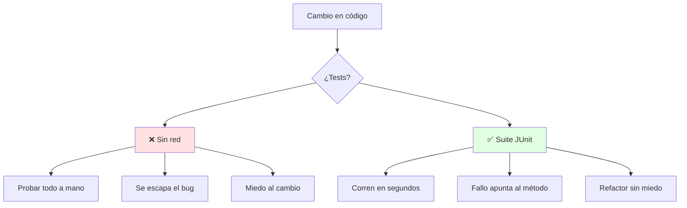
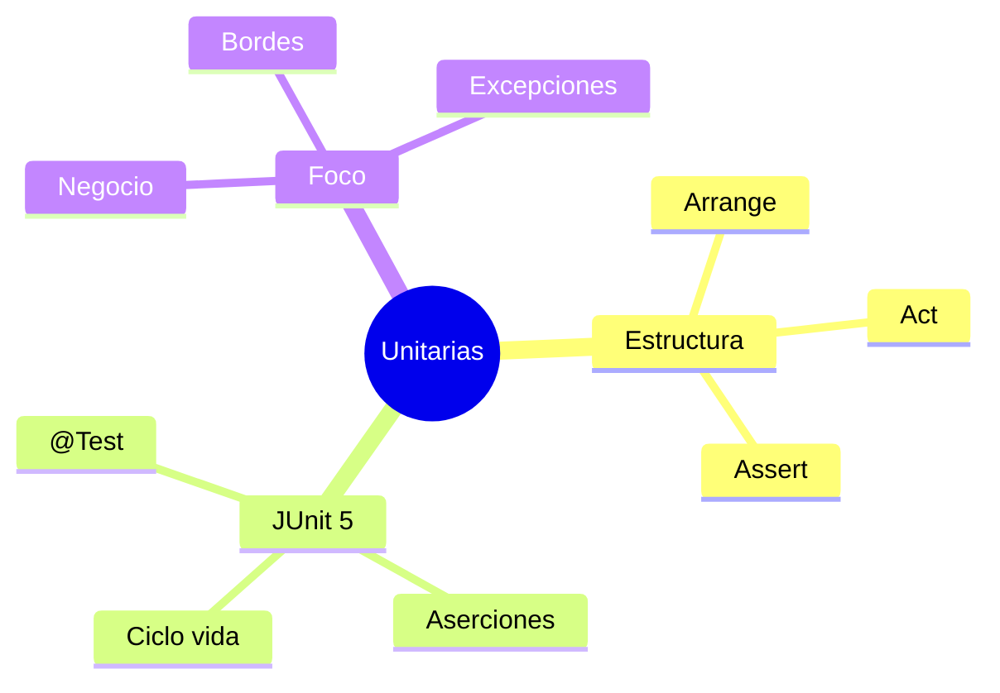

# ✅ Pruebas Unitarias con JUnit 5

## 🎯 Introducción

> [!info] 💡 ¿Por Qué Probar Piezas y no Solo el Sistema?
>
> Las **pruebas unitarias** verifican la unidad mínima (un método, una clase) de forma aislada. Son la red que sostiene la refactorización de la Unidad 4: sin ellas, cada limpieza es un salto al vacío.
>
> **Analogía del mundo real:** Piensa en control de calidad de una fábrica:
>
> - **Sin unitarias** → Pruebas el auto armado y si falla no sabes qué pieza es (debug de horas)
> - **Con unitarias** → Cada pieza se prueba al salir de su estación (el fallo apunta al culpable)
> - **JUnit 5 (Jupiter)** → La estación de pruebas estándar en Java: anotas, afirmas y corres
> - **Tu proyecto** → Cada clase de dominio con su clase de test es nota de validación casi regalada
>
> | Razón | Solo Prueba Manual | Unitarias JUnit |
> |---|---|---|
> | **Regresión** | Re-pruebas todo a mano | 1 comando corre cientos |
> | **Refactor** | Miedo a tocar | Red de seguridad |
> | **Documentación** | README que miente | Tests que muestran uso real |
> | **Nota** | Validación improvisada | Evidencia de calidad |



---

## 🧵 Anatomía de un Test JUnit 5 (docs oficiales)

### 🎭 Arrange, Act, Assert

> [!note] 🎨 Estructura que Repites Siempre
>
> Todo test tiene 3 fases: **prepara** (Arrange), **ejecuta** (Act), **verifica** (Assert). La forma oficial Jupiter, según la guía de JUnit (docs.junit.org):
>
> ```java
> import static org.junit.jupiter.api.Assertions.assertEquals;
> import example.util.Calculator;
> import org.junit.jupiter.api.Test;
>
> class CalculadoraTests {
>     private final Calculator calculator = new Calculator(); // Arrange
>
>     @Test
>     void addition() {
>         assertEquals(2, calculator.add(1, 1)); // Act + Assert
>     }
> }
> ```
>
> **Aserciones que cubren el 90% de tus tests:**
>
> | Aserción | Verifica | Ejemplo |
> |---|---|---|
> | `assertEquals(esp, real)` | Igualdad | `assertEquals(2, calc.add(1, 1))` |
> | `assertTrue(cond)` | Condición cierta | `assertTrue(cuenta.saldo() >= 0)` |
> | `assertNotNull(obj)` | No nulo | `assertNotNull(repo.buscar(id))` |
> | `assertThrows(Tipo.class, () -> ...)` | Lanza excepción esperada | `assertThrows(ArithmeticException.class, () -> calc.divide(1, 0))` |
> | `assertTimeoutPreemptively(Duration, () -> ...)` | Termina a tiempo | Límite de 1s a una consulta |
>
> **Ciclo de vida** (para preparar y limpiar entre tests):
>
> ```java
> class PedidoTests {
>     @BeforeEach
>     void setUp() { /* se ejecuta ANTES de cada @Test: arma objetos frescos */ }
>
>     @Test
>     void totalAplicaDescuento() { /* ... */ }
>
>     @AfterEach
>     void tearDown() { /* limpieza después de cada test */ }
> }
> ```
>
> `@BeforeAll` / `@AfterAll` (estáticos) corren una vez por clase: conexiones pesadas, datos compartidos de solo lectura.

### 🔍 Qué Probar Primero en tu Proyecto

> [!example] 🧪 Orden Rentable
>
> 1. **Reglas de negocio** (descuentos, validaciones, cálculos): rompen la nota si fallan
> 2. **Casos borde**: cero, vacío, nulo, máximo (ahí viven los bugs)
> 3. **Excepciones**: lo que debe fallar, que falle con el error correcto (`assertThrows`)
> 4. **Al final**: getters/setters triviales (casi nunca valen un test propio)
>
> **Regla:** si el método tiene un `if`, merece al menos 2 tests (cada rama).

---

## ⚠️ Problemas Comunes y Soluciones

> [!danger] ❌ Error: Tests que Dependen del Orden o de Datos Reales
>
> **Síntomas:** pasan solos, fallan en grupo; o fallan sin internet porque pegan a la BD real.
>
> **Solución:**
>
> - Cada test arma sus datos en `@BeforeEach`: independencia total
> - BD/red/archivos → dobles de prueba (fakes o mocks) en unitarias; lo real es para integración (Pressman cap. 20, fuera de esta unidad)

---

## 🎯 Mejores Prácticas

> [!tip] 🏆 Checklist de Suite Sana
>
> **1. Nombres que cuentan la historia**
>
> - `totalAplicaDescuentoMayorista()` dice más que `test1()`
>
> **2. 1 comportamiento por test**
>
> - Test que verifica 5 cosas falla por 5 motivos y no dice cuál
>
> **3. Rápidos y deterministas**
>
> - Segundos, no minutos; sin azar ni fechas "hoy" hardcodeadas
>
> **4. Corre la suite antes de cada commit**
>
> - Verde para avanzar, rojo para detenerte: es tu semáforo (conecta con Unidad 4)

---

## 📊 Resumen Visual



> [!success] 🔍 Comparación Final
>
> | Aspecto | Probar a Mano | Suite JUnit |
> |---|---|---|
> | **Regresión** | ❌ Eterna | ✅ Segundos |
> | **Refactor** | Miedo | Red de seguridad |
> | **Uso Recomendado** | Exploratorio | ✅ **Cada clase de dominio** |

---

## 🚀 Próximos Pasos

> [!quote] 🌟 Continuando
>
> **Has aprendido:**
>
> ✅ Estructura Arrange-Act-Assert con código oficial Jupiter
> ✅ Aserciones y ciclo de vida esenciales
> ✅ Qué probar primero y errores de novato
>
> **Próximo tema:**
>
> | Tema | Qué verás | Por qué importa |
> |---|---|---|
> | **Control de versiones con Git** | Ramas, commits, colaboración | Donde viven tus tests y tu equipo |

---

## 🔗 Seguir estudiando

> [!info] 📚 Seguir estudiando
>
> - Mapa de contenido: [[Diseño de Software]]
> - Índice Unidad 5: [[00 - Índice Unidad 5]]
> - Siguiente: [[02 - Control de versiones con Git]]
> - Syllabus: [[Bienvenida y Syllabus Diseño de Software]]

## 📚 Referencias

> [!quote] 📖 Fuentes
>
> - R. Pressman, B. Maxim, *Software Engineering: A Practitioner's Approach*, 9th ed., cap. 19 (pruebas a nivel de componente).
> - JUnit 5 User Guide (docs.junit.org): estructura de tests, aserciones, ciclo de vida — vía Context7.
> - Sílabo CCPG1042, Unidad 5: pruebas unitarias (4h).

---

**Tags:** #CCPG1042 #unidad5 #junit #pruebas #testing
