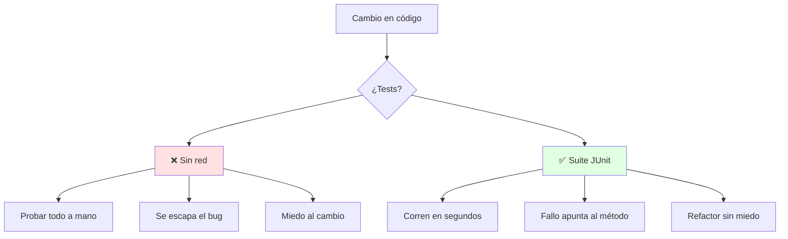
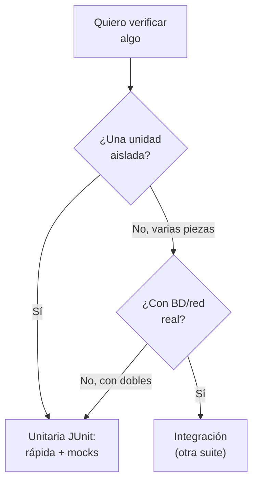
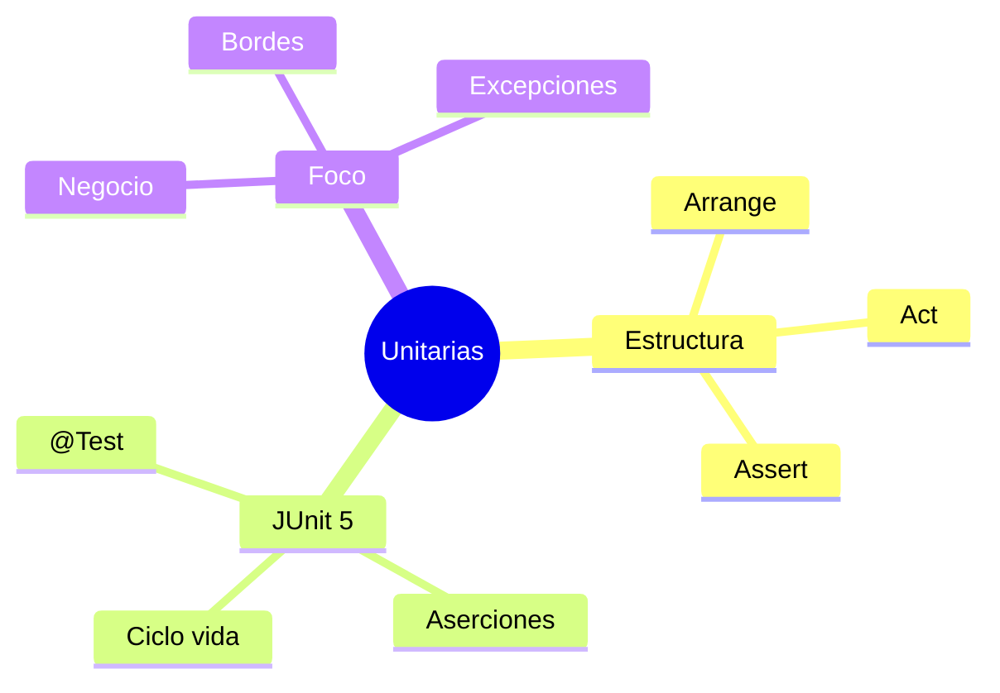

# ✅ Pruebas Unitarias con JUnit 5

## 🎯 Introducción

> [!info] 💡 ¿Por Qué Probar Piezas y no Solo el Sistema?
>
> Las **pruebas unitarias** verifican la unidad mínima (un método, una clase) de forma aislada. Son la red que sostiene la refactorización de la Unidad 4: sin ellas, cada limpieza es un salto al vacío.
>
> **Importancia histórica:** el movimiento xUnit nació con Kent Beck (Smalltalk, años 90) y se popularizó con JUnit (Beck + Gamma, 1997) — el mismo Gamma de los patrones. JUnit 5 (Jupiter, 2017) modernizó el modelo con anotaciones y ciclo de vida explícitos.
>
> **Relevancia actual:** CI/CD no existe sin suites rápidas — cada push corre miles de tests en segundos. Un proyecto sin tests unitarios no puede practicar entrega continua (nota U5-03).
>
> **Analogía del mundo real:** piensa en control de calidad de una fábrica:
>
> - **Sin unitarias** → Pruebas el auto armado y si falla no sabes qué pieza es.
> - **Con unitarias** → Cada pieza se prueba al salir de su estación (el fallo apunta al culpable).
> - **JUnit 5 (Jupiter)** → La estación de pruebas estándar en Java: anotas, afirmas y corres.
>
> | Razón | Solo Prueba Manual | Unitarias JUnit |
> |---|---|---|
> | **Regresión** | Re-pruebas todo a mano | 1 comando corre cientos |
> | **Refactor** | Miedo a tocar | Red de seguridad |
> | **Documentación** | README que miente | Tests que muestran uso real |
> | **Nota** | Validación improvisada | Evidencia de calidad |



---

## 🧵 Anatomía de un Test JUnit 5 (docs oficiales)

### 🎭 Arrange, Act, Assert

> [!note] 📋 Definición — Estructura AAA
>
> Todo test tiene 3 fases: **prepara** (Arrange), **ejecuta** (Act), **verifica** (Assert). La forma oficial Jupiter, según la guía de JUnit (docs.junit.org):
>
> ```java
> import static org.junit.jupiter.api.Assertions.assertEquals;
> import example.util.Calculator;
> import org.junit.jupiter.api.Test;
>
> class CalculadoraTests {
>     private final Calculator calculator = new Calculator(); // Arrange
>
>     @Test
>     void addition() {
>         assertEquals(2, calculator.add(1, 1)); // Act + Assert
>     }
> }
> ```
>
> **Aserciones que cubren el 90% de tus tests:**
>
> | Aserción | Verifica | Ejemplo |
> |---|---|---|
> | `assertEquals(esp, real)` | Igualdad | `assertEquals(2, calc.add(1, 1))` |
> | `assertTrue(cond)` | Condición cierta | `assertTrue(cuenta.saldo() >= 0)` |
> | `assertNotNull(obj)` | No nulo | `assertNotNull(repo.buscar(id))` |
> | `assertThrows(Tipo.class, () -> ...)` | Lanza excepción esperada | `assertThrows(ArithmeticException.class, () -> calc.divide(1, 0))` |
> | `assertTimeoutPreemptively(Duration, () -> ...)` | Termina a tiempo | Límite de 1s a una consulta |
>
> **Ciclo de vida** (para preparar y limpiar entre tests):
>
> ```java
> class PedidoTests {
>     @BeforeEach
>     void setUp() { /* se ejecuta ANTES de cada @Test: arma objetos frescos */ }
>
>     @Test
>     void totalAplicaDescuento() { /* ... */ }
>
>     @AfterEach
>     void tearDown() { /* limpieza después de cada test */ }
> }
> ```
>
> `@BeforeAll` / `@AfterAll` (estáticos) corren una vez por clase: conexiones pesadas, datos compartidos de solo lectura.

### 🔍 Qué Probar Primero en tu Proyecto

> [!example] 🧪 Orden Rentable
>
> 1. **Reglas de negocio** (descuentos, validaciones, cálculos): rompen la nota si fallan.
> 2. **Casos borde**: cero, vacío, nulo, máximo (ahí viven los bugs).
> 3. **Excepciones**: lo que debe fallar, que falle con el error correcto (`assertThrows`).
> 4. **Al final**: getters/setters triviales (casi nunca valen un test propio).
>
> **Regla:** si el método tiene un `if`, merece al menos 2 tests (cada rama).

---

## 🗺️ Diagrama de Decisión: ¿Qué Tipo de Prueba Escribo?



> [!tip] 💡 Lectura del diagrama
>
> Si tu "unitaria" necesita internet o BD real, ya no es unitaria — es de integración disfrazada. Sepáralas en suites distintas.

---

## ⚠️ Problemas Comunes y Soluciones

> [!danger] ❌ Error 1: Tests que Dependen del Orden o de Datos Reales (viola **independencia + dobles de prueba**)
>
> **Síntomas:** pasan solos, fallan en grupo; o fallan sin internet porque pegan a la BD real:
>
> ```java
> // ❌ EL ERROR ESTÁ AQUÍ: orden implícito + dependencia real
> class PedidoTests {
>     static int contador; // ❌ estado compartido entre tests
>     @Test void crea() { contador++; guardarEnBDReal(); } // ❌ BD de verdad
>     @Test void lee() { assertEquals(1, contador); } // ❌ depende del anterior
> }
> ```
>
> **Solución:**
>
> - Cada test arma sus datos en `@BeforeEach`: independencia total.
> - BD/red/archivos → dobles de prueba (fakes o mocks) en unitarias; lo real es para integración (Pressman cap. 20, fuera de esta unidad).

> [!danger] ❌ Error 2: Tests que Prueban Getters (viola **valor por test**)
>
> **Síntomas:** 50 tests que solo verifican getters/setters auto-generados; la suite es larga y no protege nada.
>
> **Solución:** borra los triviales; cada test debe proteger una decisión o regla real del dominio.

> [!danger] ❌ Error 3: Nombres que no Cuentan Nada (viola **test como documentación**)
>
> **Síntomas:** `test1()`, `testFinal2()` — cuando fallan, nadie sabe qué se rompió sin leer el cuerpo.
>
> **Solución:** `totalAplicaDescuentoMayorista()` dice qué verifica; el nombre es el primer diagnóstico.

---

## 🎯 Mejores Prácticas

> [!tip] 🏆 Checklist de Suite Sana
>
> **1. Nombres que cuentan la historia**
>
> `totalAplicaDescuentoMayorista()` dice más que `test1()`.
>
> **2. 1 comportamiento por test**
>
> Test que verifica 5 cosas falla por 5 motivos y no dice cuál.
>
> **3. Rápidos y deterministas**
>
> Segundos, no minutos; sin azar ni fechas "hoy" hardcodeadas.
>
> **4. Corre la suite antes de cada commit**
>
> Verde para avanzar, rojo para detenerte: es tu semáforo (conecta con Unidad 4).

---

## 📝 Ejercicios Propuestos

> [!example] 📋 Nivel 1 — Básico
>
> **1.** Escribe la estructura AAA de un test para `sumar(a, b)` con JUnit 5.
>
> **2.** ¿Qué hace cada anotación del ciclo de vida (`@BeforeAll`, `@BeforeEach`, `@Test`, `@AfterEach`, `@AfterAll`)?
>
> **3.** Elige la aserción correcta para: (a) igualdad, (b) excepción esperada, (c) no-nulo, (d) límite de tiempo.
>
> **4.** ¿Por qué un método con un `if` merece al menos 2 tests?
>
> **5.** Explica con tus palabras por qué los tests son "documentación que no miente".
>
> > [!success]- ✅ Respuestas — Nivel 1
> >
> > - **1.** Arrange (calculadora nueva), Act (`add`), Assert (`assertEquals`).
> > - **2.** BeforeAll/AfterAll: 1 vez por clase (estáticos). BeforeEach/AfterEach: por cada test. Test: el caso.
> > - **3.** (a) assertEquals, (b) assertThrows, (c) assertNotNull, (d) assertTimeoutPreemptively.
> > - **4.** Porque cada rama es un comportamiento distinto que puede fallar por separado.
> > - **5.** Porque se ejecutan: si el código cambia y el test sigue verde, la doc sigue vigente; el README no se verifica solo.

> [!example] 📋 Nivel 2 — Intermedio
>
> **6.** Escribe 3 tests para `descuento(edad, esEstudiante)` cubriendo ramas y un borde.
>
> **7.** Convierte un test que pega a BD real en uno con fake: muestra antes/después.
>
> **8.** Diseña `@BeforeEach` para una suite de `Pedido` con 4 tests independientes.
>
> **9.** ¿Cómo probarías un método que debe lanzar excepción con mensaje exacto? Muestra el código.
>
> **10.** Tu suite tarda 5 minutos. Diagnostica con esta nota y propón 3 recortes concretos.
>
> > [!success]- ✅ Respuestas — Nivel 2
> >
> > - **6.** Rama estudiante, rama mayor, borde edad=0 o negativa.
> > - **7.** Antes: `repoReal.guardar()`; después: `FakeRepo` en memoria inyectado por constructor.
> > - **8.** Crea pedido fresco + líneas de ejemplo en cada setup; nada compartido entre tests.
> > - **9.** `Exception e = assertThrows(Tipo.class, () -> ...); assertEquals("mensaje", e.getMessage());`
> > - **10.** Sospechosos: BD real, sleeps, fechas del sistema. Recortes: fakes, tiempos simulados, datos fijos.

> [!example] 📋 Nivel 3 — Avanzado
>
> **11.** Argumenta por qué "cobertura 100%" puede coexistir con software mal probado. Da un ejemplo concreto.
>
> **12.** Diseña la estrategia de tests (unitarias vs integración) para tu proyecto de curso: ¿qué va en cada suite?
>
> **13.** Un test falla solo los lunes. Diagnostica 3 causas posibles con esta nota y cómo confirmar cada una.
>
> **14.** Conecta tests con falsabilidad (Martin) y con refactor seguro (U4): argumenta la cadena completa.
>
> **15.** Escribe la política de tests de 1 página para tu equipo (nombres, independencia, velocidad, cuándo correr).
>
> > [!success]- ✅ Respuestas — Nivel 3
> >
> > - **11.** Cobertura mide líneas ejecutadas, no aserciones: 100% con asserts débiles (`assertTrue(true)`) no protege nada.
> > - **12.** Unitarias: reglas de negocio con mocks. Integración: flujos con BD/archivos reales de prueba.
> > - **13.** Fecha del sistema ("hoy"), datos compartidos entre suites, orden aleatorio con estado global. Confirmar: fijar semilla/fecha y aislar.
> > - **14.** Test = intento de refutación; suite verde = no refutado (suficientemente correcto); refactor cambia estructura bajo esa red.
> > - **15.** Respuesta libre guiada: las 4 reglas del checklist + suites separadas + gate en PRs.

---

## 📋 Resumen Ejecutivo

> [!summary] 📋 Lo Esencial
>
> - **AAA:** Arrange, Act, Assert — siempre en ese orden.
> - **JUnit 5:** `@Test` + aserciones + ciclo de vida; dobles para lo externo.
> - Tests **rápidos, independientes y con nombre** que cuente la historia.
> - La suite corre **antes de cada commit**: semáforo del equipo.

---

## ✅ Metas de Aprendizaje

> [!note] 🎯 Nivel Básico
> - [ ] Escribo un test AAA completo con JUnit 5 sin mirar.
> - [ ] Elijo la aserción correcta para cada caso.
> - [ ] Explico el ciclo de vida con ejemplo propio.

> [!note] 🎯 Nivel Intermedio
> - [ ] Cubro ramas y bordes sistemáticamente.
> - [ ] Sustituyo dependencias reales por fakes/mocks.
> - [ ] Diagnostico tests orden-dependientes y los independizo.

> [!note] 🎯 Nivel Avanzado
> - [ ] Diseño suites separadas (unitarias vs integración) con criterio.
> - [ ] Critico "cobertura 100%" con argumento y ejemplo.
> - [ ] Escribo la política de tests de mi equipo.

---

## 📊 Resumen Visual



> [!success] 🔍 Comparación Final
>
> | Aspecto | Probar a Mano | Suite JUnit |
> |---|---|---|
> | **Regresión** | ❌ Eterna | ✅ Segundos |
> | **Refactor** | Miedo | Red de seguridad |
> | **Decisión** | Adivinada | Con diagrama propio |
> | **Uso Recomendado** | Exploratorio | ✅ **Cada clase de dominio** |

---

## 🚀 Próximos Pasos

> [!quote] 🌟 Continuando
>
> **Has aprendido:**
>
> ✅ Estructura AAA + JUnit 5 oficial + diagrama de decisión propio
> ✅ Qué probar primero + 3 errores numerados
> ✅ Independencia como ley no negociable
>
> **Próximo tema:**
>
> | Tema | Qué verás | Por qué importa |
> |---|---|---|
> | **Control de versiones con Git** | Ramas, commits, colaboración | Donde viven tus tests y tu equipo |

---

## 🔗 Seguir estudiando

> [!info] 📚 Seguir estudiando
>
> - Mapa de contenido: [[Diseño de Software]]
> - Índice Unidad 5: [[00 - Índice Unidad 5]]
> - Siguiente: [[02 - Control de versiones con Git]]
> - Syllabus: [[Bienvenida y Syllabus Diseño de Software]]

## 📚 Referencias

> [!quote] 📖 Fuentes
>
> - R. Pressman, B. Maxim, *Software Engineering: A Practitioner's Approach*, 9th ed., cap. 19.
> - JUnit 5 User Guide (docs.junit.org) vía Context7 + K. Beck (origen xUnit).
> - Sílabo CCPG1042, Unidad 5: pruebas unitarias (4h).

---

**Tags:** #CCPG1042 #unidad5 #junit #pruebas #testing #diseno-software
