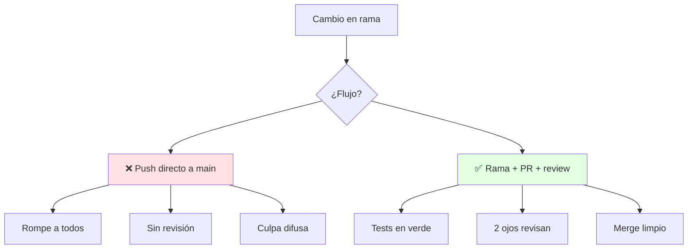
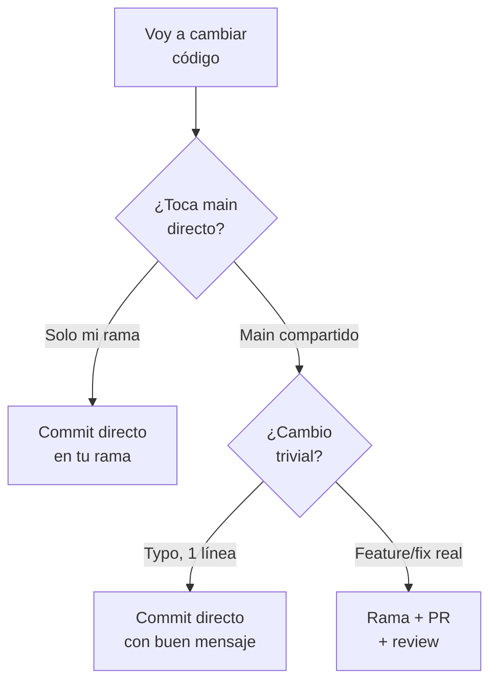
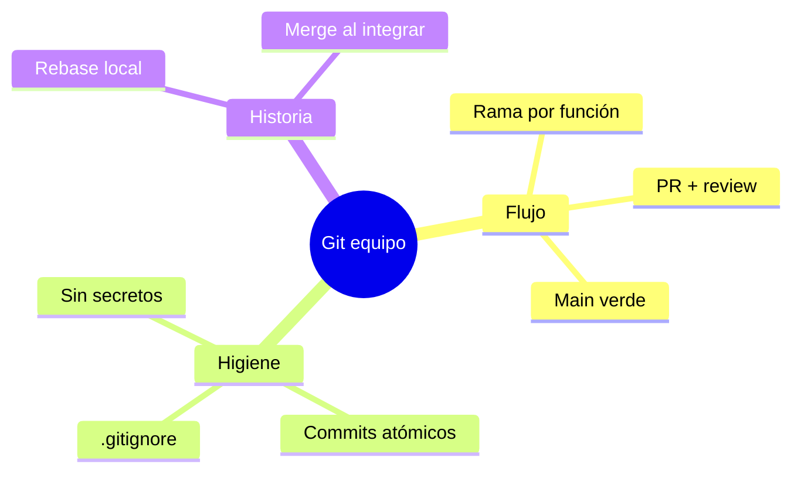

# 🔧 Control de Versiones con Git

## 🎯 Introducción

> [!info] 💡 ¿Por Qué Git es Parte del Diseño y no Solo Herramienta?
>
> El **control de versiones** (Pressman cap. 22, SCM) guarda cada cambio con quién, cuándo y por qué — y permite ramas paralelas sin pisarse. El syllabus lo exige en el objetivo 4: software de calidad *en entorno colaborativo*.
>
> **Importancia histórica:** antes de Git reinaban CVS y Subversion centralizados — una caída del servidor paralizaba al equipo. Linus Torvalds creó Git (2005) distribuido por necesidad del kernel Linux: cada clon es el repositorio completo, y GitHub (2008) lo volvió social con pull requests.
>
> **Relevancia actual:** tu nota, tu proyecto y tu empleo viven en Git. Un historial limpio es tu currículum silencioso.
>
> **Analogía del mundo real:** piensa en Google Docs con esteroides:
>
> - **Sin control** → `proyecto_final_v3_REAL2.zip` por WhatsApp (¿cuál es la buena?)
> - **Con Git** → Historial único, ramas por función, fusiones revisadas.
> - **Rama** → Mesa de trabajo separada: experimentas sin romper lo estable.
> - **Commit** → Foto firmada del avance con mensaje que explica el porqué.
>
> | Razón | ZIPs por Chat | Git |
> |---|---|---|
> | **Historial** | Se pierde | Cada cambio trazable |
> | **Paralelo** | Se pisan | Ramas por persona/función |
> | **Errores** | Reescribir a mano | `revert` de 1 commit |
> | **Colaboración** | Turnos | Revisión por pull request |



---

## 🧵 Flujo Mínimo de Equipo (Pressman cap. 22 + tus enlaces)

### 🎭 Rama, Commit, Push, PR

> [!note] 📋 Definición — El Ciclo Diario
>
> 1. **Actualiza y ramifica:** `git pull` en main, crea `feat/inscripciones` (1 rama = 1 función).
> 2. **Commits pequeños:** mensajes en imperativo — "agrega validación de cupo", no "cambios".
> 3. **Push + Pull Request:** la rama pide fusión; nadie se auto-aprueba.
> 4. **Review con checklist:** ¿compila? ¿tests verdes? ¿respeta capas? (ver Unidad 2).
> 5. **Merge y borra la rama:** main siempre verde y desplegable.
>
> ```mermaid
> graph LR
>     M[main verde] --> R[rama feat]
>     R --> C[commits chicos]
>     C --> PR[Pull Request]
>     PR --> RV[Review + tests]
>     RV --> M
>     style M fill:#e1ffe1
> ```
>
> **Comandos que cubren el 90% del curso:**
>
> | Necesito | Comando |
> |---|---|
> | Ver estado | `git status` |
> | Guardar avance | `git add -p` + `git commit -m "verbo + qué"` |
> | Traer cambios | `git pull --rebase` |
> | Nueva función | `git checkout -b feat/nombre` |
> | Deshacer último commit local | `git reset --soft HEAD~1` |
> | Ver historia legible | `git log --oneline --graph -10` |
>
> Profundiza con tus enlaces guardados: [Video YouTube — Git (desde 1:30)](https://www.youtube.com/watch?v=4XpnKHJAok8&t=1m30s), [Git: cómo gestionar y cuidar nuestro código](https://www.enmilocalfunciona.io/git-como-gestionar-y-cuidar-nuestro-codigo/) y [Resolución de conflictos en GitHub — David Jurado](https://www.youtube.com/watch?v=H34vxQeQkgg) — todos en [[Unidad 0 - Guias y Ejercicios/Enlaces del Aula Virtual|Enlaces del Aula Virtual]].

### 🔍 Buenas Prácticas que Evalúan Colaboración

> [!example] 🧪 Reglas de Equipo que Sí Puntúan
>
> - **Main protegido:** nada se sube sin PR aprobado (configúralo en GitHub desde el día 1).
> - **Convención de ramas:** `feat/`, `fix/`, `docs/` + nombre corto en minúsculas.
> - **Commits atómicos:** compila + tests verdes en cada commit, no "WIP" de 3 días.
> - **`.gitignore` desde el inicio:** `*.class`, `target/`, `.idea/`, credenciales — jamás binarios ni tokens.
> - **README vivo:** cómo compilar, probar y la arquitectura en 5 líneas (ver nota de arquitectura).

---

## 🗺️ Diagrama de Decisión: ¿Directo, Rama o PR?



> [!tip] 💡 Lectura del diagrama
>
> La rama es el valor por defecto en equipo; el commit directo a main compartido casi nunca se justifica.

---

## ⚠️ Problemas Comunes y Soluciones

> [!danger] ❌ Error 1: Commits "Arreglos Varios" de 40 Archivos (viola **commit atómico**)
>
> **Síntomas:** review imposible, revertir rompe 3 funciones, nadie sabe qué cambió.
>
> **Solución:**
>
> - Límite: 1 commit = 1 idea, describible en 1 línea.
> - Mezclaste 2 ideas: `git reset --soft HEAD~1`, reagrupa con `git add -p` y recomitea.
> - Retraso crónico: commitea al terminar cada técnica de refactor (Unidad 4), no al final del día.

> [!danger] ❌ Error 2: Push Directo a Main Compartido (viola **revisión por pares**)
>
> **Síntomas:** main roto un lunes a las 8am y nadie sabe quién ni por qué.
>
> **Solución:** protege main en GitHub (requiere PR + checks verdes); el atajo de hoy es el incidente de mañana.

> [!danger] ❌ Error 3: Secretos Commiteados (viola **higiene del repo**)
>
> **Síntomas:** tokens y claves en el historial, visibles para siempre aunque los borres después.
>
> **Solución:** `.gitignore` desde el día 1 + variables de entorno; si se filtra uno, se rota el mismo día (no basta borrarlo).

---

## 🎯 Mejores Prácticas

> [!tip] 🏆 Checklist Colaborativo
>
> **1. Sincroniza cada mañana**
>
> `pull --rebase` antes de empezar: conflictos de 5 líneas, no de 500.
>
> **2. Revisa como te gustaría ser revisado**
>
> Comenta el código, pregunta antes de exigir, aprueba rápido lo bueno.
>
> **3. Todo secreto fuera del repo**
>
> Tokens y claves por variables de entorno; si se filtra uno, se rota el mismo día.
>
> **4. Ramas de vida corta**
>
> Días, no semanas: mientras más vive una rama, más duele su merge.

---

## 📝 Ejercicios Propuestos

> [!example] 📋 Nivel 1 — Básico
>
> **1.** Describe el ciclo rama → commit → push → PR → merge con tus palabras.
>
> **2.** ¿Qué hace cada comando: `status`, `add -p`, `commit -m`, `pull --rebase`, `checkout -b`, `log --oneline --graph`?
>
> **3.** Escribe 3 buenos y 3 malos mensajes de commit y explica la diferencia.
>
> **4.** ¿Qué debe tener un `.gitignore` Java mínimo y por qué cada entrada?
>
> **5.** ¿Por qué nadie debería pushear directo a main compartido?
>
> > [!success]- ✅ Respuestas — Nivel 1
> >
> > - **1.** Ramificas, commiteas chico, subes, pides revisión, fusionas y borras la rama.
> > - **2.** Estado, staging parcial, guardar con mensaje, traer con rebase, crear rama, historia legible.
> > - **3.** Buenos: verbo + qué ("agrega validación de cupo"). Malos: "cambios", "arreglos", "WIP final 2".
> > - **4.** `*.class`, `target/`, `.idea/`, `*.env`: compilados, IDE y secretos no viajan.
> > - **5.** Porque elimina la revisión y convierte main en zona de riesgo para todos.

> [!example] 📋 Nivel 2 — Intermedio
>
> **6.** Mezclaste 2 ideas en 1 commit ya pusheado a tu rama. Recupéralo paso a paso sin perder nada.
>
> **7.** Diseña la convención de ramas y mensajes para tu equipo de 4 (con ejemplos).
>
> **8.** Un compañero commiteó un token. Lista los pasos de respuesta en orden.
>
> **9.** Configura (en prosa) la protección de main en GitHub: ¿qué reglas activas y por qué?
>
> **10.** Resuelve un conflicto de merge típico (misma línea editada por 2): pasos exactos.
>
> > [!success]- ✅ Respuestas — Nivel 2
> >
> > - **6.** `reset --soft HEAD~1` → `add -p` por idea → 2 commits → `push --force-with-lease` (solo tu rama).
> > - **7.** `feat/`, `fix/`, `docs/` + nombre corto; mensajes imperativo + alcance. Ejemplos concretos del proyecto.
> > - **8.** Revocar/rotar el token YA → limpiar historial si es necesario → `.gitignore` + variables de entorno → avisar al equipo.
> > - **9.** Requerir PR + 1 aprobación + checks verdes + prohibir push directo: main siempre desplegable.
> > - **10.** `pull --rebase`, abre el conflicto, elige/combina a mano, `add`, continúa, tests, push.

> [!example] 📋 Nivel 3 — Avanzado
>
> **11.** Argumenta `rebase` vs `merge` para historiales de equipo: ¿cuándo cada uno?
>
> **12.** Diseña el flujo Git completo de tu proyecto (ramas, PRs, releases) en 1 diagrama + reglas.
>
> **13.** Un PR lleva 3 semanas abierto con 40 commits. Diagnostica y propón rescate concreto.
>
> **14.** ¿Cómo se relaciona "main siempre verde" con entrega continua (nota U5-03)? Argumenta la cadena.
>
> **15.** Escribe la guía Git de 1 página para tu equipo (la que leería un miembro nuevo el día 1).
>
> > [!success]- ✅ Respuestas — Nivel 3
> >
> > - **11.** Rebase: historial lineal legible (ramas propias). Merge: preserva contexto real (main compartido). Regla: rebase local, merge al integrar.
> > - **12.** Respuesta libre guiada: main protegido + ramas feat/fix + releases etiquetados + convenciones del checklist.
> > - **13.** Síntoma de rama eterna: pártelo en PRs chicos fusionables por semana; lo no listo va tras feature flag o se descarta.
> > - **14.** Main verde + tests = base desplegable en cada commit: sin eso no hay pipeline que valga.
> > - **15.** Respuesta libre guiada: ciclo diario, convenciones, protección de main, qué hacer si algo sale mal.

---

## 📋 Resumen Ejecutivo

> [!summary] 📋 Lo Esencial
>
> - **Rama por función**, commits atómicos, PR con review, main siempre verde.
> - `.gitignore` desde el día 1; secretos por variables de entorno.
> - Sincroniza a diario; ramas cortas; rebase local, merge al integrar.

---

## ✅ Metas de Aprendizaje

> [!note] 🎯 Nivel Básico
> - [ ] Describo el ciclo completo rama→merge sin mirar.
> - [ ] Uso los 6 comandos base con soltura.
> - [ ] Escribo mensajes de commit que cuentan la historia.

> [!note] 🎯 Nivel Intermedio
> - [ ] Rescato commits mezclados sin perder trabajo.
> - [ ] Respondo a un secreto filtrado en orden correcto.
> - [ ] Configuro protección de main con criterio.

> [!note] 🎯 Nivel Avanzado
> - [ ] Decido rebase vs merge según el caso.
> - [ ] Diseño el flujo Git completo de un equipo.
> - [ ] Escribo la guía Git de 1 página para recién llegados.

---

## 📊 Resumen Visual



> [!success] 🔍 Comparación Final
>
> | Aspecto | ZIPs | Git con Flujo |
> |---|---|---|
> | **Trazabilidad** | ❌ Nula | Cada cambio firmado |
> | **Colaborar** | Turnos | Paralelo + review |
> | **Decisión** | Adivinada | Con diagrama propio |
> | **Uso Recomendado** | Nunca en equipo | ✅ **Objetivo 4 del syllabus** |

---

## 🚀 Próximos Pasos

> [!quote] 🌟 Continuando
>
> **Has aprendido:**
>
> ✅ Flujo diario + historia Git + diagrama de decisión propio
> ✅ 3 errores numerados + convenciones de equipo
> ✅ Protección de main y respuesta a secretos
>
> **Próximo tema:**
>
> | Tema | Qué verás | Por qué importa |
> |---|---|---|
> | **Entrega continua y DevOps** | Pipeline CI/CD | Donde tu Git se vuelve entrega |

---

## 🔗 Seguir estudiando

> [!info] 📚 Seguir estudiando
>
> - Mapa de contenido: [[Diseño de Software]]
> - Índice Unidad 5: [[00 - Índice Unidad 5]]
> - Anterior: [[01 - Pruebas unitarias con JUnit 5]]
> - Siguiente: [[03 - Entrega continua y DevOps]]
> - Syllabus: [[Bienvenida y Syllabus Diseño de Software]]

## 📚 Referencias

> [!quote] 📖 Fuentes
>
> - R. Pressman, B. Maxim, *Software Engineering: A Practitioner's Approach*, 9th ed., cap. 22 (SCM).
> - L. Torvalds (2005), Git — historia; GitHub (2008), pull requests.
> - [Git: cómo gestionar y cuidar nuestro código](https://www.enmilocalfunciona.io/git-como-gestionar-y-cuidar-nuestro-codigo/) + [Video YouTube — Git](https://www.youtube.com/watch?v=4XpnKHJAok8&t=1m30s) + [Resolución de conflictos en GitHub — David Jurado](https://www.youtube.com/watch?v=H34vxQeQkgg).

---

**Tags:** #CCPG1042 #unidad5 #git #versiones #colaboracion #diseno-software
