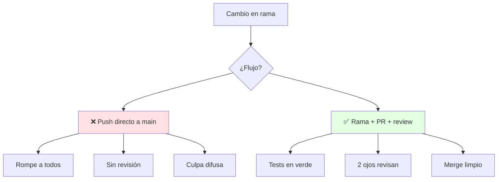
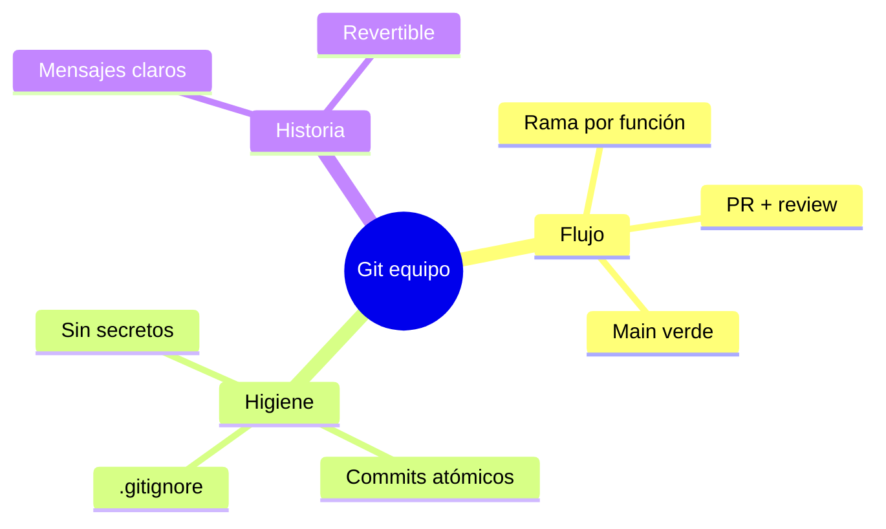

# 🔧 Control de Versiones con Git

## 🎯 Introducción

> [!info] 💡 ¿Por Qué Git es Parte del Diseño y no Solo Herramienta?
>
> El **control de versiones** (Pressman cap. 22, SCM) guarda cada cambio con quién, cuándo y por qué — y permite ramas paralelas sin pisarse. El syllabus lo exige en el objetivo 4: software de calidad *en entorno colaborativo*.
>
> **Analogía del mundo real:** Piensa en Google Docs con esteroides:
>
> - **Sin control** → `proyecto_final_v3_REAL2.zip` por WhatsApp (¿cuál es la buena?)
> - **Con Git** → Historial único, ramas por función, fusiones revisadas
> - **Rama** → Mesa de trabajo separada: experimentas sin romper lo estable
> - **Commit** → Foto firmada del avance con mensaje que explica el porqué
>
> | Razón | ZIPs por Chat | Git |
> |---|---|---|
> | **Historial** | Se pierde | Cada cambio trazable |
> | **Paralelo** | Se pisan | Ramas por persona/función |
> | **Errores** | Reescribir a mano | `revert` de 1 commit |
> | **Colaboración** | Turnos | Revisión por pull request |



---

## 🧵 Flujo Mínimo de Equipo (Pressman cap. 22 + tus enlaces)

### 🎭 Rama, Commit, Push, PR

> [!note] 🎨 El Ciclo que Repites a Diario
>
> 1. **Actualiza y ramifica:** `git pull` en main, crea `feat/inscripciones` (1 rama = 1 función)
> 2. **Commits pequeños:** mensajes en imperativo — "agrega validación de cupo", no "cambios"
> 3. **Push + Pull Request:** la rama pide fusión; nadie se auto-aprueba
> 4. **Review con checklist:** ¿compila? ¿tests verdes? ¿respeta capas? (ver Unidad 2)
> 5. **Merge y borra la rama:** main siempre verde y desplegable
>
> ```mermaid
> graph LR
>     M[main verde] --> R[rama feat]
>     R --> C[commits chicos]
>     C --> PR[Pull Request]
>     PR --> RV[Review + tests]
>     RV --> M
>
>     style M fill:#e1ffe1
> ```
>
> **Comandos que cubren el 90% del curso:**
>
> | Necesito | Comando |
> |---|---|
> | Ver estado | `git status` |
> | Guardar avance | `git add -p` + `git commit -m "verbo + qué"` |
> | Traer cambios | `git pull --rebase` |
> | Nueva función | `git checkout -b feat/nombre` |
> | Deshacer último commit local | `git reset --soft HEAD~1` |
> | Ver historia legible | `git log --oneline --graph -10` |
>
> Profundiza con tus enlaces guardados: [Video YouTube — Git (desde 1:30)](https://www.youtube.com/watch?v=4XpnKHJAok8&t=1m30s) y [Git: cómo gestionar y cuidar nuestro código](https://www.enmilocalfunciona.io/git-como-gestionar-y-cuidar-nuestro-codigo/) — ambos en [[Unidad 0 - Guias y Ejercicios/Enlaces del Aula Virtual|Enlaces del Aula Virtual]].

### 🔍 Buenas Prácticas que Evalúan Colaboración

> [!example] 🧪 Reglas de Equipo que Sí Puntúan
>
> - **Main protegido:** nada se sube sin PR aprobado (configúralo en GitHub desde el día 1)
> - **Convención de ramas:** `feat/`, `fix/`, `docs/` + nombre corto en minúsculas
> - **Commits atómicos:** compila + tests verdes en cada commit, no "WIP" de 3 días
> - **`.gitignore` desde el inicio:** `*.class`, `target/`, `.idea/`, credenciales — jamás binarios ni tokens
> - **README vivo:** cómo compilar, probar y la arquitectura en 5 líneas (ver nota de arquitectura)

---

## ⚠️ Problemas Comunes y Soluciones

> [!danger] ❌ Error: Commits "Arreglos Varios" de 40 Archivos
>
> **Síntomas:** review imposible, revertir rompe 3 funciones, nadie sabe qué cambió.
>
> **Solución:**
>
> - Límite: 1 commit = 1 idea, describible en 1 línea
> - Mezclaste 2 ideas: `git reset --soft HEAD~1`, reagrupa con `git add -p` y recomitea
> - Retraso crónico: commitea al terminar cada técnica de refactor (Unidad 4), no al final del día

---

## 🎯 Mejores Prácticas

> [!tip] 🏆 Checklist Colaborativo
>
> **1. Sincroniza cada mañana**
>
> - `pull --rebase` antes de empezar: conflictos de 5 líneas, no de 500
>
> **2. Revisa como te gustaría ser revisado**
>
> - Comenta el código, pregunta antes de exigir, aprueba rápido lo bueno
>
> **3. Todo secreto fuera del repo**
>
> - Tokens y claves por variables de entorno; si se filtra uno, se rota el mismo día

---

## 📊 Resumen Visual



> [!success] 🔍 Comparación Final
>
> | Aspecto | ZIPs | Git con Flujo |
> |---|---|---|
> | **Trazabilidad** | ❌ Nula | Cada cambio firmado |
> | **Colaborar** | Turnos | Paralelo + review |
> | **Uso Recomendado** | Nunca en equipo | ✅ **Objetivo 4 del syllabus** |

---

## 🚀 Cierre de la Materia (base libros)

> [!quote] 🌟 Lo Construido
>
> **Mapa completo Diseño de Software:**
>
> | Unidad | Estado | Fuente |
> |---|---|---|
> | U1 Introducción | ✅ 2 notas | Pressman 1, 8, 9 |
> | U2 Diseño OO | ✅ 4 notas | Pressman 10, 11 + Stevens |
> | U3 Patrones | ✅ 3 notas | Shalloway + GoF |
> | U4 Refactorización | ✅ 2 notas | Fowler 2da ed. |
> | U5 Pruebas + Git | ✅ 2 notas | Pressman 19, 22 + JUnit oficial + tus enlaces |
>
> **Pendiente cuando llegue el oficial:** ponderaciones, fechas, proyecto del docente y ajustes de temario.

---

## 🔗 Seguir estudiando

> [!info] 📚 Seguir estudiando
>
> - Mapa de contenido: [[Diseño de Software]]
> - Índice Unidad 5: [[00 - Índice Unidad 5]]
> - Anterior: [[01 - Pruebas unitarias con JUnit 5]]
> - Syllabus: [[Bienvenida y Syllabus Diseño de Software]]

## 📚 Referencias

> [!quote] 📖 Fuentes
>
> - R. Pressman, B. Maxim, *Software Engineering: A Practitioner's Approach*, 9th ed., cap. 22 (SCM).
> - [Git: cómo gestionar y cuidar nuestro código](https://www.enmilocalfunciona.io/git-como-gestionar-y-cuidar-nuestro-codigo/) + [Video YouTube — Git](https://www.youtube.com/watch?v=4XpnKHJAok8&t=1m30s) (enlaces del usuario).
> - Sílabo CCPG1042, objetivo 4: control de versiones en entorno colaborativo.

---

**Tags:** #CCPG1042 #unidad5 #git #versiones #colaboracion
