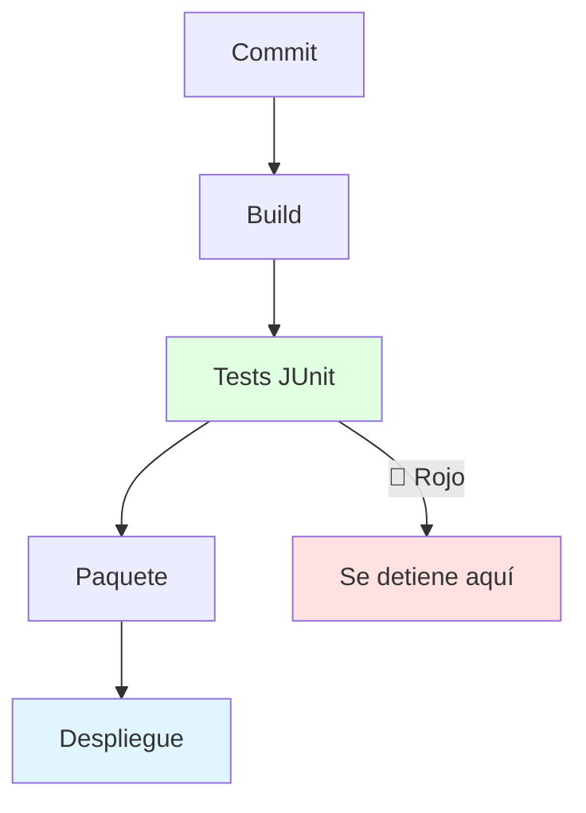
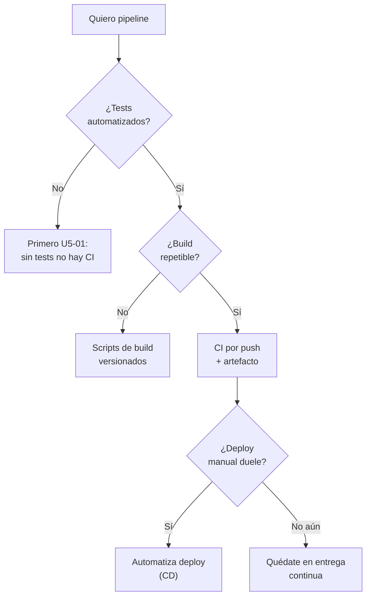
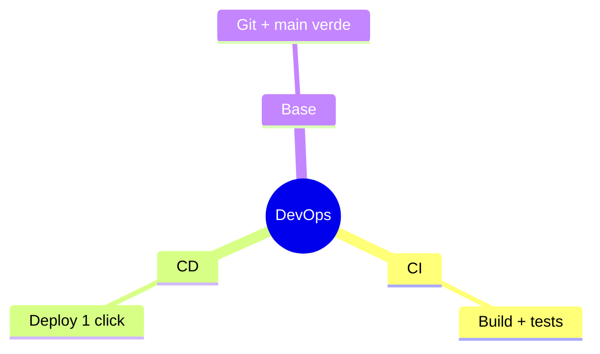

# 🚀 Entrega Continua y DevOps

## 🎯 Introducción

> [!info] 💡 ¿Por Qué el Docente Cierra con DevOps?
>
> La **entrega continua** lleva tu proyecto del "funciona en mi máquina" al "despliegue repetible con 1 comando". **DevOps** une desarrollo y operaciones: integra, prueba y entrega en ciclos cortos. Es el cierre del curso: todo lo anterior (diseño, tests, Git) existe para poder entregar seguido sin miedo.
>
> **Importancia histórica:** el término DevOps nace alrededor de 2009 (Patrick Debois y las conferencias DevOpsDays) como respuesta al muro entre devs ("funciona en mi máquina") y ops ("en producción no corre"). La integración continua viene de Kent Beck y el *Extreme Programming* de los 90.
>
> **Relevancia actual:** despliegues diarios/semanales son la norma industrial; "release grande cada 6 meses" es arqueología. Tu proyecto con pipeline impresiona más que uno con más features y deploy manual.
>
> **Analogía del mundo real:** piensa en una panadería:
>
> - **Sin DevOps** → Hornean a ciegas y descubren el pan quemado al abrir (deploy manual mensual).
> - **Con DevOps** → Receta versionada + horno calibrado + prueba de cada hornada (pipeline por push).
> - **Tu proyecto** → Compilar + tests + empaquetar automático en cada PR.
>
> | Razón | Deploy Manual | Pipeline |
> |---|---|---|
> | **Frecuencia** | Mensual con miedo | Semanal sin drama |
> | **Errores** | "En mi máquina sí" | Mismo entorno siempre |
> | **Reversión** | Horas | 1 click / 1 comando |
> | **Nota** | Demo frágil | Entrega verificable |

---

## 🧵 Pipeline Mínimo de Curso

### 🎭 CI + CD en 4 Etapas

> [!note] 📋 Definición — Integración, Entrega y Despliegue Continuos
>
> - **CI (integración continua):** cada push compila + corre tests; rojo = no se fusiona.
> - **Entrega continua:** cada commit verde deja un artefacto listo para desplegar (decisión humana para soltarlo).
> - **Despliegue continuo:** el artefacto verificado se despliega solo (un paso más allá; en curso basta la entrega).
>
> 1. **Integración:** cada push compila + corre JUnit (ver U5-01). Rojo = no se fusiona.
> 2. **Empaquetado:** 1 artefacto versionado (jar/zip/imagen) por commit verde.
> 3. **Despliegue:** mismo procedimiento siempre (script, no clicks manuales).
> 4. **Observación:** logs y health-check básicos tras desplegar.
>
> | Práctica | Qué es | Herramienta típica |
> |---|---|---|
> | **CI** | Integrar y probar a cada push | GitHub Actions / Jenkins |
> | **CD** | Desplegar automático o a 1 click | Scripts / plataformas |
> | **IaC** | Infra como código versionado | Archivos de config en Git |
>
> **Conexión con Git (U5-02):** main siempre verde + PRs revisados es el prerrequisito. Sin eso no hay pipeline que valga.

---

## 🗺️ Diagrama de Decisión: ¿Qué Automatizo Primero?

> [!tip] 💡 Lectura del diagrama
>
> El orden importa: tests → build → CI → entrega → despliegue. Saltarse escalones construye castillos en el aire.

---

## ⚠️ Problemas Comunes y Soluciones

> [!danger] ❌ Error 1: "DevOps" = Una Carpeta Llamada deploy-final-2 (viola **despliegue como código**)
>
> **Síntomas:** despliegue = pasos orales que solo una persona sabe.
>
> **Solución:**
>
> - Todo despliegue escrito como script en el repo desde el día 1.
> - Si no corre en limpio (máquina nueva), no es entrega continua.

> [!danger] ❌ Error 2: Pipeline sin Tests que lo Sostengan (viola **puerta de calidad**)
>
> **Síntomas:** pipeline verde que despliega bugs porque solo compila, no verifica nada.
>
> **Solución:** el gate mínimo es compilación + suite unitaria; sin eso el pipeline es teatro.

> [!danger] ❌ Error 3: Desplegar Todo Siempre (viola **progresividad**)
>
> **Síntomas:** cada push a producción con cambios a medio probar "porque el pipeline lo permite".
>
> **Solución:** entrega continua ≠ despliegue continuo: ten el artefacto listo siempre, suelta por decisión (más aún en curso).

---

## 🎯 Mejores Prácticas

> [!tip] 🏆 Checklist
>
> **1. Verde para avanzar**
>
> Merge solo con tests en verde: protege main como tu nota.
>
> **2. Despliega temprano y seguido**
>
> Primera entrega mínima temprano en el curso, no todo al final.
>
> **3. Un comando, un entorno**
>
> Mismo script en tu laptop y en el servidor; "en mi máquina sí" queda prohibido.
>
> **4. Observa lo desplegado**
>
> Logs + health-check mínimo: desplegar sin mirar es soltar y rezar.

---

## 📝 Ejercicios Propuestos

> [!example] 📋 Nivel 1 — Básico
>
> **1.** Diferencia integración continua, entrega continua y despliegue continuo.
>
> **2.** ¿Qué 4 etapas tiene un pipeline mínimo y qué verifica cada una?
>
> **3.** ¿Por qué sin tests no hay CI aunque compile?
>
> **4.** Explica "main siempre verde" y su relación con el pipeline.
>
> **5.** ¿Qué es IaC y qué problema resuelve?
>
> > [!success]- ✅ Respuestas — Nivel 1
> >
> > - **1.** CI: integrar+probar por push. Entrega: artefacto listo siempre. Despliegue: soltar automático.
> > - **2.** Integración (compila+tests), empaquetado (artefacto versionado), despliegue (mismo script), observación (logs/health).
> > - **3.** Porque compilar solo prueba sintaxis; sin tests no hay puerta de calidad que detenga bugs.
> > - **4.** Main desplegable en cada commit; el pipeline lo garantiza corriendo todo por push.
> > - **5.** Infraestructura como código versionado: elimina "funciona en mi máquina".

> [!example] 📋 Nivel 2 — Intermedio
>
> **6.** Diseña el pipeline mínimo de tu proyecto: herramientas, gates y artefacto.
>
> **7.** Tu pipeline tarda 40 minutos. Diagnostica con esta nota y propone 3 recortes.
>
> **8.** ¿Entrega o despliegue continuo para un proyecto de curso? Justifica.
>
> **9.** Escribe el checklist "desplegable" de tu proyecto (qué debe ser verdad para soltar).
>
> **10.** Conecta main verde (Git) + tests (JUnit) + pipeline: dibuja la cadena completa.
>
> > [!success]- ✅ Respuestas — Nivel 2
> >
> > - **6.** Respuesta libre guiada: push → build → JUnit → artefacto → deploy script, con gates en rojo.
> > - **7.** Sospechosos: tests lentos/integración en cada push, artefactos gigantes, sin caché. Recortes: paralelizar, separar suites, cachear dependencias.
> > - **8.** Entrega: tener listo siempre sin soltar automático da control con nota en juego.
> > - **9.** Ej.: compila limpio, suite verde, artefacto versionado, migraciones probadas, rollback conocido.
> > - **10.** Commit → PR (tests) → merge a main verde → artefacto → deploy: cada flecha con su gate.

> [!example] 📋 Nivel 3 — Avanzado
>
> **11.** Argumenta DevOps como respuesta histórica al muro dev/ops (2009, Debois/DevOpsDays).
>
> **12.** Diseña estrategia de releases para tu proyecto: versionado, notas de cambio y criterio de "listo para soltar".
>
> **13.** ¿Cuándo el despliegue continuo es mala idea aunque tengas pipeline? Da 2 casos.
>
> **14.** Relaciona IaC con reproducibilidad científica: ¿por qué versionar infra es como versionar un experimento?
>
> **15.** Evalúa "carpeta deploy-final-2" vs pipeline con criterios de esta nota (repetibilidad, autoría, reversión).
>
> > [!success]- ✅ Respuestas — Nivel 3
> >
> > - **11.** Devs optimizaban cambio, ops estabilidad: el muro generaba fricción; DevOps comparte pipeline, métricas y responsabilidad.
> > - **12.** Respuesta libre guiada: semver, changelog por release, gate de criterios objetivos.
> > - **13.** Regulación que exige aprobación humana; usuarios que no toleran cambios frecuentes (ej. firmware médico).
> > - **14.** Ambos exigen repetir el resultado desde cero con los mismos insumos versionados.
> > - **15.** Carpeta: irrepetible, sin autor, irreversible. Pipeline: script versionado, firmado, reversible en 1 comando.

---

## 📋 Resumen Ejecutivo

> [!summary] 📋 Lo Esencial
>
> - **CI** integra y prueba por push; **entrega** deja artefacto listo; **despliegue** suelta (manual o auto).
> - Orden: tests → build → CI → entrega → despliegue. Sin saltos.
> - Despliegue como **código versionado**, nunca oral.

---

## ✅ Metas de Aprendizaje

> [!note] 🎯 Nivel Básico
> - [ ] Diferencio CI, entrega y despliegue con ejemplo.
> - [ ] Describo las 4 etapas del pipeline mínimo.
> - [ ] Explico por qué sin tests no hay CI.

> [!note] 🎯 Nivel Intermedio
> - [ ] Diseño un pipeline mínimo para mi proyecto.
> - [ ] Diagnostico pipelines lentos con criterio.
> - [ ] Decido entrega vs despliegue según contexto.

> [!note] 🎯 Nivel Avanzado
> - [ ] Argumento DevOps históricamente (muro dev/ops).
> - [ ] Diseño releases con versionado y criterios.
> - [ ] Evalúo prácticas de deploy con la regla "corre en limpio".

---

## 📊 Resumen Visual

> [!success] 🔍 Comparación Final
>
> | Aspecto | Manual | Pipeline |
> |---|---|---|
> | **Riesgo** | ❌ Alto | ✅ Bajo y reversible |
> | **Frecuencia** | Rara | Continua |
> | **Decisión** | Adivinada | Con diagrama propio |
> | **Uso Recomendado** | Nunca en equipo | ✅ **Cierre del curso** |

---

## 🚀 Cierre Unidad 5

> [!quote] 🌟 Lo de U5
>
> - U5-01 pruebas JUnit + U5-02 Git + U5-03 DevOps = validar, colaborar y entregar.
> - Repasa patrones (S8) y smells (S11) para lecciones del 19-oct y 4-nov.

---

## 🔗 Seguir estudiando

> [!info] 📚 Seguir estudiando
>
> - Mapa de contenido: [[Diseño de Software]]
> - Índice Unidad 5: [[00 - Índice Unidad 5]]
> - Anterior: [[02 - Control de versiones con Git]]
> - Syllabus: [[Bienvenida y Syllabus Diseño de Software]]

## 📚 Referencias

> [!quote] 📖 Fuentes
>
> - Políticas oficiales 01a: entrega continua / DevOps.
> - P. Debois, DevOpsDays (2009) — origen del movimiento; K. Beck, XP (CI).
> - R. Pressman, B. Maxim, *Software Engineering: A Practitioner's Approach*, 9th ed.

---

**Tags:** #CCPG1042 #unidad5 #devops #cd #diseno-software
