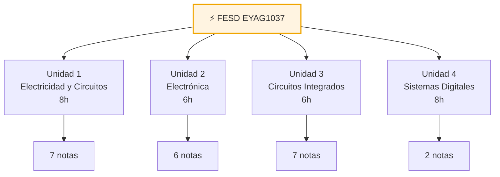

# ⚡ Fundamentos de Electricidad y Sistemas Digitales
**EYAG1037 · 3er Semestre · FIEC-ESPOL** · [[Bienvenida y Syllabus FESD|📖 Ver Syllabus completo]]

---

## ⚡ Unidad 1 — Electricidad y Circuitos *(8h)* → [[Universidad/3er Semestre/Fundamentos de Electricidad y Sistemas Digitales/Teórico/Unidad 1 - Electricidad y Circuitos/00 - Índice Unidad 1|📂 Índice Dataview]]

> [!note] Electricidad y Circuitos
> - [[01 - Conceptos Fundamentales de la Electricidad|01 — Conceptos Fundamentales]]
> - [[02 - Principios de Generacion de Energia Electrica|02 — Generación de Energía]]
> - [[03 - Elementos Basicos de un Circuito Electrico|03 — Elementos Básicos]]
> - [[04 - Circuitos en Serie Paralelo y Mixtos|04 — Serie / Paralelo / Mixtos]]
> - [[05 - Leyes de Ohm y Kirchhoff|05 — Ohm y Kirchhoff]]
> - [[06 - Teoremas de Analisis de Circuitos|06 — Teoremas]]
> - [[Ejercicios Recopilados - EYAG1037|Ejercicios Recopilados]]

---

## 🔌 Unidad 2 — Introducción a la Electrónica *(6h)* → [[Universidad/3er Semestre/Fundamentos de Electricidad y Sistemas Digitales/Teórico/Unidad 2 - Introducción a la Electrónica/00 - Índice Unidad 2|📂 Índice Dataview]]

> [!note] Electrónica
> - [[01 - Semiconductores y Bandas de Energía|01 — Semiconductores]]
> - [[02 - El Diodo - Unión P-N|02 — Diodo Unión P-N]]
> - [[03 - Transistor BJT|03 — Transistor BJT]]
> - [[04 - Circuitos de Filtrado y Fuentes Lineales|04 — Filtrado y Fuentes]]
> - [[05 - Reguladores en Fuentes Lineales|05 — Reguladores]]
> - [[06 - Ruido Electrónico e Interferencia|06 — Ruido e Interferencia]]

---

## 🧩 Unidad 3 — Circuitos Integrados *(6h)* → [[Universidad/3er Semestre/Fundamentos de Electricidad y Sistemas Digitales/Teórico/Unidad 3 - Circuitos integrados/00 - Índice Unidad 3|📂 Índice Dataview]]

> [!note] Circuitos Integrados
> - [[01 - CI no programables|01 — CI No Programables]]
> - [[02 - Aplicaciones de los OPAMs - Minimización de Ruido|02 — OPAMs y Ruido]]
> - [[03 - Configuraciones Lineales Básicas del OPAM|03 — Lineales Básicas]]
> - [[04 - Integrador, Derivador y Circuitos No Lineales|04 — Integrador / Derivador / No Lineales]]
> - [[05 - Ejercicios Resueltos y de Oposición|05 — Ejercicios Resueltos]]
> - [[06 - Aplicaciones de Integrados 555 - ADC - PWM|06 — 555 / ADC / PWM]]
> - [[07 - Lógica fija y tablas de verdad|07 — Lógica Fija]]

---

## 💻 Unidad 4 — Sistemas Digitales *(8h)* → [[Universidad/3er Semestre/Fundamentos de Electricidad y Sistemas Digitales/Teórico/Unidad 4 - Sistemas Digitales/00 - Índice Unidad 4|📂 Índice Dataview]]

> [!note] Sistemas Digitales
> - [[01 - Introducción a la Electrónica Digital|01 — Electrónica Digital]]
> - [[02 - Minimización de Funciones Lógicas|02 — Minimización]]

---

## 🧪 Práctico y Laboratorio

> [!note] Fundamentos
> - [[Equipos del Laboratorio - FESD|Equipos del Laboratorio]]
>
> [!note] Prácticas
> - [[Práctica 1 — Manejo de Equipos del Laboratorio|Práctica 1 — Manejo de Equipos]]
> - [[Práctica 2 — Ley de Ohm y Kirchhoff|Práctica 2 — Ohm y Kirchhoff]]
> - [[Práctica 3 — Diodos y Transistores|Práctica 3 — Diodos y Transistores]]
> - [[Práctica 4 — Fuentes Lineales|Práctica 4 — Fuentes Lineales]]
> - [[Práctica 5 — Filtros Activos|Práctica 5 — Filtros Activos]]
> - [[Práctica 6 — Logica Combinatoria y Arduino|Práctica 6 — Lógica y Arduino]]

---

> [!quote] 🔗 Navegación
> - Syllabus: [[Bienvenida y Syllabus FESD]]
> - Índices: [[Universidad/3er Semestre/Fundamentos de Electricidad y Sistemas Digitales/Teórico/Unidad 1 - Electricidad y Circuitos/00 - Índice Unidad 1]] · [[Universidad/3er Semestre/Fundamentos de Electricidad y Sistemas Digitales/Teórico/Unidad 2 - Introducción a la Electrónica/00 - Índice Unidad 2]] · [[Universidad/3er Semestre/Fundamentos de Electricidad y Sistemas Digitales/Teórico/Unidad 3 - Circuitos integrados/00 - Índice Unidad 3]] · [[Universidad/3er Semestre/Fundamentos de Electricidad y Sistemas Digitales/Teórico/Unidad 4 - Sistemas Digitales/00 - Índice Unidad 4]]

**Tags:** #FESD #EYAG1037 #ESPOL #indice #mapa-de-contenido
