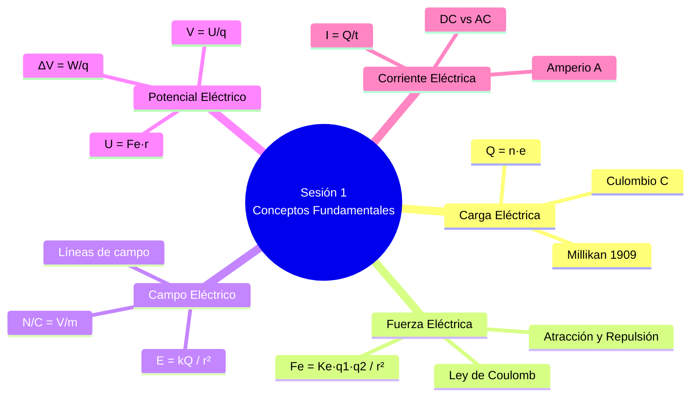

# ⚡ Conceptos Fundamentales de la Electricidad

## 🎯 Introducción

> [!info]- 💡 ¿Qué es la electricidad?
> 
> La **electricidad** es un fenómeno físico originado por el movimiento de cargas eléctricas (electrones) a través de un conductor. Es la base de todos los circuitos y sistemas electrónicos modernos.
> 
> **Analogía del mundo real:**
> 
> - **Electricidad** → Como el agua en una tubería: el voltaje es la presión, la corriente es el caudal, y la resistencia es el diámetro de la tubería.
> - **Sin diferencia de presión** → Sin voltaje = sin flujo de corriente.
> 
> ```mermaid
> graph LR
>     A[Fuente de<br/>Energía 🔋] -->|Voltaje V| B[Conductor]
>     B -->|Corriente I| C[Carga<br/>Resistiva]
>     C -->|Retorno| A
> 
>     style A fill:#fff4e1
>     style B fill:#e1f5ff
>     style C fill:#e1ffe1
> ```
> 
> **Las tres magnitudes esenciales:**
> 
> |Magnitud|Símbolo|Unidad|Descripción|
> |---|---|---|---|
> |**Voltaje**|V|Voltio (V)|Diferencia de potencial eléctrico|
> |**Corriente**|I|Amperio (A)|Flujo de carga por unidad de tiempo|
> |**Resistencia**|R|Ohmio (Ω)|Oposición al paso de la corriente|

---

## ⚛️ Carga Eléctrica

> [!note]- 🔬 Fundamentos de la Carga
> 
> La **carga eléctrica** es la propiedad fundamental de la materia que da origen a los fenómenos eléctricos. Existe en dos tipos: positiva (+) y negativa (−).
> 
> ```mermaid
> graph TD
>     A[Átomo] --> B[Núcleo]
>     A --> C[Electrones ⊖]
>     B --> D[Protones ⊕]
>     B --> E[Neutrones]
> 
>     style A fill:#f5e1ff
>     style C fill:#e1f5ff
>     style D fill:#ffe1e1
>     style E fill:#f0f0f0
> ```
> 
> **Propiedades de la carga:**
> 
> |Propiedad|Descripción|
> |---|---|
> |**Cuantización**|La carga existe en múltiplos de la carga elemental: $e = 1.6 \times 10^{-19}$ C|
> |**Conservación**|La carga total de un sistema aislado permanece constante|
> |**Atracción/Repulsión**|Cargas iguales se repelen; opuestas se atraen|
> 
> **Unidad:** El **Culombio (C)** es la unidad de carga eléctrica en el SI.
> 
> $$Q = n \cdot e$$
> 
> Donde $n$ es el número de electrones y $e = 1.6 \times 10^{-19}$ C.
> 
> ![[Pasted image 20260519222355.png]]

---

## 🔬 Partículas Subatómicas — Experimento de Millikan

> [!note]- ⚗️ Masas y cargas de las partículas básicas
> 
> En 1909, **Robert Millikan** midió la carga del electrón mediante el experimento de la gota de aceite, estableciendo el valor de la carga elemental que usamos hoy.
> 
> |Partícula|Carga (C)|Masa (kg)|
> |---|---|---|
> |**Electrón**|$-1.6 \times 10^{-19}$|$9.109 \times 10^{-31}$|
> |**Protón**|$+1.6 \times 10^{-19}$|$1.673 \times 10^{-27}$|
> |**Neutrón**|$0$|$1.675 \times 10^{-27}$|
> 
> **Conclusiones clave:**
> 
> - La carga del protón y del electrón son iguales en magnitud pero opuestas en signo.
> - Los átomos neutros tienen el mismo número de protones que de electrones.
> - Cuando un átomo **gana electrones** → carga negativa. Cuando los **pierde** → carga positiva.
> - El flujo de estas cargas a través de un conductor produce la **corriente eléctrica**.

---

## ⚡ Fuerza Eléctrica — Ley de Coulomb

> [!note]- 🔬 Fuerza entre cargas puntuales
> 
> La **Ley de Coulomb** describe la fuerza de atracción o repulsión entre dos cargas eléctricas en reposo. La fuerza es directamente proporcional al producto de las cargas e inversamente proporcional al cuadrado de la distancia que las separa.
> 
> $$F_e = K_e \cdot \frac{|q_1 \cdot q_2|}{r^2} \qquad [\text{N}]$$
> 
> Donde:
> 
> - $F_e$ = Fuerza eléctrica (Newton, N)
> - $K_e \approx 9 \times 10^9 \ \text{N·m}^2/\text{C}^2$ — constante de Coulomb
> - $q_1, q_2$ = Cargas eléctricas (Culombios, C)
> - $r$ = Distancia entre cargas (metros, m)
> 
> **Regla de signos:**
> 
> |Cargas|Fuerza|
> |---|---|
> |Mismo signo ($++$ o $--$)|Repulsiva (se alejan)|
> |Signo opuesto ($+-$)|Atractiva (se acercan)|
> 
> ```mermaid
> graph LR
>     A[⊕ Carga +] -->|Repulsión| B[⊕ Carga +]
>     C[⊕ Carga +] -->|Atracción| D[⊖ Carga −]
> 
>     style A fill:#ffe1e1
>     style B fill:#ffe1e1
>     style C fill:#ffe1e1
>     style D fill:#e1f5ff
> ```
> 
> **Ejemplo resuelto:**
> 
> > Dos cargas $q_1 = +2,\mu\text{C}$ y $q_2 = -3,\mu\text{C}$ separadas $r = 0.1,\text{m}$.
> > 
> > $$F_e = 9\times10^9 \cdot \frac{(2\times10^{-6})(3\times10^{-6})}{(0.1)^2} = 5.4,\text{N}$$
> > 
> > Fuerza **atractiva** (cargas de signo opuesto).

---

## 🧭 Campo Eléctrico

> [!tip]- 🧭 Región donde actúan las fuerzas eléctricas
> 
> El **campo eléctrico** $E$ es una región del espacio donde interactúan fuerzas eléctricas. Se define como la fuerza por unidad de carga que experimenta una carga de prueba positiva colocada en ese punto.
> 
> $$E = \frac{F}{q} = K_e \cdot \frac{Q}{r^2} \qquad \left[\frac{\text{N}}{\text{C}} = \frac{\text{V}}{\text{m}}\right]$$
> 
> **Dirección de las líneas de campo:**
> 
> |Tipo de carga|Comportamiento de las líneas|
> |---|---|
> |Carga positiva ($Q > 0$)|Las líneas **parten** de la carga hacia afuera|
> |Carga negativa ($Q < 0$)|Las líneas **apuntan** hacia la carga|
> 
> **Propiedades de las líneas de campo:**
> 
> |Propiedad|Descripción|
> |---|---|
> |Dirección|Del $+$ al $-$|
> |Densidad|Proporcional a la magnitud de $E$|
> |No se cruzan|Dos líneas nunca se intersectan|
> 
> **Campo eléctrico uniforme:**
> 
> Cuando se tienen dos placas paralelas cargadas, el campo eléctrico entre ellas es constante (uniforme): el vector $E$ no cambia de dirección ni de magnitud entre las placas.
> 
> ![[Pasted image 20260519222513.png]]

---

## 🔋 Energía Potencial y Potencial Eléctrico

> [!note]- 🔋 Del trabajo al voltaje
> 
> **Energía potencial eléctrica** es el trabajo realizado contra las fuerzas eléctricas para mover una carga entre dos puntos. Se mide en Joules y es positiva cuando la fuerza es repulsiva.
> 
> $$U = F_e \cdot r \qquad [\text{J}]$$
> 
> **Potencial eléctrico** $V$ es la energía potencial por unidad de carga. Caracteriza el campo independientemente de la carga de prueba:
> 
> $$V = \frac{U}{q} \qquad [\text{J/C} = \text{V}]$$
> 
> **Diferencia de potencial** entre dos puntos (voltaje):
> 
> $$\Delta V = \frac{W}{q} \qquad \Longrightarrow \qquad \Delta U = q \cdot \Delta V$$
> 
> > El campo eléctrico apunta de mayor a menor potencial, igual que el agua fluye de mayor a menor altura.
> 
> **Comparación de conceptos:**
> 
> |Magnitud|Símbolo|Unidad|Tipo|Depende de $q_{prueba}$|
> |---|---|---|---|---|
> |Fuerza de Coulomb|$F_e$|N|Vectorial|✅ Sí|
> |Campo eléctrico|$E$|V/m|Vectorial|❌ No|
> |Energía potencial|$U$|J|Escalar|✅ Sí|
> |Potencial eléctrico|$V$|V|Escalar|❌ No|

---

## 🌊 Corriente Eléctrica

> [!tip]- 🔁 Tipos de Corriente
> 
> La **corriente eléctrica** es el flujo ordenado de cargas eléctricas (electrones) a través de un conductor por unidad de tiempo.
> 
> $$I = \frac{Q}{t} \qquad [\text{A}]$$
> 
> Donde:
> 
> - $I$ = Corriente (Amperios, A)
> - $Q$ = Carga (Culombios, C)
> - $t$ = Tiempo (Segundos, s)
> 
> ```mermaid
> graph LR
>     A[Corriente<br/>Eléctrica] --> B[DC<br/>Corriente Continua]
>     A --> C[AC<br/>Corriente Alterna]
> 
>     B --> D[Flujo constante<br/>en un sentido]
>     C --> E[Flujo que cambia<br/>de dirección periódicamente]
> 
>     style B fill:#e1f5ff
>     style C fill:#fff4e1
>     style D fill:#e1f5ff
>     style E fill:#fff4e1
> ```
> 
> **Comparación DC vs AC:**
> 
> |Aspecto|DC (Corriente Continua)|AC (Corriente Alterna)|
> |---|---|---|
> |**Dirección**|Un solo sentido|Cambia periódicamente|
> |**Fuentes**|Baterías, pilas, paneles solares|Red eléctrica, generadores|
> |**Uso típico**|Electrónica, dispositivos móviles|Electrodomésticos, motores|
> |**Transmisión**|Pérdidas a larga distancia|✅ Eficiente a larga distancia|

---

## ⚖️ Electrónica vs Electricidad

> [!info]- 🔍 Dos campos relacionados pero distintos
> 
> El curso se llama **Fundamentos de Electricidad y Sistemas Digitales** porque abarca ambos campos. Aunque están íntimamente relacionados, tienen enfoques y objetivos distintos.
> 
> |Aspecto|Electrónica|Electricidad|
> |---|---|---|
> |**Definición**|Diseña y usa componentes para controlar el flujo de electrones y procesar señales|Se enfoca en la generación, transmisión, distribución y uso de energía eléctrica|
> |**Enfoque principal**|Controlar señales y datos mediante circuitos digitales o analógicos|Transportar y utilizar energía para alimentar equipos y sistemas|
> |**Componentes**|Resistencias, capacitores, diodos, transistores, microcontroladores, sensores|Generadores, transformadores, cables, interruptores, fusibles, motores|
> |**Aplicaciones**|Teléfonos, computadoras, robots, sistemas de control, dispositivos IoT|Instalaciones eléctricas, alumbrado público, motores industriales, redes de distribución|
> |**Objetivo final**|Procesar información y automatizar tareas|Suministrar energía eléctrica de forma segura y confiable|
> 
> **¿Cómo se relacionan?**
> 
> La electrónica **usa** la electricidad para funcionar. La electricidad proporciona la energía que hace posibles los sistemas electrónicos.

---

## 📊 Resumen Visual



---

## 📚 Referencias

> [!quote]- 📖 Fuentes consultadas
> 
> [1] A. Hermosa Donante, _Electrónica Aplicada_, 1.ª ed. Mexico: Alfaomega Grupo Editor, 2013, pp. 1–25. ISBN-13: 9786077074045.
> 
> [2] A. R. Hambley, _Electrical Engineering: Principles and Applications_, 7th ed. Hoboken, NJ, USA: Pearson, 2018, pp. 1–52.
> 
> [3] J. W. Nilsson y S. A. Riedel, _Electric Circuits_, 11th ed. Hoboken, NJ, USA: Pearson, 2019, pp. 1–42.
> 
> [4] C. K. Alexander y M. N. O. Sadiku, _Fundamentals of Electric Circuits_, 6th ed. New York, USA: McGraw-Hill, 2016, pp. 1–38.
> 
> [5] R. L. Boylestad, _Introductory Circuit Analysis_, 13th ed. Hoboken, NJ, USA: Pearson, 2016, pp. 1–55.

---

**Tags:** #electricidad #carga #voltaje #corriente #coulomb #campo #potencial #millikan #EYAG1037 #FESD #ESPOL #unidad1