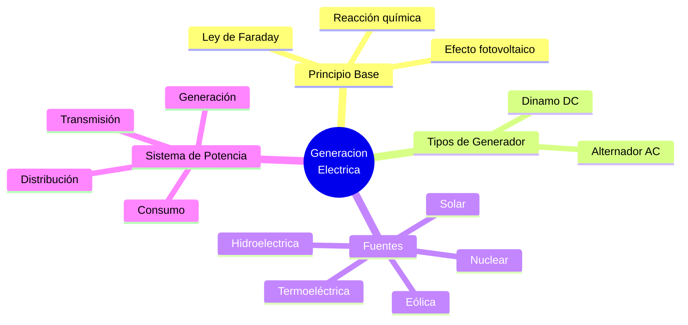

# 🔌 Principios de Generación de Energía Eléctrica

## 🎯 Introducción

> [!info]- 💡 ¿Cómo se genera la electricidad?
>
> La **generación de energía eléctrica** es el proceso de convertir otras formas de energía (mecánica, química, solar, térmica) en energía eléctrica utilizable. Este proceso es la base del suministro eléctrico en hogares, industrias y dispositivos electrónicos.
>
> **Analogía del mundo real:**
>
> - Generar electricidad es como llenar un tanque de agua: necesitas una fuente (río, lluvia, pozo) que convierta algo disponible en algo utilizable.
> - Cada tipo de generación usa una "fuente" diferente: sol, viento, agua, combustible.
>
> ```mermaid
> graph LR
>     A[Energía Primaria<br/>☀️💧🔥💨] -->|Conversión| B[Generador<br/>Eléctrico]
>     B -->|Energía Eléctrica| C[Red de<br/>Distribución]
>     C -->|Consumo| D[Hogares<br/>Industria<br/>Dispositivos]
>
>     style A fill:#fff4e1
>     style B fill:#e1f5ff
>     style C fill:#e1ffe1
>     style D fill:#f5e1ff
> ```
>
> **Principio universal:** Toda generación eléctrica se basa en la **Ley de Faraday** o en la **conversión directa de energía** (electroquímica, fotovoltaica).

---

## 🧲 Campo Magnético e Inducción — Orsted y Faraday

> [!note]- 📐 La Base de la Generación Mecánica
>
> **Hans Orsted (1820):** descubrió que una corriente eléctrica circulando por un conductor produce un campo magnético a su alrededor.
> 
> La **Ley de Faraday** establece que una fuerza electromotriz (fem) se induce en un conductor cuando el flujo magnético que lo atraviesa cambia con el tiempo.
>
> $$\mathcal{E} = -N \cdot \frac{d\Phi}{dt}$$
>
> Donde:
> - $\mathcal{E}$ = Fuerza electromotriz inducida (Voltios, V)
> - $N$ = Número de vueltas de la bobina
> - $\Phi$ = Flujo magnético (Webers, Wb)
> - $t$ = Tiempo (segundos, s)
>
> ```mermaid
> graph TD
>     A[Movimiento<br/>Mecánico 🔄] --> B[Variación de<br/>Flujo Magnético]
>     B --> C[FEM Inducida<br/>ε = -N·dΦ/dt]
>     C --> D[Corriente<br/>Eléctrica]
>
>     style A fill:#fff4e1
>     style B fill:#e1f5ff
>     style C fill:#ffe1e1
>     style D fill:#e1ffe1
> ```
>
> **Regla de la mano derecha:**
> Apunta los dedos en la dirección del movimiento del conductor → el pulgar indica la dirección de la corriente inducida.

![[ChatGPT Image 19 may 2026, 22_34_16.png]]

---
## 🔄 Ley de Lenz

> [!warning]- 🔄 Ley de Lenz — El Signo Negativo de Faraday
>
> La **Ley de Lenz** establece que la corriente inducida siempre tiene una dirección tal que su campo magnético **se opone al cambio de flujo** que la originó. Es el significado físico del signo negativo en la ecuación de Faraday.
>
> $$\mathcal{E} = -N \cdot \frac{d\Phi}{dt} \quad \leftarrow \text{el "−" es la Ley de Lenz}$$
>
> **Enunciado simple:**
>
> > "La naturaleza se resiste a los cambios en el flujo magnético."
>
> ```mermaid
> graph LR
>     A[Flujo magnético<br/>AUMENTA ↑] -->|induce| B[Corriente crea campo<br/>que SE OPONE al aumento<br/>↓ campo inducido]
>     C[Flujo magnético<br/>DISMINUYE ↓] -->|induce| D[Corriente crea campo<br/>que SE OPONE a la disminución<br/>↑ campo inducido]
>
>     style A fill:#ffe1e1
>     style B fill:#e1f5ff
>     style C fill:#fff4e1
>     style D fill:#e1ffe1
> ```
>
> **Procedimiento para determinar la dirección de la corriente inducida:**
>
> | Paso | Acción |
> |---|---|
> | **1** | Identificar la dirección del campo magnético externo $\vec{B}$ |
> | **2** | Determinar si el flujo $\Phi = \vec{B} \cdot \vec{A}$ aumenta o disminuye |
> | **3** | El campo inducido debe **oponerse** al cambio: si $\Phi$ sube → $\vec{B}_{ind}$ apunta en contra; si baja → $\vec{B}_{ind}$ apunta igual |
> | **4** | Aplicar la regla de la mano derecha al campo inducido → esa es la dirección de la corriente |
>
> **Consecuencias prácticas:**
>
> | Aplicación | Efecto de Lenz |
> |---|---|
> | **Freno magnético** | Imán cayendo por tubo de cobre se frena (corrientes de Foucault opuestas al movimiento) |
> | **Transformador** | La corriente secundaria genera flujo opuesto al primario (regulación natural) |
> | **Motor** | La FEM de retroceso (back-EMF) limita la corriente cuando el motor acelera |
> | **Inductor** | Se opone a cambios bruscos de corriente → protege circuitos |
>
> **Ejemplo:**
>
> > Un imán de barra se acerca a una bobina con su polo Norte apuntando hacia ella.
> > El flujo $\Phi$ **aumenta**. Por Lenz, la bobina genera un campo que **se opone** al imán → la cara de la bobina más cercana se comporta como polo **Norte** (repele al imán). La corriente inducida circula en sentido antihorario vista desde el imán.
> > 

![[ChatGPT Image 19 may 2026, 22_41_47.png]]

---
## ⚡ DC vs AC — Edison vs Tesla

> [!note]- 🏭 La Guerra de las Corrientes
>
> A finales del siglo XIX, dos sistemas compitieron por convertirse en el estándar mundial:
>
> | Característica | Corriente Continua (DC) | Corriente Alterna (AC) |
> |---|---|---|
> | **Defensor** | Thomas Edison | Nikola Tesla / Westinghouse |
> | **Forma de onda** | Constante (plana) | Senoidal |
> | **Transmisión** | Difícil a larga distancia | ✅ Eficiente con transformadores |
> | **Transformación** | No es fácil de transformar | ✅ Fácil cambiar voltaje |
> | **Ganador** | ❌ | ✅ Estándar mundial actual |
>
> **¿Por qué ganó AC?** Los transformadores permiten elevar el voltaje para transmitir con bajas pérdidas y luego reducirlo para uso doméstico — algo imposible con DC en esa época.

---
## 🏭 Tipos de Generadores Eléctricos

> [!tip]- ⚙️ Generador AC vs Generador DC
>
> **Generador de Corriente Alterna (Alternador):**
>
> ```mermaid
> graph LR
>     A[Rotor<br/>imán] -->|gira| B[Estátor<br/>bobinas]
>     B --> C[Salida AC<br/>senoidal]
>
>     style A fill:#e1f5ff
>     style B fill:#fff4e1
>     style C fill:#e1ffe1
> ```
>
> **Generador de Corriente Continua (Dínamo):**
>
> ```mermaid
> graph LR
>     A[Bobina<br/>giratoria] --> B[Colector<br/>de anillos]
>     B --> C[Rectificación<br/>mecánica]
>     C --> D[Salida DC]
>
>     style A fill:#e1f5ff
>     style B fill:#fff4e1
>     style C fill:#ffe1e1
>     style D fill:#e1ffe1
> ```
>
> | Característica | Alternador (AC) | Dínamo (DC) |
> |---|---|---|
> | **Salida** | Corriente alterna senoidal | Corriente continua |
> | **Mantenimiento** | Bajo | Alto (escobillas) |
> | **Eficiencia** | ✅ Alta | Media |
> | **Uso típico** | Plantas eléctricas, automóviles | Tracción eléctrica, carga de baterías |

![[ChatGPT Image 19 may 2026, 22_46_01.png]]

---
## 🔁 Proceso General de Generación

> [!info]- 🏭 De la Fuente a tu Enchufe
>
> ```mermaid
> graph LR
>     A[Materia Prima<br/>💧🔥☀️💨⚛️] --> B[Turbina<br/>⚙️]
>     B --> C[Generador<br/>🔌]
>     C --> D[Transformador<br/>elevador]
>     D --> E[Red de<br/>Transmisión]
>     E --> F[Transformador<br/>reductor]
>     F --> G[Consumidor<br/>🏠🏭]
>
>     style A fill:#fff4e1
>     style B fill:#e1f5ff
>     style C fill:#e1ffe1
>     style D fill:#ffe1e1
>     style E fill:#f5e1ff
>     style F fill:#ffe1e1
>     style G fill:#e1ffe1
> ```

---
## 🌊 Fuentes de Generación Eléctrica

### 💧 Hidroeléctrica

> [!example]- 🏔️ Energía del Agua
>
> Convierte la energía **potencial del agua** en energía eléctrica mediante turbinas.
>
> ```mermaid
> graph LR
>     A[Embalse<br/>💧 Agua] -->|caída| B[Turbina<br/>hidráulica]
>     B -->|eje mecánico| C[Generador<br/>AC]
>     C --> D[Transformador<br/>⚡]
>     D --> E[Red eléctrica]
>
>     style A fill:#e1f5ff
>     style B fill:#e1ffe1
>     style C fill:#fff4e1
>     style D fill:#ffe1e1
>     style E fill:#f5e1ff
> ```
>
> | Aspecto | Detalle |
> |---|---|
> | **Principio** | Energía potencial → cinética → eléctrica |
> | **Ventaja** | Renovable, sin emisiones, regulable |
> | **Desventaja** | Impacto ambiental, dependiente de lluvia |
> | **Ejemplo Ecuador** | Coca Codo Sinclair (~1 500 MW) |
> 
> ![[Pasted image 20260519224024.png]]

### 🔥 Termoeléctrica

> [!example]- 🌡️ Energía del Calor
>
> Quema combustibles fósiles (gas, petróleo, carbón) para producir vapor que mueve turbinas.
>
> ```mermaid
> graph LR
>     A[Combustible<br/>🔥] -->|calor| B[Caldera<br/>vapor]
>     B --> C[Turbina<br/>de vapor]
>     C --> D[Generador<br/>AC]
>     D --> E[Red eléctrica]
>
>     style A fill:#ffe1e1
>     style B fill:#fff4e1
>     style C fill:#e1ffe1
>     style D fill:#e1f5ff
>     style E fill:#f5e1ff
> ```
>
> | Aspecto | Detalle |
> |---|---|
> | **Principio** | Energía química → térmica → mecánica → eléctrica |
> | **Ventaja** | Alta disponibilidad, regulable a demanda |
> | **Desventaja** | Emisiones CO₂, uso de recursos no renovables |
> | **Eficiencia típica** | 33–45 % |
> 
> ![[Pasted image 20260519224111.png]]

### ☀️ Solar Fotovoltaica

> [!example]- 🌞 Energía del Sol
>
> Convierte directamente la luz solar en electricidad mediante el **efecto fotoeléctrico** en celdas semiconductoras de silicio.
>
> ```mermaid
> graph LR
>     A[Fotones<br/>☀️] -->|impactan| B[Celda Solar<br/>Silicio]
>     B -->|liberan electrones| C[Corriente DC]
>     C -->|inversor| D[Corriente AC]
>     D --> E[Red / Consumo]
>
>     style A fill:#fff4e1
>     style B fill:#e1f5ff
>     style C fill:#e1ffe1
>     style D fill:#f5e1ff
>     style E fill:#ffe1e1
> ```
>
> | Aspecto | Detalle |
> |---|---|
> | **Principio** | Efecto fotovoltaico (fotón → par electrón-hueco) |
> | **Ventaja** | Renovable, sin emisiones, modular, bajo mantenimiento |
> | **Desventaja** | Intermitente (depende del sol), costo inicial alto |
> | **Eficiencia típica** | 15–22 % (paneles comerciales) |
> 
> ![[Pasted image 20260519224443.png]]

### 💨 Eólica

> [!example]- 🌬️ Energía del Viento
>
> Convierte la energía **cinética del viento** en electricidad mediante aerogeneradores.
>
> | Aspecto | Detalle |
> |---|---|
> | **Principio** | Energía cinética del viento → mecánica → eléctrica |
> | **Ventaja** | Renovable, sin emisiones, bajo costo operativo |
> | **Desventaja** | Intermitente, impacto visual y acústico |
> | **Potencia** | $P = \frac{1}{2} \rho A v^3$ (depende del cubo de la velocidad del viento) |
> 
> ![[Pasted image 20260519224744.png]]

### ☢️ Nuclear

> [!example]- ⚛️ Fisión Nuclear
>
> Utiliza el calor generado por la **fisión de átomos de uranio** para producir vapor y mover turbinas.
>
> | Aspecto | Detalle |
> |---|---|
> | **Principio** | Fisión nuclear → calor → vapor → turbina → generador |
> | **Ventaja** | Alta densidad energética, sin emisiones de CO₂ |
> | **Desventaja** | Residuos radiactivos, alto costo, riesgos de seguridad |
> | **Eficiencia típica** | ~33 % |
> 
> ![[Pasted image 20260519224818.png]]

---

## ⚖️ Comparación General de Fuentes

> [!warning]- 📊 Cuadro Comparativo
>
> | Fuente | Renovable | Emisiones CO₂ | Costo operativo | Disponibilidad | Uso en Ecuador |
> |---|---|---|---|---|---|
> | **Hidroeléctrica** | ✅ | Muy bajas | Bajo | Alta (depende de lluvia) | ✅ Predominante |
> | **Termoeléctrica** | ❌ | Altas | Alto | ✅ Constante | Complementaria |
> | **Solar** | ✅ | Nulas | Muy bajo | Media (sol) | Creciente |
> | **Eólica** | ✅ | Nulas | Muy bajo | Media (viento) | Limitada |
> | **Nuclear** | ❌/✅ | Nulas | Alto | ✅ Constante | No aplica |

---
## 🏗️ Sistema Eléctrico de Potencia

> [!tip]- 🔌 Etapas y Voltajes Típicos
>
> ```mermaid
> graph LR
>     A[⚙️ Generación<br/>13.8 kV] -->|eleva| B[🔺 Transmisión<br/>230 kV / 500 kV]
>     B -->|reduce| C[🔻 Subtransmisión<br/>69 kV]
>     C -->|reduce| D[🏘️ Distribución<br/>13.8 kV]
>     D -->|reduce| E[🏠 Consumo<br/>110 V / 220 V]
>
>     style A fill:#e1f5ff
>     style B fill:#ffe1e1
>     style C fill:#fff4e1
>     style D fill:#e1ffe1
>     style E fill:#f5e1ff
> ```
>
> | Etapa | Voltaje típico | Función |
> |---|---|---|
> | **Generación** | 13.8 kV | Alternador en la planta |
> | **Transmisión** | 230 – 500 kV | Transporte de energía a larga distancia |
> | **Subtransmisión** | 69 kV | Conexión a ciudades/industrias |
> | **Distribución** | 13.8 kV | Redes urbanas y rurales |
> | **Consumo** | 110 V / 220 V | Hogares y comercios |

---
  
## 📊 Resumen Visual 


## 📚 Referencias

> [!quote]- 📖 Fuentes consultadas
>
> [1] A. Hermosa Donante, *Electrónica Aplicada*, 1.ª ed. Mexico: Alfaomega Grupo Editor, 2013, pp. 1–30. ISBN-13: 9786077074045.
>
> [2] A. R. Hambley, *Electrical Engineering: Principles and Applications*, 7th ed. Hoboken, NJ, USA: Pearson, 2018, pp. 53–90.
>
> [3] J. J. Grainger y W. D. Stevenson, *Power Systems Analysis*, 4th ed. New York, USA: McGraw-Hill, 1994, pp. 1–35.
>
> [4] C. K. Alexander y M. N. O. Sadiku, *Fundamentals of Electric Circuits*, 6th ed. New York, USA: McGraw-Hill, 2016, pp. 39–70.
>
> [5] M. A. El-Sharkawi, *Electric Energy: An Introduction*, 3rd ed. Boca Raton, FL, USA: CRC Press, 2012, pp. 1–60.

---

**Tags:** #generacion #electricidad #orsted #faraday #lenz #induccion #hidroelectrica #solar #eolica #termoelectrica #nuclear #EYAG1037 #FESD #ESPOL #unidad1