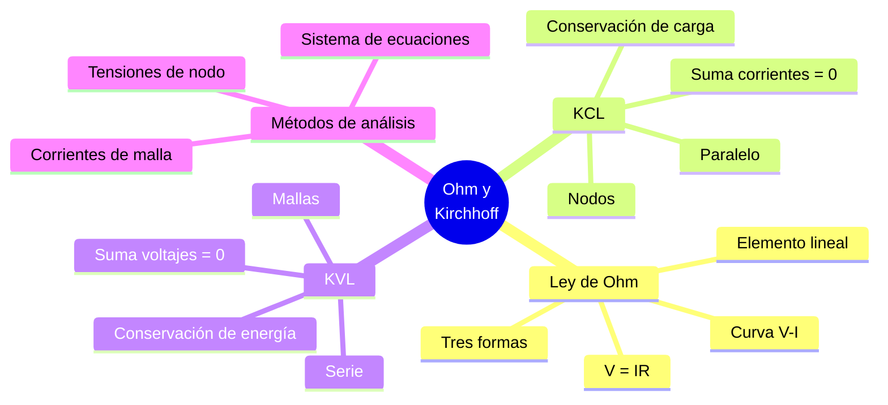

# ⚡ Leyes de Ohm y Kirchhoff

## 🎯 Introducción

> [!info]- 💡 ¿Por qué son fundamentales estas leyes?
>
> Las **leyes de Ohm y Kirchhoff** son los pilares del análisis de circuitos eléctricos. Con ellas es posible determinar voltajes, corrientes y potencias en cualquier circuito, desde el más simple hasta el más complejo.
>
> - La **Ley de Ohm** describe la relación entre voltaje, corriente y resistencia en un elemento.
> - Las **Leyes de Kirchhoff** extienden ese análisis a circuitos completos, aplicando conservación de energía y carga eléctrica.
>
> **Analogía del mundo real:**
>
> - La Ley de Ohm es como la relación entre presión, caudal y fricción en una tubería: a mayor presión (voltaje) y menor fricción (resistencia), mayor caudal (corriente).
> - KCL es como un cruce de tuberías: el agua que entra debe ser igual al agua que sale.
> - KVL es como una ruta circular de montaña: si subes 1000 m, al volver al punto de inicio habrás bajado exactamente 1000 m.
>
> ```mermaid
> graph TD
>     A[Análisis de Circuitos] --> B[Ley de Ohm]
>     A --> C[Leyes de Kirchhoff]
>
>     B --> D[Relación V, I, R<br/>en un elemento]
>     C --> E[KCL — Nodos<br/>Conservación de carga]
>     C --> F[KVL — Mallas<br/>Conservación de energía]
>
>     style B fill:#e1f5ff
>     style C fill:#e1ffe1
>     style D fill:#e1f5ff
>     style E fill:#e1ffe1
>     style F fill:#fff4e1
> ```
>
> | Ley | Postulado | Aplica a |
> |---|---|---|
> | **Ley de Ohm** | $V = I \cdot R$ | Un elemento individual |
> | **KCL** | $\sum I = 0$ en un nodo | Nodos del circuito |
> | **KVL** | $\sum V = 0$ en una malla | Mallas del circuito |

---

## 🔵 Ley de Ohm

> [!note]- 🔵 La relación fundamental entre V, I y R
>
> La **Ley de Ohm** establece que el voltaje entre los terminales de un conductor es directamente proporcional a la corriente que circula por él, siendo la resistencia la constante de proporcionalidad.
>
> Fue formulada por el físico alemán **Georg Simon Ohm** en 1827.
>
> $$\boxed{V = I \cdot R}$$
>
> Donde:
> - $V$ = Diferencia de potencial o voltaje (Voltios, V)
> - $I$ = Corriente eléctrica (Amperios, A)
> - $R$ = Resistencia eléctrica (Ohmios, Ω)
>
> ### 🔄 Formas derivadas
>
> A partir de la expresión principal se obtienen las tres formas de uso:
>
> $$I = \frac{V}{R} \qquad\qquad R = \frac{V}{I}$$
>
> ```mermaid
> graph TD
>     A["V = I · R"] --> B["I = V / R<br/>¿Cuánta corriente fluye?"]
>     A --> C["R = V / I<br/>¿Cuál es la resistencia?"]
>     A --> D["V = I · R<br/>¿Cuál es la caída de voltaje?"]
>
>     style A fill:#fff4e1
>     style B fill:#e1f5ff
>     style C fill:#e1ffe1
>     style D fill:#f5e1ff
> ```
>
> ### 📐 Relación gráfica: curva V-I
>
> Para un resistor lineal (obedece la Ley de Ohm), la curva V en función de I es una **línea recta** que pasa por el origen. La pendiente de dicha recta es la resistencia $R$.
>
> | Comportamiento | Descripción |
> |---|---|
> | **Elemento lineal** | Cumple $V = IR$ para todo rango de operación |
> | **Elemento no lineal** | No cumple $V = IR$ (diodos, transistores, termistores) |
> | **Pendiente mayor** | Mayor resistencia → línea más inclinada |
>
> ### ⚙️ Condiciones de validez
>
> > ⚠️ La Ley de Ohm aplica únicamente bajo las siguientes condiciones:
> > - El material tiene **comportamiento lineal** (resistencia constante).
> > - La **temperatura es constante** (la resistividad varía con la temperatura).
> > - La frecuencia de la señal no altera significativamente las propiedades del material.
>
> ### 🧮 Ejemplos resueltos
>
> **Ejemplo 1 — Calcular corriente:**
>
> > Un resistor de $R = 470\ \Omega$ tiene una diferencia de potencial de $V = 9.4\text{ V}$.
> >
> > $$I = \frac{V}{R} = \frac{9.4}{470} = 0.02\text{ A} = 20\text{ mA}$$
>
> **Ejemplo 2 — Calcular resistencia:**
>
> > Por un conductor fluyen $I = 50\text{ mA}$ con una caída de $V = 2.5\text{ V}$.
> >
> > $$R = \frac{V}{I} = \frac{2.5}{0.05} = 50\ \Omega$$
>
> **Ejemplo 3 — Calcular voltaje:**
>
> > Una corriente de $I = 3\text{ A}$ circula por $R = 15\ \Omega$.
> >
> > $$V = I \cdot R = 3 \times 15 = 45\text{ V}$$
> > 
![[ChatGPT Image 19 may 2026, 23_07_06.png]]

---

## 🟢 KCL — Ley de Corriente de Kirchhoff

> [!tip]- 🟢 Conservación de carga eléctrica en los nodos
>
> La **Primera Ley de Kirchhoff (KCL)** se basa en el principio de conservación de la carga eléctrica: la carga no se crea ni se destruye en un nodo.
>
> Fue enunciada por **Gustav Robert Kirchhoff** en 1845.
>
> > *"La suma algebraica de todas las corrientes que confluyen en un nodo es igual a cero."*
>
> $$\boxed{\sum_{k=1}^{n} I_k = 0}$$
>
> **Convención de signos:**
>
> | Dirección | Signo asignado |
> |---|---|
> | Corriente que **entra** al nodo | + (positivo) |
> | Corriente que **sale** del nodo | − (negativo) |
>
> > También puede enunciarse como: $\sum I_{entrada} = \sum I_{salida}$
>
> ### 📌 Identificación de nodos
>
> Un **nodo** es cualquier punto de conexión entre dos o más elementos. Un **nodo principal** conecta tres o más elementos.
>
> ```mermaid
> graph TD
>     I1[I₁ →] --> N((Nodo A))
>     I2[I₂ →] --> N
>     N --> I3[→ I₃]
>     N --> I4[→ I₄]
>     N --> I5[→ I₅]
>
>     style N fill:#e1ffe1
> ```
>
> > KCL en el nodo A: $I_1 + I_2 - I_3 - I_4 - I_5 = 0$
> >
> > Equivalentemente: $I_1 + I_2 = I_3 + I_4 + I_5$
>
> ### 🧮 Ejemplo resuelto
>
> > En un nodo se conoce que $I_1 = 5\text{ A}$ (entra), $I_2 = 3\text{ A}$ (entra), $I_3 = 2\text{ A}$ (sale) e $I_4 =\ ?$ (sale).
> >
> > Aplicando KCL:
> > $$I_1 + I_2 - I_3 - I_4 = 0$$
> > $$5 + 3 - 2 - I_4 = 0$$
> > $$I_4 = 6\text{ A}$$
> >
> > ✅ Verificación: $5 + 3 = 2 + 6 = 8\text{ A}$ ✓
>
> ### 🔗 Aplicación en circuitos en paralelo
>
> En una conexión en paralelo, KCL determina cómo se divide la corriente entre las ramas:
>
> $$I_{total} = I_1 + I_2 + \cdots + I_n = V_s \left(\frac{1}{R_1} + \frac{1}{R_2} + \cdots + \frac{1}{R_n}\right)$$
> 
> ![[ChatGPT Image 31 may 2026, 23_42_42.png]]

---

## 🟡 KVL — Ley de Voltaje de Kirchhoff

> [!tip]- 🟡 Conservación de energía en las mallas
>
> La **Segunda Ley de Kirchhoff (KVL)** se fundamenta en la conservación de energía: la energía ganada al recorrer fuentes debe ser igual a la energía cedida en los elementos pasivos.
>
> > *"La suma algebraica de todos los voltajes a lo largo de una malla cerrada es igual a cero."*
>
> $$\boxed{\sum_{k=1}^{n} V_k = 0}$$
>
> ### 📌 Definición de malla y lazo
>
> | Término | Definición |
> |---|---|
> | **Lazo** | Cualquier trayectoria cerrada en el circuito |
> | **Malla** | Lazo que no contiene ningún otro lazo en su interior (lazo independiente) |
>
> ### ⚖️ Convención de signos para KVL
>
> Se elige un sentido de recorrido (horario o antihorario) y se asigna signo según:
>
> | Elemento | Condición | Signo |
> |---|---|---|
> | **Fuente de voltaje** | Se recorre de − a + (ganancia de energía) | + |
> | **Fuente de voltaje** | Se recorre de + a − (pérdida de energía) | − |
> | **Resistencia** | La corriente asumida va en el mismo sentido del recorrido | − |
> | **Resistencia** | La corriente asumida va en sentido contrario al recorrido | + |
>
> ```mermaid
> graph LR
>     A["🔋 Vs (+)"] -->|"+ V_s"| B[R₁]
>     B -->|"- V_R1"| C[R₂]
>     C -->|"- V_R2"| D[R₃]
>     D -->|"- V_R3"| A
>
>     style A fill:#fff4e1
>     style B fill:#e1f5ff
>     style C fill:#e1f5ff
>     style D fill:#e1f5ff
> ```
>
> > KVL: $+V_s - V_{R1} - V_{R2} - V_{R3} = 0$
> >
> > $V_s = V_{R1} + V_{R2} + V_{R3}$
>
> ### 🧮 Ejemplo resuelto — una malla
>
> > Dado: $V_s = 18\text{ V}$, $R_1 = 2\ \Omega$, $R_2 = 4\ \Omega$, $R_3 = 3\ \Omega$ en serie. Encontrar $I$ y los voltajes.
> >
> > Aplicando KVL (recorrido horario):
> > $$+18 - 2I - 4I - 3I = 0$$
> > $$18 = 9I$$
> > $$I = 2\text{ A}$$
> >
> > Voltajes:
> > $$V_{R1} = 2 \times 2 = 4\text{ V}$$
> > $$V_{R2} = 2 \times 4 = 8\text{ V}$$
> > $$V_{R3} = 2 \times 3 = 6\text{ V}$$
> >
> > ✅ Verificación KVL: $4 + 8 + 6 = 18\text{ V}$ ✓
> > 
![[ChatGPT Image 31 may 2026, 23_46_11.png]]

---


## 🔢 Análisis de Circuitos con Múltiples Mallas

> [!tip]- 🔢 Método de corrientes de malla
>
> Para circuitos con múltiples mallas, se asigna una **corriente de malla** a cada malla independiente y se aplica KVL en cada una. Esto genera un sistema de ecuaciones que se resuelve simultáneamente.
>
> ```mermaid
> graph LR
>     Vs1[🔋 Vs1] -->|I₁| R1[R₁]
>     R1 --> N1[Nodo]
>     N1 -->|I₁-I₂| R2[R₂]
>     N1 -->|I₂| R3[R₃]
>     R2 --> N2[Nodo]
>     R3 --> N2
>     N2 --> Vs1
>
>     style Vs1 fill:#fff4e1
>     style R1 fill:#e1f5ff
>     style R2 fill:#e1ffe1
>     style R3 fill:#e1ffe1
> ```
>
> **Procedimiento:**
>
> 1. Identificar las mallas independientes del circuito.
> 2. Asignar una corriente de malla ($I_1$, $I_2$, …) a cada malla, generalmente en sentido horario.
> 3. Aplicar KVL en cada malla, expresando los voltajes en términos de las corrientes de malla.
> 4. Resolver el sistema de ecuaciones resultante.
> 5. Si una corriente resulta negativa, su sentido real es el opuesto al asumido.
>
> **Ejemplo resuelto — dos mallas:**
>
> > Dado: $V_{s1} = 12\text{ V}$, $V_{s2} = 6\text{ V}$, $R_1 = 2\ \Omega$, $R_2 = 4\ \Omega$ (compartida), $R_3 = 3\ \Omega$.
> >
> > KVL Malla 1 (corriente $I_1$):
> > $$+12 - 2I_1 - 4(I_1 - I_2) = 0 \implies 12 = 6I_1 - 4I_2 \quad (1)$$
> >
> > KVL Malla 2 (corriente $I_2$):
> > $$-6 - 3I_2 - 4(I_2 - I_1) = 0 \implies -6 = -4I_1 + 7I_2 \quad (2)$$
> >
> > Resolviendo el sistema:
> > $$I_1 = \frac{66}{26} \approx 2.54\text{ A} \qquad I_2 = \frac{12}{26} \approx 0.46\text{ A}$$
> 
> 
![[ChatGPT Image 31 may 2026, 23_56_09.png]]

---

## 🔵 Análisis de Nodos (Método de Tensiones de Nodo)

> [!note]- 🔵 Método de tensiones de nodo
>
> El **método de tensiones de nodo** aplica KCL en cada nodo principal para obtener un sistema de ecuaciones. Es complementario al método de mallas.
>
> **Procedimiento:**
>
> 1. Seleccionar un nodo de **referencia** (tierra, $V = 0$).
> 2. Asignar una tensión de nodo ($V_1$, $V_2$, …) a cada nodo principal restante.
> 3. Aplicar KCL en cada nodo, expresando las corrientes en función de las tensiones nodales.
> 4. Resolver el sistema de ecuaciones resultante.
>
> **Expresión de corrientes usando Ley de Ohm:**
>
> La corriente que fluye del nodo $A$ al nodo $B$ a través de $R$ es:
>
> $$I_{A \to B} = \frac{V_A - V_B}{R}$$
>
> **Ejemplo resuelto:**
>
> > Dado: $I_s = 4\text{ A}$ (fuente de corriente), $R_1 = 6\ \Omega$, $R_2 = 3\ \Omega$. Nodo de referencia: tierra. Encontrar $V_1$.
> >
> > KCL en el nodo $V_1$:
> > $$I_s = \frac{V_1}{R_1} + \frac{V_1}{R_2}$$
> > $$4 = \frac{V_1}{6} + \frac{V_1}{3} = \frac{V_1}{6} + \frac{2V_1}{6} = \frac{3V_1}{6} = \frac{V_1}{2}$$
> > $$V_1 = 8\text{ V}$$
> >
> > ✅ Verificación: $\dfrac{8}{6} + \dfrac{8}{3} = 1.33 + 2.67 = 4\text{ A}$ ✓

---

## ⚖️ Comparación de Métodos de Análisis

> [!success]- 📊 ¿Cuándo usar cada método?
>
> | Método | Base | Incógnitas | Ideal cuando… |
> |---|---|---|---|
> | **Ley de Ohm directa** | $V = IR$ | $V$, $I$ o $R$ | Circuito con un solo elemento o rama |
> | **Mallas (KVL)** | $\sum V = 0$ | Corrientes de malla | Hay pocas mallas y muchos nodos |
> | **Nodos (KCL)** | $\sum I = 0$ | Tensiones de nodo | Hay pocos nodos y muchas mallas |
>
> ```mermaid
> graph TD
>     A[Circuito a analizar] --> B{¿Cuántas<br/>mallas vs nodos?}
>
>     B -->|Pocas mallas| C[Método de<br/>corrientes de malla<br/>KVL]
>     B -->|Pocos nodos| D[Método de<br/>tensiones de nodo<br/>KCL]
>     B -->|Elemento único| E[Ley de Ohm<br/>directa]
>
>     style C fill:#e1f5ff
>     style D fill:#e1ffe1
>     style E fill:#fff4e1
> ```
>
> > 💡 Ambos métodos producen el mismo resultado. La elección depende de la estructura del circuito y la cantidad de incógnitas que genera cada enfoque.

---

## 🔗 Integración: Ohm + Kirchhoff

> [!success]- 🔗 Usando las tres leyes en conjunto
>
> En la práctica, las tres leyes se aplican de manera conjunta e iterativa para resolver cualquier circuito:
>
> ```mermaid
> graph LR
>     A[Ley de Ohm<br/>V = IR] --> D[Análisis<br/>completo del<br/>circuito]
>     B[KCL<br/>ΣI = 0<br/>en nodos] --> D
>     C[KVL<br/>ΣV = 0<br/>en mallas] --> D
>
>     D --> E[Corrientes<br/>en cada rama]
>     D --> F[Voltajes<br/>en cada elemento]
>     D --> G[Potencia<br/>disipada/entregada]
>
>     style A fill:#e1f5ff
>     style B fill:#e1ffe1
>     style C fill:#fff4e1
>     style D fill:#f5e1ff
> ```
>
> **Resumen de fórmulas esenciales:**
>
> | Cantidad | Fórmula | Unidad |
> |---|---|---|
> | Voltaje | $V = I \cdot R$ | Voltio (V) |
> | Corriente | $I = V / R$ | Amperio (A) |
> | Resistencia | $R = V / I$ | Ohmio (Ω) |
> | KCL | $\sum I_{entrada} = \sum I_{salida}$ | Amperio (A) |
> | KVL | $\sum V_{fuentes} = \sum V_{caídas}$ | Voltio (V) |
> | Potencia | $P = V \cdot I = I^2 R = V^2/R$ | Vatio (W) |
> | Energía | $W = P \cdot t$ | Julio (J) |

---

## 📊 Resumen Visual



---

## 📚 Referencias

> [!quote]- 📖 Fuentes consultadas
>
> [1] C. K. Alexander y M. N. O. Sadiku, *Fundamentals of Electric Circuits*, 6th ed. New York, USA: McGraw-Hill, 2016, pp. 29–100.
>
> [2] R. L. Boylestad, *Introductory Circuit Analysis*, 13th ed. Hoboken, NJ, USA: Pearson, 2016, pp. 56–180.
>
> [3] A. R. Hambley, *Electrical Engineering: Principles and Applications*, 7th ed. Hoboken, NJ, USA: Pearson, 2018, pp. 33–90.
>
> [4] J. W. Nilsson y S. A. Riedel, *Electric Circuits*, 11th ed. Hoboken, NJ, USA: Pearson, 2019, pp. 22–110.
>
> [5] A. Hermosa Donante, *Electrónica Aplicada*, 1.ª ed. Mexico: Alfaomega Grupo Editor, 2013, pp. 30–75. ISBN-13: 9786077074045.

---

**Tags:** #ohm #kirchhoff #KCL #KVL #nodos #mallas #análisis #corriente #voltaje #resistencia #EYAG1037 #FESD #ESPOL #unidad1
