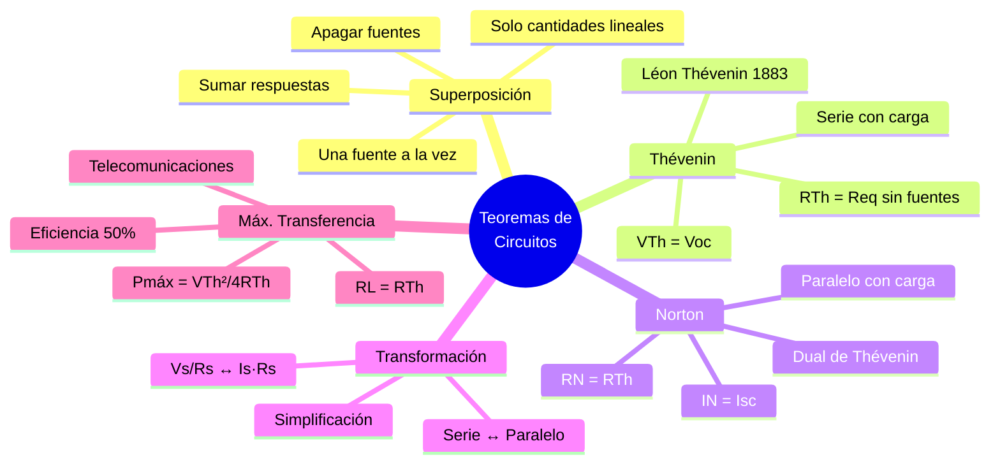

# 🧩 Teoremas de Análisis de Circuitos

## 🎯 Introducción

> [!info]- 💡 ¿Por qué necesitamos teoremas de análisis?
>
> Las leyes de Ohm y Kirchhoff permiten analizar cualquier circuito, pero en redes complejas generan sistemas de muchas ecuaciones simultáneas que resultan tediosos de resolver. Los **teoremas de análisis de circuitos** son herramientas que simplifican radicalmente ese proceso, permitiendo:
>
> - Reducir circuitos complejos a equivalentes simples.
> - Calcular la respuesta ante una sola fuente o elemento a la vez.
> - Determinar la condición de máxima transferencia de potencia.
> - Reemplazar redes de múltiples fuentes y resistencias por modelos equivalentes de uno o dos componentes.
>
> **Analogía del mundo real:**
>
> - El **Teorema de Superposición** es como calcular el ruido total de una ciudad sumando por separado el ruido del tráfico, la música y la construcción.
> - El **Teorema de Thévenin** es como reemplazar una red eléctrica compleja por una sola batería con su resistencia interna.
> - El **Teorema de Norton** es el equivalente usando una fuente de corriente.
> - La **Máxima Transferencia de Potencia** responde cuándo una carga extrae el máximo de energía posible de la fuente.
>
> ```mermaid
> graph TD
>     A[Teoremas de Circuitos] --> B[Superposición]
>     A --> C[Thévenin]
>     A --> D[Norton]
>     A --> E[Máxima Transferencia<br/>de Potencia]
>     A --> F[Transformación<br/>de Fuentes]
>
>     B --> B1[Una fuente<br/>a la vez]
>     C --> C1[Equivalente<br/>Vs + Rs]
>     D --> D1[Equivalente<br/>Is + Rp]
>     E --> E1[RL = RTh<br/>Pmáx]
>     F --> F1[Voltaje ↔ Corriente]
>
>     style B fill:#e1f5ff
>     style C fill:#e1ffe1
>     style D fill:#fff4e1
>     style E fill:#f5e1ff
>     style F fill:#ffe1e1
> ```
>
> | Teorema | Utilidad principal |
> |---|---|
> | **Superposición** | Circuitos con múltiples fuentes independientes |
> | **Thévenin** | Simplificar una red para analizar el elemento de carga |
> | **Norton** | Alternativa corriente al equivalente Thévenin |
> | **Máx. transferencia** | Encontrar $R_L$ que maximiza potencia entregada |
> | **Transformación de fuentes** | Convertir entre fuente de voltaje y corriente |

---

## 🔀 Teorema de Superposición

> [!note]- 🔀 Una fuente activa a la vez
>
> El **Teorema de Superposición** establece que en un circuito lineal con múltiples fuentes independientes, la respuesta (voltaje o corriente) en cualquier elemento es la **suma algebraica** de las respuestas producidas por cada fuente actuando individualmente, mientras las demás se eliminan.
>
> > *"La respuesta total es la superposición (suma) de las respuestas individuales de cada fuente."*
>
> ### ⚙️ Procedimiento
>
> ```mermaid
> graph TD
>     P1[1️⃣ Identificar todas las<br/>fuentes independientes] --> P2
>     P2[2️⃣ Dejar activa UNA fuente;<br/>apagar las demás] --> P3
>     P3[3️⃣ Calcular la respuesta<br/>parcial con esa fuente] --> P4
>     P4[4️⃣ Repetir para cada<br/>fuente restante] --> P5
>     P5[5️⃣ Sumar algebraicamente<br/>todas las respuestas parciales]
>
>     style P1 fill:#e1f5ff
>     style P2 fill:#e1ffe1
>     style P3 fill:#fff4e1
>     style P4 fill:#e1f5ff
>     style P5 fill:#f5e1ff
> ```
>
> ### 🔕 Cómo "apagar" una fuente
>
> | Tipo de fuente | Acción para apagarla | Equivalente eléctrico |
> |---|---|---|
> | **Fuente de voltaje independiente** | Reemplazar por un **cortocircuito** ($V = 0$) | Cable conductor |
> | **Fuente de corriente independiente** | Reemplazar por un **circuito abierto** ($I = 0$) | Desconexión |
>
> > ⚠️ Las **fuentes dependientes** (controladas) **nunca se apagan**; permanecen activas durante todo el análisis.
>
> ### 🧮 Ejemplo resuelto
>
> > Dado: $V_s = 12\text{ V}$, $I_s = 2\text{ A}$, $R_1 = 6\ \Omega$, $R_2 = 3\ \Omega$. Encontrar $V_{R2}$.
> >
> > **Paso 1 — Solo $V_s$ activa** (apagar $I_s$: circuito abierto):
> >
> > $R_1$ y $R_2$ en serie → $R_{eq} = 6 + 3 = 9\ \Omega$
> >
> > $I' = \dfrac{12}{9} = \dfrac{4}{3}\text{ A}$ → $V'_{R2} = \dfrac{4}{3} \times 3 = 4\text{ V}$
> >
> > **Paso 2 — Solo $I_s$ activa** (apagar $V_s$: cortocircuito):
> >
> > $R_1 \| R_2 = \dfrac{6 \times 3}{6 + 3} = 2\ \Omega$
> >
> > Divisor de corriente: $I''_{R2} = 2 \times \dfrac{6}{6+3} = \dfrac{4}{3}\text{ A}$ → $V''_{R2} = \dfrac{4}{3} \times 3 = 4\text{ V}$
> >
> > **Paso 3 — Superposición:**
> > $$V_{R2} = V'_{R2} + V''_{R2} = 4 + 4 = 8\text{ V}$$
>
> ### ⚠️ Limitaciones
>
> | Aplica | No aplica |
> |---|---|
> | Voltajes y corrientes (cantidades lineales) | Potencia ($P = I^2R$: no lineal) |
> | Circuitos con elementos lineales | Circuitos con elementos no lineales |

---

## 🟦 Teorema de Thévenin

> [!tip]- 🟦 Cualquier red lineal = una fuente + una resistencia
>
> El **Teorema de Thévenin** establece que cualquier red lineal de fuentes y resistencias, vista desde dos terminales ($A$-$B$), puede reemplazarse por un circuito equivalente formado por:
>
> - Una **fuente de voltaje** $V_{Th}$ (voltaje de Thévenin) en serie con
> - Una **resistencia** $R_{Th}$ (resistencia de Thévenin).
>
> Fue enunciado por el ingeniero francés **Léon Charles Thévenin** en 1883.
>
> ```mermaid
> graph LR
>     subgraph Original["Red original compleja"]
>         F1[Fuentes y resistencias] --> A1[Terminal A]
>         F1 --> B1[Terminal B]
>     end
>     subgraph Equiv["Equivalente Thévenin"]
>         VTh["🔋 VTh"] --> RTh[RTh]
>         RTh --> A2[Terminal A]
>         VTh --> B2[Terminal B]
>     end
>     Original -->|"≡"| Equiv
>
>     style VTh fill:#fff4e1
>     style RTh fill:#e1f5ff
> ```
>
> ### ⚙️ Procedimiento para obtener $V_{Th}$ y $R_{Th}$
>
> **Cálculo de $V_{Th}$:**
>
> 1. Retirar el elemento de carga $R_L$ (dejar terminales $A$-$B$ en circuito abierto).
> 2. Calcular el voltaje entre los terminales $A$ y $B$: ese es $V_{Th} = V_{oc}$.
>
> **Cálculo de $R_{Th}$:**
>
> | Condición del circuito | Método |
> |---|---|
> | **Solo fuentes independientes** | Apagar todas las fuentes; calcular $R_{eq}$ vista desde $A$-$B$ |
> | **Con fuentes dependientes** | Aplicar fuente de prueba $V_x$ (o $I_x$) en $A$-$B$; $R_{Th} = V_x / I_x$ |
>
> **Uso del equivalente:**
>
> Una vez obtenido el circuito Thévenin, la corriente en cualquier carga $R_L$ conectada a $A$-$B$ es:
>
> $$\boxed{I_L = \frac{V_{Th}}{R_{Th} + R_L}}$$
>
> $$V_L = I_L \cdot R_L = V_{Th} \cdot \frac{R_L}{R_{Th} + R_L}$$
>
> ### 🧮 Ejemplo resuelto
>
> > Dado: $V_s = 30\text{ V}$, $R_1 = 6\ \Omega$, $R_2 = 4\ \Omega$, $R_3 = 3\ \Omega$ (carga a retirar). Terminales $A$-$B$ tras retirar $R_3$.
> >
> > **$V_{Th}$** (circuito abierto en $A$-$B$):
> >
> > $I = \dfrac{30}{6+4} = 3\text{ A}$ → $V_{Th} = V_{AB} = 3 \times 4 = 12\text{ V}$
> >
> > **$R_{Th}$** (apagar $V_s$: cortocircuito):
> >
> > $R_{Th} = R_1 \| R_2 = \dfrac{6 \times 4}{6+4} = 2.4\ \Omega$
> >
> > **Corriente en $R_3$:**
> >
> > $I_{R3} = \dfrac{12}{2.4 + 3} = \dfrac{12}{5.4} \approx 2.22\text{ A}$

---

## 🟧 Teorema de Norton

> [!tip]- 🟧 Equivalente con fuente de corriente
>
> El **Teorema de Norton** es el dual del Teorema de Thévenin. Establece que cualquier red lineal vista desde dos terminales puede reemplazarse por:
>
> - Una **fuente de corriente** $I_N$ (corriente de Norton) en paralelo con
> - Una **resistencia** $R_N$ (resistencia de Norton).
>
> Fue enunciado por **Edward Lawry Norton** en 1926.
>
> ```mermaid
> graph LR
>     subgraph Equiv["Equivalente Norton"]
>         IN["⬆ IN"] --> RN[RN]
>         IN --> A2[Terminal A]
>         RN --> B2[Terminal B]
>     end
>
>     style IN fill:#fff4e1
>     style RN fill:#e1ffe1
> ```
>
> ### ⚙️ Parámetros del equivalente Norton
>
> | Parámetro | Definición | Cómo se obtiene |
> |---|---|---|
> | $I_N$ | Corriente de cortocircuito entre $A$ y $B$ | Cortocircuitar terminales $A$-$B$ y medir $I_{sc}$ |
> | $R_N$ | Resistencia vista desde $A$-$B$ | Idéntica a $R_{Th}$ |
>
> $$\boxed{I_N = I_{sc} \qquad R_N = R_{Th}}$$
>
> ### 🔄 Relación entre Thévenin y Norton
>
> Los dos equivalentes son **intercambiables** mediante la transformación de fuentes:
>
> $$V_{Th} = I_N \cdot R_N \qquad\qquad I_N = \frac{V_{Th}}{R_{Th}}$$
>
> ```mermaid
> graph LR
>     A["Thévenin<br/>VTh + RTh (serie)"] <-->|"Transformación<br/>de fuentes"| B["Norton<br/>IN + RN (paralelo)"]
>
>     style A fill:#e1f5ff
>     style B fill:#e1ffe1
> ```
>
> ### 🧮 Ejemplo resuelto
>
> > Usando el mismo circuito del ejemplo Thévenin: $V_s = 30\text{ V}$, $R_1 = 6\ \Omega$, $R_2 = 4\ \Omega$.
> >
> > **$R_N = R_{Th} = 2.4\ \Omega$** (igual al caso Thévenin)
> >
> > **$I_N$** (cortocircuito en $A$-$B$):
> >
> > $I_N = \dfrac{V_{Th}}{R_{Th}} = \dfrac{12}{2.4} = 5\text{ A}$
> >
> > ✅ Verificación: $V_{Th} = I_N \times R_N = 5 \times 2.4 = 12\text{ V}$ ✓

---

## 🔁 Transformación de Fuentes

> [!note]- 🔁 Convertir entre fuente de voltaje y fuente de corriente
>
> La **transformación de fuentes** es una técnica que permite intercambiar una fuente de voltaje con su resistencia en serie por una fuente de corriente con su resistencia en paralelo (y viceversa), manteniendo el comportamiento externo idéntico.
>
> Es la base práctica de la relación Thévenin-Norton.
>
> ```mermaid
> graph LR
>     subgraph V["Fuente de voltaje"]
>         Vs[🔋 Vs] --- Rs_s[Rs en serie]
>     end
>     subgraph I["Fuente de corriente"]
>         Is[⬆ Is] --- Rs_p[Rs en paralelo]
>     end
>
>     V <-->|"Is = Vs/Rs<br/>Vs = Is·Rs"| I
>
>     style Vs fill:#fff4e1
>     style Is fill:#e1ffe1
> ```
>
> ### ⚙️ Fórmulas de transformación
>
> | De → A | Fórmula | Resistencia |
> |---|---|---|
> | Voltaje → Corriente | $I_s = \dfrac{V_s}{R_s}$ | $R_s$ pasa de serie a **paralelo** |
> | Corriente → Voltaje | $V_s = I_s \cdot R_s$ | $R_s$ pasa de paralelo a **serie** |
>
> > ⚠️ La transformación aplica solo a **fuentes independientes**. Las fuentes dependientes no pueden transformarse de esta manera sin modificar las variables de control.
>
> ### 🧮 Ejemplo resuelto
>
> > Fuente de voltaje: $V_s = 20\text{ V}$, $R_s = 5\ \Omega$ en serie.
> >
> > Equivalente Norton:
> > $$I_s = \frac{20}{5} = 4\text{ A} \qquad \text{con } R_s = 5\ \Omega \text{ en paralelo}$$

---

## ⚡ Teorema de Máxima Transferencia de Potencia

> [!tip]- ⚡ ¿Cuándo la carga absorbe la máxima potencia?
>
> El **Teorema de Máxima Transferencia de Potencia** establece la condición bajo la cual una carga $R_L$ extrae la mayor potencia posible de una red con equivalente Thévenin ($V_{Th}$, $R_{Th}$).
>
> > *"La máxima potencia se transfiere a la carga cuando $R_L = R_{Th}$."*
>
> $$\boxed{R_L = R_{Th}} \quad \Longrightarrow \quad P_{máx} = \frac{V_{Th}^2}{4 R_{Th}}$$
>
> ### 📐 Deducción
>
> La potencia entregada a $R_L$ es:
>
> $$P_L = I_L^2 \cdot R_L = \left(\frac{V_{Th}}{R_{Th}+R_L}\right)^2 R_L$$
>
> Para maximizar $P_L$ respecto a $R_L$, se toma $\dfrac{dP_L}{dR_L} = 0$, lo que conduce a:
>
> $$R_L = R_{Th}$$
>
> ### 📊 Comportamiento de la potencia en función de $R_L$
>
> | Condición | Potencia en $R_L$ | Eficiencia |
> |---|---|---|
> | $R_L \ll R_{Th}$ | Baja (casi cortocircuito) | Baja |
> | $R_L = R_{Th}$ | **Máxima**: $P_{máx} = \dfrac{V_{Th}^2}{4R_{Th}}$ | 50 % |
> | $R_L \gg R_{Th}$ | Tiende a cero (casi circuito abierto) | Alta pero $P \to 0$ |
>
> > 💡 Nótese que la **eficiencia en el punto de máxima potencia es solo del 50 %**: la mitad de la potencia se disipa en $R_{Th}$. Este compromiso es aceptable en telecomunicaciones y electrónica de señal, pero no en sistemas de potencia, donde se prioriza la eficiencia.
>
> ### 🧮 Ejemplo resuelto
>
> > Dado el equivalente Thévenin: $V_{Th} = 12\text{ V}$, $R_{Th} = 3\ \Omega$.
> >
> > **Condición:** $R_L = R_{Th} = 3\ \Omega$
> >
> > $$P_{máx} = \frac{(12)^2}{4 \times 3} = \frac{144}{12} = 12\text{ W}$$
> >
> > **Verificación:**
> > $$I_L = \frac{12}{3+3} = 2\text{ A} \qquad P_L = (2)^2 \times 3 = 12\text{ W}\ ✓$$

---

## ⚖️ Comparación General de Teoremas

> [!success]- 📊 Resumen comparativo
>
> | Teorema | Modelo equivalente | Condición | Ventaja principal |
> |---|---|---|---|
> | **Superposición** | Sin reducción | Múltiples fuentes | Analiza cada fuente por separado |
> | **Thévenin** | $V_{Th}$ + $R_{Th}$ en serie | Red lineal | Simplifica el análisis de la carga |
> | **Norton** | $I_N$ + $R_N$ en paralelo | Red lineal | Dual de Thévenin, útil con cargas en paralelo |
> | **Transf. de fuentes** | Intercambia Vs ↔ Is | Fuente + resistencia | Simplifica nodos o mallas sucesivos |
> | **Máx. transferencia** | $R_L = R_{Th}$ | Red Thévenin conocida | Optimiza la potencia entregada |
>
> ```mermaid
> graph TD
>     A[Circuito complejo] --> B{¿Qué se busca?}
>
>     B -->|Respuesta ante<br/>varias fuentes| C[Superposición]
>     B -->|Simplificar<br/>para la carga| D{¿Tipo de equivalente?}
>     B -->|Optimizar<br/>potencia| E[Máx. transferencia<br/>de potencia]
>
>     D -->|Voltaje + serie| F[Thévenin]
>     D -->|Corriente + paralelo| G[Norton]
>     F <-->|Transformación| G
>
>     style C fill:#e1f5ff
>     style F fill:#e1ffe1
>     style G fill:#fff4e1
>     style E fill:#f5e1ff
> ```

---

## 📊 Resumen Visual



---

## 📚 Referencias

> [!quote]- 📖 Fuentes consultadas
>
> [1] C. K. Alexander y M. N. O. Sadiku, *Fundamentals of Electric Circuits*, 6th ed. New York, USA: McGraw-Hill, 2016, pp. 139–200.
>
> [2] R. L. Boylestad, *Introductory Circuit Analysis*, 13th ed. Hoboken, NJ, USA: Pearson, 2016, pp. 340–430.
>
> [3] A. R. Hambley, *Electrical Engineering: Principles and Applications*, 7th ed. Hoboken, NJ, USA: Pearson, 2018, pp. 91–160.
>
> [4] J. W. Nilsson y S. A. Riedel, *Electric Circuits*, 11th ed. Hoboken, NJ, USA: Pearson, 2019, pp. 138–210.
>
> [5] A. Hermosa Donante, *Electrónica Aplicada*, 1.ª ed. Mexico: Alfaomega Grupo Editor, 2013, pp. 76–130. ISBN-13: 9786077074045.

---

**Tags:** #teoremas #superposición #thévenin #norton #transformación #potencia #circuitos #análisis #EYAG1037 #FESD #ESPOL #unidad1
