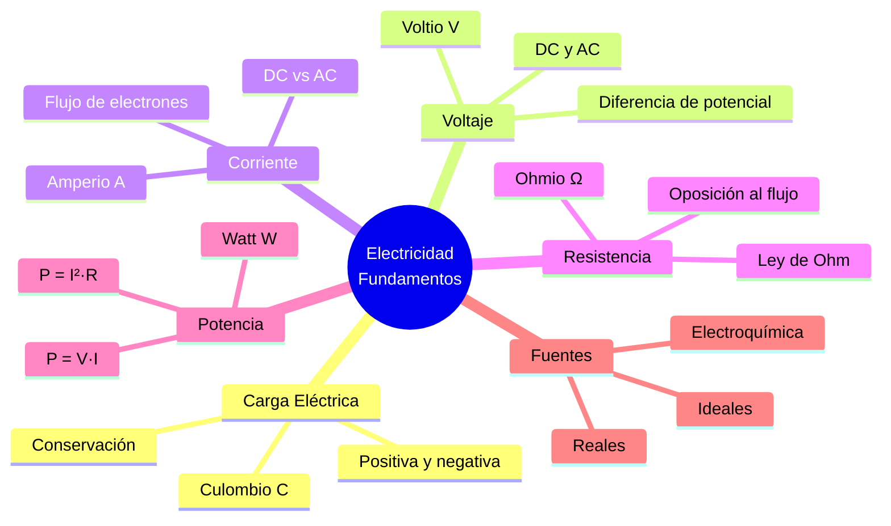

# ⚡ Conceptos Fundamentales de la Electricidad

## 🎯 Introducción

> [!info]- 💡 ¿Qué es la electricidad?
>
> La **electricidad** es un fenómeno físico originado por el movimiento de cargas eléctricas (electrones) a través de un conductor. Es la base de todos los circuitos y sistemas electrónicos modernos.
>
> **Analogía del mundo real:**
>
> - **Electricidad** → Como el agua en una tubería: el voltaje es la presión, la corriente es el caudal, y la resistencia es el diámetro de la tubería.
> - **Sin diferencia de presión** → Sin voltaje = sin flujo de corriente.
>
> ```mermaid
> graph LR
>     A[Fuente de<br/>Energía 🔋] -->|Voltaje V| B[Conductor]
>     B -->|Corriente I| C[Carga<br/>Resistiva]
>     C -->|Retorno| A
>
>     style A fill:#fff4e1
>     style B fill:#e1f5ff
>     style C fill:#e1ffe1
> ```
>
> **Las tres magnitudes esenciales:**
>
> | Magnitud | Símbolo | Unidad | Descripción |
> |---|---|---|---|
> | **Voltaje** | V | Voltio (V) | Diferencia de potencial eléctrico |
> | **Corriente** | I | Amperio (A) | Flujo de carga por unidad de tiempo |
> | **Resistencia** | R | Ohmio (Ω) | Oposición al paso de la corriente |
> 

---

## ⚛️ Carga Eléctrica

> [!note]- 🔬 Fundamentos de la Carga
>
> La **carga eléctrica** es la propiedad fundamental de la materia que da origen a los fenómenos eléctricos. Existe en dos tipos: positiva (+) y negativa (−).
>
> ```mermaid
> graph TD
>     A[Átomo] --> B[Núcleo]
>     A --> C[Electrones ⊖]
>     B --> D[Protones ⊕]
>     B --> E[Neutrones]
>
>     style A fill:#f5e1ff
>     style C fill:#e1f5ff
>     style D fill:#ffe1e1
>     style E fill:#f0f0f0
> ```
>
> **Propiedades de la carga:**
>
> | Propiedad | Descripción |
> |---|---|
> | **Cuantización** | La carga existe en múltiplos de la carga elemental: $e = 1.6 \times 10^{-19}$ C |
> | **Conservación** | La carga total de un sistema aislado permanece constante |
> | **Atracción/Repulsión** | Cargas iguales se repelen; opuestas se atraen |
>
> **Unidad:** El **Culombio (C)** es la unidad de carga eléctrica en el SI.
>
> $$Q = n \cdot e$$
>
> Donde $n$ es el número de electrones y $e = 1.6 \times 10^{-19}$ C.
> 
> ![[Pasted image 20260519222355.png]]

---

## 🧲 Electrostática — Coulomb, Campo y Energía

> [!note]- ⚛️ Ley de Coulomb
>
> La **Ley de Coulomb** describe la fuerza entre dos cargas puntuales en reposo. La fuerza es directamente proporcional al producto de las cargas e inversamente proporcional al cuadrado de la distancia que las separa.
>
> $$\vec{F} = k_e \cdot \frac{q_1 \cdot q_2}{r^2} \hat{r}$$
>
> Donde:
> - $\vec{F}$ = Fuerza eléctrica (Newton, N)
> - $k_e = \dfrac{1}{4\pi\varepsilon_0} \approx 8.99 \times 10^9 \, \text{N·m}^2/\text{C}^2$ — constante de Coulomb
> - $q_1, q_2$ = Cargas eléctricas (Culombios, C)
> - $r$ = Distancia entre cargas (metros, m)
> - $\hat{r}$ = Vector unitario de $q_1$ hacia $q_2$
>
> **Regla de signos:**
>
> | Cargas | Fuerza |
> |---|---|
> | Mismo signo ($++$ o $--$) | Repulsiva (se alejan) |
> | Signo opuesto ($+-$) | Atractiva (se acercan) |
>
> **Ejemplo resuelto:**
>
> > Dos cargas $q_1 = +2\,\mu\text{C}$ y $q_2 = -3\,\mu\text{C}$ separadas $r = 0.1\,\text{m}$.
> >
> > $$F = 8.99\times10^9 \cdot \frac{(2\times10^{-6})(3\times10^{-6})}{(0.1)^2} = 5.39\,\text{N}$$
> >
> > Fuerza **atractiva** (cargas opuestas).

---

> [!tip]- 🧭 Campo Eléctrico Vectorial
>
> El **campo eléctrico** $\vec{E}$ es la fuerza por unidad de carga que experimentaría una carga de prueba positiva $q_0$ colocada en un punto del espacio.
>
> $$\vec{E} = \frac{\vec{F}}{q_0} = k_e \cdot \frac{q}{r^2}\hat{r} \qquad \left[\frac{\text{N}}{\text{C}} = \frac{\text{V}}{\text{m}}\right]$$
>
> ```mermaid
> graph TD
>     A[Carga fuente<br/>+q] -->|líneas salen| B[Campo 𝐸⃗ apunta<br/>HACIA AFUERA]
>     C[Carga fuente<br/>-q] -->|líneas entran| D[Campo 𝐸⃗ apunta<br/>HACIA ADENTRO]
>
>     style A fill:#ffe1e1
>     style B fill:#fff4e1
>     style C fill:#e1f5ff
>     style D fill:#e1ffe1
> ```
>
> **Propiedades de las líneas de campo:**
>
> | Propiedad | Descripción |
> |---|---|
> | Dirección | Del $+$ al $-$ (o hacia el infinito desde $+$) |
> | Densidad | Proporcional a la magnitud de $\vec{E}$ |
> | No se cruzan | Dos líneas nunca se intersectan |
>
> **Superposición:** El campo total de múltiples cargas es la **suma vectorial** de los campos individuales:
>
> $$\vec{E}_{total} = \sum_{i} \vec{E}_i = \sum_{i} k_e \cdot \frac{q_i}{r_i^2}\hat{r}_i$$
> 
> ![[Pasted image 20260519222513.png]]

---

> [!note]- 🔋 Energía Potencial y Potencial Eléctrico
>
> **Energía potencial eléctrica** es el trabajo que realiza el campo eléctrico al mover una carga $q$ entre dos puntos:
>
> $$U = k_e \cdot \frac{q_1 \cdot q_2}{r} \qquad [\text{Joules, J}]$$
>
> **Potencial eléctrico** $V$ es la energía potencial por unidad de carga (caracteriza el campo, independiente de la carga de prueba):
>
> $$V = \frac{U}{q} = k_e \cdot \frac{q}{r} \qquad [\text{Voltios, V}]$$
>
> **Diferencia de potencial** entre dos puntos $A$ y $B$:
>
> $$V_{AB} = V_A - V_B = -\int_B^A \vec{E} \cdot d\vec{l}$$
>
> **Relación entre $V$ y $\vec{E}$:**
>
> $$\vec{E} = -\nabla V = -\frac{dV}{dr}\hat{r}$$
>
> > El campo apunta de mayor a menor potencial — igual que el agua fluye de mayor a menor altura.
>
> **Comparación de conceptos:**
>
> | Magnitud | Símbolo | Unidad | Tipo | Depende de $q_{prueba}$ |
> |---|---|---|---|---|
> | Fuerza de Coulomb | $\vec{F}$ | N | Vectorial | ✅ Sí |
> | Campo eléctrico | $\vec{E}$ | V/m | Vectorial | ❌ No |
> | Energía potencial | $U$ | J | Escalar | ✅ Sí |
> | Potencial eléctrico | $V$ | V | Escalar | ❌ No |
>
> **Superficies equipotenciales:** Lugares geométricos donde $V = \text{cte}$. El campo $\vec{E}$ es siempre **perpendicular** a ellas.

---
## ⚡ Voltaje (Tensión Eléctrica)

> [!tip]- 🔋 Diferencia de Potencial
>
> El **voltaje** o **diferencia de potencial** es la energía por unidad de carga necesaria para mover una carga entre dos puntos de un circuito.
>
> $$V = \frac{W}{Q}$$
>
> Donde:
> - $V$ = Voltaje (Voltios, V)
> - $W$ = Trabajo o energía (Joules, J)
> - $Q$ = Carga eléctrica (Culombios, C)
>
> **Fuentes de voltaje más comunes:**
>
> | Fuente | Tipo | Voltaje típico | Ejemplo |
> |---|---|---|---|
> | Pila AA | DC | 1.5 V | Control remoto |
> | Batería de auto | DC | 12 V | Vehículos |
> | Tomacorriente doméstico | AC | 110–120 V | Ecuador/USA |
> | Red industrial | AC | 220–240 V | Europa / uso industrial |
>
> > **Nota:** En Ecuador la red eléctrica doméstica opera a **110–120 V / 60 Hz**.
> > 
> ![[Pasted image 20260519222726.png]]

---

## 🌊 Corriente Eléctrica

> [!tip]- 🔁 Tipos de Corriente
>
> La **corriente eléctrica** es el flujo ordenado de cargas eléctricas (electrones) a través de un conductor por unidad de tiempo.
>
> $$I = \frac{Q}{t}$$
>
> Donde:
> - $I$ = Corriente (Amperios, A)
> - $Q$ = Carga (Culombios, C)
> - $t$ = Tiempo (Segundos, s)
>
> ```mermaid
> graph LR
>     A[Corriente<br/>Eléctrica] --> B[DC<br/>Corriente Continua]
>     A --> C[AC<br/>Corriente Alterna]
>
>     B --> D[Flujo constante<br/>en un sentido]
>     C --> E[Flujo que cambia<br/>de dirección periódicamente]
>
>     style B fill:#e1f5ff
>     style C fill:#fff4e1
>     style D fill:#e1f5ff
>     style E fill:#fff4e1
> ```
>
> **Comparación DC vs AC:**
>
> | Aspecto | DC (Corriente Continua) | AC (Corriente Alterna) |
> |---|---|---|
> | **Dirección** | Un solo sentido | Cambia periódicamente |
> | **Fuentes** | Baterías, pilas, paneles solares | Red eléctrica, generadores |
> | **Uso típico** | Electrónica, dispositivos móviles | Electrodomésticos, motores |
> | **Transmisión** | Pérdidas a larga distancia | ✅ Eficiente a larga distancia |

---

## 📊 Resumen Visual



---

## 📚 Referencias

> [!quote]- 📖 Fuentes consultadas
>
> [1] A. Hermosa Donante, *Electrónica Aplicada*, 1.ª ed. Mexico: Alfaomega Grupo Editor, 2013, pp. 1–25. ISBN-13: 9786077074045.
>
> [2] A. R. Hambley, *Electrical Engineering: Principles and Applications*, 7th ed. Hoboken, NJ, USA: Pearson, 2018, pp. 1–52.
>
> [3] J. W. Nilsson y S. A. Riedel, *Electric Circuits*, 11th ed. Hoboken, NJ, USA: Pearson, 2019, pp. 1–42.
>
> [4] C. K. Alexander y M. N. O. Sadiku, *Fundamentals of Electric Circuits*, 6th ed. New York, USA: McGraw-Hill, 2016, pp. 1–38.
>
> [5] R. L. Boylestad, *Introductory Circuit Analysis*, 13th ed. Hoboken, NJ, USA: Pearson, 2016, pp. 1–55.

---

**Tags:** #electricidad #carga #voltaje #corriente #resistencia #potencia #leydeohm #EYAG1037 #FESD #ESPOL #unidad1
