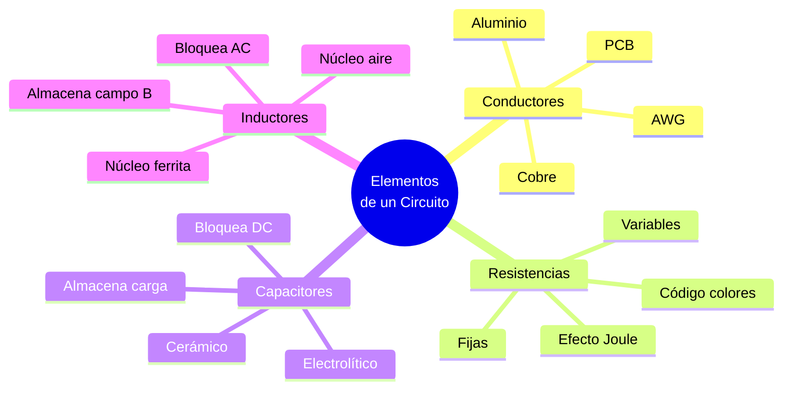

# 🔧 Elementos Básicos de un Circuito Eléctrico

## 🎯 Introducción

> [!info]- 💡 ¿Qué es un circuito eléctrico?
>
> Un **circuito eléctrico** es una trayectoria cerrada por la que puede fluir corriente eléctrica. Está compuesto por elementos interconectados que generan, transportan, almacenan o disipan energía eléctrica.
>
> **Analogía del mundo real:**
>
> - Un circuito eléctrico es como un sistema de tuberías cerrado: la **fuente** es la bomba, los **conductores** son las tuberías, y los **elementos pasivos** (resistencias, capacitores, inductores) son válvulas, depósitos y serpentines que controlan o almacenan el flujo.
>
> ```mermaid
> graph LR
>     A[Fuente<br/>de Voltaje 🔋] -->|+| B[Conductor]
>     B --> C[Elemento<br/>Pasivo]
>     C --> D[Conductor]
>     D -->|-| A
>
>     style A fill:#fff4e1
>     style B fill:#e1f5ff
>     style C fill:#e1ffe1
>     style D fill:#e1f5ff
> ```
>
> **Condición esencial:** El circuito debe ser **cerrado** para que la corriente fluya. Un circuito abierto interrumpe el flujo.
>
> | Elemento | Función principal | Símbolo |
> |---|---|---|
> | **Fuente** | Provee energía al circuito | 🔋 |
> | **Conductor** | Transporta la corriente | ➖ |
> | **Resistencia** | Disipa energía (calor) | ⊟ |
> | **Capacitor** | Almacena energía en campo eléctrico | ⊣⊢ |
> | **Inductor** | Almacena energía en campo magnético | ⌇ |
> 
> ![[Pasted image 20260519225402.png]]

---

## 🎛️ Fuentes Dependientes (Controladas)

> [!note]- 🔗 Fuentes Controladas por otra Variable del Circuito
>
> Las **fuentes dependientes** (o controladas) son elementos activos cuyo valor de voltaje o corriente de salida **depende de otra tensión o corriente** existente en el circuito. Son esenciales para modelar transistores, amplificadores operacionales y otros dispositivos activos.
>
> > A diferencia de las fuentes independientes (batería, generador), las fuentes dependientes **no tienen valor fijo**: su salida varía proporcionalmente a una variable de control $V_x$ o $I_x$ medida en otro punto del circuito.
>
> ```mermaid
> graph TD
>     A[Fuentes<br/>Dependientes] --> B[De Voltaje]
>     A --> C[De Corriente]
>
>     B --> D[VCVS<br/>Voltaje → Voltaje]
>     B --> E[CCVS<br/>Corriente → Voltaje]
>
>     C --> F[VCCS<br/>Voltaje → Corriente]
>     C --> G[CCCS<br/>Corriente → Corriente]
>
>     style B fill:#e1f5ff
>     style C fill:#fff4e1
>     style D fill:#e1ffe1
>     style E fill:#e1ffe1
>     style F fill:#ffe1e1
>     style G fill:#ffe1e1
> ```
>
> **Los cuatro tipos y su simbología:**
>
> | Tipo | Nombre completo | Ecuación | Control | Salida | Símbolo |
> |---|---|---|---|---|---|
> | **VCVS** | Fuente de voltaje controlada por voltaje | $V_s = \mu \cdot V_x$ | $V_x$ (V) | Voltaje | Rombo ◇ con $+/-$ |
> | **CCVS** | Fuente de voltaje controlada por corriente | $V_s = r_m \cdot I_x$ | $I_x$ (A) | Voltaje | Rombo ◇ con $+/-$ |
> | **VCCS** | Fuente de corriente controlada por voltaje | $I_s = g_m \cdot V_x$ | $V_x$ (V) | Corriente | Rombo ◇ con flecha |
> | **CCCS** | Fuente de corriente controlada por corriente | $I_s = \beta \cdot I_x$ | $I_x$ (A) | Corriente | Rombo ◇ con flecha |
>
> > **Simbología:** Las fuentes dependientes se representan con **rombo (◇)** para diferenciarlas de las fuentes independientes (círculo ○).
>
> **Constantes de proporcionalidad:**
>
> | Constante | Tipo | Unidades |
> |---|---|---|
> | $\mu$ (mu) | Ganancia de voltaje (VCVS) | Adimensional (V/V) |
> | $r_m$ | Transresistencia (CCVS) | Ohmios (Ω) |
> | $g_m$ | Transconductancia (VCCS) | Siemens (S = A/V) |
> | $\beta$ | Ganancia de corriente (CCCS) | Adimensional (A/A) |
>
> **Aplicaciones en modelos de dispositivos activos:**
>
> | Dispositivo | Modelo usa | Descripción |
> |---|---|---|
> | **BJT (transistor)** | CCCS | $I_C = \beta \cdot I_B$ |
> | **FET / MOSFET** | VCCS | $I_D = g_m \cdot V_{GS}$ |
> | **Amplificador Op** | VCVS | $V_{out} = A_{ol} \cdot V_{diff}$ |
> | **Transformador** (modelo) | VCVS + CCCS | Relación de transformación $n$ |
>
> **Ejemplo resuelto:**
>
> > Circuito con VCCS: $g_m = 0.02\,\text{S}$, $V_x = 3\,\text{V}$ (voltaje en resistencia de entrada).
> >
> > $$I_s = g_m \cdot V_x = 0.02 \times 3 = 0.06\,\text{A} = 60\,\text{mA}$$
> >
> > La fuente inyecta 60 mA sin importar el voltaje en su terminal de salida.

---
## 🔗 Conductores

> [!note]- 🧵 El Medio de Transporte
>
> Los **conductores** son materiales que permiten el flujo libre de electrones con muy poca oposición. Son el medio por el que la corriente viaja entre los componentes del circuito.
>
> ```mermaid
> graph LR
>     A[Material<br/>Conductor] --> B[Electrones<br/>libres abundantes]
>     B --> C[Baja resistividad<br/>ρ ~ 10⁻⁸ Ω·m]
>     C --> D[Flujo fácil<br/>de corriente]
>
>     style A fill:#e1f5ff
>     style B fill:#fff4e1
>     style C fill:#e1ffe1
>     style D fill:#f5e1ff
> ```
>
> **Materiales conductores más usados:**
>
> | Material | Resistividad (Ω·m) | Ventaja | Uso típico |
> |---|---|---|---|
> | **Plata** | 1.59 × 10⁻⁸ | Mejor conductor | Contactos de precisión |
> | **Cobre** | 1.72 × 10⁻⁸ | ✅ Equilibrio costo-conductividad | Cables, PCB, motores |
> | **Oro** | 2.44 × 10⁻⁸ | No se oxida | Conectores de alta confiabilidad |
> | **Aluminio** | 2.82 × 10⁻⁸ | Liviano y económico | Líneas de transmisión |
>
> **Tipos de conductores por uso:**
>
> | Tipo | Descripción | Ejemplo |
> |---|---|---|
> | **Sólido** | Un solo hilo rígido | Instalaciones fijas |
> | **Trenzado** | Varios hilos entrelazados | Cables flexibles |
> | **Coaxial** | Conductor central + blindaje | Antenas, RF |
> | **Pista de PCB** | Cobre laminado sobre placa | Circuitos impresos |
>
> > **Calibre AWG:** En América Latina se usa el estándar **AWG (American Wire Gauge)** para medir el diámetro de los conductores. A menor número AWG, mayor diámetro y mayor capacidad de corriente (ej. AWG 12 para circuitos de 20 A en hogares).
> > 
> > ![[Pasted image 20260519225615.png]]

---

## ⊟ Resistencias

> [!tip]- 🔩 Disipadores de Energía
>
> La **resistencia** es el elemento pasivo que se opone al paso de la corriente, convirtiendo energía eléctrica en calor (efecto Joule).
>
> $$P = I^2 \cdot R \qquad \text{(Calor disipado)}$$
>
> ```mermaid
> graph TD
>     A[Resistencias] --> B[Fijas]
>     A --> C[Variables]
>
>     B --> D[Carbón<br/>comprimido]
>     B --> E[Película<br/>metálica]
>     B --> F[Bobinadas]
>
>     C --> G[Potenciómetro<br/>3 terminales]
>     C --> H[Reóstato<br/>2 terminales]
>     C --> I[Termistor NTC/PTC<br/>depende de temperatura]
>
>     style B fill:#e1f5ff
>     style C fill:#fff4e1
> ```
>
> **Código de colores (4 bandas):**
>
> | Banda | Color | Dígito / Multiplicador | Tolerancia |
> |---|---|---|---|
> | 1ª–2ª | Negro | 0 | — |
> | 1ª–2ª | Café | 1 | ±1 % |
> | 1ª–2ª | Rojo | 2 | ±2 % |
> | 1ª–2ª | Naranja | 3 | — |
> | 1ª–2ª | Amarillo | 4 | — |
> | 1ª–2ª | Verde | 5 | ±0.5 % |
> | 1ª–2ª | Azul | 6 | ±0.25 % |
> | 1ª–2ª | Violeta | 7 | ±0.1 % |
> | 1ª–2ª | Gris | 8 | — |
> | 1ª–2ª | Blanco | 9 | — |
> | 3ª (mult.) | Dorado | ×0.1 | ±5 % |
> | 3ª (mult.) | Plateado | ×0.01 | ±10 % |
>
> **Ejemplo de lectura:**
>
> > Bandas: **Rojo – Violeta – Naranja – Dorado**
> > → 2 – 7 – ×1 000 – ±5 %
> > → **27 000 Ω = 27 kΩ ±5 %**
>
> **Parámetros importantes:**
>
> | Parámetro | Descripción |
> |---|---|
> | **Valor nominal** | Resistencia en ohmios (Ω, kΩ, MΩ) |
> | **Tolerancia** | Variación permitida respecto al valor nominal |
> | **Potencia** | Máxima potencia disipable sin dañarse (¼ W, ½ W, 1 W, 2 W…) |
> | **Coeficiente de temperatura** | Variación de R con la temperatura (ppm/°C) |
> 
> ![[Pasted image 20260519225108.png]]

---

## ⊣⊢ Capacitores

> [!tip]- ⚡ Almacenadores de Carga Eléctrica
>
> El **capacitor** (o condensador) es un elemento pasivo que almacena energía en forma de **campo eléctrico** entre dos placas conductoras separadas por un dieléctrico.
>
> $$C = \frac{Q}{V} = \varepsilon \cdot \frac{A}{d}$$
>
> Donde:
> - $C$ = Capacitancia (Faradios, F)
> - $Q$ = Carga almacenada (C)
> - $V$ = Voltaje entre las placas (V)
> - $\varepsilon$ = Permitividad del dieléctrico
> - $A$ = Área de las placas (m²)
> - $d$ = Distancia entre placas (m)
>
> **Energía almacenada:**
>
> $$E = \frac{1}{2} C V^2$$
>
> ```mermaid
> graph TD
>     A[Capacitores] --> B[No polarizados]
>     A --> C[Polarizados]
>
>     B --> D[Cerámico<br/>pF – nF]
>     B --> E[Poliéster/Film<br/>nF – µF]
>     B --> F[Mica<br/>pF – nF]
>
>     C --> G[Electrolítico<br/>µF – mF]
>     C --> H[Tántalo<br/>µF]
>
>     style B fill:#e1f5ff
>     style C fill:#fff4e1
> ```
>
> **Comparación de tipos:**
>
> | Tipo | Rango | Polaridad | Uso típico |
> |---|---|---|---|
> | **Cerámico** | 1 pF – 100 nF | No polarizado | Filtros de alta frecuencia, bypass |
> | **Poliéster** | 1 nF – 10 µF | No polarizado | Filtros de audio, temporización |
> | **Electrolítico** | 1 µF – 100 mF | ✅ Polarizado | Fuentes de poder, filtros de ripple |
> | **Tántalo** | 0.1 µF – 1 000 µF | ✅ Polarizado | Electrónica compacta |
>
> **Comportamiento en DC y AC:**
>
> | Señal | Comportamiento | Razón |
> |---|---|---|
> | **DC (estacionario)** | Bloquea la corriente | Las placas se cargan completamente → no fluye corriente |
> | **AC** | Permite el paso | El campo eléctrico varía → corriente de desplazamiento |
>
> > ⚠️ Los capacitores electrolíticos **deben conectarse respetando la polaridad** (+ y −). Invertirlos puede dañarlos o causar cortocircuito.
> > 
> > ![[Pasted image 20260519225814.png]]

---

## ⌇ Inductores

> [!tip]- 🧲 Almacenadores de Energía Magnética
>
> El **inductor** (o bobina) es un elemento pasivo que almacena energía en forma de **campo magnético** cuando circula corriente por sus espiras.
>
> $$V_L = L \cdot \frac{dI}{dt}$$
>
> Donde:
> - $V_L$ = Voltaje en el inductor (V)
> - $L$ = Inductancia (Henrios, H)
> - $\frac{dI}{dt}$ = Tasa de cambio de la corriente (A/s)
>
> **Energía almacenada:**
>
> $$E = \frac{1}{2} L I^2$$
>
> ```mermaid
> graph TD
>     A[Inductores] --> B[Núcleo de aire]
>     A --> C[Núcleo de hierro]
>     A --> D[Núcleo de ferrita]
>
>     B --> E[Alta frecuencia<br/>RF]
>     C --> F[Baja frecuencia<br/>transformadores]
>     D --> G[Media/alta frecuencia<br/>fuentes conmutadas]
>
>     style B fill:#e1f5ff
>     style C fill:#fff4e1
>     style D fill:#e1ffe1
> ```
>
> **Comportamiento en DC y AC:**
>
> | Señal | Comportamiento | Razón |
> |---|---|---|
> | **DC (estacionario)** | Se comporta como un conductor (corto circuito) | $\frac{dI}{dt} = 0$ → $V_L = 0$ |
> | **AC** | Opone cambios de corriente | Campo magnético variable induce FEM opuesta |
>
> **Aplicaciones comunes:**
>
> | Aplicación | Descripción |
> |---|---|
> | **Filtros** | Bloquea señales de alta frecuencia (choke) |
> | **Transformadores** | Dos inductores acoplados magnéticamente |
> | **Fuentes conmutadas** | Almacena y libera energía en ciclos |
> | **Motores y relés** | Genera campo magnético para movimiento mecánico |
> 
> ![[Pasted image 20260519225956.png]]

---

## ⚖️ Comparación de los Tres Elementos Pasivos

> [!success]- 📊 Resistencia, Capacitor e Inductor
>
> | Característica | Resistencia (R) | Capacitor (C) | Inductor (L) |
> |---|---|---|---|
> | **Unidad** | Ohmio (Ω) | Faradio (F) | Henrio (H) |
> | **Almacena energía** | ❌ | ✅ Campo eléctrico | ✅ Campo magnético |
> | **Disipa energía** | ✅ Calor | ❌ | ❌ (ideal) |
> | **En DC estacionario** | Pasa corriente | Bloquea | Cortocircuito |
> | **En AC** | Igual para toda f | Impide baja f | Impide alta f |
> | **Relación V-I** | $V = IR$ | $I = C\frac{dV}{dt}$ | $V = L\frac{dI}{dt}$ |
>
> ```mermaid
> graph LR
>     A[Señal AC] --> B{Elemento}
>     B -->|Resistencia| C[Disipa como calor<br/>P = I²R]
>     B -->|Capacitor| D[Almacena y libera<br/>campo eléctrico]
>     B -->|Inductor| E[Almacena y libera<br/>campo magnético]
>
>     style C fill:#ffe1e1
>     style D fill:#e1f5ff
>     style E fill:#fff4e1
> ```
> 
![[ChatGPT Image 19 may 2026, 23_02_18.png]]

---

## 📊 Resumen Visual



---

## 📚 Referencias

> [!quote]- 📖 Fuentes consultadas
>
> [1] A. Hermosa Donante, *Electrónica Aplicada*, 1.ª ed. Mexico: Alfaomega Grupo Editor, 2013, pp. 30–75. ISBN-13: 9786077074045.
>
> [2] R. L. Boylestad, *Introductory Circuit Analysis*, 13th ed. Hoboken, NJ, USA: Pearson, 2016, pp. 56–130.
>
> [3] C. K. Alexander y M. N. O. Sadiku, *Fundamentals of Electric Circuits*, 6th ed. New York, USA: McGraw-Hill, 2016, pp. 71–140.
>
> [4] A. R. Hambley, *Electrical Engineering: Principles and Applications*, 7th ed. Hoboken, NJ, USA: Pearson, 2018, pp. 91–160.
>
> [5] T. L. Floyd, *Electronic Devices*, 10th ed. Hoboken, NJ, USA: Pearson, 2017, pp. 1–40.

---

**Tags:** #circuito #conductor #resistencia #capacitor #inductor #elementos #pasivos #EYAG1037 #FESD #ESPOL #unidad1
