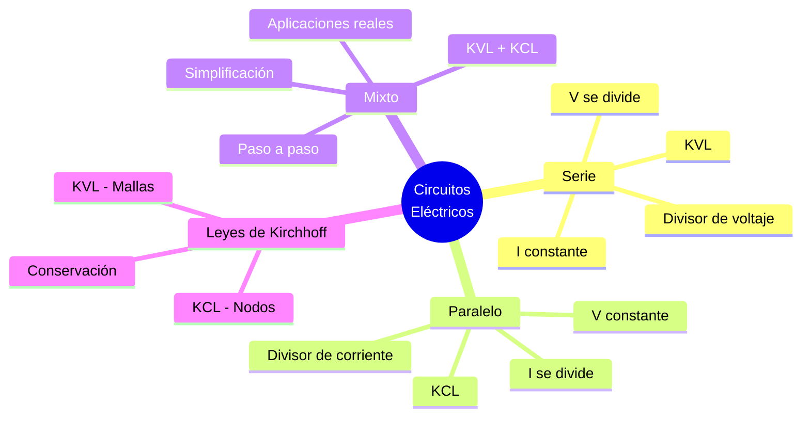

# ⚡ Circuitos en Serie, Paralelo y Mixtos

## 🎯 Introducción

> [!info]- 💡 ¿Cómo se conectan los elementos de un circuito?
>
> Cuando múltiples elementos eléctricos forman parte de un mismo circuito, pueden combinarse de distintas maneras según la trayectoria que siga la corriente. La forma en que se conectan determina completamente el comportamiento del circuito: la distribución de voltaje, la corriente en cada rama y la resistencia equivalente total.
>
> **Analogía del mundo real:**
>
> - Un circuito en **serie** es como un collar de perlas: si una se rompe, todas se desconectan.
> - Un circuito en **paralelo** es como los carriles de una autopista: si uno se cierra, los demás siguen funcionando.
> - Un circuito **mixto** combina ambas configuraciones, como las instalaciones eléctricas de un edificio.
>
> ```mermaid
> graph TD
>     A[Circuitos Eléctricos] --> B[Serie]
>     A --> C[Paralelo]
>     A --> D[Mixto]
>
>     B --> E[Una sola trayectoria<br/>de corriente]
>     C --> F[Múltiples trayectorias<br/>de corriente]
>     D --> G[Combinación de<br/>serie y paralelo]
>
>     style B fill:#e1f5ff
>     style C fill:#e1ffe1
>     style D fill:#fff4e1
> ```
>
> | Configuración | Corriente | Voltaje | Aplicación típica |
> |---|---|---|---|
> | **Serie** | Igual en todos los elementos | Se divide entre elementos | Guirnaldas, fusibles |
> | **Paralelo** | Se divide entre ramas | Igual en todas las ramas | Instalaciones domésticas |
> | **Mixto** | Varía por sección | Varía por sección | Circuitos electrónicos |

---

## 🔗 Circuito en Serie

> [!note]- 🔗 Una sola trayectoria para la corriente
>
> En un **circuito en serie**, los elementos están conectados uno tras otro formando una única trayectoria. La misma corriente recorre todos los elementos secuencialmente.
>
> ```mermaid
> graph LR
>     A[🔋 Vs] -->|I| B[R₁]
>     B -->|I| C[R₂]
>     C -->|I| D[R₃]
>     D -->|I| A
>
>     style A fill:#fff4e1
>     style B fill:#e1f5ff
>     style C fill:#e1f5ff
>     style D fill:#e1f5ff
> ```
>
> ### ⚙️ Leyes fundamentales en serie
>
> **1. Corriente:** La corriente es la misma en todos los elementos.
>
> $$I_{total} = I_1 = I_2 = I_3 = \cdots = I_n$$
>
> **2. Voltaje:** El voltaje de la fuente se distribuye (divide) entre los elementos. Esta es la **Ley de Kirchhoff de Voltaje (KVL)**:
>
> $$V_s = V_1 + V_2 + V_3 + \cdots + V_n$$
>
> **3. Resistencia equivalente:** Las resistencias se suman directamente.
>
> $$R_{eq} = R_1 + R_2 + R_3 + \cdots + R_n$$
>
> > 📌 **Nota:** En serie, $R_{eq}$ siempre es **mayor** que cualquiera de las resistencias individuales.
>
> ### 📐 Divisor de voltaje
>
> La tensión en cada resistor es proporcional a su valor:
>
> $$V_k = V_s \cdot \frac{R_k}{R_{eq}}$$
>
> **Ejemplo resuelto:**
>
> > Dado: $V_s = 12\text{ V}$, $R_1 = 100\ \Omega$, $R_2 = 200\ \Omega$, $R_3 = 300\ \Omega$
> >
> > $R_{eq} = 100 + 200 + 300 = 600\ \Omega$
> >
> > $I = \dfrac{12}{600} = 0.02\text{ A} = 20\text{ mA}$
> >
> > $V_1 = 20\text{ mA} \times 100\ \Omega = 2\text{ V}$
> >
> > $V_2 = 20\text{ mA} \times 200\ \Omega = 4\text{ V}$
> >
> > $V_3 = 20\text{ mA} \times 300\ \Omega = 6\text{ V}$
> >
> > ✅ Verificación KVL: $2 + 4 + 6 = 12\text{ V}$ ✓
>
> ### ⚠️ Características importantes
>
> | Característica | Descripción |
> |---|---|
> | **Fallo en cadena** | Si un elemento falla (circuito abierto), toda la corriente se interrumpe |
> | **Mayor resistencia** | $R_{eq}$ siempre supera a cualquier resistencia individual |
> | **Distribución de voltaje** | Elementos de mayor R tienen mayor caída de voltaje |
> | **Misma potencia base** | $P = I^2 R$ varía según la resistencia de cada elemento |
> 
> ![[Pasted image 20260519230346.png]]

---

## 🔀 Circuito en Paralelo

> [!note]- 🔀 Múltiples trayectorias para la corriente
>
> En un **circuito en paralelo**, los elementos comparten los mismos dos nodos (terminales), por lo que el voltaje en todos ellos es idéntico. La corriente total se reparte entre las ramas disponibles.
>
> ```mermaid
> graph LR
>     A[🔋 Vs] --> N1[Nodo +]
>     N1 -->|I₁| B[R₁]
>     N1 -->|I₂| C[R₂]
>     N1 -->|I₃| D[R₃]
>     B --> N2[Nodo -]
>     C --> N2
>     D --> N2
>     N2 --> A
>
>     style A fill:#fff4e1
>     style N1 fill:#e1ffe1
>     style N2 fill:#e1ffe1
>     style B fill:#e1f5ff
>     style C fill:#e1f5ff
>     style D fill:#e1f5ff
> ```
>
> ### ⚙️ Leyes fundamentales en paralelo
>
> **1. Voltaje:** El voltaje es el mismo en todas las ramas.
>
> $$V_s = V_1 = V_2 = V_3 = \cdots = V_n$$
>
> **2. Corriente:** La corriente total se divide entre las ramas. Esta es la **Ley de Kirchhoff de Corriente (KCL)**:
>
> $$I_{total} = I_1 + I_2 + I_3 + \cdots + I_n$$
>
> **3. Resistencia equivalente:** Se calcula mediante la suma de recíprocos.
>
> $$\frac{1}{R_{eq}} = \frac{1}{R_1} + \frac{1}{R_2} + \frac{1}{R_3} + \cdots + \frac{1}{R_n}$$
>
> > 📌 **Caso especial — dos resistencias en paralelo:**
> >
> > $$R_{eq} = \frac{R_1 \cdot R_2}{R_1 + R_2}$$
>
> > 📌 **Nota:** En paralelo, $R_{eq}$ siempre es **menor** que la menor resistencia del conjunto.
>
> ### 📐 Divisor de corriente
>
> La corriente en cada rama es inversamente proporcional a su resistencia:
>
> $$I_k = I_{total} \cdot \frac{R_{eq}}{R_k}$$
>
> **Ejemplo resuelto:**
>
> > Dado: $V_s = 12\text{ V}$, $R_1 = 60\ \Omega$, $R_2 = 30\ \Omega$
> >
> > $R_{eq} = \dfrac{60 \times 30}{60 + 30} = \dfrac{1800}{90} = 20\ \Omega$
> >
> > $I_{total} = \dfrac{12}{20} = 0.6\text{ A}$
> >
> > $I_1 = \dfrac{12}{60} = 0.2\text{ A}$
> >
> > $I_2 = \dfrac{12}{30} = 0.4\text{ A}$
> >
> > ✅ Verificación KCL: $0.2 + 0.4 = 0.6\text{ A}$ ✓
>
> ### ⚠️ Características importantes
>
> | Característica | Descripción |
> |---|---|
> | **Independencia de ramas** | El fallo de una rama no afecta a las demás |
> | **Menor resistencia** | $R_{eq}$ siempre es menor que cualquier $R_k$ |
> | **Mismo voltaje** | Todos los elementos operan a la misma tensión |
> | **Mayor corriente total** | Al agregar ramas, la corriente de la fuente aumenta |
> 
> ![[Pasted image 20260519230457.png]]

---

## 🔁 Circuito Mixto (Serie-Paralelo)

> [!tip]- 🔁 Combinación de ambas configuraciones
>
> Un **circuito mixto** (o serie-paralelo) combina secciones en serie con grupos en paralelo. Son los circuitos más comunes en la práctica real.
>
> El método de análisis consiste en **simplificar progresivamente** el circuito, reduciendo grupos paralelos o series a su equivalente, hasta obtener un único $R_{eq}$.
>
> ```mermaid
> graph LR
>     A[🔋 Vs] -->|I| B[R₁]
>     B --> N1[Nodo]
>     N1 -->|I₂| C[R₂]
>     N1 -->|I₃| D[R₃]
>     C --> N2[Nodo]
>     D --> N2
>     N2 -->|I| E[R₄]
>     E --> A
>
>     style A fill:#fff4e1
>     style B fill:#e1f5ff
>     style C fill:#e1ffe1
>     style D fill:#e1ffe1
>     style E fill:#e1f5ff
>     style N1 fill:#f5e1ff
>     style N2 fill:#f5e1ff
> ```
>
> ### 🧮 Metodología de simplificación paso a paso
>
> ```mermaid
> graph TD
>     P1[1️⃣ Identificar grupos<br/>en paralelo] --> P2[2️⃣ Calcular R_eq<br/>de cada grupo paralelo]
>     P2 --> P3[3️⃣ Reemplazar grupo por<br/>su resistencia equivalente]
>     P3 --> P4[4️⃣ Sumar resistencias<br/>resultantes en serie]
>     P4 --> P5[5️⃣ Aplicar Ley de Ohm<br/>para corriente total]
>     P5 --> P6[6️⃣ Calcular voltajes y<br/>corrientes en cada rama]
>
>     style P1 fill:#e1f5ff
>     style P2 fill:#e1ffe1
>     style P3 fill:#fff4e1
>     style P4 fill:#e1f5ff
>     style P5 fill:#e1ffe1
>     style P6 fill:#fff4e1
> ```
>
> **Ejemplo resuelto:**
>
> > Dado: $V_s = 24\text{ V}$, $R_1 = 4\ \Omega$ (serie), $R_2 = 12\ \Omega$ y $R_3 = 6\ \Omega$ (paralelo entre sí), $R_4 = 2\ \Omega$ (serie)
> >
> > **Paso 1:** Calcular equivalente de $R_2 \| R_3$:
> > $$R_{23} = \frac{12 \times 6}{12 + 6} = \frac{72}{18} = 4\ \Omega$$
> >
> > **Paso 2:** Circuito reducido en serie: $R_1$, $R_{23}$, $R_4$
> > $$R_{eq} = 4 + 4 + 2 = 10\ \Omega$$
> >
> > **Paso 3:** Corriente total:
> > $$I = \frac{24}{10} = 2.4\text{ A}$$
> >
> > **Paso 4:** Voltaje en el grupo paralelo:
> > $$V_{23} = I \times R_{23} = 2.4 \times 4 = 9.6\text{ V}$$
> >
> > **Paso 5:** Corrientes en cada rama del paralelo:
> > $$I_2 = \frac{9.6}{12} = 0.8\text{ A} \qquad I_3 = \frac{9.6}{6} = 1.6\text{ A}$$
> >
> > ✅ Verificación KCL: $0.8 + 1.6 = 2.4\text{ A}$ ✓
> > 
> > ![[Pasted image 20260519230523.png]]

---
## 🔋 Potencia en Circuitos

> [!tip]- ⚡ Potencia disipada y suministrada
>
> La **potencia** indica la rapidez con que se transfiere o disipa energía en el circuito. Se expresa en vatios (W).
>
> $$P = V \cdot I = I^2 \cdot R = \frac{V^2}{R}$$
>
> **Conservación de energía — Teorema de Tellegen:**
>
> $$\sum P_{suministrada} = \sum P_{disipada}$$
>
> La potencia total entregada por las fuentes debe ser igual a la potencia consumida por todos los elementos pasivos.
>
> **Comparación de potencia según configuración:**
>
> | Parámetro | Serie | Paralelo |
> |---|---|---|
> | **Potencia total** | $P_T = I^2 R_{eq}$ | $P_T = \dfrac{V_s^2}{R_{eq}}$ |
> | **Potencia por elemento** | $P_k = I^2 R_k$ (mayor R → mayor P) | $P_k = \dfrac{V_s^2}{R_k}$ (menor R → mayor P) |
> | **Al agregar elementos** | $R_{eq}$ aumenta → $P_T$ disminuye | $R_{eq}$ disminuye → $P_T$ aumenta |

---

## 📊 Comparación General

> [!success]- 📊 Serie vs. Paralelo vs. Mixto
>
> | Característica | Serie | Paralelo | Mixto |
> |---|---|---|---|
> | **Trayectorias de corriente** | Una sola | Múltiples | Combinadas |
> | **Corriente** | $I_1 = I_2 = \cdots$ | Se divide | Varía por sección |
> | **Voltaje** | Se divide | $V_1 = V_2 = \cdots$ | Varía por sección |
> | **$R_{eq}$** | $\sum R_k$ (mayor) | $< R_{min}$ (menor) | Depende del circuito |
> | **Ley aplicada** | KVL | KCL | KVL + KCL |
> | **Fallo de un elemento** | Interrumpe todo | Solo esa rama | Depende de la ubicación |
> | **Ejemplo real** | Luces navideñas antiguas | Tomacorrientes del hogar | Circuitos electrónicos |
>
> ```mermaid
> graph LR
>     A[Fuente Vs] --> B{Tipo de<br/>circuito}
>
>     B -->|Serie| C[I constante<br/>V se divide<br/>R_eq = ΣRk]
>     B -->|Paralelo| D[V constante<br/>I se divide<br/>R_eq < R_min]
>     B -->|Mixto| E[Simplificar<br/>paso a paso<br/>KVL + KCL]
>
>     style C fill:#e1f5ff
>     style D fill:#e1ffe1
>     style E fill:#fff4e1
> ```

---

## 🔀 Elementos de Control

> [!tip]- 🔘 Interruptores y Pulsadores
>
> Los **elementos de control** permiten abrir, cerrar o conmutar trayectorias de corriente en un circuito. Son la interfaz entre la señal de mando (manual o eléctrica) y el circuito de potencia o señal.
>
> ```mermaid
> graph TD
>     A[Elementos<br/>de Control] --> B[Acción Manual]
>     A --> C[Acción Eléctrica]
>
>     B --> D[Interruptores]
>     B --> E[Pulsadores]
>     B --> F[Conmutadores]
>
>     C --> G[Relé]
>     C --> H[Contactor]
>     C --> I[Transistor<br/>como switch]
>
>     style B fill:#e1f5ff
>     style C fill:#fff4e1
> ```
>
> **Interruptores (toggle / palanca):**
>
> | Tipo | Descripción | Símbolo SPST | Uso típico |
> |---|---|---|---|
> | **SPST** (*Single Pole Single Throw*) | Un polo, una posición: abre o cierra un circuito | ― / ○ | Encendido/apagado simple |
> | **SPDT** (*Single Pole Double Throw*) | Un polo, dos posiciones: selecciona entre dos trayectorias | ―⟋○ / ○ | Conmutación de fuentes |
> | **DPST** (*Double Pole Single Throw*) | Dos polos simultáneos, una posición | Dos SPST acoplados | Corte bifásico |
> | **DPDT** (*Double Pole Double Throw*) | Dos polos simultáneos, dos posiciones | Dos SPDT acoplados | Inversión de motor DC |

---

> [!tip]- ⏺️ Pulsadores NA y NC
>
> Los **pulsadores** (pushbuttons) son interruptores momentáneos: **solo actúan mientras se presionan** y vuelven a su estado de reposo al soltar.
>
> | Tipo | Estado de reposo | Estado al pulsar | Símbolo | Uso típico |
> |---|---|---|---|---|
> | **NA** — Normalmente Abierto *(NO: Normally Open)* | Abierto (no pasa corriente) | Cerrado (pasa corriente) | ○—/—○ con flecha | Botón de marcha, doorbell |
> | **NC** — Normalmente Cerrado *(NC: Normally Closed)* | Cerrado (pasa corriente) | Abierto (corta corriente) | ○—/—○ con barra | Botón de paro, seguridad |
>
> ```mermaid
> graph LR
>     A[Pulsador NA<br/>Reposo: ABIERTO] -->|se presiona| B[CIERRA el circuito<br/>→ corriente fluye]
>     C[Pulsador NC<br/>Reposo: CERRADO] -->|se presiona| D[ABRE el circuito<br/>→ corriente se interrumpe]
>
>     style A fill:#e1f5ff
>     style B fill:#e1ffe1
>     style C fill:#fff4e1
>     style D fill:#ffe1e1
> ```
>
> > **Regla de seguridad:** En circuitos industriales, los **botones de paro** deben ser **NC** — si el cable se rompe o el contacto falla, el sistema se detiene de forma segura (*fail-safe*).

---

> [!tip]- 🔁 Conmutadores
>
> Los **conmutadores** desvían la corriente entre dos o más trayectorias sin interrumpirla. El ejemplo más común es el **circuito de escalera** (dos interruptores para una misma lámpara).
>
> | Tipo | Polos / Tiros | Función |
> |---|---|---|
> | **SPDT como conmutador** | 1P – 2T | Conecta un circuito a uno de dos destinos |
> | **Conmutador rotativo** | 1P – nT | Selecciona entre $n$ posiciones (bandas de radio, rangos de multímetro) |
> | **Conmutador de escalera** | 2× SPDT | Control de una carga desde dos puntos distintos |
>
> **Circuito de escalera (escalera de dos tramos):**
>
> $$\text{Lámpara enciende si: } S_1 = S_2 \quad \text{(ambos arriba o ambos abajo)}$$
> $$\text{Lámpara apaga si: } S_1 \neq S_2 \quad \text{(posiciones opuestas)}$$

---

> [!example]- ⚡ Relé — Interruptor Controlado Eléctricamente
>
> El **relé** es un interruptor electromecánico que usa una pequeña corriente de control (bobina) para conmutar un circuito de mayor potencia (contactos).
>
> ```mermaid
> graph LR
>     A[Señal de control<br/>baja potencia<br/>ej. 5 V / 50 mA] -->|energiza| B[Bobina<br/>electroimán]
>     B -->|atrae armadura| C[Contactos<br/>se cierran/abren]
>     C -->|controla| D[Circuito de carga<br/>alta potencia<br/>ej. 220 V / 10 A]
>
>     style A fill:#e1f5ff
>     style B fill:#fff4e1
>     style C fill:#e1ffe1
>     style D fill:#ffe1e1
> ```
>
> **Partes del relé:**
>
> | Parte | Función |
> |---|---|
> | **Bobina** | Genera campo magnético al circular corriente (circuito de control) |
> | **Armadura** | Pieza metálica móvil atraída por el electroimán |
> | **Contactos COM** | Terminal común (*common*) |
> | **Contacto NA** | Abierto en reposo; se cierra al activar la bobina |
> | **Contacto NC** | Cerrado en reposo; se abre al activar la bobina |
> | **Diodo flyback** | Protege el circuito de control de la FEM de retroceso de la bobina |
>
> **Parámetros clave al seleccionar un relé:**
>
> | Parámetro | Descripción |
> |---|---|
> | **Tensión de bobina** | Voltaje necesario para activar (5 V, 12 V, 24 V…) |
> | **Corriente de bobina** | Consumo del circuito de control (típico 50–150 mA) |
> | **Tensión máx. de contactos** | Voltaje que soportan los contactos (ej. 250 V AC) |
> | **Corriente máx. de contactos** | Corriente máxima conmutada (ej. 10 A) |
>
> **Comparación relé vs. contactor:**
>
> | Característica | Relé | Contactor |
> |---|---|---|
> | **Corriente de contactos** | Baja–media (< 20 A) | Alta (20 A – kA) |
> | **Aplicación** | Control, señal, automatización | Motores, cargas industriales |
> | **Tamaño** | Pequeño (PCB / DIN) | Grande (panel eléctrico) |
> | **Costo** | Bajo | Mayor |

---
## 📊 Resumen Visual



---

## 📚 Referencias

> [!quote]- 📖 Fuentes consultadas
>
> [1] R. L. Boylestad, *Introductory Circuit Analysis*, 13th ed. Hoboken, NJ, USA: Pearson, 2016, pp. 131–210.
>
> [2] C. K. Alexander y M. N. O. Sadiku, *Fundamentals of Electric Circuits*, 6th ed. New York, USA: McGraw-Hill, 2016, pp. 29–70.
>
> [3] A. R. Hambley, *Electrical Engineering: Principles and Applications*, 7th ed. Hoboken, NJ, USA: Pearson, 2018, pp. 33–90.
>
> [4] J. W. Nilsson y S. A. Riedel, *Electric Circuits*, 11th ed. Hoboken, NJ, USA: Pearson, 2019, pp. 22–100.
>
> [5] A. Hermosa Donante, *Electrónica Aplicada*, 1.ª ed. Mexico: Alfaomega Grupo Editor, 2013, pp. 76–130. ISBN-13: 9786077074045.

---

**Tags:** #circuito #serie #paralelo #mixto #kirchhoff #KVL #KCL #divisor #resistencia #potencia #EYAG1037 #FESD #ESPOL #unidad1
