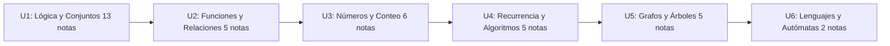

# 🟧 Matemáticas Discretas

**Código:** MATG1051 · **Semestre:** 3ro · [[Bienvenida y Syllabus Matemáticas Discretas|Ver Syllabus completo]]

---

## Progreso del Curso

---

## Unidad I — Lógica y Conjuntos *(6h)* → [[Universidad/3er Semestre/Matemáticas Discretas/Unidad 1 - Logica y Conjuntos/00 - Índice Unidad 1|📂 Índice]]

> [!note] I — Lógica Proposicional
> - [[01 - Proposiciones, conectivos lógicos, tablas de verdad , propiedades y circuitos combinatorio|01 — Proposiciones y conectivos]]
> - [[02 - Proposiciones Condicionales y Equivalencia Lógica|02 — Condicionales y equivalencia]]

> [!note] II — Álgebra Proposicional
> - [[01 - Algebra de Proposiciones|01 — Algebra de proposiciones]]
> - [[02 - Cuantificadores|02 — Cuantificadores]]
> - [[03 - Demostraciones|03 — Demostraciones]]

> [!note] III — Razonamiento Inductivo
> - [[01 - Reglas de Inferencia|01 — Reglas de inferencia]]
> - [[02 - Reglas de Inferencia para Afirmaciones Cuantificadas|02 — Afirmaciones cuantificadas]]
> - [[03 - Inducción Matemática|03 — Inducción matemática]]

> [!note] IV — Teoría de Conjuntos
> - [[01 - Conjuntos, Cardinalidad y Subconjuntos|01 — Conjuntos y cardinalidad]]
> - [[02 - Operaciones y Diagramas de Venn|02 — Operaciones y Venn]]
> - [[03 - Leyes de Conjuntos|03 — Leyes de conjuntos]]
> - [[04 - Cardinalidad y Leyes de Cardinalidad|04 — Cardinalidad y leyes]]

---

## Unidad II — Funciones, Sucesiones y Relaciones *(5h)* → [[Universidad/3er Semestre/Matemáticas Discretas/Unidad 2 - Funciones y Relaciones/00 - Índice Unidad 2|📂 Índice]]

> [!note] II — Funciones, Sucesiones y Relaciones
> - [[01 - Funciones|01 — Funciones]]
> - [[02 - Relaciones|02 — Relaciones]]
> - [[03 - Propiedades y Equivalencia|03 — Propiedades y equivalencia]]
> - [[04 - Sucesiones y Cadenas|04 — Sucesiones y cadenas]]

---

## Unidad III — Números y Conteo *(8h)* → [[Universidad/3er Semestre/Matemáticas Discretas/Unidad 3 - Números y Conteo/00 - Índice Unidad 3|📂 Índice]]

> [!note] III — Divisibilidad y Conteo
> - [[01 - Divisibilidad y Números Primos|01 — Divisibilidad y primos]]
> - [[02 - MCD, MCM y Algoritmo de Euclides|02 — MCD, MCM y Euclides]]
> - [[03 - Criterios de Divisibilidad y Sistemas de Numeración|03 — Criterios y sistemas]]

> [!note] III — Principios y Enumeración
> - [[04 - Principios de Multiplicación y Suma|04 — Principios de suma y multiplicación]]
> - [[05 - Permutaciones y Combinaciones|05 — Permutaciones y combinaciones]]
> - [[06 - Teorema del Binomio y Principio del Palomar|06 — Binomio y Palomar]]

---

## Unidad IV — Recurrencia y Algoritmos *(7h)* → [[Universidad/3er Semestre/Matemáticas Discretas/Unidad 4 - Recurrencia y Algoritmos/00 - Índice Unidad 4|📂 Índice]]

> [!note] IV — Recurrencia
> - [[01 - Relaciones de Recurrencia|01 — Relaciones de recurrencia]]
> - [[02 - Recurrencia Homogénea|02 — Recurrencia homogénea]]

> [!note] IV — Análisis de Algoritmos
> - [[03 - Pseudocódigo y Algoritmos|03 — Pseudocódigo y algoritmos]]
> - [[04 - Análisis de Algoritmos I - Fundamentos y Funciones Matemáticas|04 — Análisis I]]
> - [[05 - Análisis de Algoritmos II - Pseudocódigo y Tiempo Real|05 — Análisis II]]

---

## Unidad V — Grafos y Árboles *(12h)* → [[Universidad/3er Semestre/Matemáticas Discretas/Unidad 5 - Grafos y Árboles/00 - Índice Unidad 5|📂 Índice]]

> [!note] V — Grafos
> - [[01 - Grafos I - Conceptos Básicos y Recorridos|01 — Grafos I]]
> - [[02 - Grafos II - Subgrafos, Matrices y Algoritmos|02 — Grafos II]]
> - [[03 - Grafos III - Isomorfismo|03 — Isomorfismo]]

> [!note] V — Árboles
> - [[04 - Árboles I - Conceptos Básicos y Árboles de Expansión|04 — Árboles I]]
> - [[05 - Árboles II - Árboles Binarios, Recorridos y Códigos Huffman|05 — Árboles II]]

---

## Unidad VI — Lenguajes y Autómatas *(4h)* → [[Universidad/3er Semestre/Matemáticas Discretas/Unidad 6 - Lenguajes y Autómatas/00 - Índice Unidad 6|📂 Índice]]

> [!note] VI — Lenguajes y Autómatas
> - [[01 - Máquinas de Estado Finito - Definición y Estructura|01 — Máquinas de estado finito]]
> - [[02 - Autómatas de Estado Finito - Diseño y Aceptación de Cadenas|02 — Autómatas]]

---

## 📂 Ejercicios y Guías

> [!note] Guías de Ejercicios
> - [[Guía de Problemas 1 - Ejercicios Resueltos|Guía 1]]
> - [[Guía de Problemas 2 - Ejercicios Resueltos|Guía 2]]
> - [[Guía de Problemas 3 - Ejercicios Resueltos|Guía 3]]
> - [[Guía de Problemas 4 - Ejercicios Resueltos|Guía 4]]
> - [[Guía de Problemas 5 - Ejercicios Resueltos|Guía 5]]
> - [[Guía de Problemas 6 - Ejercicios Resueltos|Guía 6]]

---

**Tags:** #matematicas #discretas #ESPOL #MATG1051
