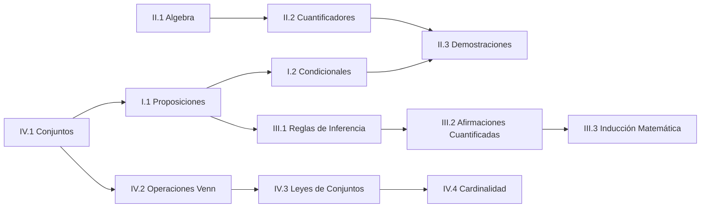

# 🗺️ Unidad 1 — Lógica y Conjuntos — Índice

> [!info] ℹ️ Índice manual
> Se actualiza a mano para que funcione igual en Obsidian y en Digital Garden.

## 📑 Notas de la Unidad

- [[Guía de Problemas 1 - Ejercicios Resueltos]]

### I - Lógica Proporcional

- [[01 - Proposiciones y conectivos]]
- [[02 - Proposiciones Condicionales y Equivalencia Lógica]]

### II - Álgebra Proposicional

- [[01 - Algebra de Proposiciones]]
- [[02 - Cuantificadores]]
- [[03 - Demostraciones]]

### III - Razonamiento Inductivo

- [[01 - Reglas de Inferencia]]
- [[02 - Reglas de Inferencia para Afirmaciones Cuantificadas]]
- [[03 - Inducción Matemática]]

### IV - Teoría de Conjuntos

- [[01 - Conjuntos, Cardinalidad y Subconjuntos]]
- [[02 - Operaciones y Diagramas de Venn]]
- [[03 - Leyes de Conjuntos]]
- [[04 - Cardinalidad y Leyes de Cardinalidad]]

## 📊 Mapa de conexiones

> [!quote] 🔗 Conexiones
> - Siguiente unidad: [[01 - Funciones]] (Unidad 2)
> - MOC general: [[Matemáticas Discretas]]

---
**Tags:** #MATG1051 #unidad1 #indice #discretas
