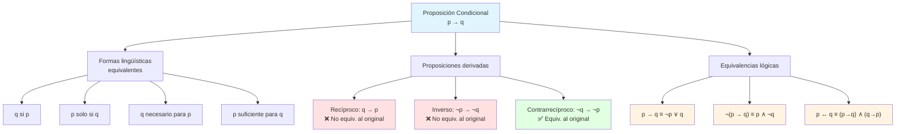

# 🔀 Proposiciones Condicionales y Equivalencia Lógica

## 🎯 El Condicional en Profundidad

> [!info]- 📖 Recordatorio: Definición del Condicional
> 
> Sean $p$ y $q$ dos proposiciones. El **condicional** $p \rightarrow q$ ("si $p$ entonces $q$") tiene la siguiente tabla de verdad:
> 
> |$p$|$q$|$p \rightarrow q$|
> |:-:|:-:|:-:|
> |V|V|V|
> |V|F|**F**|
> |F|V|V|
> |F|F|V|
> 
> - $p$ = **hipótesis** (antecedente)
> - $q$ = **conclusión** (consecuente)
> - **Solo es falso** cuando el antecedente es verdadero y el consecuente es falso.
> 
> **Fórmula:** $VL(p \rightarrow q) = \max{1 - VL(p),\ VL(q)}$

---

## 🔤 Formas Equivalentes del Condicional

> [!tip]- 🗣️ Distintas Maneras de Expresar "si p entonces q"
> 
> En el lenguaje natural existen muchas formas de expresar un condicional. Todas las siguientes son equivalentes a $p \rightarrow q$:
> 
> |Forma lingüística|Ejemplo concreto|
> |---|---|
> |**si** $p$, **entonces** $q$|Si estudias, entonces apruebas.|
> |$q$ **si** $p$|Apruebas si estudias.|
> |$p$ **solo si** $q$|Estudias solo si apruebas.|
> |$q$ **es necesario para** $p$|Aprobar es necesario para haber estudiado.|
> |$p$ **es suficiente para** $q$|Estudiar es suficiente para aprobar.|
> |**una condición necesaria para** $p$ **es** $q$|Una condición necesaria para estudiar es aprobar.|
> |**una condición suficiente para** $q$ **es** $p$|Una condición suficiente para aprobar es estudiar.|
> 
> > ⚠️ **Clave para no confundirse:**
> > 
> > - "**Necesario para $p$**" → el resultado va en $q$ (consecuente)
> > - "**Suficiente para $q$**" → la causa va en $p$ (antecedente)

> [!example]- ✏️ Práctica: Convertir a la forma estándar
> 
> Escriba en la forma **"si $p$ entonces $q$"** cada proposición:
> 
> |Proposición|Identificación|Forma estándar|
> |---|---|---|
> |Una condición necesaria para que comience el verano es que termine el calor.|$p$: comienza el verano; $q$: termina el calor|Si comienza el verano, entonces termina el calor.|
> |Alan aprobó el examen de Álgebra si estudió todos los temas.|$p$: estudió todos los temas; $q$: aprobó el examen|Si Alan estudió todos los temas, entonces aprobó el examen de Álgebra.|
> |Hace calor solo si está lloviendo.|$p$: hace calor; $q$: está lloviendo|Si hace calor, entonces está lloviendo.|
> |Para que 17 sea menor que 12 es suficiente que 17 sea primo.|$p$: 17 es primo; $q$: 17 es menor que 12|Si 17 es primo, entonces 17 es menor que 12.|
> |Una condición necesaria para que Luisa visite Salinas es que viaje a Manta.|$p$: Luisa visita Salinas; $q$: viaja a Manta|Si Luisa visita Salinas, entonces viaja a Manta.|
> |Para comer sano es suficiente adelgazar.|$p$: adelgazo; $q$: como sano|Si adelgazo, entonces como sano.|

---

## 🔁 Proposiciones Derivadas del Condicional

> [!note]- 📐 Recíproco, Inverso y Contrarrecíproco
> 
> Dado el condicional $p \rightarrow q$, se definen tres proposiciones relacionadas:
> 
> |Proposición|Simbología|Nombre|
> |---|---|---|
> |$p \rightarrow q$|—|**Original**|
> |$q \rightarrow p$|—|**Recíproco** (conversa)|
> |$\neg p \rightarrow \neg q$|—|**Inverso**|
> |$\neg q \rightarrow \neg p$|—|**Contrarrecíproco**|
> 
> **Relaciones de equivalencia:**
> 
> ```mermaid
> graph LR
>     A["p → q\n(Original)"] <-->|"≡"| B["¬q → ¬p\n(Contrarrecíproco)"]
>     C["q → p\n(Recíproco)"] <-->|"≡"| D["¬p → ¬q\n(Inverso)"]
>     A -.-|"≢"| C
>     A -.-|"≢"| D
>     
>     style A fill:#e1f5ff
>     style B fill:#e1f5ff
>     style C fill:#fff4e1
>     style D fill:#fff4e1
> ```
> 
> > ✅ El original y su contrarrecíproco son **lógicamente equivalentes**.  
> > ✅ El recíproco y el inverso son **lógicamente equivalentes** entre sí.  
> > ❌ El original y el recíproco **no son equivalentes** en general.

> [!example]- 🧮 Verificación mediante tabla de verdad
> 
> Verifiquemos que $p \rightarrow q \equiv \neg q \rightarrow \neg p$:
> 
> |$p$|$q$|$\neg p$|$\neg q$|$p \rightarrow q$|$\neg q \rightarrow \neg p$|
> |:-:|:-:|:-:|:-:|:-:|:-:|
> |V|V|F|F|**V**|**V**|
> |V|F|F|V|**F**|**F**|
> |F|V|V|F|**V**|**V**|
> |F|F|V|V|**V**|**V**|
> 
> Las columnas son idénticas → $p \rightarrow q \equiv \neg q \rightarrow \neg p$ ✅
> 
> Y que el recíproco $q \rightarrow p$ **NO** es equivalente al original:
> 
> |$p$|$q$|$p \rightarrow q$|$q \rightarrow p$|
> |:-:|:-:|:-:|:-:|
> |V|V|V|V|
> |V|F|**F**|**V**|
> |F|V|**V**|**F**|
> |F|F|V|V|
> 
> Las columnas difieren → $p \rightarrow q \not\equiv q \rightarrow p$ ❌

> [!example]- ✏️ Ejemplo aplicado: Recíproco y Contrarrecíproco
> 
> Sea la proposición: **"Si nieva, entonces hace frío."**
> 
> |Tipo|Enunciado|Equivalente al original|
> |---|---|---|
> |**Original**|Si nieva, entonces hace frío.|—|
> |**Recíproco**|Si hace frío, entonces nieva.|❌ No|
> |**Inverso**|Si no nieva, entonces no hace frío.|❌ No|
> |**Contrarrecíproco**|Si no hace frío, entonces no nieva.|✅ Sí|

---

## 💡 Verdadero por Omisión

> [!warning]- ⚠️ Condicional Vacuamente Verdadero
> 
> Una proposición condicional $p \rightarrow q$ que es verdadera **porque el antecedente $p$ es falso** se dice que es **verdadera por omisión** (o _vacuamente verdadera_ / _superficialmente verdadera_).
> 
> **Ejemplos:**
> 
> |Condicional|$VL(p)$|$VL(q)$|$VL(p \rightarrow q)$|Tipo|
> |---|:-:|:-:|:-:|---|
> |Si $2 + 2 = 5$ entonces el sol es frío.|F|F|**V**|Vacuamente verdadera|
> |Si $2 + 2 = 5$ entonces el sol es caliente.|F|V|**V**|Vacuamente verdadera|
> |Si $2 + 2 = 4$ entonces el sol es caliente.|V|V|**V**|Verdadera normalmente|
> |Si $2 + 2 = 4$ entonces el sol es frío.|V|F|**F**|Falsa|
> 
> > 💡 En lógica, cuando el antecedente es falso, "no se promete nada", por eso el condicional es verdadero independientemente del consecuente.

---

## ⚖️ Equivalencia Lógica

> [!info]- 📖 Definiciones Fundamentales
> 
> **Forma proposicional:** Cualquier expresión $P$ obtenida a partir de variables proposicionales $p_1, p_2, \ldots, p_n$ usando conectivos lógicos de forma adecuada.
> 
> **Equivalencia lógica:** Sean $P$ y $Q$ dos formas proposicionales. Se dice que $P$ y $Q$ son **lógicamente equivalentes**, denotado $P \equiv Q$ (o $P \Leftrightarrow Q$), si tienen los **mismos valores lógicos** para **todos** los posibles valores de las variables.
> 
> > Dicho de otra forma: $P \equiv Q$ si y solo si $P \leftrightarrow Q$ es una **tautología**.
> 
> **Tautología:** Forma proposicional que es **siempre verdadera**.  
> **Contradicción:** Forma proposicional que es **siempre falsa**.

> [!example]- ✅ Verificar $\neg(p \rightarrow q) \equiv p \wedge \neg q$
> 
> |$p$|$q$|$\neg q$|$p \rightarrow q$|$\neg(p \rightarrow q)$|$p \wedge \neg q$|
> |:-:|:-:|:-:|:-:|:-:|:-:|
> |V|V|F|V|F|F|
> |V|F|V|**F**|**V**|**V**|
> |F|V|F|V|F|F|
> |F|F|V|V|F|F|
> 
> Las columnas $\neg(p \rightarrow q)$ y $p \wedge \neg q$ son idénticas → $\neg(p \rightarrow q) \equiv p \wedge \neg q$ ✅
> 
> **Aplicación:** Para negar la proposición "Si Laura va al gym entonces está en forma":
> 
> Sea $p$: "Laura va al gym" y $q$: "Laura está en forma."
> 
> $$\neg(p \rightarrow q) \equiv p \wedge \neg q$$
> 
> → **"Laura va al gym y (pero) no está en forma."**

---

## 📋 Principales Equivalencias Lógicas

> [!success]- 🏛️ Tabla de Equivalencias (Leyes del Álgebra Proposicional)
> 
> ### Leyes de Identidad
> 
> |Ley|Expresión|
> |---|---|
> |Identidad $\vee$|$p \vee F \equiv p$|
> |Identidad $\wedge$|$p \wedge V \equiv p$|
> 
> ### Leyes de Dominación
> 
> |Ley|Expresión|
> |---|---|
> |Dominación $\vee$|$p \vee V \equiv V$|
> |Dominación $\wedge$|$p \wedge F \equiv F$|
> 
> ### Leyes de Idempotencia
> 
> |Ley|Expresión|
> |---|---|
> |Idempotencia $\vee$|$p \vee p \equiv p$|
> |Idempotencia $\wedge$|$p \wedge p \equiv p$|
> 
> ### Leyes de Complemento
> 
> |Ley|Expresión|Tipo|
> |---|---|---|
> |Complemento $\vee$|$p \vee \neg p \equiv V$|Tautología|
> |Complemento $\wedge$|$p \wedge \neg p \equiv F$|Contradicción|
> |Doble negación|$\neg(\neg p) \equiv p$|—|
> 
> ### Leyes Conmutativas
> 
> |Ley|Expresión|
> |---|---|
> |Conmutativa $\vee$|$p \vee q \equiv q \vee p$|
> |Conmutativa $\wedge$|$p \wedge q \equiv q \wedge p$|
> 
> ### Leyes Asociativas
> 
> |Ley|Expresión|
> |---|---|
> |Asociativa $\vee$|$(p \vee q) \vee r \equiv p \vee (q \vee r)$|
> |Asociativa $\wedge$|$(p \wedge q) \wedge r \equiv p \wedge (q \wedge r)$|
> 
> ### Leyes Distributivas
> 
> |Ley|Expresión|
> |---|---|
> |Distributiva $\vee$ sobre $\wedge$|$p \vee (q \wedge r) \equiv (p \vee q) \wedge (p \vee r)$|
> |Distributiva $\wedge$ sobre $\vee$|$p \wedge (q \vee r) \equiv (p \wedge q) \vee (p \wedge r)$|
> 
> ### Leyes de De Morgan
> 
> |Ley|Expresión|
> |---|---|
> |De Morgan 1|$\neg(p \vee q) \equiv \neg p \wedge \neg q$|
> |De Morgan 2|$\neg(p \wedge q) \equiv \neg p \vee \neg q$|
> 
> ### Leyes de Absorción
> 
> |Ley|Expresión|
> |---|---|
> |Absorción $\vee$|$p \vee (p \wedge q) \equiv p$|
> |Absorción $\wedge$|$p \wedge (p \vee q) \equiv p$|
> 
> ### Equivalencias con el Condicional
> 
> |Nombre|Expresión|
> |---|---|
> |Condicional como disyunción|$p \rightarrow q \equiv \neg p \vee q$|
> |Negación del condicional|$\neg(p \rightarrow q) \equiv p \wedge \neg q$|
> |Contrarrecíproco|$p \rightarrow q \equiv \neg q \rightarrow \neg p$|
> |Bicondicional descompuesto|$p \leftrightarrow q \equiv (p \rightarrow q) \wedge (q \rightarrow p)$|
> |Disyunción exclusiva|$p \veebar q \equiv (p \wedge \neg q) \vee (q \wedge \neg p)$|

---

## 🔍 Verificación de Equivalencias

> [!example]- 🧮 Ejemplo 1: $p \rightarrow q \equiv \neg p \vee q$
> 
> |$p$|$q$|$\neg p$|$p \rightarrow q$|$\neg p \vee q$|
> |:-:|:-:|:-:|:-:|:-:|
> |V|V|F|V|V|
> |V|F|F|**F**|**F**|
> |F|V|V|V|V|
> |F|F|V|V|V|
> 
> Columnas idénticas → $p \rightarrow q \equiv \neg p \vee q$ ✅

> [!example]- 🧮 Ejemplo 2: $p \leftrightarrow q \equiv (p \rightarrow q) \wedge (q \rightarrow p)$
> 
> |$p$|$q$|$p \leftrightarrow q$|$p \rightarrow q$|$q \rightarrow p$|$(p \rightarrow q) \wedge (q \rightarrow p)$|
> |:-:|:-:|:-:|:-:|:-:|:-:|
> |V|V|V|V|V|V|
> |V|F|F|F|V|F|
> |F|V|F|V|F|F|
> |F|F|V|V|V|V|
> 
> Columnas idénticas → $p \leftrightarrow q \equiv (p \rightarrow q) \wedge (q \rightarrow p)$ ✅

> [!example]- 🧮 Ejemplo 3: $p \veebar q \equiv (p \wedge \neg q) \vee (q \wedge \neg p)$
> 
> |$p$|$q$|$\neg p$|$\neg q$|$p \veebar q$|$p \wedge \neg q$|$q \wedge \neg p$|$(p \wedge \neg q) \vee (q \wedge \neg p)$|
> |:-:|:-:|:-:|:-:|:-:|:-:|:-:|:-:|
> |V|V|F|F|F|F|F|F|
> |V|F|F|V|V|V|F|V|
> |F|V|V|F|V|F|V|V|
> |F|F|V|V|F|F|F|F|
> 
> Columnas idénticas → $p \veebar q \equiv (p \wedge \neg q) \vee (q \wedge \neg p)$ ✅

> [!example]- 🧮 Ejemplo 4: $(p \rightarrow q) \rightarrow r \not\equiv p \rightarrow (q \rightarrow r)$
> 
> |$p$|$q$|$r$|$p \rightarrow q$|$(p \rightarrow q) \rightarrow r$|$q \rightarrow r$|$p \rightarrow (q \rightarrow r)$|
> |:-:|:-:|:-:|:-:|:-:|:-:|:-:|
> |V|V|V|V|V|V|V|
> |V|V|F|V|**F**|F|**F**|
> |V|F|V|F|V|V|V|
> |V|F|F|F|**V**|V|**V**|
> |F|V|V|V|V|V|V|
> |F|V|F|V|**F**|F|**V**|
> |F|F|V|V|V|V|V|
> |F|F|F|V|**F**|V|**V**|
> 
> Las columnas difieren (fila 6) → $(p \rightarrow q) \rightarrow r \not\equiv p \rightarrow (q \rightarrow r)$ ❌

---

## 🏷️ Tautologías y Contradicciones

> [!note]- 📖 Definiciones y Ejemplos
> 
> **Tautología:** Forma proposicional cuya columna final en la tabla de verdad es **toda V**.  
> **Contradicción:** Forma proposicional cuya columna final es **toda F**.
> 
> **Ejemplos de tautologías clásicas:**
> 
> |Nombre|Expresión|
> |---|---|
> |Tercio excluido|$p \vee \neg p$|
> |Modus Ponens|$(p \wedge (p \rightarrow q)) \rightarrow q$|
> |Modus Tollens|$(\neg q \wedge (p \rightarrow q)) \rightarrow \neg p$|
> |Silogismo hipotético|$((p \rightarrow q) \wedge (q \rightarrow r)) \rightarrow (p \rightarrow r)$|
> |Adición|$p \rightarrow (p \vee q)$|
> |Simplificación|$(p \wedge q) \rightarrow p$|
> 
> **Ejemplo de contradicción:**
> 
> |Nombre|Expresión|
> |---|---|
> |Contradicción|$p \wedge \neg p$|

> [!example]- 🧮 Verificación: $p \vee \neg p$ es tautología
> 
> |$p$|$\neg p$|$p \vee \neg p$|
> |:-:|:-:|:-:|
> |V|F|**V**|
> |F|V|**V**|
> 
> Siempre verdadera → es una tautología ✅

> [!example]- 🧮 Verificación: Modus Ponens $(p \wedge (p \rightarrow q)) \rightarrow q$
> 
> |$p$|$q$|$p \rightarrow q$|$p \wedge (p \rightarrow q)$|$(p \wedge (p \rightarrow q)) \rightarrow q$|
> |:-:|:-:|:-:|:-:|:-:|
> |V|V|V|V|**V**|
> |V|F|F|F|**V**|
> |F|V|V|F|**V**|
> |F|F|V|F|**V**|
> 
> Siempre verdadera → es una tautología ✅

---

## 🗺️ Mapa Conceptual



---

## 📊 Resumen de Equivalencias Clave

```mermaid
mindmap
  root((Equivalencia\nLógica))
    Condicional
      p→q ≡ ¬p∨q
      ¬(p→q) ≡ p∧¬q
      Contrarrecíproco
        p→q ≡ ¬q→¬p
      Recíproco
        q→p NO equiv.
    Bicondicional
      p↔q ≡ (p→q)∧(q→p)
    Leyes De Morgan
      ¬(p∨q) ≡ ¬p∧¬q
      ¬(p∧q) ≡ ¬p∨¬q
    Tautologías
      p∨¬p siempre V
      Modus Ponens
      Modus Tollens
    Contradicciones
      p∧¬p siempre F
```

---

**Tags:** #matematicas-discretas #logica-proposicional #condicional #equivalencia-logica #tautologia #contradiccion #contrarreciproco #leyes-de-morgan #MATG1051