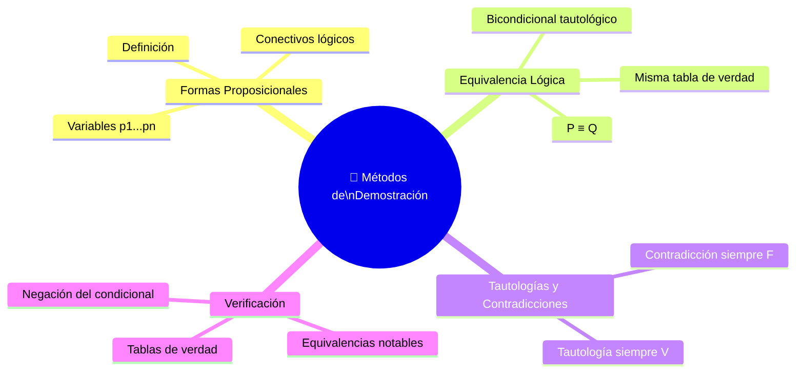

# 🟦 Métodos de Demostración

## 🎯 Introducción

> [!info]- 🧠 ¿De qué trata este tema?
> 
> Los **métodos de demostración** permiten verificar si dos expresiones lógicas son equivalentes, si una expresión es siempre verdadera o siempre falsa, y cómo construir argumentos válidos a partir de proposiciones.
> 
> La herramienta principal de este tema es la **tabla de verdad**, que permite verificar cualquier equivalencia o propiedad de forma sistemática.
> 
> **Este tema responde 3 preguntas clave:**
> 
> 1. 🔵 ¿Qué es una forma proposicional y cuándo dos son equivalentes?
> 2. 🟢 ¿Qué son las tautologías y las contradicciones?
> 3. 🟡 ¿Cómo se verifican equivalencias con tablas de verdad?

---

## 📋 Mapa del Tema

---

## 🔵 Formas Proposicionales

> [!note]- 📌 Definición
> 
> **Definición:** Una **forma proposicional** es cualquier expresión $P$ obtenida a partir de variables proposicionales $p_1, p_2, \ldots, p_n$ usando conectivos lógicos en forma adecuada.
> 
> **Ejemplos de formas proposicionales:**
> 
> |Expresión|Variables involucradas|
> |---|---|
> |$\neg p \vee q$|$p, q$|
> |$p \wedge q \to r$|$p, q, r$|
> |$\neg(p \to q)$|$p, q$|
> |$p \leftrightarrow (q \wedge \neg r)$|$p, q, r$|
> 
> > 💡 Las **proposiciones atómicas** (sin conectivos) son el caso más simple de forma proposicional.

---

## 🟢 Equivalencia Lógica

> [!note]- 📌 Definición de Equivalencia Lógica
> 
> **Definición:** Sean $P$ y $Q$ dos formas proposicionales. Se dice que $P$ y $Q$ son **lógicamente equivalentes**, denotado $P \equiv Q$ (o $P \Leftrightarrow Q$), si tienen los **mismos valores lógicos para todos los posibles valores** de $p_1, \ldots, p_n$.
> 
> Equivalentemente: $P \equiv Q$ cuando $P \leftrightarrow Q$ es **siempre verdadero** (es una tautología).

---

## 🟡 Tautologías y Contradicciones

> [!note]- 📌 Definiciones
> 
> |Concepto|Definición|Característica|
> |---|---|---|
> |**Tautología**|Forma proposicional **siempre verdadera**|$VL = V$ para cualquier combinación de valores|
> |**Contradicción**|Forma proposicional **siempre falsa**|$VL = F$ para cualquier combinación de valores|
> 
> **Ejemplos clásicos:**
> 
> |Expresión|Tipo|Razón|
> |---|---|---|
> |$p \vee \neg p$|Tautología|Siempre una de las dos es verdadera|
> |$p \wedge \neg p$|Contradicción|Nunca ambas pueden ser verdaderas|
> |$p \to p$|Tautología|Una proposición siempre se implica a sí misma|
> 
> > 💡 **Conclusión clave:** $P \equiv Q \iff P \leftrightarrow Q$ es una **tautología**.

---

## 🔬 Verificación por Tablas de Verdad

> [!note]- 📌 Ejemplo — Negación del Condicional
> 
> **Verificar que $\neg(p \to q) \equiv p \wedge \neg q$**
> 
> |$p$|$q$|$\neg q$|$p \to q$|$\neg(p \to q)$|$p \wedge \neg q$|
> |:-:|:-:|:-:|:-:|:-:|:-:|
> |V|V|F|V|F|F|
> |V|F|V|F|**V**|**V**|
> |F|V|F|V|F|F|
> |F|F|V|V|F|F|
> 
> Las columnas de $\neg(p \to q)$ y $p \wedge \neg q$ son **idénticas** → $\neg(p \to q) \equiv p \wedge \neg q$ ✅
> 
> **Aplicación práctica:** Negación de _"Si Laura va al gym entonces está en forma"_
> 
> - $p$: Laura va al gym
> - $q$: Laura está en forma
> - $\neg(p \to q) \equiv p \wedge \neg q$
> - En palabras: **"Laura va al gym y no está en forma"**

> [!note]- 📌 Equivalencias Notables — ¿Cuáles son ciertas?
> 
> |#|Equivalencia|¿Cierta?|Observación|
> |---|---|:-:|---|
> |1|$p \to q \equiv \neg p \vee q$|✅|Forma alternativa del condicional|
> |2|$(p \veebar q) \veebar r \equiv p \veebar (q \veebar r)$|✅|La XOR es asociativa|
> |3|$p \leftrightarrow q \equiv (p \to q) \wedge (q \to p)$|✅|Definición alternativa del bicondicional|
> |4|$p \veebar q \equiv (p \wedge \neg q) \vee (q \wedge \neg p)$|✅|Definición alternativa de XOR|
> |5|$(p \to q) \to r \equiv p \to (q \to r)$|❌|El condicional **no** es asociativo|
> 
> **Verificación de la equivalencia 1** — $p \to q \equiv \neg p \vee q$:
> 
> |$p$|$q$|$\neg p$|$p \to q$|$\neg p \vee q$|
> |:-:|:-:|:-:|:-:|:-:|
> |V|V|F|V|V|
> |V|F|F|F|F|
> |F|V|V|V|V|
> |F|F|V|V|V|
> 
> Columnas idénticas ✅
> 
> **Verificación de la equivalencia 3** — $p \leftrightarrow q \equiv (p \to q) \wedge (q \to p)$:
> 
> |$p$|$q$|$p \to q$|$q \to p$|$(p \to q) \wedge (q \to p)$|$p \leftrightarrow q$|
> |:-:|:-:|:-:|:-:|:-:|:-:|
> |V|V|V|V|V|V|
> |V|F|F|V|F|F|
> |F|V|V|F|F|F|
> |F|F|V|V|V|V|
> 
> Columnas idénticas ✅

---

## 🗂️ Tabla Resumen — Conceptos Clave

> [!NOTE] Todo lo que necesitas recordar
> 
> |Concepto|Símbolo|Significado|
> |---|---|---|
> |**Forma proposicional**|$P(p_1,\ldots,p_n)$|Expresión lógica con variables y conectivos|
> |**Equivalencia lógica**|$P \equiv Q$|Misma tabla de verdad para todos los valores|
> |**Tautología**|—|Siempre verdadera|
> |**Contradicción**|—|Siempre falsa|
> |**Verificación**|Tabla de verdad|Método sistemático para probar equivalencias|

---

## 📖 Glosario

> [!info]- 💡 Términos clave de este tema
> 
> |Término|Definición|
> |---|---|
> |**Forma proposicional**|Expresión construida con variables $p_1,\ldots,p_n$ y conectivos lógicos|
> |**Equivalencia lógica ($\equiv$)**|Dos formas proposicionales con idéntica tabla de verdad|
> |**Tautología**|Forma proposicional siempre verdadera|
> |**Contradicción**|Forma proposicional siempre falsa|
> |**Tabla de verdad**|Método para verificar el valor lógico de una expresión en todos los casos posibles|
> |**Asociatividad**|Propiedad de un operador donde $(a \circ b) \circ c = a \circ (b \circ c)$. El $\to$ **no** la tiene.|

---

**Tags:** #matematicas-discretas #logica-proposicional #equivalencia-logica #tautologia #demostracion #MATG1051 #ESPOL #unidad1