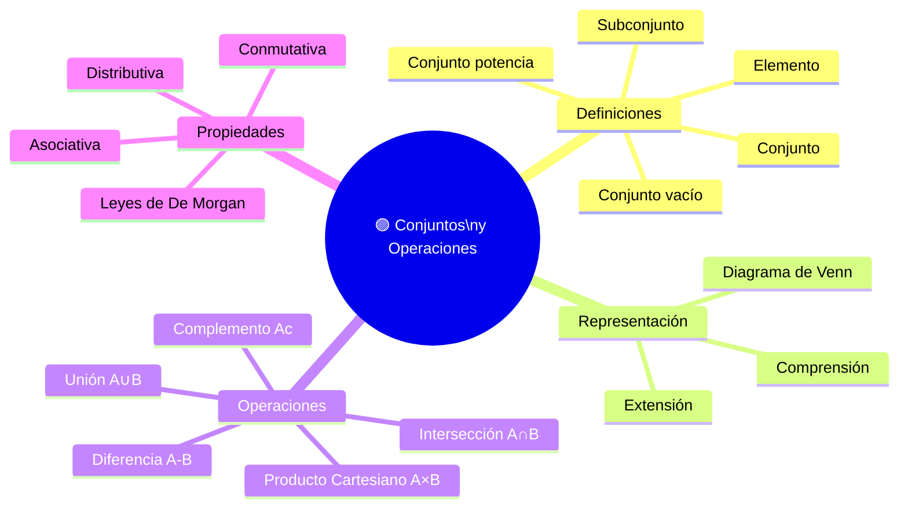

# 🟦 Conjuntos y Operaciones

## 🎯 Introducción

> [!info]- 🧠 ¿De qué trata este tema?
> 
> La **teoría de conjuntos** es el lenguaje base de toda la matemática discreta. Un conjunto es una colección bien definida de objetos, y sobre ellos se pueden realizar operaciones análogas a los conectivos lógicos vistos en los temas anteriores.
> 
> De hecho, existe una **correspondencia directa** entre la lógica proposicional y la teoría de conjuntos:
> 
> |Lógica|Conjuntos|
> |---|---|
> |$\neg p$ (negación)|$A^c$ (complemento)|
> |$p \wedge q$ (conjunción)|$A \cap B$ (intersección)|
> |$p \vee q$ (disyunción)|$A \cup B$ (unión)|
> |$p \to q$|$A \subseteq B$ (subconjunto)|
> |$p \leftrightarrow q$|$A = B$ (igualdad)|
> 
> **Este tema responde 3 preguntas clave:**
> 
> 1. 🔵 ¿Qué es un conjunto y cómo se representa?
> 2. 🟢 ¿Cuáles son las operaciones entre conjuntos y cómo se visualizan?
> 3. 🟡 ¿Qué propiedades cumplen estas operaciones?

---

## 📋 Mapa del Tema

---

## 🔵 Definiciones Fundamentales

> [!note]- 📌 Conjunto y Elemento
> 
> **Definición:** Un **conjunto** es una colección bien definida de objetos llamados **elementos**. Se denota con letras mayúsculas ($A, B, C, \ldots$) y sus elementos con letras minúsculas.
> 
> - Si $x$ pertenece al conjunto $A$: $x \in A$
> - Si $x$ no pertenece al conjunto $A$: $x \notin A$
> 
> **Formas de representar un conjunto:**
> 
> |Forma|Nombre|Ejemplo|
> |---|---|---|
> |${1, 2, 3, 4, 5}$|**Extensión** (listado explícito)|Conjunto de los primeros 5 naturales|
> |${x \mid x \in \mathbb{N},; x \leq 5}$|**Comprensión** (regla de pertenencia)|Mismo conjunto, con condición|
> 
> **Conjuntos especiales:**
> 
> |Símbolo|Nombre|Descripción|
> |---|---|---|
> |$\emptyset$ o ${}$|Conjunto vacío|No contiene elementos|
> |$\mathbb{N}$|Naturales|${0, 1, 2, 3, \ldots}$|
> |$\mathbb{Z}$|Enteros|${\ldots, -2, -1, 0, 1, 2, \ldots}$|
> |$\mathbb{R}$|Reales|Todos los números en la recta numérica|
> |$\mathcal{U}$|Conjunto universal|Contiene todos los elementos del contexto|

> [!note]- 📌 Subconjunto y Conjunto Potencia
> 
> **Subconjunto:** $A \subseteq B$ si todo elemento de $A$ también pertenece a $B$.
> 
> - $A \subseteq B$ y $B \subseteq A \Rightarrow A = B$
> - $\emptyset \subseteq A$ para cualquier conjunto $A$
> 
> **Conjunto potencia:** $\mathcal{P}(A)$ es el conjunto de **todos los subconjuntos** de $A$.
> 
> Si $|A| = n$, entonces $|\mathcal{P}(A)| = 2^n$
> 
> **Ejemplo:** $A = {1, 2}$
> 
> $$\mathcal{P}(A) = {\emptyset,; {1},; {2},; {1,2}} \quad \Rightarrow \quad |\mathcal{P}(A)| = 4 = 2^2$$

---

## 🟢 Operaciones entre Conjuntos

> [!note]- 📌 Unión, Intersección, Diferencia y Complemento
> 
> |Operación|Símbolo|Definición|Conectivo lógico análogo|
> |---|---|---|---|
> |**Unión**|$A \cup B$|Elementos en $A$, en $B$ o en ambos|$p \vee q$|
> |**Intersección**|$A \cap B$|Elementos que están en $A$ **y** en $B$|$p \wedge q$|
> |**Diferencia**|$A - B$|Elementos en $A$ que **no** están en $B$|$p \wedge \neg q$|
> |**Complemento**|$A^c$|Elementos del universo $\mathcal{U}$ que no están en $A$|$\neg p$|
> 
> **Ejemplo:** Sean $A = {1, 2, 3, 4}$, $B = {3, 4, 5, 6}$, $\mathcal{U} = {1,2,3,4,5,6,7}$
> 
> |Operación|Resultado|
> |---|---|
> |$A \cup B$|${1, 2, 3, 4, 5, 6}$|
> |$A \cap B$|${3, 4}$|
> |$A - B$|${1, 2}$|
> |$B - A$|${5, 6}$|
> |$A^c$|${5, 6, 7}$|

> [!note]- 📌 Producto Cartesiano
> 
> **Definición:** El **producto cartesiano** de $A$ y $B$, denotado $A \times B$, es el conjunto de todos los **pares ordenados** $(a, b)$ con $a \in A$ y $b \in B$.
> 
> $$A \times B = {(a, b) \mid a \in A \text{ y } b \in B}$$
> 
> Si $|A| = m$ y $|B| = n$, entonces $|A \times B| = m \cdot n$
> 
> **Ejemplo:** $A = {1, 2}$, $B = {x, y}$
> 
> $$A \times B = {(1,x),; (1,y),; (2,x),; (2,y)}$$
> 
> > ⚠️ En general $A \times B \neq B \times A$ (el orden importa en los pares).

---

## 🟡 Propiedades y Leyes

> [!note]- 📌 Leyes de De Morgan para Conjuntos
> 
> Las **Leyes de De Morgan** relacionan complemento con unión e intersección. Son análogas a las leyes lógicas:
> 
> |Ley|Conjuntos|Equivalente lógico|
> |---|---|---|
> |**De Morgan 1**|$(A \cup B)^c = A^c \cap B^c$|$\neg(p \vee q) \equiv \neg p \wedge \neg q$|
> |**De Morgan 2**|$(A \cap B)^c = A^c \cup B^c$|$\neg(p \wedge q) \equiv \neg p \vee \neg q$|

> [!note]- 📌 Otras Propiedades
> 
> |Propiedad|Unión|Intersección|
> |---|---|---|
> |**Conmutativa**|$A \cup B = B \cup A$|$A \cap B = B \cap A$|
> |**Asociativa**|$(A \cup B) \cup C = A \cup (B \cup C)$|$(A \cap B) \cap C = A \cap (B \cap C)$|
> |**Distributiva**|$A \cup (B \cap C) = (A \cup B) \cap (A \cup C)$|$A \cap (B \cup C) = (A \cap B) \cup (A \cap C)$|
> |**Identidad**|$A \cup \emptyset = A$|$A \cap \mathcal{U} = A$|
> |**Complemento**|$A \cup A^c = \mathcal{U}$|$A \cap A^c = \emptyset$|

---

## 🗂️ Tabla Resumen — Operaciones de Conjuntos

> [!NOTE] Todo lo que necesitas recordar
> 
> |Operación|Símbolo|Se lee|Resultado|
> |---|---|---|---|
> |**Unión**|$A \cup B$|"A unión B"|Lo que está en A, en B o en ambos|
> |**Intersección**|$A \cap B$|"A intersección B"|Solo lo que está en A **y** en B|
> |**Diferencia**|$A - B$|"A menos B"|Lo de A que no está en B|
> |**Complemento**|$A^c$|"complemento de A"|Lo del universo que no está en A|
> |**Producto cartesiano**|$A \times B$|"A por B"|Todos los pares ordenados $(a, b)$|

---

## 📖 Glosario

> [!info]- 💡 Términos clave de este tema
> 
> |Término|Definición|
> |---|---|
> |**Conjunto**|Colección bien definida de objetos (elementos)|
> |**Elemento**|Objeto que pertenece a un conjunto ($x \in A$)|
> |**Conjunto vacío ($\emptyset$)**|Conjunto sin elementos|
> |**Subconjunto ($A \subseteq B$)**|Todo elemento de $A$ también está en $B$|
> |**Conjunto potencia ($\mathcal{P}(A)$)**|Conjunto de todos los subconjuntos de $A$|
> |**Unión ($A \cup B$)**|Elementos en $A$ o en $B$ (o en ambos)|
> |**Intersección ($A \cap B$)**|Elementos que están en $A$ y en $B$|
> |**Diferencia ($A - B$)**|Elementos en $A$ que no están en $B$|
> |**Complemento ($A^c$)**|Elementos del universo que no están en $A$|
> |**Producto cartesiano ($A \times B$)**|Conjunto de pares ordenados $(a, b)$ con $a \in A$, $b \in B$|
> |**Diagrama de Venn**|Representación visual de conjuntos y sus relaciones|
> |**Leyes de De Morgan**|$(A \cup B)^c = A^c \cap B^c$ y $(A \cap B)^c = A^c \cup B^c$|

---

**Tags:** #matematicas-discretas #conjuntos #operaciones-conjuntos #de-morgan #MATG1051 #ESPOL #unidad1