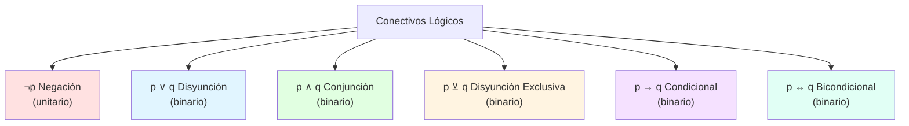
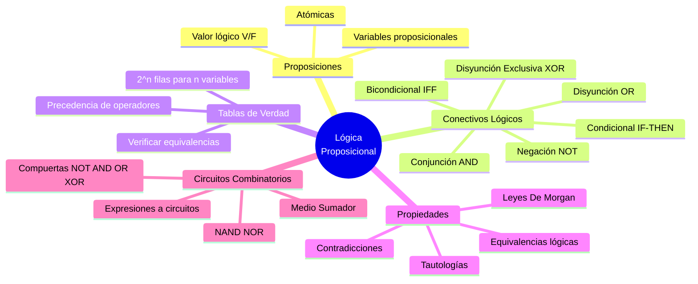

# 🔣 Lógica Proposicional

## 🎯 Introducción

> [!info]- 💡 ¿Qué es la Matemática Discreta?
> 
> La **Matemática Discreta** es la rama de las matemáticas que estudia los objetos y estructuras que son **finitos o discretos**, en lugar de continuos.
> 
> **Diferencia con el Cálculo:**
> 
> |Área|Tipo|Ejemplos|
> |---|---|---|
> |**Cálculo / Análisis**|Continuo|Funciones reales, límites, derivadas, integrales|
> |**Matemática Discreta**|Discreto|Números enteros, grafos, proposiciones lógicas|
> 
> Sus técnicas son especialmente útiles en **computación** y **ciencias de la información**.
> 
> **Algunas aplicaciones:**
> 
> |Área|Aplicación|
> |---|---|
> |**Teoría de Grafos**|Redes de computadoras, diseño de circuitos, GPS, redes de transporte|
> |**Criptografía**|Seguridad de la información, algoritmos RSA y AES|
> |**Teoría de Juegos**|Inteligencia artificial, toma de decisiones en sistemas multiagente|
> |**Análisis de redes sociales**|Modelar interacciones, identificar patrones y comunidades|
> |**Teoría de Autómatas**|Diseño de compiladores, procesamiento de lenguajes de programación|

---

## 📋 Proposiciones

> [!note]- 📖 Definición
> 
> Una **proposición** es una oración (enunciado) que es **verdadero o falso**, pero no ambas cosas a la vez. Se representan con las letras $p, q, r, s$, etc.
> 
> - En general, se usarán $p_1, p_2, \ldots, p_n$ para representar proposiciones → las llamaremos **variables proposicionales**.
> - El **valor lógico** de $p$, denotado $VL(p)$, es el valor $V$ o $F$ (también $1$ o $0$) dependiendo si $p$ es verdadera o falsa, respectivamente.
> - Las proposiciones que **no contienen conectivos lógicos** se llaman **proposiciones atómicas**.

### 🔍 ¿Cuál es una proposición?

> [!example]- ✅ Ejemplos comentados
> 
> Analicemos los siguientes enunciados:
> 
> |#|Enunciado|¿Es proposición?|¿Por qué?|
> |---|---|---|---|
> |1|Ninguna persona estudia Arqueología.|✅ Sí|Puede ser V o F|
> |2|¿Mariana revisó el aula virtual?|❌ No|Es una pregunta|
> |3|La tierra es el único planeta con árboles.|✅ Sí|Puede ser V o F|
> |4|Compra dos boletos para el concierto.|❌ No|Es una orden|
> |5|$3y^2 - 5y < 4y^3$|❌ No|Depende de $y$; no tiene valor fijo|
> |6|Algunos números primos son positivos.|✅ Sí|Es verdadera|
> |7|El 12 de Mayo de 1026 fue Martes.|✅ Sí|Tiene un valor V o F determinado|
> 
> > **Respuesta:** Los enunciados **1, 3, 6 y 7** son proposiciones. Los enunciados **2, 4 y 5** no lo son.

---

## 🔗 Conectivos Lógicos

> [!tip]- ⚙️ Operadores Unitarios y Binarios
> 
> - Un **operador unitario** sobre un conjunto $X$ asigna a cada elemento de $X$ otro elemento de $X$.
> - Un **operador binario** sobre un conjunto $X$ asigna a cada **par** de elementos de $X$ otro elemento de $X$.
> 
> Los operadores $\vee$ (disyunción) y $\wedge$ (conjunción) son **binarios**; el operador $\neg$ (negación) es **unitario**.  
> A todos ellos los llamamos **conectivos lógicos**.
> 
> **Precedencia de operadores** (de mayor a menor):
> 
> ```
> ¬  →  ∧  →  ∨  →  →
> ```
> 
> En ausencia de paréntesis:
> 
> 1. Se evalúa primero $\neg$
> 2. Luego $\wedge$
> 3. Luego $\vee$
> 4. Por último $\rightarrow$ (se evalúa al final)

---

### 1️⃣ Negación ($\neg p$)

> [!info]- 📋 Definición y Tabla de Verdad
> 
> Sea $p$ una proposición. La **negación** de $p$, denotada $\neg p$, es la proposición "no $p$".
> 
> |$p$|$\neg p$|
> |:-:|:-:|
> |V|F|
> |F|V|
> 
> **Fórmula:** $VL(\neg p) = 1 - VL(p)$
> 
> **Ejemplo:**
> 
> - $p$: "El cielo es azul." → $VL(p) = V$
> - $\neg p$: "El cielo **no** es azul." → $VL(\neg p) = F$

---

### 2️⃣ Disyunción ($p \vee q$)

> [!info]- 📋 Definición y Tabla de Verdad
> 
> Sean $p$ y $q$ dos proposiciones. La **disyunción** de $p$ y $q$, denotada $p \vee q$, es la proposición "$p$ **o** $q$".
> 
> |$p$|$q$|$p \vee q$|
> |:-:|:-:|:-:|
> |V|V|V|
> |V|F|V|
> |F|V|V|
> |F|F|**F**|
> 
> > La disyunción es **falsa solo cuando ambas proposiciones son falsas**; en cualquier otro caso es verdadera.
> 
> **Fórmula:** $VL(p \vee q) = \max{VL(p),\ VL(q)}$

---

### 3️⃣ Conjunción ($p \wedge q$)

> [!info]- 📋 Definición y Tabla de Verdad
> 
> Sean $p$ y $q$ dos proposiciones. La **conjunción** de $p$ y $q$, denotada $p \wedge q$, es la proposición "$p$ **y** $q$".
> 
> |$p$|$q$|$p \wedge q$|
> |:-:|:-:|:-:|
> |V|V|**V**|
> |V|F|F|
> |F|V|F|
> |F|F|F|
> 
> > La conjunción es **verdadera solo cuando ambas proposiciones son verdaderas**; en cualquier otro caso es falsa.
> 
> **Fórmula:** $VL(p \wedge q) = \min{VL(p),\ VL(q)}$

---

### 4️⃣ Disyunción Exclusiva ($p \veebar q$)

> [!info]- 📋 Definición y Tabla de Verdad
> 
> Sean $p$ y $q$ dos proposiciones. La **disyunción exclusiva** de $p$ y $q$, denotada $p \veebar q$, es la proposición "**ó** $p$ **ó** $q$" (pero no ambas).
> 
> |$p$|$q$|$p \veebar q$|
> |:-:|:-:|:-:|
> |V|V|F|
> |V|F|**V**|
> |F|V|**V**|
> |F|F|F|
> 
> > La disyunción exclusiva es **verdadera solo cuando $p$ y $q$ tienen valores lógicos distintos**.
> 
> **Fórmula:** $VL(p \veebar q) = |VL(p) - VL(q)|$
> 
> **Ejemplo:**
> 
> - $p$: $(-5)^3 = -125$ → $VL(p) = V$
> - $q$: $237$ es un número impar → $VL(q) = V$
> - $VL(p \veebar q) = F$ (ambas tienen el mismo valor lógico)

---

### 5️⃣ Condicional ($p \rightarrow q$)

> [!info]- 📋 Definición y Tabla de Verdad
> 
> Sean $p$ y $q$ dos proposiciones. El **condicional** de $p$ y $q$, denotado $p \rightarrow q$, es la proposición "**si** $p$ **entonces** $q$".
> 
> |$p$|$q$|$p \rightarrow q$|
> |:-:|:-:|:-:|
> |V|V|V|
> |V|F|**F**|
> |F|V|V|
> |F|F|V|
> 
> - $p$ es la **hipótesis** (antecedente)
>     
> - $q$ es la **conclusión** (consecuente)
>     
> 
> > El condicional es **falso solo cuando el antecedente es verdadero y el consecuente es falso**.  
> > Cuando el antecedente es falso, el condicional es **verdadero por omisión** (superficialmente verdadero).
> 
> **Fórmula:** $VL(p \rightarrow q) = \max{1 - VL(p),\ VL(q)}$

> [!tip]- 🔄 Formas Equivalentes del Condicional
> 
> Todas las siguientes expresiones son equivalentes a "$si\ p\ entonces\ q$":
> 
> |Forma|Ejemplo|
> |---|---|
> |$q$ **si** $p$|Laura está en forma si va al gym|
> |$p$ **solo si** $q$|Hace calor solo si está lloviendo|
> |$q$ **es necesario para** $p$|Terminar el calor es necesario para que comience el verano|
> |$p$ **es suficiente para** $q$|Ir al gym es suficiente para estar en forma|
> |Una condición **necesaria** para $p$ es $q$|Una condición necesaria para comenzar el verano es terminar el calor|
> |Una condición **suficiente** para $q$ es $p$|Una condición suficiente para estar en forma es ir al gym|

> [!example]- ✏️ Reescribir en forma "si p entonces q"
> 
> |Proposición original|Forma estándar|
> |---|---|
> |Una condición necesaria para que comience el verano es que termine el calor.|Si comienza el verano, entonces termina el calor.|
> |Alan aprobó el examen de Álgebra si estudió todos los temas.|Si Alan estudió todos los temas, entonces aprobó el examen de Álgebra.|
> |Hace calor solo si está lloviendo.|Si hace calor, entonces está lloviendo.|
> |Para que 17 sea menor que 12 es suficiente que 17 sea primo.|Si 17 es primo, entonces 17 es menor que 12.|
> |Una condición necesaria para que Luisa visite Salinas es que viaje a Manta.|Si Luisa visita Salinas, entonces viaja a Manta.|
> |Para comer sano es suficiente adelgazar.|Si adelgazo, entonces como sano.|

> [!note]- 🔁 Recíproco y Contrarrecíproco
> 
> Dado el condicional $p \rightarrow q$:
> 
> |Proposición|Definición|Equivalencia|
> |---|---|---|
> |**Original**|$p \rightarrow q$|—|
> |**Recíproco**|$q \rightarrow p$|No equivalente al original|
> |**Contrarrecíproco**|$\neg q \rightarrow \neg p$|✅ Equivalente al original|

---

### 6️⃣ Bicondicional ($p \leftrightarrow q$)

> [!info]- 📋 Definición y Tabla de Verdad
> 
> Sean $p$ y $q$ dos proposiciones. El **bicondicional** de $p$ y $q$, denotado $p \leftrightarrow q$, es la proposición "$p$ **si y solo si** $q$".
> 
> |$p$|$q$|$p \leftrightarrow q$|
> |:-:|:-:|:-:|
> |V|V|**V**|
> |V|F|F|
> |F|V|F|
> |F|F|**V**|
> 
> > El bicondicional es **verdadero cuando $p$ y $q$ tienen el mismo valor lógico**.
> 
> **Fórmula:** $VL(p \leftrightarrow q) = 1 - |VL(p) - VL(q)|$

---

## 📊 Resumen de Conectivos



| Conectivo            | Símbolo               | Nombre               | Falso cuando...              |
| -------------------- | --------------------- | -------------------- | ---------------------------- |
| Negación             | $\neg p$              | NO $p$               | $p$ es verdadero             |
| Disyunción           | $p \vee q$            | $p$ O $q$            | Ambas son falsas             |
| Conjunción           | $p \wedge q$          | $p$ Y $q$            | Al menos una es falsa        |
| Disyunción exclusiva | $p \veebar q$         | O $p$ o $q$          | Ambas tienen el mismo VL     |
| Condicional          | $p \rightarrow q$     | Si $p$ entonces $q$  | $p$ verdadera y $q$ falsa    |
| Bicondicional        | $p \leftrightarrow q$ | $p$ si y solo si $q$ | $p$ y $q$ tienen distinto VL |

---

## 🔢 Tablas de Verdad

> [!tip]- 🛠️ Cómo construir una Tabla de Verdad
> 
> 1. Identificar las variables proposicionales ($p, q, r, \ldots$)
> 2. La tabla tendrá $2^n$ filas, donde $n$ es el número de variables
> 3. Agregar columnas para cada subexpresión
> 4. Evaluar de adentro hacia afuera, respetando la precedencia
> 
> **Precedencia:** $\neg$ → $\wedge$ → $\vee$ → $\rightarrow$

> [!example]- 🧮 Ejemplo 1: Precedencia de operadores
> 
> **Dado:** $VL(p) = F,\ VL(q) = V,\ VL(r) = F$. Hallar $VL(\neg p \vee q \wedge r)$.
> 
> Por precedencia: $\neg p \vee q \wedge r \equiv ((\neg p) \vee (q \wedge r))$
> 
> |Paso|Operación|Resultado|
> |---|---|---|
> |1|$VL(\neg p) = 1 - 0 = 1$|$V$|
> |2|$VL(q \wedge r) = \min{1, 0}$|$F$|
> |3|$VL((\neg p) \vee (q \wedge r)) = \max{1, 0}$|**V**|

> [!example]- 🧮 Ejemplo 2: Tabla completa con condicional
> 
> **Dado:** $VL(q) = VL(r) = F,\ VL(p) = V$.
> 
> |Expresión|Desarrollo|Resultado|
> |---|---|---|
> |$p \wedge q \rightarrow r$|$VL(p \wedge q) = F$, luego $F \rightarrow F$|**V**|
> |$p \vee \neg q \rightarrow r$|$VL(\neg q) = V$, $VL(p \vee V) = V$, luego $V \rightarrow F$|**F**|
> |$p \rightarrow (q \rightarrow r)$|$VL(q \rightarrow r) = V$ (antecedente falso), luego $V \rightarrow V$|**V**|

> [!example]- 🧮 Ejemplo 3: Verificar equivalencia $\neg(p \rightarrow q) \equiv p \wedge \neg q$
> 
> |$p$|$q$|$\neg q$|$p \rightarrow q$|$\neg(p \rightarrow q)$|$p \wedge \neg q$|
> |:-:|:-:|:-:|:-:|:-:|:-:|
> |V|V|F|V|F|F|
> |V|F|V|**F**|**V**|**V**|
> |F|V|F|V|F|F|
> |F|F|V|V|F|F|
> 
> Las columnas de $\neg(p \rightarrow q)$ y $p \wedge \neg q$ son **idénticas**, por lo tanto $\neg(p \rightarrow q) \equiv p \wedge \neg q$ ✅
> 
> **Aplicación:** La negación de "Si Laura va al gym, entonces está en forma" es:  
> → "**Laura va al gym y no está en forma**."

---

## ⚖️ Equivalencias Lógicas y Propiedades

> [!note]- 📐 Tautologías, Contradicciones y Equivalencias
> 
> - **Tautología:** Forma proposicional que es **siempre verdadera**, sin importar los valores de las variables.
> - **Contradicción:** Forma proposicional que es **siempre falsa**.
> - **Contingencia**: Si no es ni una **tautología ni una contradicción**.
> - **Equivalencia lógica:** $P \equiv Q$ (también $P \Leftrightarrow Q$) cuando $P$ y $Q$ tienen los **mismos valores lógicos** para todas las combinaciones posibles de sus variables.  
>     Equivalente a decir que $P \leftrightarrow Q$ es una **tautología**.

> [!success]- 📋 Principales Equivalencias Lógicas
> ![[Pasted image 20260517162520.png]]
> **Leyes de identidad:**
> 
> |Ley|Expresión|
> |---|---|
> |Identidad $\vee$|$p \vee F \equiv p$|
> |Identidad $\wedge$|$p \wedge V \equiv p$|
> 
> **Leyes de dominación:**
> 
> |Ley|Expresión|
> |---|---|
> |Dominación $\vee$|$p \vee V \equiv V$|
> |Dominación $\wedge$|$p \wedge F \equiv F$|
> 
> **Leyes de idempotencia:**
> 
> |Ley|Expresión|
> |---|---|
> |Idempotencia $\vee$|$p \vee p \equiv p$|
> |Idempotencia $\wedge$|$p \wedge p \equiv p$|
> 
> **Leyes de complemento:**
> 
> |Ley|Expresión|
> |---|---|
> |Complemento $\vee$|$p \vee \neg p \equiv V$ (tautología)|
> |Complemento $\wedge$|$p \wedge \neg p \equiv F$ (contradicción)|
> |Doble negación|$\neg(\neg p) \equiv p$|
> 
> **Leyes conmutativas:**
> 
> |Ley|Expresión|
> |---|---|
> |Conmutativa $\vee$|$p \vee q \equiv q \vee p$|
> |Conmutativa $\wedge$|$p \wedge q \equiv q \wedge p$|
> 
> **Leyes asociativas:**
> 
> |Ley|Expresión|
> |---|---|
> |Asociativa $\vee$|$(p \vee q) \vee r \equiv p \vee (q \vee r)$|
> |Asociativa $\wedge$|$(p \wedge q) \wedge r \equiv p \wedge (q \wedge r)$|
> 
> **Leyes distributivas:**
> 
> |Ley|Expresión|
> |---|---|
> |Distributiva $\vee$ sobre $\wedge$|$p \vee (q \wedge r) \equiv (p \vee q) \wedge (p \vee r)$|
> |Distributiva $\wedge$ sobre $\vee$|$p \wedge (q \vee r) \equiv (p \wedge q) \vee (p \wedge r)$|
> 
> **Leyes de De Morgan:**
> 
> |Ley|Expresión|
> |---|---|
> |De Morgan 1|$\neg(p \vee q) \equiv \neg p \wedge \neg q$|
> |De Morgan 2|$\neg(p \wedge q) \equiv \neg p \vee \neg q$|
> 
> **Equivalencias con el condicional:**
> 
> |Equivalencia|Expresión|
> |---|---|
> |Condicional|$p \rightarrow q \equiv \neg p \vee q$|
> |Negación del condicional|$\neg(p \rightarrow q) \equiv p \wedge \neg q$|
> |Contrarrecíproco|$p \rightarrow q \equiv \neg q \rightarrow \neg p$|
> |Bicondicional|$p \leftrightarrow q \equiv (p \rightarrow q) \wedge (q \rightarrow p)$|
> |Disyunción exclusiva|$p \veebar q \equiv (p \wedge \neg q) \vee (q \wedge \neg p)$|

> [!example]- ✅ Equivalencias que son ciertas
> 
> Las siguientes equivalencias son **verdaderas** (tautologías):
> 
> 1. $p \rightarrow q \equiv \neg p \vee q$ ✅
> 2. $(p \veebar q) \veebar r \equiv p \veebar (q \veebar r)$ ✅ (la XOR es asociativa)
> 3. $p \leftrightarrow q \equiv (p \rightarrow q) \wedge (q \rightarrow p)$ ✅
> 4. $p \veebar q \equiv (p \wedge \neg q) \vee (q \wedge \neg p)$ ✅
> 5. $(p \rightarrow q) \rightarrow r \equiv p \rightarrow (q \rightarrow r)$ ❌ (No son equivalentes)

---

## ⚡ Circuitos Combinatorios

> [!info]- 🖥️ Conexión con la Lógica Digital
> 
> Los **circuitos combinatorios** (o circuitos lógicos) son sistemas digitales cuya salida depende **únicamente** de los valores actuales de las entradas. Están construidos con **compuertas lógicas** que implementan directamente los conectivos de la lógica proposicional.
> 
> ```mermaid
> graph LR
>     A[Proposiciones<br/>Lógicas] -->|Se implementan como| B[Compuertas<br/>Lógicas]
>     B -->|Se combinan en| C[Circuitos<br/>Combinatorios]
>     C -->|Se aplican en| D[Computadoras<br/>y Electrónica]
>     
>     style A fill:#e1f5ff
>     style B fill:#fff4e1
>     style C fill:#e1ffe1
>     style D fill:#f5e1ff
> ```

### 🔌 Compuertas Lógicas Básicas

> [!tip]- 🔧 Compuertas y sus Símbolos
> 
> Cada conectivo lógico se corresponde con una **compuerta** en circuitos digitales:
> 
> |Compuerta|Conectivo|Símbolo|Comportamiento|
> |---|---|---|---|
> |**NOT**|$\neg p$|Triángulo con círculo|Invierte la entrada|
> |**AND**|$p \wedge q$|Forma D|Verdadero solo si ambas entradas son 1|
> |**OR**|$p \vee q$|Forma curvada|Verdadero si al menos una entrada es 1|
> |**XOR**|$p \veebar q$|OR con arco extra|Verdadero si las entradas son distintas|
> |**NAND**|$\neg(p \wedge q)$|AND con círculo|Falso solo si ambas entradas son 1|
> |**NOR**|$\neg(p \vee q)$|OR con círculo|Verdadero solo si ambas entradas son 0|
> 
![[ChatGPT Image 20 may 2026, 13_02_00.png]]

> [!example]- 🧮 Tablas de Verdad de Compuertas
> 
> **Compuerta NOT:**
> 
> |$A$|$\neg A$|
> |:-:|:-:|
> |0|1|
> |1|0|
> 
> **Compuerta AND:**
> 
> |$A$|$B$|$A \wedge B$|
> |:-:|:-:|:-:|
> |0|0|0|
> |0|1|0|
> |1|0|0|
> |1|1|1|
> 
> **Compuerta OR:**
> 
> |$A$|$B$|$A \vee B$|
> |:-:|:-:|:-:|
> |0|0|0|
> |0|1|1|
> |1|0|1|
> |1|1|1|
> 
> **Compuerta XOR:**
> 
> |$A$|$B$|$A \veebar B$|
> |:-:|:-:|:-:|
> |0|0|0|
> |0|1|1|
> |1|0|1|
> |1|1|0|

### 🏗️ Circuitos Combinatorios

> [!note]- 🔗 De expresiones lógicas a circuitos
> 
> Cualquier **forma proposicional** puede representarse como un circuito combinatorio y viceversa.
> 
> **Pasos para construir un circuito desde una expresión:**
> 
> 1. Identificar las variables de entrada
> 2. Respetar la precedencia de operadores
> 3. Asignar una compuerta a cada operación
> 4. Conectar las compuertas en orden
> 
> **Ejemplo:** Circuito para $(\neg p \vee q) \wedge r$
> 
> ```
> p ──[ NOT ]──┐
>              ├──[ OR ]──┐
> q ───────────┘          ├──[ AND ]──→ Salida
> r ──────────────────────┘
> ```
> ![[ChatGPT Image 20 may 2026, 13_05_26.png]]
> 
> |$p$|$q$|$r$|$\neg p$|$\neg p \vee q$|$(\neg p \vee q) \wedge r$|
> |:-:|:-:|:-:|:-:|:-:|:-:|
> |0|0|0|1|1|0|
> |0|0|1|1|1|1|
> |0|1|0|1|1|0|
> |0|1|1|1|1|1|
> |1|0|0|0|0|0|
> |1|0|1|0|0|0|
> |1|1|0|0|1|0|
> |1|1|1|0|1|1|

> [!example]- 💡 Ejemplo: Medio Sumador (Half Adder)
> 
> El **medio sumador** suma dos bits $A$ y $B$ produciendo una **suma** $S$ y un **acarreo** $C$:
> 
> $$S = A \veebar B \qquad C = A \wedge B$$
> 
> ```
> A ──┬──[ XOR ]──→ S (Suma)
>     └──[ AND ]──→ C (Carry / Acarreo)
> B ──┘
> ```
> 
> |$A$|$B$|$S = A \veebar B$|$C = A \wedge B$|
> |:-:|:-:|:-:|:-:|
> |0|0|0|0|
> |0|1|1|0|
> |1|0|1|0|
> |1|1|0|1|
> 
> En binario: $1 + 1 = 10_2$ (suma = 0, acarreo = 1)

---

## 📊 Resumen Visual



---

**Tags:** #matematicas-discretas #logica-proposicional #conectivos-logicos #tablas-de-verdad #equivalencias #circuitos-combinatorios #compuertas-logicas #MATG1051