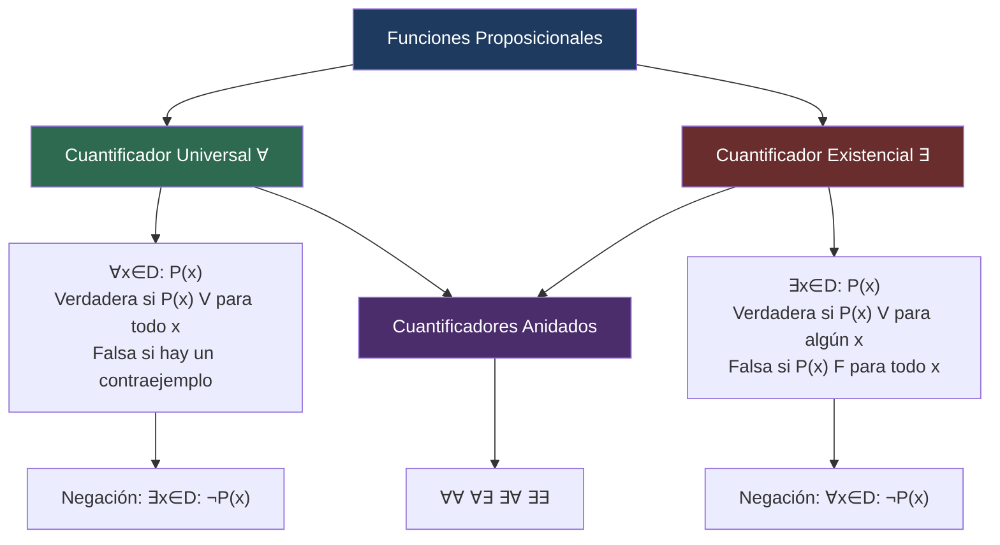

# 🔍 Cuantificadores

## 🎯 Introducción

> [!info]- 💡 ¿Por qué necesitamos cuantificadores?
> 
> Considera el enunciado:
> 
> > $p$: "$n$ es un número entero."
> 
> Este enunciado **no es una proposición** por sí solo, ya que su valor lógico depende del valor de $n$:
> 
> - $p$ es **verdadera** si $n = -2,\ 0,\ 3,\ 8$
> - $p$ es **falsa** si $n = \tfrac{1}{3},\ \sqrt{2},\ \pi$
> 
> Para poder trabajar con este tipo de enunciados necesitamos las **funciones proposicionales** y los **cuantificadores**.

---

## 📋 Funciones Proposicionales

> [!note]- 📖 Definición 1 — Función Proposicional
> 
> Sea $P(x)$ un enunciado que incluye a la variable $x$ y sea $D$ un conjunto. Diremos que $P$ es una **función proposicional** si para cada $x \in D$, $P(x)$ es una proposición. En este caso, $D$ es el **dominio de discurso** de $P$.

> [!example]- ✅ Ejemplo 1 — Números Primos
> 
> Sea $P(n)$: "$n$ es un número primo" y sea $D$ el conjunto de enteros positivos.
> 
> Entonces $P$ es una función proposicional con dominio de discurso $D$, ya que para cada $n \in D$, $P(n)$ es una proposición:
> 
> - $P(17)$: "17 es un número primo" → **verdadera** ✅
> - $P(21)$: "21 es un número primo" → **falsa** ❌

> [!example]- ✅ Ejemplo 2 — Más Funciones Proposicionales
> 
> Los siguientes enunciados son funciones proposicionales:
> 
> | Función | Enunciado | Dominio |
> |---|---|---|
> | $P(x)$ | $-7x^5 + 3x^2 - 8 = 0$ | $D = \mathbb{R}$ |
> | $Q(n)$ | $6n^2 - 7n + 1$ es un número primo | $D = \mathbb{N}$ |
> | $R(x)$ | $x$ rendirá el examen de Matemáticas Discretas | $D = $ Estudiantes de ESPOL |

---

## ∀ Cuantificador Universal

> [!note]- 📖 Definición 2 — Cuantificador Universal
> 
> Sea $P$ una función proposicional con dominio de discurso $D$. La proposición:
> 
> > "**Para toda** $x$ en $D$, $P(x)$"
> 
> es una proposición **cuantificada universalmente**, y se escribe:
> 
> $$\forall x \in D : P(x)$$
> 
> El símbolo $\forall$ se llama **cuantificador universal** y significa: "para todo", "para cualquier" o "para cada".

> [!tip]- ⚙️ Valor de Verdad
> 
> | Condición | Valor de la proposición |
> |---|---|
> | $P(x)$ es verdadera **para toda** $x \in D$ | $\forall x \in D : P(x)$ es **verdadera** |
> | $P(x)$ es falsa **para al menos un** $x \in D$ | $\forall x \in D : P(x)$ es **falsa** |
> 
> > Un valor $x \in D$ que hace a $P(x)$ **falsa** se llama un **contraejemplo** de la proposición $\forall x \in D : P(x)$.

> [!example]- ✅ Ejemplo 3 — Proposición Universal Verdadera
> 
> La proposición $\forall x \in \mathbb{R} : 9x^2 + 16 \geq 24x$ es **verdadera**.
> 
> **Demostración:**
> 
> $$9x^2 + 16 \geq 24x$$
> $$\Leftrightarrow 9x^2 - 24x + 16 \geq 0$$
> $$\Leftrightarrow (3x - 4)^2 \geq 0$$
> 
> Como el cuadrado de cualquier número real es siempre $\geq 0$, la proposición es verdadera. ✅

> [!example]- ❌ Ejemplo 4 — Proposición Universal Falsa (con contraejemplo)
> 
> La proposición $\forall x \in \mathbb{R} : x^2 - 10x \geq -17$ es **falsa**.
> 
> **Contraejemplo:** Tomemos $x = 5$:
> 
> $$5^2 - 10(5) = 25 - 50 = -25 \not\geq -17$$
> 
> Como $x = 5$ hace la proposición falsa, es un contraejemplo y la proposición universal es **falsa**. ❌
> 
> > Aunque para muchos $x \in \mathbb{R}$ la proposición sea verdadera, **basta un contraejemplo** para que sea falsa.

---

## ∃ Cuantificador Existencial

> [!note]- 📖 Definición 3 — Cuantificador Existencial
> 
> Sea $P$ una función proposicional con dominio de discurso $D$. La proposición:
> 
> > "**Existe** $x$ en $D$, $P(x)$"
> 
> es una proposición **cuantificada existencialmente**, y se escribe:
> 
> $$\exists x \in D : P(x)$$
> 
> El símbolo $\exists$ se llama **cuantificador existencial** y significa: "existe", "existe un" o "existe algún".

> [!tip]- ⚙️ Valor de Verdad
> 
> | Condición | Valor de la proposición |
> |---|---|
> | $P(x)$ es verdadera **para al menos un** $x \in D$ | $\exists x \in D : P(x)$ es **verdadera** |
> | $P(x)$ es falsa **para todo** $x \in D$ | $\exists x \in D : P(x)$ es **falsa** |

> [!example]- ✅ Ejemplo 5 — Proposición Existencial Verdadera
> 
> La proposición:
> 
> $$\exists x \in \mathbb{R} : \frac{x}{4x^2 + 9} = \frac{1}{12}$$
> 
> es **verdadera**, ya que tomando $x = \dfrac{3}{2}$:
> 
> $$\frac{3/2}{4(3/2)^2 + 9} = \frac{3/2}{9 + 9} = \frac{3/2}{18} = \frac{1}{12} \checkmark$$

> [!example]- ❌ Ejemplo 6 — Proposición Existencial Falsa
> 
> La proposición:
> 
> $$\exists x \in \mathbb{R} : \frac{5}{x^2 - 6x + 14} > 2$$
> 
> es **falsa**.
> 
> **Demostración:** Hay que probar que para **todo** $x \in \mathbb{R}$, $\dfrac{5}{x^2 - 6x + 14} \leq 2$.
> 
> Completando el cuadrado: $x^2 - 6x + 14 = (x-3)^2 + 5 \geq 5$
> 
> Por lo tanto:
> $$\frac{5}{x^2 - 6x + 14} \leq \frac{5}{5} = 1 \leq 2$$
> 
> Así la proposición existencial es **falsa**. ❌

---

## 🔄 Negación de Cuantificadores

> [!important]- ⭐ Teorema 2 — Negación de Proposiciones Cuantificadas
> 
> Sea $P$ una función proposicional con dominio de discurso $D$. Entonces:
> 
> $$\neg\left(\forall x \in D : P(x)\right) \equiv \exists x \in D : \neg P(x)$$
> $$\neg\left(\exists x \in D : P(x)\right) \equiv \forall x \in D : \neg P(x)$$
> 
> **Regla mnemotécnica:** Al negar, el cuantificador "cambia" ($\forall \leftrightarrow \exists$) y la función se niega.

> [!tip]- ⚙️ Tabla de Negaciones
> 
> | Proposición original | Negación equivalente |
> |---|---|
> | $\forall x \in D : P(x)$ | $\exists x \in D : \neg P(x)$ |
> | $\exists x \in D : P(x)$ | $\forall x \in D : \neg P(x)$ |

> [!note]- 📋 Demostración del Teorema (caso 2)
> 
> **Probar:** $\neg(\exists x \in D : P(x)) \equiv \forall x \in D : \neg P(x)$
> 
> - Si $\neg(\exists x \in D : P(x))$ es **verdadera** → $\exists x \in D : P(x)$ es falsa → $P(x)$ es falsa para cada $x \in D$ → $\neg P(x)$ es verdadera para cada $x \in D$ → $\forall x \in D : \neg P(x)$ es **verdadera**. ✅
> 
> - Si $\neg(\exists x \in D : P(x))$ es **falsa** → $\exists x \in D : P(x)$ es verdadera → $P(x)$ es verdadera para al menos un $x \in D$ → $\neg P(x)$ es falsa para al menos un $x \in D$ → $\forall x \in D : \neg P(x)$ es **falsa**. ✅

---

## 🪆 Cuantificadores Anidados

> [!note]- 📖 Definición 4 — Cuantificadores Anidados
> 
> Se dice que hay **cuantificadores anidados** cuando una función proposicional depende de dos o más variables y cada una es cuantificada.
> 
> Sea $P(x,y)$ una función proposicional con dominio $D$. Entonces:

### Caso ∀∀

> [!tip]- ⚙️ $\forall x \in D,\ \forall y \in D : P(x,y)$
> 
> - **Verdadera** si $P(x,y)$ es verdadera **para toda** $x$ en $D$ y **para toda** $y$ en $D$.
> - **Falsa** si $P(x,y)$ es falsa **para al menos un par** $(x,y)$ en $D$.

### Caso ∀∃

> [!tip]- ⚙️ $\forall x \in D,\ \exists y \in D : P(x,y)$
> 
> - **Verdadera** si para **toda** $x \in D$, **existe al menos una** $y \in D$ tal que $P(x,y)$ es verdadera.
> - **Falsa** si **existe al menos una** $x \in D$ tal que $P(x,y)$ es falsa **para toda** $y \in D$.

### Caso ∃∀

> [!tip]- ⚙️ $\exists x \in D,\ \forall y \in D : P(x,y)$
> 
> - **Verdadera** si **existe al menos una** $x \in D$ tal que $P(x,y)$ es verdadera **para toda** $y \in D$.
> - **Falsa** si **para toda** $x \in D$, **existe una** $y \in D$ tal que $P(x,y)$ es falsa.

### Caso ∃∃

> [!tip]- ⚙️ $\exists x \in D,\ \exists y \in D : P(x,y)$
> 
> - **Verdadera** si **existe al menos un par** $(x,y)$ en $D$ tal que $P(x,y)$ es verdadera.
> - **Falsa** si $P(x,y)$ es falsa **para toda** $x$ y **toda** $y$ en $D$.

---

### 📊 Tabla Comparativa de Cuantificadores Anidados

> [!success]- 🗂️ Resumen rápido
> 
> | Forma | Verdadera cuando... | Falsa cuando... |
> |---|---|---|
> | $\forall x, \forall y : P(x,y)$ | $P(x,y)$ es V para todos los pares | Existe un par que hace $P$ falsa |
> | $\forall x, \exists y : P(x,y)$ | Para cada $x$ hay algún $y$ que satisface $P$ | Algún $x$ no tiene $y$ que satisfaga $P$ |
> | $\exists x, \forall y : P(x,y)$ | Hay un $x$ que satisface $P$ para todo $y$ | Ningún $x$ satisface $P$ para todo $y$ |
> | $\exists x, \exists y : P(x,y)$ | Hay algún par que satisface $P$ | Ningún par satisface $P$ |

---

## ✅ Ejemplos de Cuantificadores Anidados

> [!example]- ✅ Ejemplo 7 — $\forall\forall$ Verdadera
> 
> La proposición:
> 
> $$\forall x \in \mathbb{R},\ \forall y \in \mathbb{R} : x > 2 \wedge y < -5 \to x - y > 7$$
> 
> es **verdadera**.
> 
> **Demostración:** Fijemos $x, y \in \mathbb{R}$. Si $x > 2$ y $y < -5$ son verdaderas, entonces:
> - $x > 2$ y $-y > 5$
> - Por tanto $x - y > 2 + 5 = 7$ ✅
> 
> Si $x > 2 \wedge y < -5$ es falsa, el condicional es **vacuamente verdadero**. ✅

> [!example]- ✅ Ejemplo 8 — $\forall\exists$ Verdadera
> 
> La proposición:
> 
> $$\forall x \in \mathbb{R},\ \exists y \in \mathbb{R} : -3y + 4x = -6$$
> 
> es **verdadera**.
> 
> **Demostración:** Para cualquier $x \in \mathbb{R}$, basta escoger $y = \dfrac{4}{3}x + 2$:
> 
> $$-3\left(\frac{4}{3}x + 2\right) + 4x = -4x - 6 + 4x = -6 \checkmark$$

> [!example]- ❌ Ejemplo 9 — $\forall\exists$ Falsa
> 
> La proposición:
> 
> $$\forall x \in \mathbb{R},\ \exists y \in \mathbb{R} : (x+7)(y-3) = -5$$
> 
> es **falsa**.
> 
> **Contraejemplo:** Tomemos $x = -7$:
> 
> $$((-7)+7)(y-3) = 0 \cdot (y-3) = 0 \neq -5 \quad \text{para todo } y \in \mathbb{R}$$
> 
> No existe $y$ que satisfaga la ecuación cuando $x = -7$. ❌

> [!example]- ❌ Ejemplo 10 — $\exists\forall$ Falsa
> 
> La proposición:
> 
> $$\exists x \in \mathbb{N},\ \forall y \in \mathbb{N} : \frac{y+5}{3} \leq 2x$$
> 
> es **falsa**.
> 
> **Demostración:** Para cualquier $x \in \mathbb{N}$, tomemos $y = 6x - 4$ (se verifica que $y \geq 2$, entonces $y \in \mathbb{N}$):
> 
> $$\frac{(6x-4)+5}{3} = \frac{6x+1}{3} = 2x + \frac{1}{3} > 2x$$
> 
> Por lo tanto la proposición es **falsa**. ❌

> [!example]- ✅ Ejemplo 11 — $\exists\exists$ Verdadera
> 
> La proposición:
> 
> $$\exists x \in \mathbb{Z},\ \exists y \in \mathbb{Z} : 2x^3 + 5 = -y^2$$
> 
> es **verdadera**.
> 
> **Demostración:** Tomemos $x = -3$ y $y = 7$:
> 
> $$2(-3)^3 + 5 = 2(-27) + 5 = -54 + 5 = -49 = -(7)^2 = -y^2 \checkmark$$

---

## 📊 Resumen Visual

---

**Tags:** #matematicas-discretas #cuantificadores #cuantificador-universal #cuantificador-existencial #cuantificadores-anidados #funciones-proposicionales #MATG1051
