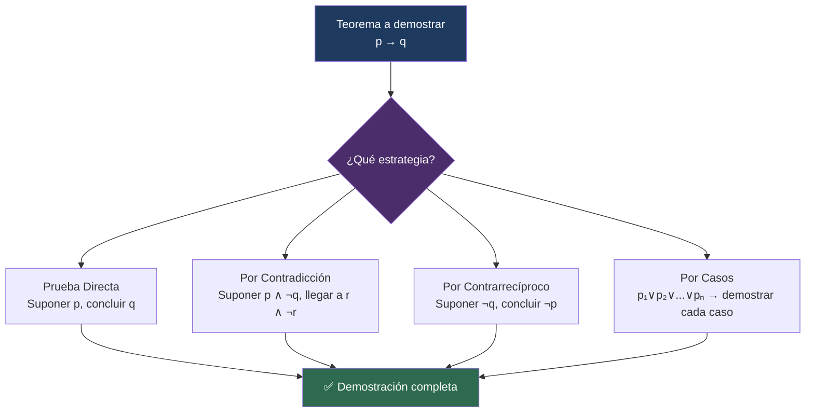

# 🧾 Demostraciones

## 🎯 Introducción

> [!info]- 💡 ¿Qué es una demostración matemática?
> 
> Una **demostración** es un argumento lógico riguroso que establece la verdad de una proposición a partir de **axiomas**, **definiciones** y **resultados previamente probados**.
> 
> A diferencia de las demostraciones algebraicas (que manipulan equivalencias lógicas paso a paso), aquí se trabaja con proposiciones matemáticas del mundo real: propiedades de enteros, desigualdades, existencia de objetos, etc.

---

## 📚 Vocabulario Matemático Fundamental

> [!note]- 📖 Definición 5 — Términos esenciales
> 
> | Término | Definición |
> |---|---|
> | **Axioma** | Resultado que se supone **verdadero sin necesidad de demostrarlo**. Es el punto de partida de toda la teoría. |
> | **Teorema** | Proposición que se ha **probado que es verdadera** a partir de axiomas y resultados previos. |
> | **Lema** | Teorema auxiliar que **por sí mismo no es interesante**, pero resulta útil para probar otro teorema más importante. |
> | **Corolario** | Teorema que es **consecuencia inmediata** de otro teorema ya demostrado. |
> | **Demostración / Prueba** | Argumento lógico que **establece la veracidad** de un teorema. |

---

## 📐 Estructura General de un Teorema

> [!note]- 📋 Forma estándar
> 
> La mayoría de los teoremas tienen la siguiente forma:
> 
> > "Para todo $x_1, x_2, \ldots, x_n$, **si** $p(x_1, \ldots, x_n)$ **entonces** $q(x_1, \ldots, x_n)$."
> 
> Esta es una proposición **cuantificada universalmente**, y es verdadera si:
> 
> $$p(x_1,\ldots,x_n) \to q(x_1,\ldots,x_n) \quad \text{es verdadera para todo } x_1,\ldots,x_n \text{ en el dominio}$$
> 
> **Clave:** Para demostrarla, solo necesitamos considerar el caso en que $p$ es **verdadera**, pues cuando $p$ es **falsa**, el condicional es **verdadero por omisión**.

---

## 🔢 Definición de Paridad

> [!note]- 📖 Definición 6 — Números Pares e Impares
> 
> Sea $n$ un número entero:
> 
> - $n$ es **par** si existe un entero $k$ tal que $n = 2k$.
> - $n$ es **impar** si existe un entero $k$ tal que $n = 2k + 1$.
> 
> > Todo número entero es par **o** impar, y nunca ambos a la vez.
> 
> Esta definición es la base de muchos ejemplos de demostración.

---

## 🎯 Técnica 1 — Prueba Directa

> [!tip]- ⚙️ ¿En qué consiste?
> 
> Se **supone que $p$ es verdadera** y, mediante razonamiento lógico usando axiomas, definiciones y teoremas previos, se **concluye que $q$ es verdadera**.
> 
> ```
> Hipótesis p  →  razonamiento  →  Conclusión q
> ```

> [!example]- 📝 Ejemplo 12 — Suma de impar y par es impar
> 
> **Teorema:** Para cualesquiera enteros $m$ y $n$, si $m$ es impar y $n$ es par, entonces $m + n$ es impar.
> 
> **Demostración directa:**
> 
> Sean $m, n \in \mathbb{Z}$ arbitrarios. Supongamos que $m$ es impar y $n$ es par.
> 
> Por definición:
> - $\exists\, k_1 \in \mathbb{Z}$ tal que $m = 2k_1 + 1$
> - $\exists\, k_2 \in \mathbb{Z}$ tal que $n = 2k_2$
> 
> Entonces:
> $$m + n = (2k_1 + 1) + 2k_2 = 2k_1 + 2k_2 + 1 = 2(k_1 + k_2) + 1$$
> 
> Haciendo $k = k_1 + k_2 \in \mathbb{Z}$, se tiene $m + n = 2k + 1$, es decir, $m + n$ es **impar**. $\blacksquare$

> [!example]- 📝 Ejemplo 15 — El cuadrado de un impar es impar
> 
> **Teorema:** Para todo entero $m$, si $m$ es impar entonces $m^2$ es impar.
> 
> **Demostración directa:**
> 
> Si $m$ es impar, existe $k \in \mathbb{Z}$ tal que $m = 2k + 1$. Entonces:
> 
> $$m^2 = (2k+1)^2 = 4k^2 + 4k + 1 = 2(2k^2 + 2k) + 1$$
> 
> Haciendo $n = 2k^2 + 2k \in \mathbb{Z}$, se tiene $m^2 = 2n + 1$, es decir, $m^2$ es **impar**. $\blacksquare$

---

## 🔁 Técnica 2 — Prueba por Contradicción

> [!tip]- ⚙️ ¿En qué consiste?
> 
> También llamada **prueba indirecta**. Para demostrar $p \to q$:
> 
> 1. Se supone que $p \to q$ es **falsa**, es decir, que $p \wedge \neg q$ es verdadera.
> 2. Se razona hasta llegar a una **contradicción** de la forma $r \wedge \neg r$.
> 3. La contradicción muestra que la suposición era imposible, por tanto $p \to q$ es **verdadera**.
> 
> ```
> Suponer: p ∧ ¬q  →  razonamiento  →  r ∧ ¬r  (contradicción)
>                                        ↓
>                              p → q es verdadera ✅
> ```

> [!example]- 📝 Ejemplo 13 — Prueba por contradicción
> 
> **Teorema:** Para todos $x, y \in \mathbb{R}$, si $x + y \geq 2$ entonces $x \geq 1$ o $y \geq 1$.
> 
> **Demostración por contradicción:**
> 
> Sean $x, y \in \mathbb{R}$ arbitrarios. Supongamos que:
> - $p$: $x + y \geq 2$ es **verdadera**, y
> - $q$: $x \geq 1$ o $y \geq 1$ es **falsa**.
> 
> Como $q$ es falsa, por las Leyes de De Morgan:
> $$\neg(x \geq 1 \vee y \geq 1) \equiv x < 1 \wedge y < 1$$
> 
> Entonces $x < 1$ y $y < 1$, lo que implica:
> $$x + y < 1 + 1 = 2$$
> 
> Pero habíamos supuesto $x + y \geq 2$. Tenemos:
> $$(x + y \geq 2) \wedge (x + y < 2) \quad \longrightarrow \quad \text{contradicción!}$$
> 
> Por lo tanto la proposición es **verdadera**. $\blacksquare$

---

## 🔂 Técnica 3 — Prueba por Contrarrecíproco

> [!tip]- ⚙️ ¿En qué consiste?
> 
> Es un caso especial de la prueba por contradicción, basado en la equivalencia:
> 
> $$p \to q \equiv \neg q \to \neg p$$
> 
> En lugar de demostrar $p \to q$, se demuestra su contrarrecíproco $\neg q \to \neg p$:
> 
> 1. Se supone que $q$ es **falsa** ($\neg q$ verdadera).
> 2. Se deduce que $p$ es **falsa** ($\neg p$ verdadera).
> 
> ```
> Suponer: ¬q  →  razonamiento  →  ¬p
>                                    ↓
>                         p → q es verdadera ✅
> ```

> [!example]- 📝 Ejemplo 14 — Prueba por contrarrecíproco
> 
> **Teorema:** Para todo entero $m$, si $m^2$ es impar entonces $m$ es impar.
> 
> **Demostración por contrarrecíproco:**
> 
> Debemos demostrar: si $m$ **no** es impar (es par), entonces $m^2$ **no** es impar (es par).
> 
> Supongamos que $m$ es **par**. Entonces $\exists\, k \in \mathbb{Z}$ tal que $m = 2k$.
> 
> $$m^2 = (2k)^2 = 4k^2 = 2(2k^2)$$
> 
> Haciendo $n = 2k^2 \in \mathbb{Z}$, se tiene $m^2 = 2n$, es decir, $m^2$ es **par**.
> 
> Hemos demostrado $\neg q \to \neg p$, equivalente a $p \to q$. $\blacksquare$

> [!success]- ⭐ Corolario — Equivalencia del cuadrado
> 
> Combinando los Ejemplos 14 y 15 (usando contrarrecíproco):
> 
> > **Para todo entero $m$: $m^2$ es impar $\Leftrightarrow$ $m$ es impar.**
> 
> Y aplicando la ley del contrarrecíproco:
> 
> > **Para todo entero $m$: $m^2$ es par $\Leftrightarrow$ $m$ es par.**

---

## 📚 Técnica 4 — Prueba por Casos

> [!tip]- ⚙️ ¿En qué consiste?
> 
> Se emplea cuando la hipótesis se divide en **casos exhaustivos y excluyentes** de manera natural. Si $p \equiv p_1 \vee p_2 \vee \cdots \vee p_n$, entonces:
> 
> $$p \to q \equiv (p_1 \to q) \wedge (p_2 \to q) \wedge \cdots \wedge (p_n \to q)$$
> 
> Se demuestra **cada caso por separado** y se concluye que $p \to q$ es verdadera.
> 
> ```
> Caso 1: p₁ → q  ✅
> Caso 2: p₂ → q  ✅
>     ...
> Caso n: pₙ → q  ✅
>          ↓
>    p → q verdadera ✅
> ```

> [!example]- 📝 Ejemplo 16a — $|x| = |-x|$
> 
> **Teorema:** $\forall x \in \mathbb{R} : |x| = |-x|$
> 
> **Demostración por casos:**
> 
> **Caso 1:** $x \geq 0$.
> Entonces $|x| = x$ y $|-x| = -(-x) = x$. Por lo tanto $|x| = |-x|$. ✅
> 
> **Caso 2:** $x < 0$.
> Entonces $|x| = -x$ y como $-x > 0$, se tiene $|-x| = -x$. Por lo tanto $|x| = |-x|$. ✅
> 
> En ambos casos se cumple. $\blacksquare$

> [!example]- 📝 Ejemplo 16b — $x \leq |x|$
> 
> **Teorema:** $\forall x \in \mathbb{R} : x \leq |x|$
> 
> **Demostración por casos:**
> 
> **Caso 1:** $x \geq 0$.
> Entonces $|x| = x$, por lo tanto $x = |x|$, es decir $x \leq |x|$. ✅
> 
> **Caso 2:** $x < 0$.
> Entonces $|x| = -x > 0 > x$, por lo tanto $x < |x|$. ✅
> 
> En ambos casos $x \leq |x|$. $\blacksquare$

> [!example]- 📝 Ejemplo 16c — Desigualdad Triangular $|x+y| \leq |x| + |y|$
> 
> **Teorema:** $\forall x, y \in \mathbb{R} : |x + y| \leq |x| + |y|$
> 
> **Demostración por casos** (según los signos de $x$ y $y$):
> 
> **Caso 1:** $x \geq 0$ y $y \geq 0$.
> $x + y \geq 0$, entonces $|x+y| = x+y = |x|+|y|$. ✅
> 
> **Caso 2:** $x < 0$ y $y < 0$.
> $x + y < 0$, entonces $|x+y| = -(x+y) = (-x)+(-y) = |x|+|y|$. ✅
> 
> **Caso 3:** $x \geq 0$ y $y < 0$ (el caso $x < 0$, $y \geq 0$ es simétrico).
> Si $x + y \geq 0$: $|x+y| = x+y \leq x + |y| = |x|+|y|$. ✅
> Si $x + y < 0$: $|x+y| = -(x+y) \leq -y = |y| \leq |x|+|y|$. ✅
> 
> En todos los casos $|x+y| \leq |x|+|y|$. $\blacksquare$

> [!example]- 📝 Ejemplo 16d — Fórmulas del máximo y mínimo
> 
> **Teoremas:**
> 
> $$\forall x, y \in \mathbb{R} : \max\{x, y\} = \frac{x + y + |x - y|}{2}$$
> 
> $$\forall x, y \in \mathbb{R} : \min\{x, y\} = \frac{x + y - |x - y|}{2}$$
> 
> **Demostración del máximo por casos:**
> 
> **Caso 1:** $x \geq y$ → $x - y \geq 0$, entonces $|x-y| = x-y$.
> $$\frac{x+y+(x-y)}{2} = \frac{2x}{2} = x = \max\{x,y\}$$ ✅
> 
> **Caso 2:** $x < y$ → $x - y < 0$, entonces $|x-y| = -(x-y) = y-x$.
> $$\frac{x+y+(y-x)}{2} = \frac{2y}{2} = y = \max\{x,y\}$$ ✅
> 
> $\blacksquare$

---

## 📊 Comparación de Técnicas

> [!success]- 🗂️ ¿Cuándo usar cada técnica?
> 
> | Técnica | ¿Cuándo usarla? | Estructura |
> |---|---|---|
> | **Prueba Directa** | La conclusión fluye naturalmente de la hipótesis | $p \Rightarrow \cdots \Rightarrow q$ |
> | **Por Contradicción** | Difícil trabajar directo; útil con "no existe" | Suponer $p \wedge \neg q$, llegar a $r \wedge \neg r$ |
> | **Por Contrarrecíproco** | Más fácil probar $\neg q \to \neg p$ que $p \to q$ | Suponer $\neg q$, demostrar $\neg p$ |
> | **Por Casos** | La hipótesis tiene subcasos naturales (par/impar, positivo/negativo...) | Demostrar $p_i \to q$ para cada $i$ |

---

## 🔗 Base Lógica de cada Técnica

> [!note]- 📋 Fundamento en el álgebra de proposiciones
> 
> Cada técnica se apoya en una equivalencia lógica ya demostrada:
> 
> | Técnica | Equivalencia que la justifica |
> |---|---|
> | Prueba directa | El condicional es vacuamente V cuando $p$ es F |
> | Por contradicción | $(p \to q) \equiv \neg(p \wedge \neg q)$ |
> | Por contrarrecíproco | $(p \to q) \equiv (\neg q \to \neg p)$ |
> | Por casos | $(p_1 \vee p_2) \to q \equiv (p_1 \to q) \wedge (p_2 \to q)$ |
> | Uso de De Morgan | $\neg(p \vee q) \equiv \neg p \wedge \neg q$ |

---

## 📊 Resumen Visual



---

**Tags:** #matematicas-discretas #algebra-proposicional #demostraciones #prueba-directa #contradiccion #contrarreciproco #prueba-por-casos #axiomas #teoremas #MATG1051
