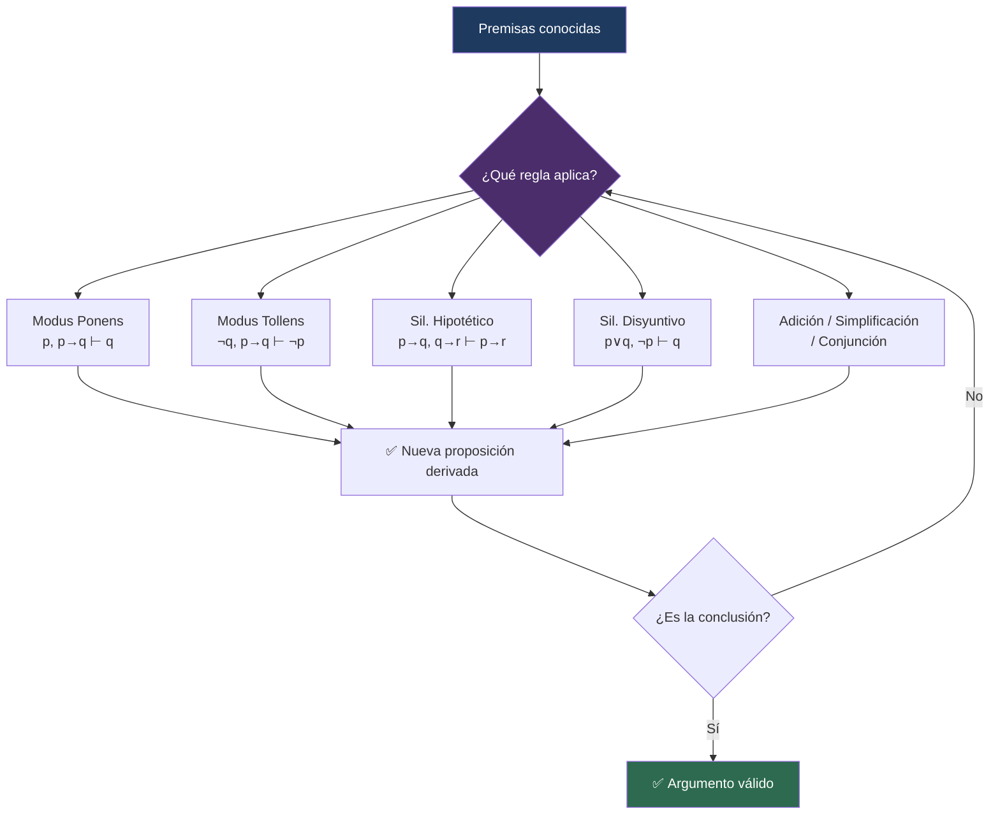

# 🧩 Reglas de Inferencia

## 🎯 Introducción

> [!info]- 💡 ¿Qué es el razonamiento deductivo?
> 
> El proceso de obtener conclusiones a partir de una secuencia de proposiciones se llama **razonamiento deductivo**.
> 
> - Las proposiciones de partida se llaman **hipótesis** o **premisas**.
> - La proposición que se deriva de las hipótesis se llama **conclusión**.
> - Un **argumento (deductivo)** consiste en hipótesis junto con una conclusión.
> 
> Cualquier argumento tiene la forma:
> 
> $$\text{Si } p_1 \text{ y } p_2 \text{ y } \cdots \text{ y } p_n \text{ entonces } q.$$

---

## 📚 Argumentos y Validez

> [!note]- 📖 Definición — Argumento válido e inválido
> 
> Diremos que el argumento es **válido** si cada vez que $p_1, p_2, \ldots, p_n$ son verdaderas entonces $q$ también es verdadera. De lo contrario diremos que el argumento es **inválido**.
> 
> Los argumentos se representan en la forma:
> 
> $$\frac{p_1 \quad p_2 \quad \cdots \quad p_n}{\therefore\ q}$$
> 
> Si el argumento es válido, lo denotaremos $p_1, p_2, \ldots, p_n \Rightarrow q$. El símbolo $\Rightarrow$ se lee: **implica**.

> [!warning]- ⚠️ Observación importante
> 
> No se está afirmando que la conclusión es cierta; sólo se dice que si se garantiza la hipótesis, también se debe garantizar la conclusión.
> 
> > **Un argumento es válido por su forma, no por su contenido.**

---

## 📋 Tabla de Reglas de Inferencia

> [!note]- 📖 Reglas fundamentales
> 
> | Regla de inferencia | Nombre |
> |---|---|
> | $p \to q,\ p \Rightarrow q$ | **Modus Ponens** |
> | $p,\ q \Rightarrow p \wedge q$ | **Conjunción** |
> | $p \to q,\ \neg q \Rightarrow \neg p$ | **Modus Tollens** |
> | $p \to q,\ q \to r \Rightarrow p \to r$ | **Silogismo Hipotético** |
> | $p \Rightarrow p \vee q$ | **Suma (Adición)** |
> | $p \vee q,\ \neg p \Rightarrow q$ | **Silogismo Disyuntivo** |
> | $p \wedge q \Rightarrow p$ | **Simplificación** |
> 
![[ChatGPT Image 2 jun 2026, 00_08_36.png]]

---

## 🔍 Reglas Detalladas

### 1 — Modus Ponens

> [!tip]- ⚙️ Descripción
> 
> Si $p$ es verdadera y $p$ implica $q$, entonces $q$ debe ser verdadera.
> 
> $$\frac{p \to q \qquad p}{\therefore\ q}$$

---

### 2 — Modus Tollens

> [!tip]- ⚙️ Descripción
> 
> Si $p$ implica $q$ pero $q$ es falsa, entonces $p$ también debe ser falsa.
> 
> $$\frac{p \to q \qquad \neg q}{\therefore\ \neg p}$$

---

### 3 — Silogismo Hipotético

> [!tip]- ⚙️ Descripción
> 
> Transitividad del condicional: si $p \to q$ y $q \to r$, entonces $p \to r$.
> 
> $$\frac{p \to q \qquad q \to r}{\therefore\ p \to r}$$

---

### 4 — Silogismo Disyuntivo

> [!tip]- ⚙️ Descripción
> 
> Si tenemos $p \vee q$ y sabemos que $p$ es falsa, entonces $q$ debe ser verdadera.
> 
> $$\frac{p \vee q \qquad \neg p}{\therefore\ q}$$

---

### 5 — Suma (Adición)

> [!tip]- ⚙️ Descripción
> 
> Si $p$ es verdadera, entonces $p \vee q$ es verdadera para cualquier $q$.
> 
> $$\frac{p}{\therefore\ p \vee q}$$

---

### 6 — Simplificación

> [!tip]- ⚙️ Descripción
> 
> Si $p \wedge q$ es verdadera, entonces cada componente por separado también lo es.
> 
> $$\frac{p \wedge q}{\therefore\ p}$$

---

### 7 — Conjunción

> [!tip]- ⚙️ Descripción
> 
> Si $p$ y $q$ son verdaderas de forma independiente, entonces $p \wedge q$ también lo es.
> 
> $$\frac{p \qquad q}{\therefore\ p \wedge q}$$

---

## 📝 Ejemplos

> [!example]- 📝 Ejemplo 1 — Verificar validez: Modus Tollens
> 
> Determine si el argumento es válido:
> 
> $$\frac{p \to q \qquad \neg q}{\therefore\ \neg p}$$
> 
> **Solución:**
> 
> Supongamos que $p \to q$ y $\neg q$ son verdaderas. Así, $q$ es falsa; como $p \to q$ es verdadera entonces $p$ es falsa, por lo que $\neg p$ es verdadera.
> 
> El razonamiento es válido: $p \to q,\ \neg q \Rightarrow \neg p$. $\blacksquare$

> [!example]- 📝 Ejemplo 2 — Argumento inválido (Falacia)
> 
> Determine la validez del argumento:
> 
> *Si el equipo jugó bien entonces ganó el partido. El equipo no jugó bien. Por tanto, el equipo no ganó el partido.*
> 
> **Solución:** Sea $p$: el equipo jugó bien, $q$: el equipo ganó el partido. El argumento toma la forma:
> 
> $$\frac{p \to q \qquad \neg p}{\therefore\ \neg q}$$
> 
> Supongamos que $p \to q$ y $\neg p$ son verdaderas. Así, $p$ es falsa, pero independientemente de que $q$ sea verdadera o falsa, $p \to q$ es verdadera **por omisión**. No podemos concluir nada sobre $q$.
> 
> > El argumento es **inválido**. Esta es la falacia de **negación del antecedente**. $\blacksquare$

> [!example]- 📝 Ejemplo 3 — Cadena de inferencia con De Morgan
> 
> Determine la validez del argumento:
> 
> *Si estudio oportunamente entonces apruebo Cálculo y tomo vacaciones. No aprobé Cálculo o no tomé vacaciones. $\therefore$ No estudié oportunamente.*
> 
> **Solución:** Sea $p$: estudio oportunamente, $q$: apruebo cálculo, $r$: tomo vacaciones. El argumento se representa:
> 
> $$\frac{p \to q \wedge r \qquad \neg q \vee \neg r}{\therefore\ \neg p}$$
> 
> Ahora, por **De Morgan**: $\neg(q \wedge r) \equiv \neg q \vee \neg r$.
> 
> Así, $p \to q \wedge r$ y $\neg(q \wedge r)$ son verdaderas, por lo que $\neg p$ es verdadera (**Modus Tollens**).
> 
> Esto es, $p \to q \wedge r,\ \neg q \vee \neg r \Rightarrow \neg p$. El argumento es **válido**. $\blacksquare$

> [!example]- 📝 Ejemplo 4 — Demostración paso a paso
> 
> Demostrar la validez del siguiente razonamiento:
> 
> *Si me gradúo y encuentro trabajo entonces tendré un buen sueldo. Si tengo un buen sueldo entonces ayudaré a mi familia. No ayudo a mi familia. Por lo tanto, no me gradué o no encontré trabajo.*
> 
> **Solución:** Sea $p$: me gradué, $q$: encuentro trabajo, $r$: tendré un buen sueldo, $s$: ayudo a mi familia. El argumento toma la forma:
> 
> $$\frac{p \wedge q \to r \qquad r \to s \qquad \neg s}{\therefore\ \neg p \vee \neg q}$$
> 
> | Paso | Proposición | Justificación |
> |:---:|---|---|
> | 1 | $r \to s,\ \neg s \Rightarrow \neg r$ | Modus Tollens |
> | 2 | $p \wedge q \to r,\ \neg r \Rightarrow \neg(p \wedge q)$ | Modus Tollens |
> | 3 | $\neg(p \wedge q) \equiv \neg p \vee \neg q$ | De Morgan |
> 
> Concluimos que el razonamiento es **válido**. $\blacksquare$
> 
> > **Ejercicio propuesto:** Demuestre que $p \to r,\ p \to (r \to q) \Rightarrow p \to r \wedge q$.

---

## ⚠️ Falacias Comunes

> [!warning]- 🚫 Errores de razonamiento frecuentes
> 
> Las siguientes **no son** reglas de inferencia válidas:
> 
> | Falacia | Forma inválida | ¿Por qué es incorrecta? |
> |---|---|---|
> | **Afirmación del consecuente** | $q,\ p \to q \;\therefore p$ | $q$ puede ser verdadera por otras razones distintas a $p$ |
> | **Negación del antecedente** | $\neg p,\ p \to q \;\therefore \neg q$ | Cuando $p$ es falsa, el condicional no dice nada sobre $q$ |

---

## 📊 Resumen Visual

---

**Tags:** #matematicas-discretas #logica-proposicional #reglas-de-inferencia #modus-ponens #modus-tollens #silogismo #falacias #MATG1051
