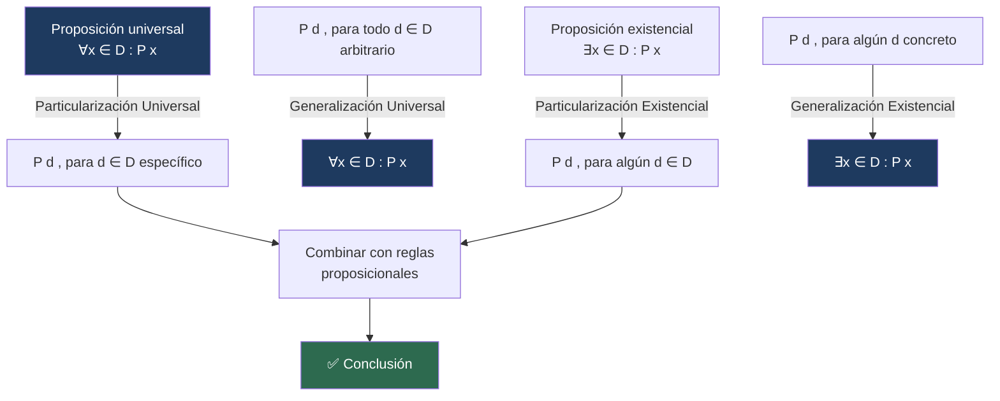

# 🔢 Reglas de Inferencia para Afirmaciones Cuantificadas

## 🎯 Introducción

> [!info]- 💡 ¿Por qué necesitamos reglas cuantificadas?
> 
> Cuando las proposiciones involucran cuantificadores $\forall$ y $\exists$, las reglas proposicionales no son suficientes. Necesitamos reglas que permitan **pasar entre lo universal y lo particular**, y entre lo existencial y lo concreto.
> 
> Estas reglas combinan naturalmente con las reglas proposicionales para construir argumentos más complejos.

---

## 📋 Tabla de Reglas para Cuantificadores

> [!note]- 📖 Definición — Reglas de inferencia cuantificadas
> 
> | Regla | Nombre |
> |---|---|
> | $\forall x \in D : P(x) \Rightarrow P(d),\ \text{si } d \in D$ | **Particularización Universal** |
> | $P(d),\ \text{para toda } d \in D \Rightarrow \forall x \in D : P(x)$ | **Generalización Universal** |
> | $\exists x \in D : P(x) \Rightarrow P(d),\ \text{para alguna } d \in D$ | **Particularización Existencial** |
> | $P(d),\ \text{para alguna } d \in D \Rightarrow \exists x \in D : P(x)$ | **Generalización Existencial** |
![[ChatGPT Image 2 jun 2026, 01_40_53 1.png]]

---

## 🔍 Reglas Detalladas

### 1 — Particularización Universal

> [!tip]- ⚙️ Descripción
> 
> Si $\forall x \in D : P(x)$ es verdadera, entonces $P(x)$ es verdadera para **cada** $x$ en el dominio de discurso $D$. En particular, si $d \in D$ entonces $P(d)$ es verdadera.
> 
> $$\frac{\forall x \in D : P(x)}{\therefore\ P(d), \quad \text{si } d \in D}$$
> 
> > Esta es la regla más usada al inicio de demostraciones: tomamos un elemento particular del dominio y le aplicamos la propiedad universal.

---

### 2 — Generalización Universal

> [!tip]- ⚙️ Descripción
> 
> Si $P(d)$ es verdadera para **todo** $d \in D$ (sin imponer restricciones especiales sobre $d$), entonces $\forall x \in D : P(x)$ es verdadera.
> 
> $$\frac{P(d), \quad \text{para toda } d \in D}{\therefore\ \forall x \in D : P(x)}$$
> 
> > ⚠️ El elemento $d$ debe ser **arbitrario**: no puede tener propiedades especiales que no compartan todos los elementos del dominio.

---

### 3 — Particularización Existencial

> [!tip]- ⚙️ Descripción
> 
> Si $\exists x \in D : P(x)$ es verdadera, podemos dar nombre a ese elemento y llamarlo $d$.
> 
> $$\frac{\exists x \in D : P(x)}{\therefore\ P(d), \quad \text{para alguna } d \in D}$$

---

### 4 — Generalización Existencial

> [!tip]- ⚙️ Descripción
> 
> Si existe un elemento concreto $d \in D$ tal que $P(d)$ es verdadera, entonces existe al menos un $x$ en $D$ que cumple $P$.
> 
> $$\frac{P(d), \quad \text{para alguna } d \in D}{\therefore\ \exists x \in D : P(x)}$$

---

## 📝 Ejemplos

> [!example]- 📝 Ejemplo 1 — Argumento con cuantificadores y reglas proposicionales
> 
> Demuestre que el siguiente argumento es válido:
> 
> **Hipótesis:** Antoine Griezmann, un jugador del Atlético de Madrid, es un goleador. Todos los goleadores pueden ganar mucho dinero.
> 
> **Conclusión:** Algún jugador del Atlético de Madrid puede ganar mucho dinero.
> 
> **Solución:**
> 
> Sea $D$ el conjunto de todos los jugadores. Definimos:
> - $P(x)$: $x$ es un jugador del Atlético de Madrid
> - $Q(x)$: $x$ es un goleador
> - $R(x)$: $x$ puede ganar mucho dinero
> 
> Sea $d$ = Antoine Griezmann. El argumento se representa:
> 
> $$\frac{P(d) \wedge Q(d) \qquad \forall x \in D : Q(x) \to R(x)}{\therefore\ \exists x \in D : P(x) \wedge R(x)}$$
> 
> **Demostración paso a paso:**
> 
> | Paso | Proposición | Justificación |
> |:---:|---|---|
> | 1 | $Q(d) \to R(d)$ | Particularización Universal sobre $\forall x : Q(x) \to R(x)$ |
> | 2 | $Q(d)$ | Simplificación de $P(d) \wedge Q(d)$ |
> | 3 | $R(d)$ | Modus Ponens (pasos 1, 2) |
> | 4 | $P(d)$ | Simplificación de $P(d) \wedge Q(d)$ |
> | 5 | $P(d) \wedge R(d)$ | Conjunción (pasos 4, 3) |
> | 6 | $\exists x \in D : P(x) \wedge R(x)$ | Generalización Existencial (paso 5) |
> 
> Concluimos que el argumento es **válido**. $\blacksquare$

---

## 🏋️ Ejercicios Propuestos

> [!question]- 📋 Ejercicios de la clase
> 
> Determine la validez de los siguientes argumentos:
> 
> **1.** Todo científico honesto contribuye al progreso del conocimiento. Toda persona tiene reconocimiento público o no contribuye al progreso del conocimiento. Existe al menos un científico honesto. Por lo tanto, existe al menos un científico honesto que tiene reconocimiento público.
> 
> **2.** Si vamos a Galápagos, gastaremos mucho dinero. Si vamos a Quilotoa, sufriremos por el frío. Vamos a Galápagos o a Quilotoa. En consecuencia, gastaremos mucho dinero o sufriremos por el frío.
> 
> **3.** Todo lector estudioso consulta fuentes confiables. Algunos lectores consultan fuentes poco confiables. Todo lector que consulta fuentes confiables aumenta su conocimiento. Por lo tanto, todos los lectores aumentan su conocimiento.

---

## 📊 Comparación de las 4 Reglas

> [!success]- 🗂️ Resumen rápido
> 
> | Regla | Dirección | Cuantificador | Uso típico |
> |---|---|---|---|
> | **Particularización Universal** | $\forall \to$ particular | $\forall$ | Aplicar una propiedad a un elemento concreto |
> | **Generalización Universal** | particular $\to \forall$ | $\forall$ | Concluir que algo vale para todos |
> | **Particularización Existencial** | $\exists \to$ particular | $\exists$ | Nombrar un elemento que sabemos que existe |
> | **Generalización Existencial** | particular $\to \exists$ | $\exists$ | Afirmar que al menos uno existe |

---

## 📊 Resumen Visual

---

**Tags:** #matematicas-discretas #logica-predicados #cuantificadores #particularizacion-universal #generalizacion-existencial #reglas-de-inferencia #MATG1051
