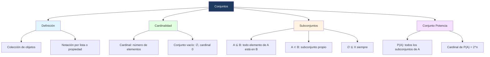

# 🗃️ Conjuntos, Cardinalidad y Subconjuntos

## 🎯 Introducción

> [!info]- 💡 ¿Qué es un conjunto?
>
> La **Teoría de Conjuntos** es la base formal de las Matemáticas Discretas. Un conjunto es la estructura más fundamental sobre la que se construyen relaciones, funciones y estructuras más complejas.
>
> ```mermaid
> graph TD
>     A[Teoría de Conjuntos] --> B[Definición y notación]
>     A --> C[Cardinalidad]
>     A --> D[Subconjuntos]
>     A --> E[Conjunto potencia y conjuntos especiales]
>
>     style B fill:#e1f5ff
>     style C fill:#e1ffe1
>     style D fill:#fff4e1
>     style E fill:#f5e1ff
> ```
>
> | Concepto | Descripción breve |
> |---|---|
> | **Conjunto** | Colección de objetos llamados elementos |
> | **Cardinal** | Número de elementos de un conjunto finito |
> | **Subconjunto** | Conjunto cuyos elementos pertenecen todos a otro |
> | **Conjunto potencia** | Conjunto de todos los subconjuntos de un conjunto |

---

## 📖 Definición de Conjunto

> [!note]- 📖 Definición — Conjunto y notación
>
> Llamaremos **Conjunto** a cualquier colección de objetos. A estos objetos los llamaremos **elementos** o **miembros** del conjunto.
>
> Si un conjunto es finito o no muy grande, es posible describirlo por la **lista de sus elementos** entre llaves:
>
> $$A = \{-3, 1, 2, 5, 9\}$$
>
> Un conjunto se determina por sus elementos y **no por el orden** en que aparecen. Así, $\{-3, 5, 9, 1, 2\}$ también representa al conjunto $A$.
>
> También podemos describir un conjunto por una **propiedad** que cumplan sus elementos:
>
> $$B = \{x : x \text{ es un impar positivo}\} = \{1, 3, 5, 7, \ldots\}$$
>
> ### Notación de pertenencia
>
> | Símbolo | Significado | Ejemplo |
> |---|---|---|
> | $x \in X$ | x pertenece al conjunto X | $3 \in \{1, 3, 5\}$ |
> | $x \notin X$ | x no pertenece al conjunto X | $4 \notin \{1, 3, 5\}$ |

---

## 🔢 Cardinalidad

> [!note]- 🔢 Definición — Cardinal de un conjunto
>
> Si A es un conjunto finito, definimos el **cardinal** de A, denotado |A|, como el número de elementos que contiene.
>
> **Ejemplo:**
>
> $$A = \{-4, -1, 0, 3, 5, 7\} \implies |A| = 6$$
>
> ### Conjunto vacío
>
> Al conjunto que no tiene elementos lo llamaremos **conjunto vacío**, denotado $\emptyset$:
>
> $$\emptyset = \{\} \qquad |\emptyset| = 0$$
>
> > [!tip]- 💡 Observación importante
> >
> > El conjunto vacío $\emptyset$ **no es lo mismo** que el conjunto {0}. El primero no tiene elementos; el segundo tiene exactamente un elemento (el cero).
> >
> > | Conjunto | Cardinal |
> > |---|---|
> > | $\emptyset$ | 0 |
> > | {0} | 1 |
> > | {$\emptyset$} | 1 |

---

## 🌐 Conjuntos Numéricos Estándar

> [!note]- 🌐 Conjuntos de números más usados
>
> En Matemáticas Discretas trabajamos frecuentemente con los siguientes conjuntos:
>
> | Símbolo | Nombre | Descripción |
> |---|---|---|
> | $\mathbb{N}$ | Naturales | {0, 1, 2, 3, ...} |
> | $\mathbb{Z}$ | Enteros | {..., -2, -1, 0, 1, 2, ...} |
> | $\mathbb{Q}$ | Racionales | Números expresables como p/q, con q ≠ 0 |
> | $\mathbb{R}$ | Reales | Todos los números en la recta real |
> | $\mathbb{C}$ | Complejos | Números de la forma a + bi |
>
> En muchos casos trabajamos con conjuntos que son todos subconjuntos de un **conjunto universal** U, que representa el contexto de todo el problema.

---

## 🔍 Igualdad de Conjuntos

> [!note]- 🔍 Definición — Igualdad
>
> Diremos que A y B son **iguales**, denotado A = B, si tienen exactamente los mismos elementos:
>
> $$A = B \iff (\forall x : x \in A \Leftrightarrow x \in B)$$
>
> **Ejemplo:**
>
> Sea A = {1, 2, 3} y B = {3, 1, 2}. Como tienen los mismos elementos (sin importar el orden), A = B. ✅
>
> > [!tip]- 💡 Observación
> >
> > La igualdad de conjuntos es una **relación de equivalencia** — es reflexiva, simétrica y transitiva.

---

## 📦 Subconjuntos

> [!note]- 📦 Definición 1 — Subconjunto ⊆
>
> Diremos que A es **subconjunto** de B, denotado A ⊆ B, si todo elemento de A también pertenece a B:
>
> $$A \subseteq B \iff \forall x : x \in A \Rightarrow x \in B$$
>
> Si existe algún elemento de A que no está en B, entonces A **no es subconjunto** de B, denotado A ⊄ B.
>
> **Ejemplo 1:**
>
> A = {1, 3}, B = {1, 2, 3, 4} → A ⊆ B ✅ pues 1 ∈ B y 3 ∈ B.
>
> **Ejemplo 2:**
>
> X = {1, 5}, Y = {1, 2, 3} → X ⊄ Y ✅ pues 5 ∉ Y.

> [!note]- 📦 Definición 2 — Subconjunto propio ⊂
>
> Diremos que A es **subconjunto propio** de B, denotado A ⊂ B, si A ⊆ B pero A ≠ B:
>
> $$A \subset B \iff A \subseteq B \text{ y } A \neq B$$
>
> **Ejemplo:**
>
> A = ℕ, B = ℤ → A ⊂ B pues todo natural es entero, pero -1 ∈ ℤ y -1 ∉ ℕ.
>
> ### Propiedades de los subconjuntos
>
> > [!tip]- 💡 Propiedades fundamentales
> >
> > Para cualquier conjunto X:
> >
> > - ∅ ⊆ X — el conjunto vacío es subconjunto de cualquier conjunto.
> > - X ⊆ X — todo conjunto es subconjunto de sí mismo.
> >
> > **Demostración de ∅ ⊆ X:**
> >
> > Supongamos por absurdo que ∅ ⊄ X. Entonces existe x ∈ ∅ tal que x ∉ X. Pero ∅ no tiene elementos, lo cual es una contradicción. $\blacksquare$

---

## 🧮 Conjunto Potencia

> [!note]- 🧮 Definición — Conjunto Potencia P(A)
>
> El **conjunto potencia** de A, denotado P(A), es el conjunto formado por **todos los subconjuntos** de A:
>
> $$\mathcal{P}(A) = \{X : X \subseteq A\}$$
>
> **Ejemplo:**
>
> Sea A = {1, 3, 4}. Entonces:
>
> $$\mathcal{P}(A) = \{\emptyset,\ \{1\},\ \{3\},\ \{4\},\ \{1,3\},\ \{1,4\},\ \{3,4\},\ A\}$$
>
> $$|\mathcal{P}(A)| = 8 = 2^3$$
>
> > [!tip]- 💡 Fórmula del cardinal del conjunto potencia
> >
> > Si |A| = n, entonces |P(A)| = 2^n.
> >
> > | |A| | |P(A)| |
> > |---|---|
> > | 0 | 2^0 = 1 |
> > | 1 | 2^1 = 2 |
> > | 2 | 2^2 = 4 |
> > | 3 | 2^3 = 8 |
> > | n | 2^n |

---

## 📝 Ejercicios Propuestos

> [!question]- 📋 Ejercicios
>
> **1.** Sea A = {1, 2, 3} y B = {1, 2, 3, 4, 5}. Determina si A ⊆ B, B ⊆ A, o A = B.
>
> **2.** Encuentra P(A) para A = {a, b}. ¿Cuántos elementos tiene?
>
> **3.** Sea U = {1, 2, 3, 4, 5, 6, 7, 8, 9, 10} el conjunto universal. ¿Es ∅ ⊆ U? ¿Es U ⊆ U?
>
> **4.** Determina si A = B dado que A = {x : x² = 1} y B = {-1, 1}.
>
> **5.** ¿Cuántos subconjuntos tiene un conjunto de 5 elementos?

> [!success]- ✅ Respuestas
>
> | # | Respuesta | Justificación |
> |---|---|---|
> | **1** | A ⊆ B ✅, B ⊄ A, A ≠ B | 4, 5 ∈ B pero 4, 5 ∉ A |
> | **2** | P(A) = {∅, {a}, {b}, {a,b}}, con 4 elementos | 2^2 = 4 |
> | **3** | ∅ ⊆ U ✅ y U ⊆ U ✅ | Propiedades fundamentales de subconjuntos |
> | **4** | A = B ✅ | x² = 1 implica x = ±1, mismos elementos |
> | **5** | 2^5 = 32 subconjuntos | Fórmula del conjunto potencia |

---

## 📊 Resumen Visual



---

## 🧩 Ejercicios Resueltos

> [!example]- 📝 Ejercicio Resuelto 1 — Determinar igualdad de conjuntos
>
> **Problema:** Determina si A = B dado que:
> - A = {x ∈ ℤ : x² ≤ 4}
> - B = {-2, -1, 0, 1, 2}
>
> **Solución:**
>
> Encontramos todos los enteros que satisfacen x² ≤ 4:
>
> | x | x² | ¿x² ≤ 4? |
> |---|---|---|
> | -3 | 9 | ❌ |
> | -2 | 4 | ✅ |
> | -1 | 1 | ✅ |
> | 0 | 0 | ✅ |
> | 1 | 1 | ✅ |
> | 2 | 4 | ✅ |
> | 3 | 9 | ❌ |
>
> Entonces A = {-2, -1, 0, 1, 2} = B. ✅ $\blacksquare$

> [!example]- 📝 Ejercicio Resuelto 2 — Subconjuntos y conjunto potencia
>
> **Problema:** Sea A = {∅, {1}, 2}. Responde:
> a) ¿Cuántos elementos tiene A?
> b) ¿Es {1} ∈ A?
> c) ¿Es {1} ⊆ A?
> d) ¿Cuántos elementos tiene P(A)?
>
> **Solución:**
>
> a) A tiene **3 elementos**: ∅, {1} y 2.
>
> b) Sí, {1} ∈ A ✅ — el conjunto {1} es uno de los elementos de A.
>
> c) No, {1} ⊄ A ❌ — para que {1} ⊆ A se necesita que el elemento 1 (no {1}) esté en A, pero 1 ∉ A.
>
> d) |P(A)| = 2³ = **8 elementos**. $\blacksquare$

> [!example]- 📝 Ejercicio Resuelto 3 — Cardinal y subconjuntos propios
>
> **Problema:** Sea U = {1, 2, 3, 4, 5, 6, 7, 8, 9, 10} y A = {x ∈ U : x es par}. Encuentra A y demuestra que A ⊂ U.
>
> **Solución:**
>
> A = {2, 4, 6, 8, 10}, con |A| = 5.
>
> **A ⊆ U:** Todo elemento de A es par y está en U = {1,...,10}, por lo que todo x ∈ A satisface x ∈ U. ✅
>
> **A ≠ U:** El elemento 1 ∈ U pero 1 ∉ A (1 es impar).
>
> Por tanto A ⊂ U (subconjunto propio). $\blacksquare$

---

**Tags:** #matematicas-discretas #conjuntos #cardinalidad #subconjuntos #conjunto-potencia #MATG1051