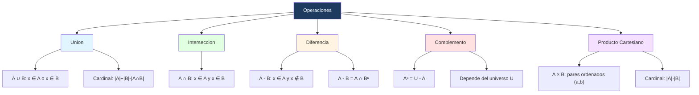

# ⚙️ Operaciones de Conjuntos y Diagramas de Venn

## 🎯 Introducción

> [!info]- 💡 ¿Qué operaciones podemos hacer con conjuntos?
>
> Así como los números tienen operaciones (suma, resta, multiplicación), los conjuntos tienen sus propias operaciones que permiten combinarlos o compararlos. Estas operaciones son la base del álgebra de conjuntos.
>
> ```mermaid
> graph TD
>     A[Operaciones de Conjuntos] --> B[Unión ∪]
>     A --> C[Intersección ∩]
>     A --> D[Diferencia −]
>     A --> E[Complemento Xᶜ]
>     A --> F[Producto Cartesiano ×]
>
>     style B fill:#e1f5ff
>     style C fill:#e1ffe1
>     style D fill:#fff4e1
>     style E fill:#ffe1e1
>     style F fill:#f5e1ff
> ```
>
> | Operación | Símbolo | Descripción breve |
> |---|---|---|
> | **Unión** | $A \cup B$ | Elementos que están en $A$, en $B$, o en ambos |
> | **Intersección** | $A \cap B$ | Elementos que están en $A$ **y** en $B$ |
> | **Diferencia** | $A - B$ | Elementos de $A$ que **no** están en $B$ |
> | **Complemento** | $A^c$ | Elementos del universo que **no** están en $A$ |
> | **Producto Cartesiano** | $A \times B$ | Todos los pares ordenados $(a, b)$ con $a \in A$, $b \in B$ |

---

## 🔵 Unión

> [!note]- 🔵 Definición — Unión $A \cup B$
>
> La **unión** de $A$ y $B$ es el conjunto de todos los elementos que pertenecen a $A$, a $B$, o a ambos:
>
> $$A \cup B = \{x : x \in A \lor x \in B\}$$
>
> **Ejemplo:**
>
> > $A = \{1, 2, 3\}$, $B = \{3, 4, 5\}$
> >
> > $A \cup B = \{1, 2, 3, 4, 5\}$
>
> > [!tip]- 💡 Unión disjunta
> >
> > Si $A \cap B = \emptyset$, decimos que $A$ y $B$ son **disjuntos**. En ese caso, la unión se llama **unión disjunta** y se cumple que:
> >
> > $$|A \cup B| = |A| + |B|$$
> >
> > En general (cuando pueden tener elementos comunes):
> >
> > $$|A \cup B| = |A| + |B| - |A \cap B|$$

---

## 🟢 Intersección

> [!note]- 🟢 Definición — Intersección $A \cap B$
>
> La **intersección** de $A$ y $B$ es el conjunto de todos los elementos que pertenecen simultáneamente a $A$ y a $B$:
>
> $$A \cap B = \{x : x \in A \land x \in B\}$$
>
> **Ejemplo:**
>
> > $A = \{1, 2, 3\}$, $B = \{3, 4, 5\}$
> >
> > $A \cap B = \{3\}$
>
> Si $A \cap B = \emptyset$, los conjuntos son **disjuntos por pares**.
>
> > [!tip]- 💡 Colección disjunta por pares
> >
> > Diremos que una colección $S$ de conjuntos es **disjunta por pares** si para cualquier par de conjuntos distintos $A, B \in S$, se cumple que $A \cap B = \emptyset$.

---

## 🟡 Diferencia

> [!note]- 🟡 Definición — Diferencia $A - B$
>
> La **diferencia** de $A$ y $B$ es el conjunto de elementos que pertenecen a $A$ pero **no** a $B$:
>
> $$A - B = \{x : x \in A \land x \notin B\}$$
>
> **Ejemplo:**
>
> > $A = \{1, 2, 3, 4\}$, $B = \{3, 4, 5\}$
> >
> > $A - B = \{1, 2\}$
> >
> > $B - A = \{5\}$
>
> > [!tip]- 💡 Ley de diferencia
> >
> > $$A - B = A \cap B^c$$
> >
> > Esto es, la diferencia $A - B$ equivale a la intersección de $A$ con el complemento de $B$.
> >
> > Nótese que en general $A - B \neq B - A$.

---

## 🔴 Complemento

> [!note]- 🔴 Definición — Complemento $A^c$
>
> Dado un **conjunto universal** $U$ y un subconjunto $A \subseteq U$, el **complemento** de $A$, denotado $A^c$, es el conjunto de todos los elementos de $U$ que **no** pertenecen a $A$:
>
> $$A^c = \{x \in U : x \notin A\} = U - A$$
>
> **Ejemplo:**
>
> > $U = \{1, 2, 3, 4, 5\}$, $A = \{1, 3, 5\}$
> >
> > $A^c = \{2, 4\}$
>
> > [!tip]- 💡 Observación
> >
> > El complemento de un conjunto **depende del universo** $U$ con el que se trabaje. Si $U$ cambia, $A^c$ también cambia.

---

## 🟣 Producto Cartesiano

> [!note]- 🟣 Definición — Par ordenado y Producto Cartesiano
>
> ### Par ordenado
>
> Dados elementos $a$ y $b$, sabemos que $\{a, b\} = \{b, a\}$ como conjuntos. Sin embargo, a veces el **orden importa**.
>
> Llamaremos **par ordenado** formado por $a$ y $b$, denotado $(a, b)$, al conjunto $\{a, \{a, b\}\}$, donde indicamos que $a$ es el primer elemento y $b$ es el segundo.
>
> $$\{a, b\} = \{b, a\} \quad \text{(conjuntos)} \qquad (a, b) \neq (b, a) \quad \text{(pares ordenados, si } a \neq b\text{)}$$
>
> ### Producto Cartesiano
>
> El **producto cartesiano** de $A$ y $B$, denotado $A \times B$, es el conjunto de todos los pares ordenados $(a, b)$ con $a \in A$ y $b \in B$:
>
> $$A \times B = \{(a, b) : a \in A \land b \in B\}$$
>
> **Ejemplo:**
>
> > $A = \{1, 2\}$, $B = \{a, b, c\}$
> >
> > $A \times B = \{(1,a),\ (1,b),\ (1,c),\ (2,a),\ (2,b),\ (2,c)\}$
> >
> > $|A \times B| = |A| \cdot |B| = 2 \cdot 3 = 6$
>
> > [!tip]- 💡 Cardinal del producto cartesiano
> >
> > $$|A \times B| = |A| \cdot |B|$$
> >
> > En general, $A \times B \neq B \times A$ a menos que $A = B$.

---

## 🔷 Diagramas de Venn

> [!note]- 🔷 Representación visual de operaciones
>
> Los **diagramas de Venn** representan conjuntos como regiones dentro de un rectángulo (el universo $U$). Son útiles para visualizar operaciones e identificar relaciones entre conjuntos.
>
> ### Diagramas de Venn para 2 conjuntos
>
> ```mermaid
> graph LR
>     subgraph U["Universo U"]
>         A((A))
>         B((B))
>     end
> ```
>
> | Operación | Región sombreada |
> |---|---|
> | $A \cup B$ | Todo lo que está dentro de $A$ o $B$ |
> | $A \cap B$ | Solo la zona central donde se superponen |
> | $A - B$ | Solo la parte de $A$ que no toca $B$ |
> | $B - A$ | Solo la parte de $B$ que no toca $A$ |
> | $A^c$ | Todo lo que está fuera de $A$ dentro de $U$ |
>
> ### Diagramas de Venn para 3 conjuntos
>
> Con tres conjuntos $A$, $B$ y $C$ se generan hasta **8 regiones** distintas:
>
> | Región | Descripción |
> |---|---|
> | Solo $A$ | $A - B - C$ |
> | Solo $B$ | $B - A - C$ |
> | Solo $C$ | $C - A - B$ |
> | $A \cap B$ (sin $C$) | $(A \cap B) - C$ |
> | $A \cap C$ (sin $B$) | $(A \cap C) - B$ |
> | $B \cap C$ (sin $A$) | $(B \cap C) - A$ |
> | $A \cap B \cap C$ | Centro — en los tres |
> | Ninguno | $U - (A \cup B \cup C)$ |

---

## 🧮 Ejemplo con Diagrama de Venn — Problema de conteo

> [!example]- 📝 Ejemplo — Estudiantes con 3 materias
>
> En un grupo de **191 estudiantes**, se sabe que:
> - 10 toman francés, negocios y música.
> - Se pide encontrar cuántos estudiantes no toman ninguna de las tres materias, dado que $|A \cup B \cup C| = 140$.
>
> **Solución:**
>
> Usando la fórmula de inclusión-exclusión para 3 conjuntos:
>
> $$|A \cup B \cup C| = |A| + |B| + |C| - |A \cap B| - |A \cap C| - |B \cap C| + |A \cap B \cap C|$$
>
> Se calcula que $|A \cup B \cup C| = 140$, por lo tanto:
>
> $$|\overline{A \cup B \cup C}| = 191 - 140 = 51$$
>
> Esto es, **51 estudiantes** no toman ninguna de las tres materias.

---

## 📝 Ejercicios Propuestos

> [!question]- 📋 Ejercicios
>
> **1.** Sean $A = \{1, 2, 3, 4\}$ y $B = \{3, 4, 5, 6\}$. Calcula:
> - $A \cup B$
> - $A \cap B$
> - $A - B$
> - $B - A$
>
> **2.** Sea $U = \{1, 2, 3, 4, 5, 6, 7, 8\}$, $A = \{1, 2, 3, 4\}$, $B = \{3, 4, 5, 6\}$. Calcula $A^c$, $B^c$ y $(A \cup B)^c$.
>
> **3.** Sean $A = \{a, b\}$ y $B = \{1, 2, 3\}$. Calcula $A \times B$ y $B \times A$. ¿Son iguales?
>
> **4.** En un grupo de 50 estudiantes, 30 estudian matemáticas, 25 estudian física y 10 estudian ambas. ¿Cuántos no estudian ninguna?

> [!success]- ✅ Respuestas
>
> **1.**
> - $A \cup B = \{1, 2, 3, 4, 5, 6\}$
> - $A \cap B = \{3, 4\}$
> - $A - B = \{1, 2\}$
> - $B - A = \{5, 6\}$
>
> **2.**
> - $A^c = \{5, 6, 7, 8\}$
> - $B^c = \{1, 2, 7, 8\}$
> - $(A \cup B)^c = \{7, 8\}$
>
> **3.**
> - $A \times B = \{(a,1),(a,2),(a,3),(b,1),(b,2),(b,3)\}$
> - $B \times A = \{(1,a),(1,b),(2,a),(2,b),(3,a),(3,b)\}$
> - No son iguales — $A \times B \neq B \times A$
>
> **4.**
> - $|M \cup F| = 30 + 25 - 10 = 45$
> - No estudian ninguna: $50 - 45 = \mathbf{5}$ estudiantes

---

## 📊 Resumen Visual



---

## 🧩 Ejercicios Resueltos

> [!example]- 📝 Ejercicio Resuelto 1 — Operaciones combinadas
>
> **Problema:** Sean A = {1, 2, 3, 4, 5}, B = {3, 4, 5, 6, 7} y U = {1, 2, ..., 10}. Calcula:
> a) A ∪ B
> b) A ∩ B
> c) A - B
> d) Aᶜ
> e) |A × B|
>
> **Solución:**
>
> a) A ∪ B = {1, 2, 3, 4, 5, 6, 7}
>
> b) A ∩ B = {3, 4, 5}
>
> c) A - B = {1, 2} — elementos de A que no están en B
>
> d) Aᶜ = U - A = {6, 7, 8, 9, 10}
>
> e) |A × B| = |A| · |B| = 5 · 5 = **25 pares ordenados** $\blacksquare$

> [!example]- 📝 Ejercicio Resuelto 2 — Diagrama de Venn con 3 conjuntos
>
> **Problema:** En una encuesta de 100 personas sobre streaming:
> - 60 usan Netflix (N)
> - 45 usan Disney+ (D)
> - 30 usan Amazon Prime (A)
> - 20 usan N y D
> - 15 usan N y A
> - 10 usan D y A
> - 5 usan los tres
>
> ¿Cuántas personas no usan ninguno?
>
> **Solución:**
>
> Aplicando inclusión-exclusión:
>
> $$|N \cup D \cup A| = 60 + 45 + 30 - 20 - 15 - 10 + 5 = 95$$
>
> Personas que no usan ninguno: 100 - 95 = **5 personas** $\blacksquare$

> [!example]- 📝 Ejercicio Resuelto 3 — Producto Cartesiano
>
> **Problema:** Sea A = {0, 1} y B = {a, b, c}. Encuentra A × B y B × A. ¿Son iguales?
>
> **Solución:**
>
> A × B = {(0,a), (0,b), (0,c), (1,a), (1,b), (1,c)}
>
> B × A = {(a,0), (a,1), (b,0), (b,1), (c,0), (c,1)}
>
> No son iguales — (0,a) ∈ A × B pero (0,a) ∉ B × A. En ambos casos el cardinal es 6, pero los conjuntos son distintos. $\blacksquare$

---

**Tags:** #matematicas-discretas #conjuntos #union #interseccion #diferencia #complemento #producto-cartesiano #venn #MATG1051